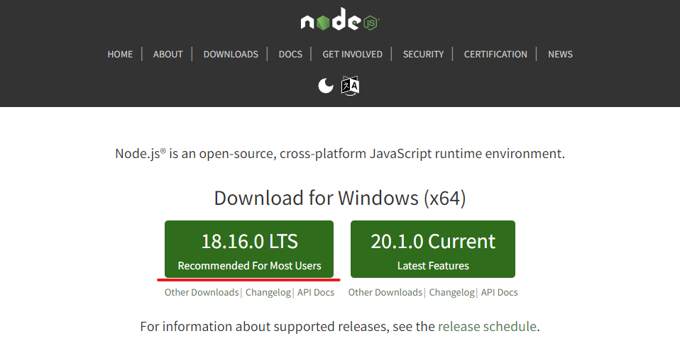
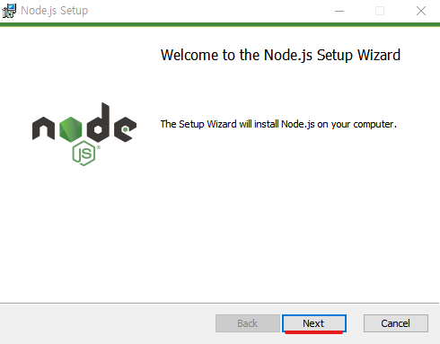
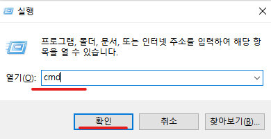
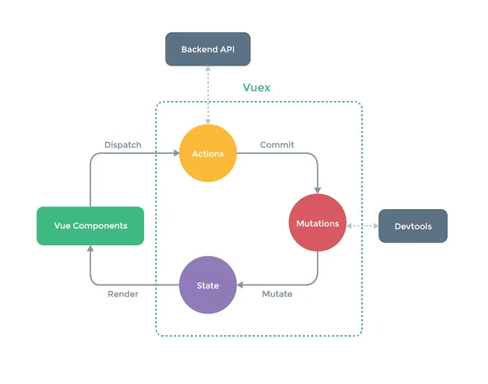
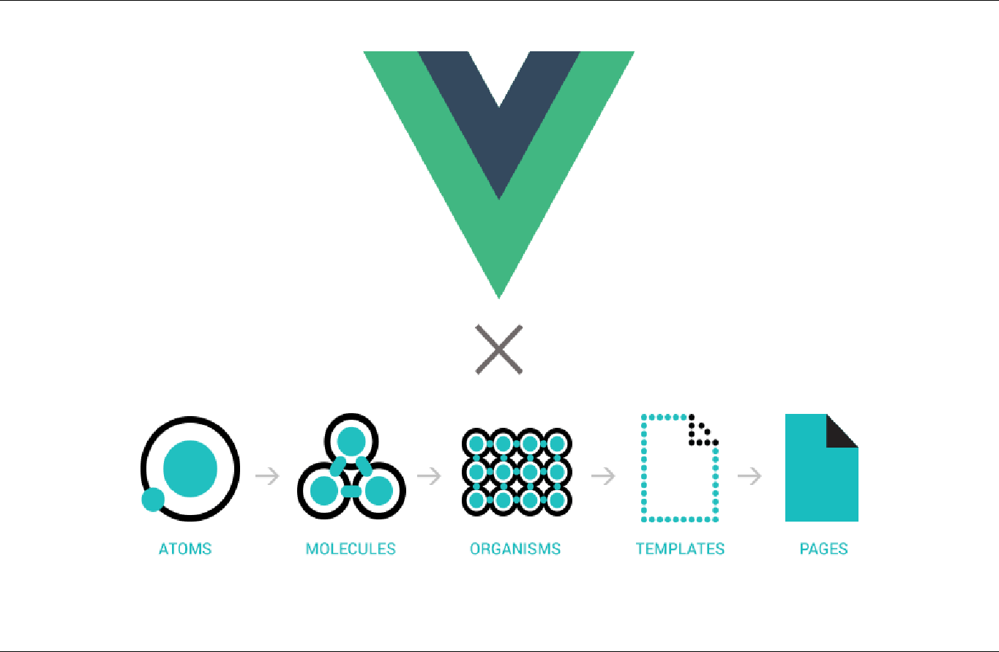

# 1. Vue version 3 설치 및 환경설정

## 1-1. Node 다운로드

### 1-1-1. Node.js 홈페이지 접속

[Node.js 홈페이지](https://nodejs.org/en)

<br>

### 1-1-2. Node.js 다운로드



<br><br>

## 1-2. Node 설치

### 1-2-1. 설치 시작

다운로드 디렉토리에서 `node-v20.11-x64.msi` 또는 `node-v18.16-x64.msi` 를 더블클릭하여 설치 화면이 나오면, [Next] 버튼을 누릅니다.



<br>

### 1-2-2. 약관 동의 페이지


<br>

### 1-2-3. 설치 위치 지정


<br>

### 1-2-4. 설치할 패키지 또는 부가기능 선택


<br>

### 1-2-5. Native Module 을 위한 도구 선택


<br>

### 1-2-6. Node 도구 준비 화면


<br>

### 1-2-7. Node 환경 설정


<br>

### 1-2-8. Native Module 을 위한 도구 선택


<br><br>

## 1-3. Node 기본 명령

### 1-3-1. Node 설치 확인




<br>

### 1-3-2. Node 자바스크립트 실행

**1. Hello.js 작성**

```javascript
console.log("Hello");
```

<br>

**2. Node 에서 Hello.js 실행**


<br><br>

## 1-4. Visual Studio Code 다운로드

Visual Studio Code는 마이크로소프트 사에서 개발한 코드 편집이 가능한 에디터로서 문서 작업을 할 때 MS-WORD나 아래한글과 같은 워드프로세서를 사용하는 것처럼 코딩을 할 때는 VS Code와 같은 코드 편집 프로그램을 사용합니다.

Visual Studio는 IDE(Intergrated Development Environment)로서 통합 개발 환경으로 개발과 관련된 모든 작업을 수행할 수 있는 공간을 제공하지만, VS Code는 내부적인 환경을 구축하지 않아도 사용이 가능하지만, Visual Studio는 프로그램이 다소 무겁기 때문에 용량이 매우 크고 설치 과정도 복잡합니다.

<br>

## 1-4-1. Visual Studio Code 다운로드 페이지로 이동하기

**VS Code 바로가기**  [VS Code 다운로드](https://code.visualstudio.com/)

<br>

## 1-4-2. Visual Studio Code 다운로드


<br><br>

## 1-5. Visual Studio Code 설치

### 1-5-1. 설치 시작

다운로드한 설치 파일인 `` 을 실행합니다.

<br>

### 1-5-2. 라이선스 사용권 계약 동의


위와 같은 페이이지가 로딩되면, '동의합니다' 를 선택하고, [Next] 버튼을 누릅니다.

<br>

### 1-5-3. 설치 디렉토리 지정 


"Visual Studio Code"를 "Applications" 폴더에 설치하도록 설정합니다.

<br>

### 1-5-4. 시작 메뉴 폴더 선택


`[다음]` 버튼을 클릭합니다.

<br>

### 1-5-5. 추가 작업 선택


원하는 추가 작업을 선택하고, `[다음]` 버튼을 클릭하여 설치를 진행합니다.

<br>

### 1-5-6. 설치 준비 완료


`[설치]` 버튼을 클릭하여 설치를 진행합니다.

<br>

### 1-5-7. 설치 완료


설치가 완료 화면이 나오면 `[종료]` 버튼을 클릭합니다.

<br><br>

## 1-6. Visual Studio Code 환경 설정 및 확장 프로그램 설치


Visual Studio Code 를 실행하면, 초기화면이 나타납니다.

<br>

### 1-6-1. 탭 사용자 설정

react 나 Vue 에서 여러 블록의 단계로 구성되기 때문에 tab Size를 2로 바꾸는 것이 좋습니다.

<br>

**명령 입력줄 호출**


1. `[Ctrl + Shift + P]` 단축키 또는 `[View]-[Command Palette...]` 메뉴를 누릅니다.
2. 나타난 입력란에 `open use settings` 입력
3. `Preferences: Open User Settings` 를 선택합니다.

<br>

**탭 크기조절**


`Editor: Tab Size` 항목에 `2` 를 입력합니다.

<br>

**탭 크기조절 후 결과**


VS Code 화면 하단부의 상태표시줄에 `Spaces: 4` 가 `Spaces: 2` 로 변경되었는지 확인합니다.

<br><br>

### 1-6-2. 한국어 팩 설치

1. 메뉴나 대화 상자가 영어일 때 불편하신 분들은 한국어 팩을 설치할 수도 있습니다.
2. 영어가 편하신 분은 굳이 설치할 필요는 없습니다.

<br>

**한국어 팩 설치**


1. 화면 좌측의 `Extensions(Ctrl+Shift+X)` 아이콘을 선택
2. 입력란에 `korean` 을 입력
3. 목록 중 `korean language pack for visual studio code` 의 우측 `Install` 클릭
4. 설치 완료 후 `Restart Now` 클릭

<br>

**한국어 팩 설치 후 화면**


모든 메뉴가 한국어로 변경되었는지 확인합니다.

<br><br>

### 1-6-3. Vue 3 snippets

뷰(Vue)에서 자주 사용하는 코드 단축어들을 활용하여 코드 블록을 자동 완성 해주는 플러그인

<br>


1. 화면 좌측의 `Extensions(Ctrl+Shift+X)` 아이콘을 선택
2. 입력란에 `Vue 3 Snippets` 을 입력
3. 목록 중에서 `Vue 3 Snippets` 의 우측 `Install` 또는 `설치` 클릭

<br>

자주 사용하는 키워드를 입력하여 선택하면 Vue 컴포넌트를 만들어 주게 됩니다.

| 단축 키워드 | 설명                                      | 생성되는 코드 예시                                           |
|-------------|-------------------------------------------|--------------------------------------------------------------|
| `vbase`     | 기본 Vue 3 컴포넌트 템플릿                | `<template>...</template>\n<script>\nexport default {...}</script>\n<style></style>` |
| `vbasec`    | 기본 Composition API 컴포넌트 템플릿      | `<template>...</template>\n<script setup>...</script>\n<style></style>` |
| `vdata`     | 데이터 속성 추가                          | `data() { return {...}; }`                                   |
| `vcomputed` | 계산된 속성 추가                          | `computed: {...}`                                            |
| `vwatch`    | 감시자(watcher) 추가                      | `watch: {...}`                                               |
| `vmethod`   | 메서드 추가                               | `methods: {...}`                                             |
| `vcreated`  | created 라이프사이클 훅 추가              | `created() {...}`                                            |
| `vmounted`  | mounted 라이프사이클 훅 추가              | `mounted() {...}`                                            |
| `vprops`    | props 속성 추가                           | `props: {...}`                                               |
| `vemits`    | emits 속성 추가                           | `emits: ['event']`                                           |
| `vsetup`    | Composition API의 setup 함수 추가         | `setup() { return {...}; }`                                  |
| `vimport`   | Vue 기능을 임포트                         | `import { ref, reactive, computed } from 'vue';`             |
| `vref`      | ref 함수 추가                             | `const variable = ref(initialValue);`                        |
| `vreactive` | reactive 함수 추가                        | `const state = reactive({ ... });`                           |
| `vfor`      | v-for 디렉티브 추가                       | `<div v-for="item in items" :key="item.id">...</div>`        |
| `vif`       | v-if 디렉티브 추가                        | `<div v-if="condition">...</div>`                            |
| `vmodel`    | v-model 디렉티브 추가                     | `<input v-model="data" />`                                   |
| `vslot`     | slot 추가                                 | `<slot name="default">...</slot>`                            |
| `vrouter`   | Vue Router 라우터 템플릿                  | `import { createRouter, createWebHistory } from 'vue-router';` |

<br><br>

### 1-6-4. Vetur

전체적인 Vue.js 개발 경험을 개선하는 확장 프로그램입니다. 구문 강조, 자동 완성, 코드 스타일 검사, 코드 포맷팅 등 여러 기능을 제공합니다.

<br>


1. 화면 좌측의 `Extensions(Ctrl+Shift+X)` 아이콘을 선택
2. 입력란에 `Vetur` 을 입력
3. 목록 중에서 `Vetur` 의 우측 `Install` 또는 `설치` 클릭

<br><br>

### 1-6-5. HTML CSS Support

html 문서에 적용되어 있는 css를 자동완성으로 추천해주는 기능을 지원합니다.

<br>


1. 화면 좌측의 `Extensions(Ctrl+Shift+X)` 아이콘을 선택
2. 입력란에 `HTML CSS` 을 입력
3. 목록 중에서 `HTML CSS Support` 의 우측 `Install` 또는 `설치` 클릭

<br><br>

### 1-6-6. Live Server

현재 작성하고 있는 문서의 내용을 실시간으로 보여주는 기능으로 문서의 저장이 감지되면 자동으로 로컬 서버를 통해 웹브라우저에 수정사항을 반영해 줍니다.


1. 화면 좌측의 `Extensions(Ctrl+Shift+X)` 아이콘을 선택
2. 입력란에 `Live` 을 입력
3. 목록 중에서 `Live Server` 의 우측 `Install` 또는 `설치` 클릭

<br><br>

### 1-6-7. Prettier

줄바꿈등의 스타일을 자동으로 변환해주며, 이클립스의 코드 포매터와 비슷합니다.


1. 화면 좌측의 `Extensions(Ctrl+Shift+X)` 아이콘을 선택
2. 입력란에 `Prettier` 을 입력
3. 목록 중에서 `Prettier - Code Formatter` 의 우측 `Install` 또는 `설치` 클릭

<br><br>

### 1-6-8. Auto Rename Tag

태그의 이름을 변경 시 열고 닫는 태그를 한번에 같이 수정해줍니다.


<br><br>

### 1-6-9. REST Client


1. `.http / .rest` 확장자로 파일을 생성해 줍니다.
2. api호출 하나씩 "###"으로 구분하면 되며, `SendRequest` 라는 텍스트가 자동 생성 됩니다.


<br><br>

### 1-6-10. Git history

특정 파일의 커밋 히스토리를 보고싶을때 사용합니다.


<br>

마우스 우클릭 > Git : View file History 를 클릭하면 해당 파일, 라인에 대한 커밋 히스토리가 화면에 표시됩니다.


<br><br>

### 1-6-11. Git Graph

커밋 로그들을 그래프 형태로 직관적으로 볼 수 있다.


<br><br>

### 1-6-12. Git Lens

코드의 특정 단락, 라인등에 커밋 관련 정보를 흐릿하게 노출해 주며, 마우스 커서의 위치를 이동하면 자세한 정보를 보여줍니다.


<br><br>

### 1-6-13. 테마(Theme) 변경

편집 및 에디터에 대한 작업 환경의 색상이나 아이콘의 형태를 변경할 수 있습니다.

<br>


왼쪽 하단에 톱니바퀴 모양의 설정 아이콘을 클릭하거나 `[Ctrl+,]` 단축키를 누릅니다.

<br>


입력란에 `Light` 검색어를 입력하면, 나오는 목록 중에서 `Default Light+` 를 선택합니다.

<br>


위와 같이 테마가 변경되었음을 확인합니다.

<br><br>

### 1-6-14. ESLint 

코드 품질을 유지하고 일관된 코딩 스타일을 적용하게 해줍니다.


## 1-3. Vue 설치

<br><br>

## 1-4. Vue.js Devtools 설치


<br><br><br>

# 2. Javascript ES6+

## 2-1. Javascript ES6+ 의 개념

### 2-1-1. Javascript의 탄생

1. 1993년, 최초의 웹 브라우저의 NSCA의 Mosaic가 탄생하였으며, Mosaic의 개발자 중 한 명인 Marc Andreesen은 Mosaic Communications Corporation 을 공동 설립하고 Mosaic Netscape 라는 새로운 웹 브라우저를 만들게 되고, NCSA와 관련된 저작권 및 기타 법적 문제를 해결하기 위해 회사 이름은 Netscape Communications Corporation 으로 변경하고, 브라우저의 이름도 Netscape Navigator 로 변경하게 됩니다.
2. Netscape(Netscape Communications Corporation)는 1995년 Brianden Eich를 고용하여 스크립트 언어의 시제품인 Mocha 를 개발하게 되며, 이후 Mocha 는 LiveScript 라는 이름을 거쳐 JavaScript 라는 이름으로 명명하게 됩니다.

<br>

### 2-1-2. ECMAScript의 탄생

1. 1996년 3월, Netscape는 Netscape Navigator 2.0 웹 브라우저를 출시하면서 JavaScript를 채택하여 웹 페이지의 동작을 향상시키게 됩니다.
2. 마이크로소프트가 JavaScript와 호환되는 JScript를 개발하였으며, 이를 채택한 1996년 8월에 Internet Explorer 3.0에 포함되어 출시하게 됩니다.
3. 경쟁사회가 도래하면서 마이크로소프트를 견제하려는 의도하에 Netscape는 표준 기관인 Ecma International 에 표준화를 주관해달라고 요청하였으며, ECMA-262 명세는 1996년 11월에 시작되어 1997년 6월, ECMA 일반 회의에서 ECMA-262의 초판이 채택되게 됩니다.
4. 썬 마이크로시스템즈에서 Java라는 이름으로 상표를 소유하고 있었으므로 표준 언어의 공식 이름을 JavaScript라고 부를 수는 없게되자 JavaScript와 ECMA를 합쳐, ECMAScript 라는 이름을 작명하여 표준화된 언어의 이름으로 공개하게 됩니다.

<br><br>

## 2-2. Node.js 의 개념

Node.js는 JavaScript 실행 환경으로, 주로 서버 측에서 사용됩니다. 일반적으로 JavaScript는 웹 브라우저 내에서 클라이언트 측 스크립팅 언어로 사용되지만, Node.js는 이를 브라우저 외부, 즉 서버에서 실행할 수 있도록 해줍니다. 

<br>

### 2-2-1. JavaScript 런타임

Node.js는 V8 JavaScript 엔진(Google Chrome 브라우저에서 사용하는 엔진)을 기반으로 합니다. 이 엔진은 JavaScript 코드를 고속으로 실행할 수 있도록 설계되어 있습니다.

<br>

### 2-2-2. 비동기 I/O 처리

Node.js는 비동기적이고 이벤트 기반의 I/O 처리를 지원합니다. 이를 통해 파일 시스템, 데이터베이스, 네트워크 통신 등 다양한 I/O 작업을 처리할 때 효율적인 성능을 제공합니다. 이벤트 루프를 통해 블로킹 없이 비동기 작업을 관리할 수 있습니다.

<br>

### 2-2-3. 단일 스레드 이벤트 루프

Node.js는 단일 스레드로 작동합니다. 그러나 내부적으로는 이벤트 루프와 비동기 콜백을 활용하여 많은 동시 작업을 처리할 수 있습니다. 이는 높은 성능과 확장성을 제공하는 핵심 요소 중 하나입니다.

<br>

### 2-2-4. 모듈 시스템

Node.js는 CommonJS 모듈 시스템을 사용합니다. 개발자는 require를 사용하여 다른 파일이나 패키지에서 모듈을 가져와 사용할 수 있습니다. Node.js는 또한 ES6의 import/export 구문도 지원합니다.

<br>

### 2-2-5. NPM (Node Package Manager)

Node.js는 NPM이라는 강력한 패키지 관리자를 가지고 있습니다. NPM을 통해 다양한 오픈 소스 라이브러리와 패키지를 손쉽게 설치하고 관리할 수 있습니다. NPM은 세계에서 가장 큰 소프트웨어 레지스트리로, 전 세계의 개발자들이 만든 수많은 패키지를 포함하고 있습니다.

<br>

### 2-2-6. 크로스 플랫폼

Node.js는 Windows, macOS, Linux 등 다양한 운영 체제에서 작동합니다. 이는 개발자가 다양한 환경에서 애플리케이션을 실행하고 배포할 수 있게 해줍니다.

<br>

### 2-2-7. 서버 사이드 애플리케이션 개발

Node.js는 웹 서버를 직접 작성할 수 있는 기능을 제공합니다. HTTP 모듈을 사용해 간단한 웹 서버를 만들고, Express.js와 같은 프레임워크를 사용해 복잡한 서버 애플리케이션을 구축할 수 있습니다.

<br>

### 2-2-8. 비동기 프로그래밍

Node.js에서 비동기 코드는 콜백 함수, 프로미스(Promise), 그리고 async/await 구문을 통해 작성됩니다. 이는 비동기 작업을 더 쉽게 관리하고 읽기 쉬운 코드를 작성하는 데 도움을 줍니다.

<br>

### 2-2-9. 용도 및 활용

Node.js는 다양한 용도로 사용됩니다. 예를 들어, 웹 애플리케이션, API 서버, 실시간 채팅 애플리케이션, 싱글 페이지 애플리케이션(SPA)의 백엔드, 마이크로서비스 아키텍처 등에서 Node.js가 활용됩니다.

<br>

### 2-2-10. 성장 및 커뮤니티

Node.js는 2009년에 처음 출시된 이후, 빠르게 성장하며 많은 개발자 커뮤니티와 기업에서 채택되었습니다. 특히 자바스크립트 개발자에게는 친숙한 환경을 제공하므로, 풀스택 개발에서 매우 유용합니다.

Node.js는 그 비동기 처리 방식과 성능 덕분에, 특히 I/O 작업이 많은 애플리케이션에서 높은 효율성을 발휘합니다. 이것이 웹 서버뿐만 아니라, 다양한 네트워크 애플리케이션의 백엔드에서도 널리 사용되는 이유입니다.

<br><br>

## 2-3. Node 패키지 명령

**npm 명령**

| 명령어         | 용도(설명)                                                | 기본 문법                                      | 옵션                                                               | 명령 예시                                               |
|----------------|-----------------------------------------------------------|------------------------------------------------|--------------------------------------------------------------------|---------------------------------------------------------|
| `npm init`     | 새로운 Node.js 프로젝트를 초기화                           | `npm init`                                     | `-y` : 모든 질문에 기본값으로 자동 응답                              | `npm init -y`                                           |
| `npm install`  | 패키지를 설치                                             | `npm install <package>`                        | `-g` : 전역 설치<br>`--save` : dependencies에 추가<br>`--save-dev` : devDependencies에 추가 | `npm install lodash`<br>`npm install -g typescript`<br>`npm install jest --save-dev` |
| `npm uninstall`| 패키지를 제거                                             | `npm uninstall <package>`                      | `-g` : 전역에서 제거<br>`--save` : dependencies에서 제거<br>`--save-dev` : devDependencies에서 제거 | `npm uninstall lodash`<br>`npm uninstall -g typescript` |
| `npm update`   | 패키지를 업데이트                                         | `npm update <package>`                         | `-g` : 전역에서 업데이트                                           | `npm update lodash`                                     |
| `npm list`     | 설치된 패키지 목록을 출력                                 | `npm list`                                     | `-g` : 전역 설치된 패키지 목록<br>`--depth=0` : 첫 번째 레벨 패키지만 표시 | `npm list -g --depth=0`                                 |
| `npm run`      | 스크립트를 실행                                           | `npm run <script>`                             | -                                                                  | `npm run build`                                         |
| `npm test`     | 테스트 스크립트를 실행                                    | `npm test`                                     | -                                                                  | `npm test`                                              |
| `npm start`    | 시작 스크립트를 실행                                      | `npm start`                                    | -                                                                  | `npm start`                                             |
| `npm stop`     | 정지 스크립트를 실행                                      | `npm stop`                                     | -                                                                  | `npm stop`                                              |
| `npm restart`  | 재시작 스크립트를 실행                                    | `npm restart`                                  | -                                                                  | `npm restart`                                           |
| `npm cache`    | npm 캐시를 관리                                           | `npm cache <command>`                          | `clean` : 캐시 정리<br>`verify` : 캐시 무결성 검사                  | `npm cache clean`<br>`npm cache verify`                 |
| `npm config`   | npm 설정을 관리                                           | `npm config <command>`                         | `set <key>=<value>` : 설정값 변경<br>`get <key>` : 설정값 조회      | `npm config set registry https://registry.npmjs.org`<br>`npm config get registry` |
| `npm outdated` | 업데이트 가능한 패키지를 확인                              | `npm outdated`                                 | -                                                                  | `npm outdated`                                          |
| `npm info`     | 패키지의 정보를 조회                                       | `npm info <package>`                           | -                                                                  | `npm info lodash`                                       |
| `npm audit`    | 취약점을 검사                                             | `npm audit`                                    | `fix` : 자동으로 취약점 수정                                       | `npm audit`<br>`npm audit fix`                          |
| `npm version`  | 프로젝트의 버전을 변경                                     | `npm version <newversion>`                     | `major` : 주 버전<br>`minor` : 부 버전<br>`patch` : 패치 버전       | `npm version major`<br>`npm version 1.0.1`              |
| `npm publish`  | 패키지를 npm 레지스트리에 배포                            | `npm publish`                                  | `--access=public` : 공개 패키지로 배포                              | `npm publish --access=public`                           |
| `npm unpublish`| 패키지를 npm 레지스트리에서 제거                           | `npm unpublish <package>`                      | `--force` : 강제 제거                                              | `npm unpublish my-package --force`                      |
| `npm rebuild`  | 설치된 패키지를 재컴파일                                   | `npm rebuild`                                  | -                                                                  | `npm rebuild`                                           |
| `npm ci`       | 패키지를 clean install 방식으로 설치                       | `npm ci`                                       | -                                                                  | `npm ci`                                                |
| `npm doctor`   | npm 환경을 진단                                            | `npm doctor`                                   | -                                                                  | `npm doctor`                                            |
| `npm link`     | 패키지를 전역 링크하여 다른 프로젝트에서 사용               | `npm link <package>`                           | -                                                                  | `npm link <package>`<br>`npm link`                       |
| `npm unlink`   | 전역 링크를 해제                                           | `npm unlink <package>`                         | -                                                                  | `npm unlink <package>`                                  |
| `npm dedupe`   | 중복된 의존성을 제거                                        | `npm dedupe`                                   | -                                                                  | `npm dedupe`                                            |
| `npm fund`     | 패키지의 자금 지원 정보를 출력                             | `npm fund`                                     | -                                                                  | `npm fund`                                              |

<br>

**npx 명령**

| 명령어        | 용도(설명)                                           | 기본 문법                          | 옵션                                                                                             | 명령 예시                                            |
|---------------|------------------------------------------------------|------------------------------------|--------------------------------------------------------------------------------------------------|------------------------------------------------------|
| `npx <command>`| 명령어를 실행, 명령어가 없으면 자동으로 설치하고 실행| `npx <command>`                    | `--package <pkg>` : 특정 패키지 버전 사용<br>`--no-install` : 로컬 설치된 패키지만 사용<br>`-p <pkg>` : --package의 약어   | `npx create-react-app my-app`                        |
|               |                                                      |                                    |                                                                                                  | `npx -p @angular/cli ng new my-app`                  |
|               |                                                      |                                    |                                                                                                  | `npx --no-install jest`                              |
| `npx --help`  | npx 명령어의 도움말 출력                              | `npx --help`                       | -                                                                                                | `npx --help`                                         |
| `npx --version`| npx의 버전 정보 출력                                 | `npx --version`                    | -                                                                                                | `npx --version`                                      |
| `npx env`     | npx 환경 변수 출력                                    | `npx env`                          | -                                                                                                | `npx env`                                            |
| `npx --ignore-existing` | 이미 설치된 버전을 무시하고 항상 최신 버전 설치 | `npx --ignore-existing <command>`  | -                                                                                                | `npx --ignore-existing create-react-app my-app`      |
| `npx --userconfig` | 사용자 지정 npm 설정 파일 사용                    | `npx --userconfig <path> <command>`| -                                                                                                | `npx --userconfig /path/to/config create-react-app my-app` |
| `npx --cache` | 명령어 실행에 사용할 npm 캐시 디렉터리 지정            | `npx --cache <path> <command>`     | -                                                                                                | `npx --cache /path/to/cache create-react-app my-app` |
| `npx --no-shell` | 명령어 실행을 새로운 셸에서 실행하지 않음            | `npx --no-shell <command>`         | -                                                                                                | `npx --no-shell create-react-app my-app`             |
| `npx --call` | 로컬 또는 전역으로 설치된 패키지 실행                  | `npx --call <command>`             | -                                                                                                | `npx --call create-react-app my-app`                 |
| `npx -c`     | 쉘 명령어를 실행                                       | `npx -c "<command>"`               | -                                                                                                | `npx -c "echo Hello, World!"`                        |
| `npx -n`     | 특정 Node.js 버전으로 명령어 실행                       | `npx -n <version> <command>`       | -                                                                                                | `npx -n 12.18.3 create-react-app my-app`             |
| `npx --quiet`| 출력 없이 명령어 실행                                   | `npx --quiet <command>`            | -                                                                                                | `npx --quiet create-react-app my-app`                |
| `npx --yes`  | 모든 프롬프트에 자동으로 '예' 응답                      | `npx --yes <command>`              | -                                                                                                | `npx --yes create-react-app my-app`                  |

<br><br>

## 2-4. 자바스크립트 ES6+ 문법

### 2-4-1. 변수 선언

| 키워드  | 용도                   | 특징                                                                 | 문법                            | 예시 코드                           |
|---------|------------------------|----------------------------------------------------------------------|---------------------------------|-------------------------------------|
| `var`   | 변수를 선언할 때 사용   | 함수 스코프<br>변수 호이스팅 발생<br>같은 변수명으로 재선언 가능      | `var 변수명 = 값;`              | ```javascript var x = 10; x = 20; var x = 30; console.log(x); // 30 ``` |
| `let`   | 변수를 선언할 때 사용   | 블록 스코프<br>변수 호이스팅 발생하지 않음<br>같은 변수명으로 재선언 불가| `let 변수명 = 값;`              | ```javascript let y = 10; y = 20; console.log(y); // 20 ```              |
| `const` | 상수를 선언할 때 사용   | 블록 스코프<br>변경 불가<br>선언 시 반드시 초기값 필요               | `const 변수명 = 값;`            | ```javascript const z = 10; // z = 20; // 오류 console.log(z); // 10 ``` |

<br><br>

### 2-4-2. 파라미터

JavaScript의 ES6(ECMAScript 2015) 이상에서는 함수의 파라미터(매개변수)와 관련하여 여러 새로운 기능과 문법이 도입되었습니다. 이를 통해 함수의 사용이 더 유연하고 편리해졌습니다. 주요 기능과 예시는 다음과 같습니다.

#### 2-4-2-1. 기본 파라미터 (Default Parameters)

ES6 이전에는 함수의 파라미터에 기본값을 설정하기 위해 조건문을 사용해야 했습니다. ES6부터는 파라미터에 직접 기본값을 설정할 수 있습니다.

```javascript
function greet(name = "Guest") {
    return `Hello, ${name}!`;
}

console.log(greet()); // "Hello, Guest!"
console.log(greet("Alice")); // "Hello, Alice!"
```

<br>

#### 2-4-2-2. 나머지 파라미터 (Rest Parameters)

나머지 파라미터는 함수의 마지막 파라미터에 사용할 수 있으며, 함수가 호출될 때 넘겨진 나머지 인수들을 배열로 모아줍니다. 이를 통해 가변 인수를 처리할 수 있습니다.

```javascript
function sum(...numbers) {
    return numbers.reduce((total, number) => total + number, 0);
}

console.log(sum(1, 2, 3)); // 6
console.log(sum(10, 20, 30, 40)); // 100
```

<br>

#### 2-4-2-3. 전개 연산자 (Spread Operator)

전개 연산자는 배열이나 객체를 펼쳐서 함수의 인수로 전달할 수 있게 해줍니다. 이는 함수 호출 시 유용하게 사용됩니다.

```javascript
function multiply(a, b, c) {
    return a * b * c;
}

const numbers = [2, 3, 4];
console.log(multiply(...numbers)); // 24
```

<br>

#### 2-4-2-4. 함수 파라미터의 디스트럭처링 (Destructuring)

함수의 파라미터에서 배열이나 객체의 디스트럭처링을 사용할 수 있습니다. 이를 통해 특정 속성만 쉽게 추출하여 사용할 수 있습니다.

**배열 디스트럭처링**

```javascript
function printFirstTwo([first, second]) {
    console.log(`First: ${first}, Second: ${second}`);
}

const arr = [10, 20, 30];
printFirstTwo(arr); // "First: 10, Second: 20"
```

**객체 디스트럭처링**

```javascript
function displayUser({ name, age }) {
    console.log(`Name: ${name}, Age: ${age}`);
}

const user = { name: "Bob", age: 25, location: "New York" };
displayUser(user); // "Name: Bob, Age: 25"
```

<br>

#### 2-4-2-5. 나머지 파라미터와 디스트럭처링의 조합

나머지 파라미터와 디스트럭처링을 조합하여, 객체의 특정 속성을 제외하고 나머지를 모두 받는 방식으로 사용 가능합니다.

```javascript
function logDetails({ name, age, ...rest }) {
    console.log(`Name: ${name}, Age: ${age}`);
    console.log('Other details:', rest);
}

const person = { name: "Eve", age: 30, job: "Engineer", city: "Paris" };
logDetails(person);
// "Name: Eve, Age: 30"
// "Other details: { job: 'Engineer', city: 'Paris' }"
```

<br>

#### 2-4-2-6. 매개변수 초기화 표현식

기본 파라미터를 사용할 때, 기본값으로 복잡한 표현식이나 함수를 사용할 수 있습니다.

```javascript
function randomInt(min = 0, max = 100) {
    return Math.floor(Math.random() * (max - min + 1)) + min;
}

console.log(randomInt()); // 예: 42 (0부터 100 사이의 랜덤 숫자)
console.log(randomInt(10, 20)); // 예: 15 (10부터 20 사이의 랜덤 숫자)
```

<br><br>

### 2-4-3. 구조분해 할당

JavaScript의 ES6에서는 **구조 분해 할당(Destructuring Assignment)**이라는 기능이 도입되어, 배열이나 객체의 값을 쉽게 추출하고 변수에 할당할 수 있게 되었습니다. 이를 통해 코드가 더 간결해지고, 특정 값에 접근하거나 할당하는 과정이 직관적으로 변합니다.

<br>

#### 2-4-3-1. 배열 구조 분해 할당 (Array Destructuring)

배열에서 구조 분해 할당을 사용하면, 배열의 요소를 쉽게 추출하여 변수에 할당할 수 있습니다.

```javascript
// 배열 구조 분해 할당
const numbers = [1, 2, 3];

// 첫 번째와 두 번째 요소를 각각 x와 y에 할당
const [x, y] = numbers;

console.log(x); // 1
console.log(y); // 2

// 나머지 요소를 변수로 할당
const [a, ...rest] = numbers;
console.log(a); // 1
console.log(rest); // [2, 3]

// 변수 스왑(swap)
let p = 10, q = 20;
[p, q] = [q, p];
console.log(p); // 20
console.log(q); // 10
```

<br>

#### 2-4-3-2. 객체 구조 분해 할당 (Object Destructuring)

객체에서 구조 분해 할당을 사용하면, 객체의 속성을 쉽게 추출하여 변수에 할당할 수 있습니다.

```javascript
// 객체 구조 분해 할당
const user = {
    name: "Alice",
    age: 30,
    job: "Developer"
};

// 객체의 속성을 변수에 할당
const { name, age } = user;

console.log(name); // "Alice"
console.log(age);  // 30

// 다른 이름으로 변수에 할당
const { job: occupation } = user;
console.log(occupation); // "Developer"

// 기본값 할당
const { city = "Unknown" } = user;
console.log(city); // "Unknown"
```

<br>

#### 2-4-3-3. 중첩 구조 분해 할당 (Nested Destructuring)

구조 분해 할당은 중첩된 배열이나 객체에서도 사용할 수 있습니다.

```javascript
// 중첩 배열 구조 분해 할당
const coordinates = [1, [2, 3]];

const [x, [y, z]] = coordinates;

console.log(x); // 1
console.log(y); // 2
console.log(z); // 3

// 중첩 객체 구조 분해 할당
const person = {
    name: "Bob",
    address: {
        city: "New York",
        zip: "10001"
    }
};

const {
    name,
    address: { city, zip }
} = person;

console.log(name); // "Bob"
console.log(city); // "New York"
console.log(zip);  // "10001"
```

<br>

#### 2-4-3-4. 함수 파라미터에서의 구조 분해 할당

구조 분해 할당은 함수의 파라미터에서도 사용할 수 있습니다. 이를 통해 함수가 받는 인수를 객체나 배열 형태로 간편하게 처리할 수 있습니다.

```javascript
// 객체 구조 분해 할당을 사용한 함수 파라미터
function displayUser({ name, age, job }) {
    console.log(`Name: ${name}, Age: ${age}, Job: ${job}`);
}

const user = {
    name: "Charlie",
    age: 25,
    job: "Designer"
};

displayUser(user);
// 출력: "Name: Charlie, Age: 25, Job: Designer"

// 배열 구조 분해 할당을 사용한 함수 파라미터
function sum([a, b, c]) {
    return a + b + c;
}

const numbers = [1, 2, 3];
console.log(sum(numbers)); // 6
```

<br>

#### 2-4-3-5. 기본값과 함께 사용하는 구조 분해 할당

구조 분해 할당을 사용할 때, 변수에 기본값을 설정할 수 있습니다. 이는 값이 undefined일 때 유용하게 사용할 수 있습니다.

```javascript
// 기본값을 사용한 구조 분해 할당
const options = { timeout: 1000 };

const { timeout, delay = 500 } = options;

console.log(timeout); // 1000
console.log(delay);   // 500 (기본값)
```

<br><br>

### 2-4-4. 화살표 함수

**화살표 함수(Arrow Function)**는 JavaScript의 ES6(ECMAScript 2015)에서 도입된 새로운 함수 표현식입니다. 화살표 함수는 간결한 문법과 this 바인딩의 변화로 인해 특히 콜백 함수나 짧은 함수 표현에서 자주 사용됩니다.

<br>

#### 2-4-4-1. 기본 문법

화살표 함수는 function 키워드 대신, **=> (화살표)**를 사용하여 정의합니다. 기본적인 문법은 다음과 같습니다.

```javascript
// 일반 함수 표현식
const add = function(a, b) {
    return a + b;
};

// 화살표 함수 표현식
const add = (a, b) => {
    return a + b;
};

// 더 간결하게
const add = (a, b) => a + b;
```

<br>

#### 2-4-4-2. 화살표 함수의 주요 특징

간결한 문법: 함수 본문이 단일 표현식인 경우 중괄호 {}와 return 키워드를 생략할 수 있습니다. 생략할 경우 해당 표현식이 자동으로 반환됩니다.

```javascript
const square = x => x * x;
console.log(square(5)); // 25
```

암묵적 반환: 중괄호 {} 없이 작성된 단일 표현식은 자동으로 반환됩니다.

```javascript
const greet = () => "Hello, World!";
console.log(greet()); // "Hello, World!"
```

this 바인딩: 화살표 함수는 this를 자신의 컨텍스트에 바인딩하지 않고, 선언될 때의 상위 스코프의 this를 그대로 사용합니다. 이는 일반 함수와의 중요한 차이점으로, 특히 객체 메서드나 콜백 함수에서 유용합니다.

```javascript
function Person() {
    this.age = 0;

    setInterval(() => {
        this.age++; // 여기서의 `this`는 Person 객체를 가리킵니다.
        console.log(this.age);
    }, 1000);
}

const p = new Person();
// 매초마다 `this.age`가 1씩 증가하여 출력됩니다.
```

매개변수가 하나인 경우: 매개변수가 하나일 때는 괄호 ()를 생략할 수 있습니다.

```javascript
const double = n => n * 2;
console.log(double(4)); // 8
```

매개변수가 없는 경우: 매개변수가 없을 때는 빈 괄호 ()를 사용해야 합니다.

```javascript
const sayHi = () => console.log("Hi!");
sayHi(); // "Hi!"
```

<br>

#### 2-4-4-3. 예시 코드

1) 배열의 map 메서드와 함께 사용

```javascript
const numbers = [1, 2, 3, 4, 5];

// 화살표 함수를 사용하여 배열의 각 요소를 제곱
const squared = numbers.map(n => n * n);

console.log(squared); // [1, 4, 9, 16, 25]
```

2) 기본 콜백 함수 대신 사용

```javascript
// 일반 함수 표현식
setTimeout(function() {
    console.log("Time's up!");
}, 1000);

// 화살표 함수 표현식
setTimeout(() => {
    console.log("Time's up!");
}, 1000);
```

3) 객체의 메서드에서 사용

화살표 함수는 객체의 메서드로 사용할 때 주의해야 합니다. this 바인딩이 다르게 작동하기 때문입니다.

```javascript
const user = {
    name: "Alice",
    greet: function() {
        console.log(`Hello, my name is ${this.name}.`);
    },
    greetArrow: () => {
        console.log(`Hello, my name is ${this.name}.`);
    }
};

user.greet(); // "Hello, my name is Alice."
user.greetArrow(); // "Hello, my name is undefined."
```

위 예제에서 greetArrow는 화살표 함수로 정의되어, this가 user 객체를 가리키지 않기 때문에 this.name이 undefined가 됩니다.

<br>

#### 2-4-4-4. 주의사항

this, arguments, super, new.target: 화살표 함수는 이러한 키워드들을 바인딩하지 않으며, 상위 스코프에서 그대로 가져옵니다.
new 키워드와 함께 사용 불가: 화살표 함수는 생성자 함수로 사용할 수 없으므로 new 키워드를 사용할 수 없습니다.

<br><br>

### 2-4-5. 객체 리터럴

JavaScript의 ES6(ECMAScript 2015)에서는 **객체 리터럴(Object Literal)**의 기능이 확장되어 객체를 더 간편하고 강력하게 정의할 수 있게 되었습니다. 객체 리터럴은 객체를 정의하는 가장 기본적인 방법으로, 중괄호 {} 안에 키-값 쌍을 나열하여 객체를 생성합니다.

<br>

#### 2-4-5-1. 기본 객체 리터럴

객체 리터럴은 키-값 쌍으로 이루어진 데이터를 정의하는 방식입니다.

```javascript
const person = {
    name: "John",
    age: 30,
    job: "Engineer"
};

console.log(person.name); // "John"
console.log(person.age); // 30
console.log(person.job); // "Engineer"
```

<br>

#### 2-4-5-2. ES6의 객체 리터럴 확장 기능

ES6에서는 객체 리터럴에 몇 가지 새로운 기능이 추가되었습니다.

1) 단축 속성명 (Shorthand Property Names)

ES6 이전에는 객체의 속성과 변수를 일치시키기 위해 중복된 코드를 작성해야 했습니다. ES6에서는 객체의 키와 값의 이름이 동일한 경우, 단축 속성명을 사용할 수 있습니다.

```javascript
const name = "Alice";
const age = 25;

// ES5 방식
const person = {
    name: name,
    age: age
};

// ES6 방식 (단축 속성명)
const person = {
    name,
    age
};

console.log(person); // { name: "Alice", age: 25 }
```

2) 계산된 속성명 (Computed Property Names)

ES6에서는 객체 리터럴에서 속성명을 동적으로 정의할 수 있습니다. 대괄호 [] 안에 표현식을 넣으면 그 결과가 속성명으로 사용됩니다.

```javascript
const key = "job";

const person = {
    name: "Bob",
    age: 30,
    [key]: "Developer"
};

console.log(person); // { name: "Bob", age: 30, job: "Developer" }
```

3) 메서드 축약 표현 (Method Shorthand)

객체 리터럴에서 메서드를 정의할 때 function 키워드를 생략하고 간단히 작성할 수 있습니다.

```javascript
// ES5 방식
const person = {
    name: "Charlie",
    greet: function() {
        console.log("Hello!");
    }
};

// ES6 방식 (메서드 축약 표현)
const person = {
    name: "Charlie",
    greet() {
        console.log("Hello!");
    }
};

person.greet(); // "Hello!"
```

4) 객체의 병합 (Object.assign)

ES6에서는 Object.assign을 사용하여 여러 객체를 하나의 객체로 병합할 수 있습니다.

```javascript
const target = { a: 1 };
const source1 = { b: 2 };
const source2 = { c: 3 };

const result = Object.assign(target, source1, source2);

console.log(result); // { a: 1, b: 2, c: 3 }
console.log(target); // { a: 1, b: 2, c: 3 }
```

이후의 ES7부터는 전개 연산자(...)를 사용해 더 간단하게 병합할 수 있습니다.

```javascript
const target = { a: 1 };
const source1 = { b: 2 };
const source2 = { c: 3 };

const result = { ...target, ...source1, ...source2 };

console.log(result); // { a: 1, b: 2, c: 3 }
```

<br>

#### 2-4-5-3. 객체 리터럴의 활용 예시

1) 동적 속성명과 메서드 축약을 활용한 예시

```javascript
const property = "status";
const value = "active";

const user = {
    name: "Dave",
    [property]: value, // 동적 속성명
    greet() {          // 메서드 축약 표현
        console.log(`Hello, ${this.name}!`);
    }
};

console.log(user.status); // "active"
user.greet();             // "Hello, Dave!"
```

2) 단축 속성명과 계산된 속성명을 활용한 예시

```javascript
const key1 = "firstName";
const key2 = "lastName";

const firstName = "Emma";
const lastName = "Stone";

const person = {
    [key1]: firstName, // 계산된 속성명
    [key2]: lastName,  // 계산된 속성명
    age: 32,
    greet() {
        console.log(`Hi, I'm ${this.firstName} ${this.lastName}!`);
    }
};

console.log(person); 
// { firstName: "Emma", lastName: "Stone", age: 32 }

person.greet(); 
// "Hi, I'm Emma Stone!"
```

<br>

### 2-4-6. 템플릿 리터럴


**템플릿 리터럴(Template Literal)**은 JavaScript의 ES6(ECMAScript 2015)에서 도입된 문자열 표기법으로, 기존의 문자열 표기법보다 유연하고 강력한 기능을 제공합니다. 템플릿 리터럴은 문자열을 다룰 때, 여러 줄 문자열, 문자열 내 변수 및 표현식의 삽입, 태그드 템플릿(tagged templates) 등 다양한 기능을 제공합니다.

<br>

#### 2-4-6-1. 기본 문법

템플릿 리터럴은 백틱(&#96;)으로 문자열을 감싸서 사용합니다. 이 문법을 사용하면 문자열 내에 변수와 표현식을 `${}` 로 쉽게 삽입할 수 있습니다.

```javascript
const name = "John";
const message = `Hello, ${name}!`;
console.log(message); // "Hello, John!"
```

<br>

#### 2-4-6-2. 템플릿 리터럴의 주요 기능

1) 문자열 내 변수 및 표현식 삽입 (Expression Interpolation)

템플릿 리터럴의 가장 강력한 기능 중 하나는 문자열 내에 변수 또는 표현식을 간편하게 삽입할 수 있다는 점입니다.

```javascript
const a = 5;
const b = 10;

console.log(`The sum of ${a} and ${b} is ${a + b}.`);
// "The sum of 5 and 10 is 15."
```

2) 여러 줄 문자열 (Multiline Strings)

템플릿 리터럴을 사용하면 여러 줄에 걸쳐 문자열을 쉽게 작성할 수 있습니다. 이전에는 여러 줄 문자열을 작성하기 위해서 줄바꿈 문자(\n)를 사용하거나 여러 개의 문자열을 더해야 했습니다.

```javascript
const message = `This is a string
that spans multiple
lines.`;

console.log(message);
// 출력:
// This is a string
// that spans multiple
// lines.
```

3) 중첩된 템플릿 리터럴

템플릿 리터럴 안에서 다른 템플릿 리터럴을 사용할 수 있습니다. 이를 통해 더 복잡한 문자열을 다루는 것이 가능해집니다.

```javascript
const person = {
  name: "Alice",
  age: 25
};

const greeting = `Hello, my name is ${person.name}. I am ${person.age} years old.`;

console.log(greeting);
// "Hello, my name is Alice. I am 25 years old."
```

4) 태그드 템플릿 (Tagged Templates)

태그드 템플릿은 함수와 함께 템플릿 리터럴을 사용하여, 문자열과 그 안에 포함된 값들을 처리하는 방법입니다. 태그드 템플릿은 문자열을 특정한 방식으로 가공하거나, SQL 쿼리, HTML 생성 등 다양한 상황에서 유용하게 사용할 수 있습니다.

```javascript
function highlight(strings, ...values) {
  return strings.map((str, i) => `${str}<strong>${values[i] || ""}</strong>`).join("");
}

const name = "Alice";
const age = 25;

const result = highlight`Name: ${name}, Age: ${age}`;
console.log(result);
// "Name: <strong>Alice</strong>, Age: <strong>25</strong>"
```

<br>

#### 2-4-6-3. 템플릿 리터럴의 사용 예시

1) HTML 문자열 생성

템플릿 리터럴은 HTML 문자열을 생성하는 데 유용합니다.

```javascript
const title = "My Blog Post";
const author = "Jane Doe";
const content = "This is the content of the blog post.";

const html = `
  <article>
    <h1>${title}</h1>
    <p>by ${author}</p>
    <div>${content}</div>
  </article>
`;

console.log(html);
/*
<article>
  <h1>My Blog Post</h1>
  <p>by Jane Doe</p>
  <div>This is the content of the blog post.</div>
</article>
*/
```

2) 조건부 텍스트 삽입

템플릿 리터럴을 사용하여 조건부로 텍스트를 삽입할 수 있습니다.

```javascript
const isMember = true;

const message = `You have ${isMember ? "full" : "limited"} access.`;

console.log(message); // "You have full access."
```

3) 복잡한 문자열 생성

템플릿 리터럴은 복잡한 구조의 문자열을 작성하는 데 특히 유용합니다.

```javascript
const items = ["Apple", "Banana", "Cherry"];
const list = `
  <ul>
    ${items.map(item => `<li>${item}</li>`).join("")}
  </ul>
`;

console.log(list);
/*
<ul>
  <li>Apple</li>
  <li>Banana</li>
  <li>Cherry</li>
</ul>
*/
```

<br>

### 2-4-7. 모듈화

**모듈화(Modularity)**는 코드의 재사용성과 유지보수성을 높이기 위해 코드를 여러 개의 독립된 파일로 나누어 관리하는 기법입니다. JavaScript에서 모듈화는 특정 기능이나 관련된 기능들을 별도의 파일로 분리한 후, 필요할 때 해당 파일을 불러와 사용하는 방식으로 이루어집니다. ES6 이전에도 JavaScript에서 모듈화를 구현하는 방법이 있었지만, ES6에서는 표준화된 모듈 시스템을 제공하여 모듈화가 훨씬 쉬워졌습니다.

<br>

### 2-4-7-1. ES6 모듈 시스템

ES6부터 JavaScript는 import와 export 키워드를 사용하여 모듈화를 지원합니다.

export: 모듈(파일)에서 특정 함수, 객체, 변수 등을 외부로 내보낼 때 사용합니다.
import: 다른 모듈에서 내보낸 기능을 가져올 때 사용합니다.

<br>

### 2-4-7-2. 모듈화의 예시 코드

1) 모듈 내보내기 (Exporting)

math.js라는 파일에서 여러 함수를 정의하고 내보낼 수 있습니다.

```javascript
// math.js

// Named exports
export function add(a, b) {
    return a + b;
}

export function subtract(a, b) {
    return a - b;
}

// Default export
const PI = 3.14159;
export default PI;
```

2) 모듈 불러오기 (Importing)

위에서 작성한 math.js 파일을 다른 파일에서 불러와 사용해 봅니다.

```javascript
// main.js

// Named imports: 함수들을 가져옴
import { add, subtract } from './math.js';

// Default import: PI 상수를 가져옴
import PI from './math.js';

console.log(add(5, 3));         // 8
console.log(subtract(9, 4));    // 5
console.log(`The value of PI is ${PI}`); // "The value of PI is 3.14159"
```

3) 전체 모듈 불러오기 (Importing Everything as an Object)

모듈에서 내보낸 모든 것을 하나의 객체로 불러올 수도 있습니다.

```javascript
// main.js

// math.js 모듈의 모든 내용을 math 객체로 불러오기
import * as math from './math.js';

console.log(math.add(5, 3));       // 8
console.log(math.subtract(9, 4));  // 5
console.log(`The value of PI is ${math.default}`); // "The value of PI is 3.14159"
```

<br>

### 2-4-7-3. 모듈 시스템의 주요 특징

파일 간의 의존성 관리: 모듈화를 통해 코드가 어느 파일에 정의되어 있는지를 명확히 할 수 있습니다. 서로 다른 파일에서 필요한 부분만을 가져와 사용함으로써 코드의 가독성과 유지보수성을 높일 수 있습니다.
코드의 재사용성: 특정 기능을 여러 파일에서 재사용할 수 있습니다. 예를 들어, math.js에 정의된 add 함수는 다른 여러 파일에서 불러와 사용할 수 있습니다.
네임스페이스 충돌 방지: 각 모듈은 자체적인 스코프를 가지므로, 동일한 이름의 변수나 함수가 다른 파일에서 사용되더라도 충돌하지 않습니다.
트리 쉐이킹(Tree Shaking): ES6 모듈 시스템은 사용하지 않는 코드를 자동으로 제거할 수 있습니다. 이는 번들링 과정에서 코드 크기를 줄여줍니다.

<br>

### 2-4-7-4. 모듈화 예시 시나리오

1) 사용자 관련 기능을 모듈화하기

user.js 파일에서 사용자 관련 기능을 정의하고 내보냅니다.

```javascript
// user.js

export const getUser = (id) => {
    return { id, name: "John Doe" };
};

export const saveUser = (user) => {
    console.log(`Saving user ${user.name} to the database.`);
};
```

이제 main.js에서 사용자 관련 기능을 불러와 사용할 수 있습니다.

```javascript
// main.js

import { getUser, saveUser } from './user.js';

const user = getUser(1);
console.log(user); // { id: 1, name: "John Doe" }

saveUser(user); // Saving user John Doe to the database.
```

<br>

### 2-4-7-5. 동적으로 모듈을 가져오기 (Dynamic Import)

ES2020에서는 모듈을 동적으로 가져오는 기능이 추가되었습니다. 이 기능을 사용하면 필요할 때만 모듈을 불러올 수 있습니다.

```javascript
// main.js

async function loadMathModule() {
    const math = await import('./math.js');
    console.log(math.add(2, 3)); // 5
}

loadMathModule();
```

<br><br>

### 2-4-8. Promise

**프로미스(Promise)**는 JavaScript의 비동기 작업을 처리하기 위해 ES6(ECMAScript 2015)에서 도입된 객체입니다. 프로미스는 비동기 작업의 완료 또는 실패를 처리하는 방법을 제공하며, 비동기 코드의 가독성을 높이고, 예외 처리를 더 쉽게 할 수 있게 해줍니다.

<br>

#### 2-4-8-1. 프로미스(Promise)의 기본 개념

프로미스(Promise)는 다음과 같은 상태를 가질 수 있습니다:

Pending (대기): 프로미스가 아직 완료되지 않은 상태. 초기 상태입니다.
Fulfilled (이행): 프로미스가 성공적으로 완료된 상태. resolve 콜백이 호출된 경우입니다.
Rejected (거부): 프로미스가 실패한 상태. reject 콜백이 호출된 경우입니다.
프로미스는 다음과 같은 방식으로 사용됩니다:

프로미스 생성: new Promise를 사용하여 프로미스를 생성합니다. 프로미스는 executor 함수(인자로 resolve와 reject를 받는 함수)를 통해 비동기 작업을 정의합니다.
프로미스 사용: .then 메서드를 사용하여 프로미스가 성공적으로 이행된 경우의 처리를 정의하고, .catch 메서드를 사용하여 에러를 처리합니다.
프로미스 체이닝: .then과 .catch를 체이닝하여 여러 비동기 작업을 순차적으로 처리할 수 있습니다.

<br>

#### 2-4-8-2. 프로미스의 예시 코드

1) 기본적인 프로미스 생성 및 사용

```javascript
// 프로미스 생성
const myPromise = new Promise((resolve, reject) => {
    setTimeout(() => {
        const success = true; // 또는 false로 변경하여 실패 테스트 가능
        if (success) {
            resolve("The operation was successful!");
        } else {
            reject("The operation failed.");
        }
    }, 2000); // 2초 후에 완료
});

// 프로미스 사용
myPromise
    .then(result => {
        console.log(result); // "The operation was successful!"
    })
    .catch(error => {
        console.error(error); // "The operation failed."
    });
```

2) 프로미스 체이닝

체이닝을 사용하여 여러 비동기 작업을 순차적으로 처리할 수 있습니다.

```javascript
const step1 = () => new Promise((resolve) => {
    setTimeout(() => resolve("Step 1 completed"), 1000);
});

const step2 = () => new Promise((resolve) => {
    setTimeout(() => resolve("Step 2 completed"), 1000);
});

const step3 = () => new Promise((resolve) => {
    setTimeout(() => resolve("Step 3 completed"), 1000);
});

step1()
    .then(result => {
        console.log(result); // "Step 1 completed"
        return step2(); // 다음 단계로 넘어가기
    })
    .then(result => {
        console.log(result); // "Step 2 completed"
        return step3(); // 다음 단계로 넘어가기
    })
    .then(result => {
        console.log(result); // "Step 3 completed"
    })
    .catch(error => {
        console.error("An error occurred:", error);
    });
```

3) 프로미스.all()

Promise.all은 여러 개의 프로미스를 병렬로 처리하고, 모든 프로미스가 완료될 때까지 기다린 후 결과를 반환합니다.

```javascript
const promise1 = new Promise((resolve) => setTimeout(() => resolve("Result 1"), 1000));
const promise2 = new Promise((resolve) => setTimeout(() => resolve("Result 2"), 2000));
const promise3 = new Promise((resolve) => setTimeout(() => resolve("Result 3"), 1500));

Promise.all([promise1, promise2, promise3])
    .then(results => {
        console.log(results); // ["Result 1", "Result 2", "Result 3"]
    })
    .catch(error => {
        console.error("An error occurred:", error);
    });
```

4) 프로미스.race()

Promise.race는 주어진 프로미스 중 가장 먼저 완료된 프로미스의 결과를 반환합니다.

```javascript
const promise1 = new Promise((resolve) => setTimeout(() => resolve("Result 1"), 3000));
const promise2 = new Promise((resolve) => setTimeout(() => resolve("Result 2"), 1000));

Promise.race([promise1, promise2])
    .then(result => {
        console.log(result); // "Result 2" (가장 빨리 완료된 프로미스의 결과)
    })
    .catch(error => {
        console.error("An error occurred:", error);
    });
```

<br>

#### 2-4-8-3. 비동기 함수와 프로미스

ES8(ECMAScript 2017)에서는 async와 await를 도입하여 프로미스와 비동기 코드를 더 간결하게 작성할 수 있습니다.

```javascript
// 비동기 함수 예시
async function asyncFunction() {
    try {
        const result1 = await new Promise((resolve) => setTimeout(() => resolve("Step 1 completed"), 1000));
        console.log(result1);

        const result2 = await new Promise((resolve) => setTimeout(() => resolve("Step 2 completed"), 1000));
        console.log(result2);

        const result3 = await new Promise((resolve) => setTimeout(() => resolve("Step 3 completed"), 1000));
        console.log(result3);
    } catch (error) {
        console.error("An error occurred:", error);
    }
}

asyncFunction();
```

<br>

### 2-4-9. 전개 연산자

**전개 연산자(Spread Operator)**는 JavaScript의 ES6(ECMAScript 2015)에서 도입된 기능으로, 배열이나 객체를 더 편리하게 다룰 수 있게 해줍니다. 전개 연산자는 배열이나 객체의 요소를 개별적인 요소로 분해하거나, 배열이나 객체를 복사할 때 사용됩니다. 전개 연산자는 세 개의 점(...)으로 표기됩니다.

<br>

#### 2-4-9-1. 전개 연산자의 주요 용도

1) 배열 복사 및 결합

전개 연산자는 배열을 복사하거나 여러 배열을 결합할 때 유용합니다.

**배열 복사**

```javascript
const numbers = [1, 2, 3];
const numbersCopy = [...numbers];

console.log(numbersCopy); // [1, 2, 3]
```

**배열 결합**

```javascript
const fruits = ['apple', 'banana'];
const vegetables = ['carrot', 'broccoli'];

const food = [...fruits, ...vegetables];

console.log(food); // ["apple", "banana", "carrot", "broccoli"]
```

2) 객체 복사 및 결합

전개 연산자는 객체를 복사하거나 여러 객체를 결합할 때 사용됩니다.

**객체 복사**

```javascript
const person = {
    name: 'Alice',
    age: 30
};

const personCopy = { ...person };

console.log(personCopy); // { name: 'Alice', age: 30 }
```

**객체 결합**

```javascript
const address = {
    city: 'New York',
    country: 'USA'
};

const contact = {
    phone: '123-456-7890',
    email: 'alice@example.com'
};

const profile = { ...address, ...contact };

console.log(profile); 
// { city: 'New York', country: 'USA', phone: '123-456-7890', email: 'alice@example.com' }
```

3) 함수 호출 시 배열 요소 전개

전개 연산자를 사용하여 배열의 요소를 함수에 전달할 수 있습니다.

```javascript
const numbers = [1, 2, 3, 4, 5];

function sum(a, b, c, d, e) {
    return a + b + c + d + e;
}

const result = sum(...numbers);

console.log(result); // 15
```

4) 배열의 일부 요소만 추출하기

전개 연산자를 사용하여 배열의 일부 요소를 추출하거나 변형할 수 있습니다.

```javascript
const numbers = [1, 2, 3, 4, 5];

// 첫 번째 요소와 나머지 요소들로 분리
const [first, ...rest] = numbers;

console.log(first); // 1
console.log(rest); // [2, 3, 4, 5]
```

<br>

#### 2-4-9-2. 전개 연산자의 예시 코드

1) 배열의 전개

배열을 결합하거나 복사할 때 전개 연산자를 사용할 수 있습니다.

```javascript
const array1 = [1, 2, 3];
const array2 = [4, 5, 6];

const combinedArray = [...array1, ...array2];

console.log(combinedArray); // [1, 2, 3, 4, 5, 6]
```

2) 객체의 전개

객체의 복사 및 결합에도 전개 연산자를 사용할 수 있습니다.

```javascript
const obj1 = { name: 'John', age: 25 };
const obj2 = { city: 'New York', job: 'Developer' };

const combinedObj = { ...obj1, ...obj2 };

console.log(combinedObj); 
// { name: 'John', age: 25, city: 'New York', job: 'Developer' }
```

3) 함수 호출 시 배열의 전개

배열을 함수의 인자로 전달할 때 전개 연산자를 사용할 수 있습니다.

```javascript
const numbers = [10, 20, 30];

function multiply(x, y, z) {
    return x * y * z;
}

const result = multiply(...numbers);

console.log(result); // 6000
```

4) 객체의 속성 전개

객체의 속성을 다른 객체로 전개할 수 있습니다.

```javascript
const user = {
    id: 1,
    username: 'alice',
    email: 'alice@example.com'
};

const updatedUser = {
    ...user,
    email: 'alice.new@example.com' // 기존 email 속성 덮어쓰기
};

console.log(updatedUser); 
// { id: 1, username: 'alice', email: 'alice.new@example.com' }
```

<br><br>

### 2-4-10. Proxy

<br><br>

## 2-5. 자바스크립트 ES6 종합 실습

<br>

```shell
D:\kim>md 02_es6exam

D:\kim>cd 02_es6exam

02_es6exam>npm init         # node 기반 프로젝트 생성
This utility will walk you through creating a package.json file.
It only covers the most common items, and tries to guess sensible defaults.

See `npm help init` for definitive documentation on these fields
and exactly what they do.

Use `npm install <pkg>` afterwards to install a package and
save it as a dependency in the package.json file.

Press ^C at any time to quit.
package name: (02_es6exam)
version: (1.0.0)
description:
entry point: (index.js)
test command:
git repository:
keywords:
author:
license: (ISC)
About to write to 02_es6exam\package.json:

{
  "name": "02_es6exam",
  "version": "1.0.0",
  "main": "index.js",
  "scripts": {
    "test": "echo \"Error: no test specified\" && exit 1"
  },
  "author": "",
  "license": "ISC",
  "description": ""
}


Is this OK? (yes)


02_es6exam>npm install --stdev @babel/core @babel/cli @babel/preset-env core-js     # babel 설치
npm warn deprecated inflight@1.0.6: This module is not supported, and leaks memory. Do not use it. Check out lru-cache if you want a good and tested way to coalesce async requests by a key value, which is much more comprehensive and powerful.
npm warn deprecated glob@7.2.3: Glob versions prior to v9 are no longer supported

added 197 packages, and audited 198 packages in 11s

14 packages are looking for funding
  run `npm fund` for details

found 0 vulnerabilities

02_es6exam>type package.json

{
  "name": "02_es6exam",
  "version": "1.0.0",
  "main": "index.js",
  "scripts": {
    "test": "echo \"Error: no test specified\" && exit 1"
  },
  "author": "",
  "license": "ISC",
  "description": "",
  "dependencies": {
    "@babel/cli": "^7.24.7",
    "@babel/core": "^7.24.7",
    "@babel/preset-env": "^7.24.7",
    "core-js": "^3.37.1"
  }
}
```

<br>

**02_es6exam/src/02-01.js**


```javascript
let msg = "World"
console.log("Hello "+msg);
console.log(`Hello ${msg}`);    //`(Grave accent 또는 Backtick) 로 묶는데 이는 babel 방식의 문장을 의미함 
```

```shell
02_es6exam\src>node 02-01.js
Hello World
Hello World
```

<br>

**babel 빌드 작업**

```shell
02_es6exam>node src/02-01.js        # 02_es6exam 의 src 디렉토리 안에 02-01.js 를 작성한 후 진행
Hello World

02_es6exam>npx babel src -d build           # babel 설치 후 src 디렉토리 안에 있는 babel 형식의 스크립트를 자바스크립트로 빌드
Successfully compiled 1 file with Babel (312ms).  # 자바스크립트로 빌드를 하게 되면, 02_es6exam/build/02-01.js 가 생성됨

02_es6exam>
```

<br><br>

**02_es6exam/src/02-02.js**

```javascript
let msg = "GLOBAL";
function outer() {
    let msg = "OUTER";
    console.log("step0", msg);
    if (true) {
        let msg = "BLOCK";
        console.log("step2", msg);
    }
}
outer();
console.log("step1", msg);
```

```shell
02_es6exam\src>node 02-02.js
step0 OUTER
step2 BLOCK
step1 GLOBAL
```


<br>

**02_es6exam/src/02-03.js**

```javascript
//const 의 keyword 특징, 객체 선언 
const p0 = "10";
const p1 = { key: "value", name : "john", age : 20 };
const p2 = 10;
//p1.key => "value"
p1.key = "김기태";
p1.age = 22;
p1["age"] = 22;

//p1은 const로 선언이 되어 있으므로 p1의 각 멤버에 관한 값의 변경은 가능하나 p1 의 전체를 변경할 수는 없음
//p1 = {name: "김기순", age: 40};

console.log(p0)
console.log(p1);
console.log(p2);
```

```shell
02_es6exam\src>node 02-03.js
10
{ key: '김기태', name: 'john', age: 22 }
10
```

<br>

**02_es6exam/src/02-04.js**

```javascript
//함수 인자에 기본 값 설정
function addContact(name, mobile, home="없음", address="없음", email="없음") {  
    var str = `name=${name}, mobile=${mobile}, home=${home},` + 
            ` address=${address}, email=${email}`;
    console.log(str);
}
   
addContact("홍길동", "010-222-3331");   //home, address, email 은 기본값이 설정되어 있으므로 전달값을 생략할 수 있음
addContact("이몽룡", "010-222-3331", "02-3422-9900", "서울시"); //email 만 전달값을 생략 

//함수의 인자 생략형(...)은 실제 배열임
//배열 
//색인배열[0..n]
//연관배열 = 자바에서의 Map과 같이 { key : value } 의 형식
//JSON : 색인 배열은 []로 연관 배열은 {}로 정의함
function foodReport(name, age, ...favoriteFoods) {
    console.log(name + ", " + age);
    console.log(favoriteFoods);
    console.log(favoriteFoods.length);
}

foodReport("이몽룡", 20, "짜장면", "냉면", "불고기");      //"짜장면", "냉면", "불고기" 는 favoriteFoods 색인 배열에 저장됨
foodReport("홍길동", 16, "초밥");   //"초밥" 만 favoriteFoods 단일 기억장소에 저장됨
```

```shell
02_es6exam\src>node 02-04.js
name=홍길동, mobile=010-222-3331, home=없음, address=없음, email=없음
name=이몽룡, mobile=010-222-3331, home=02-3422-9900, address=서울시, email=없음
이몽룡, 20
[ '짜장면', '냉면', '불고기' ]
3
홍길동, 16
[ '초밥' ]
1
```

<br>

**02_es6exam/src/02-05.js**

```javascript
let arr = [10,20,30,40];    //색인 배열 선언

let 제품1번갯수 = arr[0];
let 제품2번갯수 = arr[1];
let 제품3번갯수 = arr[2];

//배열 구조분해 할당 연산자
let [a1,a2,a3] = arr;   //a1=10, a2=20, a3=30 으로 각 각 할당됨.
console.log(a1, a2, a3);

let p1 = { name:"홍길동", age:20, gender:"M" };

//객체 구조분해 할당 연산자
let { name: n, age:a, gender } = p1;    //n="홍길동", a=20, gender="M" 으로 각 각 할당됨
console.log(n, a, gender);  //홍길동    20   M

//객체 선언시 변수를 사용하여 속성 값 설정하는 방법으로 key와 value를 각 각 명시하지 않고, key와 value 를 묶어서 전달
let user = {n, a, gender};  //user 객체의 멤버는 n:"홍길동", a:20, gender:"M"
console.log(user);  //{ n: '홍길동', a: 20, gender: 'M' }

user = p1;
console.log(user);  //{name: "홍길동", age: 20, gender: "M"} 
```

```shell
02_es6exam\src>node 02-05.js
10 20 30
홍길동 20 M
{ n: '홍길동', a: 20, gender: 'M' }
{ name: '홍길동', age: 20, gender: 'M' }
```

<br>

**02_es6exam/src/02-06.js**

```javascript
//함수 선언시 매개변수인 name, phone, email="이메일없음", age=0 로 하는 경우는 함수 호출시 전달값의 순서를 지켜야 함.
//함수 선언시 객체의 형태인 {name, phone, email="이메일없음", age=0} 로 하는 경우는 함수 호출시 전달값의 순서를 지키지 않아도 됨.

//함수의 인자로 구조분해 할당과 기본 인자값을 사용한 함수 인자선언 
function addContact1({name, phone, email="이메일없음", age=0}) {
    console.log(name,phone,email,age);      //이몽룡 010-3434-8989 이메일없음 0
}    
addContact1({ name : "이몽룡", phone : "010-3434-8989" })

//함수의 인자로 객체 변수 선언 
function addContact2(contact) {
    if (!contact.email) contact.email = "이메일없음";
    if (!contact.age) contact.age = 0;
    let { name, phone, email, age} = contact;
    console.log(name,phone,email,age);  //이몽룡 010-3434-8989 이메일없음 0
}    
addContact2({ name : "이몽룡", phone : "010-3434-8989" })   //함수 선언시 contact 하나의 변수로 정의하였지만, 함수 호출시 전달값을 객체형으로 하였으므로, contact는 객체가 됨.

//일반적인 함수의 인자로 기본 인자값 선언 예제 
function addContact3(name,phone,email="이메일없음",age=0) {
    console.log(name,phone,email,age);  //이몽룡 010-3434-8989 이메일없음 0
}    
addContact3("이몽룡","010-3434-8989")
```

```shell
02_es6exam\src>node 02-06.js
이몽룡 010-3434-8989 이메일없음 0
이몽룡 010-3434-8989 이메일없음 0
이몽룡 010-3434-8989 이메일없음 0
```

<br>

**02_es6exam/src/02-07.js**

```javascript
function add(a, b) {    //ES5 이전의 함수 선언
    return a + b;
}
//add = 10;

//함수 선언을 전역 상수 변수로 작성하는 예제
const test1 = function(a,b) {
    return a+b;
}

//화살표 함수(람다함수)
//일반적인 처리는 느리지만, 병렬 처리 가능해지고, test3 와 같이 "return" 이나 "{" 중괄호 블록을 생략할 수 있음
const test2 = (a,b) => {
    return a+b;
};
let sum = test2(10, 20);

//함수의 살행되는 코드가 1줄이고 리턴을 하는 경우는 return 과 {, }를 생략할 수 있음
const test3 = (a,b) => a+b;

//인자가 1개인 경우 
const test4 = (a) => {
    return a + 10;
}

//인자가 1개인 경우 괄호를 생략할 수 있음  
const test5 = a => {
    return a + 10;
}

//인자가 1개이고 리턴하는 경우 괄호를 생략하는 예제  
const test6 = a => a + 10;

//출력
console.log(add(10,40));    //50
console.log(test1(3,4));    //7
console.log(test2(3,4));    //7
console.log(test3(3,4));    //7
console.log(test4(3));      //13
console.log(test5(3));      //13
console.log(test6(20));     //30
```

```shell
02_es6exam\src>node 02-07.js
50
7
7
7
13
13
30
```

<br>

**02_es6exam/src/02-08.js**

```javascript
//객체 변수 선언
var obj = { result: 0 };

//객체 속성 추가
obj.name = "홍길동";
obj.age = 20;

//객체 속성의 함수(메소드)를 정의하는 예제 
obj.add = function(x,y) {  
   this.result = x+y;
}
obj.add(3,4)    //함수 호출
console.log(obj)        // { result: 7, name: '홍길동', age: 20, add: [Function (anonymous)] }


//객체 변수 선언
var obj2 = { result: 0 };
obj2.add = function(x,y) {  
   //this는 해당 함수를 소유한 객체를 의미함, 객체가 생략된 경우 브라우저에서는 window객체가 됨 
   this.result = x+y;
}
var add2 = obj2.add;    //add2는 함수이, obj2.add는 obj2 객체 속성의 함수(메소드)임 - 괄호 문자는 생략 가능함
console.log(add2 === obj2.add)      //true : 그러므로 add2()와 obj2.add() 는 같음
add2(3,4)       //전역변수 result에 7이 할당됨.
console.log(obj);       //{ result: 7, name: '홍길동', age: 20, add: [Function (anonymous)] }
console.log(result);    //7
//console.log(window.result);    // 브라우저의 개발자 도구에서 확인해야 하며, 이 때 window는 브라우저 전역 객체임 
```

```shell
02_es6exam\src>node 02-08.js
{ result: 7, name: '홍길동', age: 20, add: [Function (anonymous)] }
true
{ result: 7, name: '홍길동', age: 20, add: [Function (anonymous)] }
7
```

<br>

**02_es6exam/src/02-09.js**

```javascript
//1. 함수 정의와 객체에 결과를 저장하는 방법
//함수 정의
var add = function(x,y) {  
    this.result = x+y;
}
//객체 정의
var obj = {};

//1. apply() 사용, appy() 함수 호출시 전달되는 인자는 1번째는 객체 자신되는 2번째는 함수의 인자로 배열로 전달해야함 
//add.apply(obj, [3,4]) : obj 객체에 add(3, 4) 의 결과를 저장
//2. call() 사용, call() 함수는 함수 호출시 인자는 1번째는 객체가 되고 나머지는 호출에 각각 대응 됨 
//add.call(obj,3,4) : obj 객체에 add(3, 4) 의 결과를 저장
//3. bind() 사용, bind() 함수는 객체(obj)의 멤버 함수로 함수(add)로 연결 할 수 있음, 측 add() 내부에서 사용는 this는 obj가 됨   
//add.bind(obj), add2(3,4) : obj 객체에 add2(3, 4) 의 결과를 저장

const add2 = add.bind(obj);     //add2는 결과를 obj에 저장하여 바인딩된 함수임
add2(3,4)
console.log(obj);      // { result : 7 }
console.log(add);      // [Function: add]
console.log(add2);      // [Function: bound add]

add = add.bind(obj);
add(3,4)
console.log(obj);      // { result : 7 }

//함수.apply(객체, [값1, 값2,...]) : [값1, 값2,...] 를 함수로 처리하여 그 결과를 객체에 저장할 수 있도록 적용해주는 메소드
//함수.call(객체, 값1, 값2,...) : 값1, 값2,... 등 전달값을 함수 호출하여 처리한 후 그 결과를 객체에 저장하는 함수 호출 메소드
//함수.bind(객체) : 앞으로 함수로 호출될 경우 그 결과를 객체에 저장할 수 있도록 하는 바인딩 메소드
//새함수 = 함수.bind(객체), 새함수(값1, 값2,...)


//2. 내부 함수 활용
var obj2 = { result:0 };
obj2.add = function(x,y) {
  //내부함수 선언 
  function inner() {
     this.result = x+y;
  }
  //내부함수 호출 
  inner();
}
obj2.add(3,4)
console.log(obj2)        // { result: 0 }
console.log(result)     // 7


//3. 함수의 내부 함수와 바인딩
var obj3 = { result:0 };
obj3.add = function(x,y) {
  //함수 선언 
  function inner() {
     this.result = x+y;
  }
  
  inner = inner.bind(this);
  inner()
}
obj3.add(3,4)
console.log(obj3)        // { result: 7 }


//4. 함수의 내부 화살표 함수 활용
var obj4 = { result:0 };
obj4.add = function(x,y) {
  //함수 선언 
  const inner = () => {
     this.result = x+y;
  }
  //함수 호출
  inner()
}
obj4.add(3,4)
console.log(obj4)        // { result: 7 }
```

```shell
02_es6exam\src>node 02-09.js
{ result: 7 }
[Function: add]
[Function: bound add]
{ result: 7 }
{ result: 0, add: [Function (anonymous)] }
7
{ result: 7, add: [Function (anonymous)] }
{ result: 7, add: [Function (anonymous)] }
```

<br>

**02_es6exam/src/02-10.js**

```javascript
var name = "홍길동";
var age = 20;
var email = "gdhong@test.com";

//var obj = { name: name, age: age, email: email };
var obj = { name, age, email };
console.log(obj);


//객체의 멤버 함수(메소드)를 정의하는 여러 가지 방법
let p1 = {
    name : "아이패드",      //name,
    price : 200000,
    quantity : 2,
    //멤버 함수(메소드) 선언 방법1
    order : function() {
        if (!this.amount) {
            this.amount = this.quantity * this.price;
        }
        console.log("주문금액 : " + this.amount);
    },
    //멤버 함수(메소드) 선언 방법2
    discount(rate) {
        if (rate > 0 && rate < 0.8) {
            this.amount = (1-rate) * this.price * this.quantity;
        }
        console.log((100*rate) + "% 할인된 금액으로 구매합니다.");
    },
    //화살표 함수를 이용하여 선언 
    order : () => {
        if (!this.amount) {
            this.amount = this.quantity * this.price;
        }
        console.log("주문금액 : " + this.amount);
    },

}
p1.discount(0.2);
p1.order();
```

```shell
02_es6exam\src>node 02-10.js
{ name: '홍길동', age: 20, email: 'gdhong@test.com' }
20% 할인된 금액으로 구매합니다.
주문금액 : NaN
```

<br>

**02_es6exam/src/02-11.js**

```javascript
//1. 템플릿 리터럴 활용법
const d1 = new Date();
let name = "홍길동";
//템플릿 리터럴 : `${}`
let r1 = `${name} 님에게 ${d1.toDateString() }에 연락했다.`;
console.log(r1);

let product = "갤럭시S7";
let price = 199000;
let str = `${product}의 가격은
        ${price}원 입니다.`;
console.log(str);


let base = 100;

//2. 모듈 만들기1
const add = x => base + x ;
const multiply = x => base * x;

//외부에서 add(), multiply() 함수를 사용 할 수 있게 노출한다
//아래의 코드는 npm run build로 트랜스파일 한 후 사용해야 함 
export {add, multiply}

//3. 모듈 만들기2
const sub = x => base - x ;
const divide = x => base / x;
const getBase = () => base;
//외부에서 add(), multiply() 함수를 사용 할 수 있게 노출한다
//아래의 코드는 npm run build로 트랜스파일 한 후 사용해야 함 
export {sub, divide}
export default getBase;
```

```shell
02_es6exam>npx babel src -d build
Successfully compiled 15 files with Babel (1324ms).

02_es6exam>cd build

02_es6exam\build>node 02-11.js
홍길동 님에게 Sun Jun 23 2024에 연락했다.
갤럭시S7의 가격은
        199000원 입니다.
```

<br>

**02_es6exam/src/02-12.js**

```javascript
//02-11에서 제작한 모듈의 활용
import { add, multiply } from './02-11';
import getBase, { sub, divide } from './02-11';

console.log(add(4));
console.log(multiply(4));
console.log(sub(4));
console.log(divide(4));
console.log(getBase());
```

```shell
02_es6exam\build>node 02-12.js
홍길동 님에게 Sun Jun 23 2024에 연락했다.
갤럭시S7의 가격은
        199000원 입니다.
104
400
96
25
100
```

<br>

**02_es6exam/src/02-13.js**

```javascript
//Promise : 비동기 처리시에 성공과 실패할 때를 대비하여 정의
//resolve : 성공할 때 처리할 코드.
//reject : 실패할 때 처리할 코드.
const p = new Promise((resolve, reject) => {
    setTimeout(()=> {
        var num = Math.random();        //0~1사이의 난수 발생
        if (num >= 0.8) {
            //reject() 호출되면 catch() 함수로 결과 받을 수 있음  
            reject("생성된 숫자가 0.8이상임 - " + num);
        }
        //resolve() 호출되면 then() 함수로 결과 받을 수 있음  
        resolve(num);
    }, 2000)        //2초후에 결과 반환
})

p.then((result)=> {
    console.log("처리 결과 : ", result)
})
.catch((error)=>{
    console.log("오류 : ", error)
})

console.log("## Promise 객체 생성!");


//성공에 관한 Promise 만 기술
var p2 = new Promise((resolve, reject)=> {
    resolve("first!")
})

p2.then((msg)=> {
    console.log(msg);
    //throw new Error("## 에러!!")  //강제 예외 발생
    return "second";
})
.then((msg)=>{
    console.log(msg);
    return "third";
})
.then((msg)=>{
    console.log(msg);
})
.catch((error)=> {
    console.log("오류 발생 ==>  " + error)
})
```

```shell
02_es6exam\src>node 02-13.js
## Promise 객체 생성!
first!
second
third
처리 결과 :  0.5774565747010298
```

<br>

**02_es6exam/src/02-14.js**

```javascript
//"...객체" 는 객체의 모든 멤버를 의미함
let obj1 = { name:"박문수", age:29 };
let obj2 = obj1;        //shallow copy! obj1, obj2는 동일한 객체를 참조 - 얕은 복제
let obj3 = { ...obj1 };    //객체 내부의 값은 복사하지만 obj3, obj1은 다른 객체 - 깊은 복제
let obj4 = { ...obj1, email:"mspark@gmail.com" };  //새로운 속성 추가

obj2.age = 19;
console.log(obj1);  //{ name:"박문수", age:19 }
console.log(obj2);  //{ name:"박문수", age:19 }   obj1과 동일!!
console.log(obj3);  //{ name:"박문수", age:29 }   age가 바뀌지 않음
console.log(obj1 == obj2); //true
console.log(obj1 == obj3); //false


let arr1 = [ 100, 200, 300 ];
let arr2 = [ "hello", ...arr1, "world"];
console.log(arr1);      // [ 100, 200, 300 ]
console.log(arr2);      // [ "hello", 100, 200, 300, "world" ]
```

```shell
02_es6exam\src>node 02-14.js
{ name: '박문수', age: 19 }
{ name: '박문수', age: 19 }
{ name: '박문수', age: 29 }
true
false
[ 100, 200, 300 ]
[ 'hello', 100, 200, 300, 'world' ]
```

<br>

**02_es6exam/src/02-15.js**

```javascript
//Proxy(대리자) : 객체나 배열을 대신하여 getter 동작과 setter 동작을 하는 대리 객체임.
//Proxy는 객체의 손실이나 변경을 원하지 않는 경우 원본은 안전하게 그대로 두고 Proxy 객체를 사용하여 계속적인 요청에 의해 변동을 일으키고, 최종 결과를 원본 객체에 저장한다.
//Object Proxy : 객체를 대신하는 대리자, obj : 원본 객체
let obj = { name : "홍길동", age :20 };
const obj_proxy = new Proxy(obj, {
    get: function(target, key) {
        console.log("## get " + key)
        if (!target[key]) throw new Error(`존재하지 않는 속성(${key})입니다`);
        return target[key];
    },
    set : function(target, key, value) {
        console.log("## set " + key)
        if (!target[key]) throw new Error(`존재하지 않는 속성(${key})입니다`);
        target[key] = value;
    }
})

console.log("변경 전 : "+obj_proxy.name);        //읽기 작업 get 호출
obj_proxy.name = "이몽룡";          //쓰기 작업 set 호출
obj_proxy.age = 30;                 //쓰기 작업 set 호출
console.log("변경 후 : " + obj_proxy.name);
console.log("obj : ");
console.log(obj);

//Array Proxy : 배열을 대신하는 대리자
var arr = [10,20,30];
const arr_proxy = new Proxy(arr, {
    get: function(target, key, receiver) {
        //console.log("## get " + key)
        if (!target[key]) { // throw new Error(`존재하지 않는 속성(${key})입니다`);
            target[key] = 0;
        }    
        return target[key];
    },
    set : function(target, key, value) {
        console.log("## set " + key)
        if (!target[key]) throw new Error(`존재하지 않는 속성(${key})입니다`);
        target[key] = value;
    }
})

console.log();
console.log("변경 전 : "+arr_proxy[1]);
arr_proxy[1] = 99;
//arr_proxy[4] = 100;     //오류발생
console.log("변경 후 : " + arr_proxy[1]);
console.log("arr : ");
console.log(arr);
```

```shell
02_es6exam\src>node 02-15.js
## get name
변경 전 : 홍길동
## set name
## set age
## get name
변경 후 : 이몽룡
obj :
{ name: '이몽룡', age: 30 }

변경 전 : 20
## set 1
변경 후 : 99
arr :
[ 10, 99, 30 ]
```

<br><br><br>

# 3. Vue Template 

Vue 3에서 Vue Template는 Vue 컴포넌트의 UI 구조를 정의하는 부분입니다. Vue의 템플릿은 HTML과 매우 유사하지만, Vue에서 제공하는 특수 디렉티브와 구문을 사용하여 데이터와의 상호작용을 쉽게 구현할 수 있습니다. Vue 템플릿은 컴포넌트의 뷰를 정의하며, Vue의 반응형 시스템을 사용해 데이터와 DOM을 동기화합니다.

<br>

**Vue Template의 역할**

Vue 템플릿은 Vue 인스턴스의 데이터와 DOM을 결합하는 중요한 부분입니다. 여기서는 주로 HTML 태그와 Vue의 특수 구문을 사용하여 데이터 바인딩, 이벤트 처리, 조건부 렌더링, 리스트 렌더링 등을 수행합니다.

<br>

**Vue Template 의 구성**

데이터 바인딩(Data Binding) : Vue 템플릿에서는 `{{ }}` (Mustache 구문)을 사용하여 데이터를 바인딩할 수 있습니다.
디렉티브(Directive) : Vue 템플릿에서는 다양한 디렉티브를 사용하여 DOM에 특별한 동작을 적용할 수 있습니다.
템플릿 표현식(Template Expression) : 템플릿 표현식에서는 JavaScript 표현식을 사용할 수 있습니다. 단, 논리적으로 복잡한 표현식보다는 간단한 값 접근 또는 연산에 사용하는 것이 좋습니다.
이벤트 수식어 : Vue 템플릿에서 이벤트를 처리할 때 `.stop`, `.prevent`, `.self`, `.once`, `.capture`, `.passive` 등 다양한 수식어를 사용하여 이벤트의 동작을 제어할 수 있습니다.
Vue Template의 컴파일 : Vue 템플릿은 내부적으로 Virtual DOM으로 컴파일됩니다. Vue 컴파일러는 템플릿을 함수로 변환하여, 이 함수가 실행될 때 Virtual DOM을 생성하고, 이 Virtual DOM이 실제 DOM과 비교되어 최소한의 변경 사항만 실제 DOM에 반영됩니다.

<br>

## 3-1. 프로그래밍 디자인 패턴

Vue.js를 포함한 현대의 프론트엔드 프레임워크와 라이브러리는 다양한 소프트웨어 아키텍처 패턴을 사용할 수 있습니다. 대표적인 패턴으로는 MVC (Model-View-Controller), MVP (Model-View-Presenter), 그리고 **MVVM (Model-View-ViewModel)**이 있습니다. 이들 패턴은 사용자 인터페이스를 구성하는 방식에 따라 다릅니다.

<br>

### 3-1-1. MVC (Model-View-Controller) 패턴

MVC 패턴은 애플리케이션을 세 가지 주요 구성 요소로 나누는 전통적인 소프트웨어 디자인 패턴입니다:

Model: 애플리케이션의 데이터와 비즈니스 로직을 관리합니다. 데이터를 저장하고, 데이터에 대한 작업을 처리합니다.
View: 사용자 인터페이스를 정의하고 사용자에게 데이터를 표시합니다. 사용자가 볼 수 있는 모든 내용을 담당합니다.
Controller: 사용자 입력을 처리하고, Model과 View 간의 상호작용을 조정합니다. 사용자의 동작에 따라 Model을 업데이트하고, View를 다시 렌더링합니다.

<br>

**MVC 패턴 예시**

Model: 데이터를 정의합니다.

```javascript
// model.js
export const model = {
  message: "Hello, MVC!",
  updateMessage(newMessage) {
    this.message = newMessage;
  }
};
```

<br>

View: 사용자 인터페이스를 정의합니다.

```html
<!-- view.html -->
<div id="app">
  <h1>{{ message }}</h1>
  <button @click="updateMessage('Hello, Vue MVC!')">Update Message</button>
</div>
```

<br>

Controller: 사용자 입력을 처리하고 Model과 View를 연결합니다.

```javascript
// controller.js
import { model } from './model.js';

new Vue({
  el: '#app',
  data: {
    message: model.message
  },
  methods: {
    updateMessage(newMessage) {
      model.updateMessage(newMessage);
      this.message = model.message;
    }
  }
});
```

<br><br>

### 3-1-2. MVP (Model-View-Presenter) 패턴

MVP 패턴은 MVC 패턴의 변형으로, 주로 사용자 인터페이스와 비즈니스 로직을 분리하는 데 사용됩니다:

Model: 애플리케이션의 데이터와 비즈니스 로직을 관리합니다.
View: 사용자에게 데이터를 표시하고 사용자 입력을 Presenter에게 전달합니다.
Presenter: View에서 받은 사용자 입력을 처리하고 Model을 업데이트하며, Model의 상태를 View에 반영합니다.

<br>

**MVP 패턴 예시**

Model: 데이터를 정의합니다.

```javascript
// model.js
export const model = {
  message: "Hello, MVP!",
  updateMessage(newMessage) {
    this.message = newMessage;
  }
};
```

<br>

View: 사용자 인터페이스를 정의합니다.

```html
<!-- view.html -->
<div id="app">
  <h1>{{ message }}</h1>
  <button @click="updateMessage">Update Message</button>
</div>
```

<br>

Presenter: View와 Model을 연결합니다.

```javascript
// presenter.js
import { model } from './model.js';

const presenter = new Vue({
  el: '#app',
  data: {
    message: model.message
  },
  methods: {
    updateMessage() {
      model.updateMessage('Hello, Vue MVP!');
      this.message = model.message;
    }
  }
});
```

<br><br>

### 3-1-3. MVVM (Model-View-ViewModel) 패턴

MVVM 패턴은 데이터 바인딩과 명령 패턴을 활용하여 View와 ViewModel 간의 데이터 흐름을 관리합니다:

Model: 애플리케이션의 데이터와 비즈니스 로직을 관리합니다.
View: 사용자 인터페이스를 정의하고 데이터를 사용자에게 표시합니다.
ViewModel: Model과 View 간의 연결 역할을 하며, 데이터 바인딩을 통해 View와 Model을 연결합니다. ViewModel은 View의 상태를 관리하고, 사용자의 입력을 처리하여 Model을 업데이트합니다.

<br>

**MVVM 패턴 예시**

Model: 데이터를 정의합니다.

```javascript
// model.js
export const model = {
  message: "Hello, MVVM!",
  updateMessage(newMessage) {
    this.message = newMessage;
  }
};
```

<br>

View: 사용자 인터페이스를 정의합니다.

```html
<!-- view.html -->
<div id="app">
  <h1>{{ message }}</h1>
  <button @click="updateMessage('Hello, Vue MVVM!')">Update Message</button>
</div>
```

<br>

ViewModel: Vue 인스턴스에서 View와 Model을 연결합니다.

```javascript
// main.js
import Vue from 'vue';
import { model } from './model.js';

new Vue({
  el: '#app',
  data: {
    message: model.message
  },
  methods: {
    updateMessage(newMessage) {
      model.updateMessage(newMessage);
      this.message = model.message;
    }
  }
});
```

<br><br>

## 3-2. Vue Directive(디렉티브)

| 디렉티브명    | 디렉티브 용도                                              | 기본 문법                                | 옵션 및 설명                                                                                                                                               | 예시 코드                                                                                     |
|---------------|-----------------------------------------------------------|------------------------------------------|-------------------------------------------------------------------------------------------------------------------------------------------------------------|-------------------------------------------------------------------------------------------------|
| `v-text`      | 요소의 텍스트 콘텐츠를 갱신                               | `<p v-text="message"></p>`               | `message`는 문자열이어야 합니다.                                                                                                                            | ```html <p v-text="message"></p> ```                                                           |
| `v-html`      | 요소의 HTML 콘텐츠를 갱신                                 | `<p v-html="rawHtml"></p>`               | `rawHtml`은 HTML 문자열이어야 합니다.                                                                                                                       | ```html <p v-html="rawHtml"></p> ```                                                           |
| `v-bind`      | HTML 속성을 바인딩                                        | `<a v-bind:href="url"></a>`              | 약어로 `:` 사용 가능. 예: `:href="url"`                                                                                                                     | ```html <a :href="url">Link</a> ```                                                            |
| `v-model`     | 양방향 데이터 바인딩                                      | `<input v-model="message" />`            | 주로 폼 요소와 함께 사용되며, 입력 이벤트를 감지하여 데이터를 업데이트.                                                                                     | ```html <input v-model="message" /> ```                                                        |
| `v-show`      | 요소의 표시/숨김을 토글                                   | `<div v-show="isVisible"></div>`         | `isVisible`이 참일 때만 요소가 보입니다.                                                                                                                    | ```html <div v-show="isVisible">This is visible</div> ```                                      |
| `v-if`        | 조건에 따라 요소를 렌더링                                  | `<div v-if="condition"></div>`           | `condition`이 참일 때만 요소가 렌더링됩니다.                                                                                                                | ```html <div v-if="isShown">This is shown</div> ```                                            |
| `v-else`      | `v-if`와 함께 사용되며, 조건이 거짓일 때 요소를 렌더링   | `<div v-else></div>`                     | `v-if` 다음에 와야 합니다.                                                                                                                                | ```html <div v-if="isShown">This is shown</div><div v-else>This is else</div> ```               |
| `v-else-if`   | `v-if`와 함께 사용되며, 추가 조건을 검사                  | `<div v-else-if="anotherCondition"></div>`| `v-if` 다음에 와야 합니다.                                                                                                                                 | ```html <div v-if="condition1">Condition 1</div><div v-else-if="condition2">Condition 2</div> ```|
| `v-for`       | 리스트 렌더링                                              | `<div v-for="item in items"></div>`      | `item`은 각 항목을 나타내며, `items`는 배열입니다.                                                                                                          | ```html <div v-for="item in items">{{ item }}</div> ```                                        |
| `v-pre`       | 요소와 하위 요소의 템플릿 컴파일을 건너뜀                 | `<div v-pre>{{ raw }}</div>`             | 디버깅이나 원시 템플릿을 그대로 보존해야 할 때 사용됩니다.                                                                                                 | ```html <div v-pre>{{ raw }}</div> ```                                                         |
| `v-once`      | 요소와 하위 요소를 한 번만 렌더링                         | `<div v-once>{{ message }}</div>`        | 데이터가 변경되더라도 재렌더링되지 않습니다.                                                                                                               | ```html <div v-once>{{ message }}</div> ```                                                    |
| `v-cloak`     | Vue가 완전히 초기화되기 전에 보이지 않게 함               | `<div v-cloak></div>`                    | 스타일과 함께 사용하여 초기 로딩 동안 내용을 숨깁니다.                                                                                                      | ```html <div v-cloak>{{ message }}</div><style>[v-cloak] { display: none; }</style> ```         |
| `v-on`        | 이벤트 리스너를 추가                                       | `<button v-on:click="doSomething"></button>` | 약어로 `@` 사용 가능. 예: `@click="doSomething"`                                                                                                           | ```html <button @click="doSomething">Click me</button> ```                                      |

<br><br>


### 3-2-1. v-text 디렉티브 

v-text는 HTML 요소의 텍스트 콘텐츠를 Vue 인스턴스의 데이터와 연결합니다. HTML 태그를 텍스트로 처리합니다.

**vtext.html**

```html
<!DOCTYPE html>
<html lang="en">
<head>
    <meta charset="UTF-8">
    <meta name="viewport" content="width=device-width, initial-scale=1.0">
    <title>Vue 3 v-text Example</title>
    <script src="https://unpkg.com/vue@3/dist/vue.global.js"></script>
</head>
<body>
    <div id="app">
        <p v-text="message"></p>
    </div>

    <script>
        const app = Vue.createApp({
            data() {
                return {
                    message: 'Hello, Vue 3 with v-text!'
                };
            }
        });

        app.mount('#app');
    </script>
</body>
</html>
```

<br><br>

### 3-2-2. v-html 디렉티브 

v-html은 HTML 태그를 렌더링하여 동적으로 HTML 콘텐츠를 삽입합니다.

**vhtml.html**

```html
<!DOCTYPE html>
<html lang="en">
<head>
    <meta charset="UTF-8">
    <meta name="viewport" content="width=device-width, initial-scale=1.0">
    <title>Vue 3 v-html Example</title>
    <script src="https://unpkg.com/vue"></script>
</head>
<body>
    <div id="app">
        <p v-html="htmlContent"></p>
    </div>

    <script>
        const app = Vue.createApp({
            data() {
                return {
                    htmlContent: '<strong>This is bold text</strong>'
                };
            }
        });

        app.mount('#app');
    </script>
</body>
</html>
```

<br><br>

### 3-2-3. v-bind 디렉티브

v-bind는 HTML 속성을 Vue 인스턴스의 데이터와 연결합니다. 속성의 값이 동적으로 변경됩니다.

**vbind.html**

```html
<!DOCTYPE html>
<html lang="en">
<head>
    <meta charset="UTF-8">
    <meta name="viewport" content="width=device-width, initial-scale=1.0">
    <title>Vue 3 v-bind Example</title>
    <script src="https://unpkg.com/vue"></script>
</head>
<body>
    <div id="app">
        
        <p v-bind:style="{ color: textColor }">Styled text</p>
    </div>

    <script>
        const app = Vue.createApp({
            data() {
                return {
                    imageSrc: 'https://vuejs.org/images/logo.png',
                    textColor: 'blue'
                };
            }
        });

        app.mount('#app');
    </script>
</body>
</html>
```

<br>

**※ v-bind 의 경우 `:` 축약식을 사용할 수 있습니다.**

**vbind2.html**

```html
<!DOCTYPE html>
<html lang="en">
<head>
    <meta charset="UTF-8">
    <meta name="viewport" content="width=device-width, initial-scale=1.0">
    <title>Vue 3 v-bind Example</title>
    <script src="https://unpkg.com/vue"></script>
</head>
<body>
    <div id="app">
        
        <p :style="{ color: textColor }">Styled text</p>
    </div>

    <script>
        Vue.createApp({
            data() {
                return { imageSrc: 'https://vuejs.org/images/logo.png', textColor: 'blue' };
            }
        }).mount('#app');
    </script>
</body>
</html>
```

<br><br>

### 3-2-4. v-model 디렉티브

v-model은 폼 요소와 Vue 인스턴스의 데이터 간의 양방향 데이터 바인딩을 처리합니다.

 **vmodel.html**

```html
<!DOCTYPE html>
<html lang="en">
<head>
    <meta charset="UTF-8">
    <meta name="viewport" content="width=device-width, initial-scale=1.0">
    <title>Vue 3 v-model Example</title>
    <script src="https://unpkg.com/vue"></script>
</head>
<body>
    <div id="app">
        <input v-model="inputText" placeholder="Type something" />
        <p>You typed: {{ inputText }}</p>
    </div>

    <script>
        const app = Vue.createApp({
            data() {
                return {
                    inputText: ''
                };
            }
        });

        app.mount('#app');
    </script>
</body>
</html>
```

<br><br>

### 3-2-5. v-show 디렉티브 

v-show는 조건에 따라 HTML 요소를 표시하거나 숨깁니다. v-show는 display CSS 속성을 사용하여 요소를 숨깁니다.

**vshow.html**

```html
<!DOCTYPE html>
<html lang="en">
<head>
    <meta charset="UTF-8">
    <meta name="viewport" content="width=device-width, initial-scale=1.0">
    <title>Vue 3 v-show Example</title>
    <script src="https://unpkg.com/vue"></script>
</head>
<body>
    <div id="app">
        <button @click="toggleVisibility">Toggle Visibility</button>
        <p v-show="isVisible">This text can be shown or hidden</p>
    </div>

    <script>
        const app = Vue.createApp({
            data() {
                return {
                    isVisible: true
                };
            },
            methods: {
                toggleVisibility() {
                    this.isVisible = !this.isVisible;
                }
            }
        });

        app.mount('#app');
    </script>
</body>
</html>
```

<br><br>

### 3-2-6. v-if, v-else-if, v-else 디렉티브

v-if, v-else-if, v-else는 조건부 렌더링을 처리하며, 조건에 따라 HTML 요소를 렌더링합니다.

**vif.html**

```html
<!DOCTYPE html>
<html lang="en">
<head>
    <meta charset="UTF-8">
    <meta name="viewport" content="width=device-width, initial-scale=1.0">
    <title>Vue 3 v-if Example</title>
    <script src="https://unpkg.com/vue"></script>
</head>
<body>
    <div id="app">
        <button @click="currentState = 'A'">State A</button>
        <button @click="currentState = 'B'">State B</button>
        <button @click="currentState = 'C'">State C</button>

        <p v-if="currentState === 'A'">State A is active</p>
        <p v-else-if="currentState === 'B'">State B is active</p>
        <p v-else-if="currentState === 'C'">State C is active</p>
        <p v-else>No state is active</p>
    </div>

    <script>
        const app = Vue.createApp({
            data() {
                return {
                    currentState: ''
                };
            }
        });

        app.mount('#app');
    </script>
</body>
</html>
```

<br><br>

### 3-2-7. v-pre 디렉티브 

v-pre는 템플릿의 내용을 Vue의 템플릿 처리 없이 원래의 내용 그대로 출력합니다. 주로 디버깅이나 템플릿의 로우 마크업을 유지할 때 사용됩니다.

**vpre.html**

```html
<!DOCTYPE html>
<html lang="en">
<head>
    <meta charset="UTF-8">
    <meta name="viewport" content="width=device-width, initial-scale=1.0">
    <title>Vue 3 v-pre Example</title>
    <script src="https://unpkg.com/vue"></script>
</head>
<body>
    <div id="app">
        <p v-pre>{{ rawTemplate }}</p>
    </div>

    <script>
        const app = Vue.createApp({
            data() {
                return {
                    rawTemplate: '<strong>Raw HTML content</strong>'
                };
            }
        });

        app.mount('#app');
    </script>
</body>
</html>
```

<br><br>

### 3-2-8. v-once 디렉티브 

v-once는 HTML 요소를 한 번만 렌더링하며, 이후에는 데이터가 변경되어도 다시 렌더링되지 않습니다.

**vonce.html**

```html
<!DOCTYPE html>
<html lang="en">
<head>
    <meta charset="UTF-8">
    <meta name="viewport" content="width=device-width, initial-scale=1.0">
    <title>Vue 3 v-once Example</title>
    <script src="https://unpkg.com/vue"></script>
</head>
<body>
    <div id="app">
        <p v-once>This text will not change: {{ message }}</p>
        <button @click="updateMessage">Change Message</button>
    </div>

    <script>
        const app = Vue.createApp({
            data() {
                return {
                    message: 'Initial message'
                };
            },
            methods: {
                updateMessage() {
                    this.message = 'Updated message';
                }
            }
        });

        app.mount('#app');
    </script>
</body>
</html>
```

<br><br>

### 3-2-9. v-cloak 디렉티브 

v-cloak은 Vue 인스턴스가 마운트될 때까지 HTML 요소의 콘텐츠를 숨깁니다. 주로 Vue가 렌더링되기 전의 표시 문제를 방지합니다.

**vcloak.html**

```html
<!DOCTYPE html>
<html lang="en">
<head>
    <meta charset="UTF-8">
    <meta name="viewport" content="width=device-width, initial-scale=1.0">
    <title>Vue 3 v-cloak Example</title>
    <script src="https://unpkg.com/vue"></script>
    <style>
        [v-cloak] {
            display: none;
        }
    </style>
</head>
<body>
    <div id="app">
        <p v-cloak>{{ message }}</p>
    </div>

    <script>
        const app = Vue.createApp({
            data() {
                return {
                    message: 'Vue is working!'
                };
            }
        });

        app.mount('#app');
    </script>
</body>
</html>
```

<br><br>

### 3-2-10. v-on 디렉티브

v-on은 DOM 이벤트를 처리하며, 이벤트가 발생할 때 Vue 인스턴스의 메서드를 호출합니다.

**von.html**

```html
<!DOCTYPE html>
<html lang="en">
<head>
    <meta charset="UTF-8">
    <meta name="viewport" content="width=device-width, initial-scale=1.0">
    <title>Vue 3 v-on Example</title>
    <script src="https://unpkg.com/vue"></script>
</head>
<body>
    <div id="app">
        <button v-on:click="handleClick">Click me</button>
        <p>{{ clickMessage }}</p>
    </div>

    <script>
        const app = Vue.createApp({
            data() {
                return {
                    clickMessage: ''
                };
            },
            methods: {
                handleClick() {
                    this.clickMessage = 'Button was clicked!';
                }
            }
        });

        app.mount('#app');
    </script>
</body>
</html>
```

<br>

**※ v-on 은 `@` 축약형으로 표현이 가능**

**von2.html**

```html
<!DOCTYPE html>
<html lang="en">
<head>
    <meta charset="UTF-8">
    <meta name="viewport" content="width=device-width, initial-scale=1.0">
    <title>Vue 3 v-on Example</title>
    <script src="https://unpkg.com/vue"></script>
</head>
<body>
    <div id="app">
        <button @click="handleClick">Click me</button>
        <p>{{ clickMessage }}</p>
    </div>

    <script>
        Vue.createApp({
            data() {
                return { clickMessage: '' };
            },
            methods: {
                handleClick() {
                    this.clickMessage = 'Button was clicked!';
                }
            }
        }).mount('#app');
    </script>
</body>
</html>
```

<br><br>

### 3-2-11. v-for 디렉티브 

v-for 디렉티브는 배열이나 객체를 반복적으로 렌더링할 때 사용됩니다. 배열의 경우 각 항목을 반복적으로 렌더링하며, 객체의 경우 각 속성을 반복적으로 렌더링합니다.

<br>

**vfor.html**

```html
<!DOCTYPE html>
<html lang="en">
<head>
    <meta charset="UTF-8">
    <meta name="viewport" content="width=device-width, initial-scale=1.0">
    <title>Vue 3 v-for Example</title>
    <script src="https://unpkg.com/vue"></script>
</head>
<body>
    <div id="app">
        <ul>
            <!-- v-for 디렉티브를 사용하여 배열 항목을 반복합니다. -->
            <li v-for="item in items" :key="item.id">{{ item.name }}</li>
        </ul>
    </div>

    <script>
        Vue.createApp({
            data() {
                return {
                    items: [
                        { id: 1, name: 'Item 1' },
                        { id: 2, name: 'Item 2' },
                        { id: 3, name: 'Item 3' }
                    ]
                };
            }
        }).mount('#app');
    </script>
</body>
</html>
```

<br>

※ v-for의 축약형으로 `:key` 속성을 포함하여 가능

**vfor2.html**

```html
<!DOCTYPE html>
<html lang="en">
<head>
    <meta charset="UTF-8">
    <meta name="viewport" content="width=device-width, initial-scale=1.0">
    <title>Vue 3 v-for Example (Shortened)</title>
    <script src="https://unpkg.com/vue"></script>
</head>
<body>
    <div id="app">
        <ul>
            <!-- v-for 디렉티브를 사용하여 배열 항목을 반복합니다. -->
            <li v-for="item in items" :key="item.id">{{ item.name }}</li>
        </ul>
    </div>

    <script>
        Vue.createApp({
            data() {
                return {
                    items: [
                        { id: 1, name: 'Item 1' },
                        { id: 2, name: 'Item 2' },
                        { id: 3, name: 'Item 3' }
                    ]
                };
            }
        }).mount('#app');
    </script>
</body>
</html>
```

<br><br>

## 3-3. Vue Directive(디렉티브) 종합 실습

### 3-3-1. MVVM 디자인 패턴 실습

**03-01.html**

```html
<!DOCTYPE html>
<html lang="en">
  <head>
    <meta charset="UTF-8" />
    <meta name="viewport" content="width=device-width, initial-scale=1.0" />
    <title>03-01. MVVM 디자인 패턴</title>
  </head>
  <body>
    <!-- View 영역 : 유저 인터페이스 -->
    <div id="app">
      <h2>{{message}}</h2>
    </div>
    <script type="text/javascript" src="https://unpkg.com/vue"></script>
    <script type="text/javascript">
      //model 영역 : 도메인 특화 데이터 
      var model = { message: "Hello Vue3!" };
      
      //View-Model 영역 : 상태와 연산(데이터를 변경하는 작업) => Proxy 객체임
      var vm = Vue.createApp({
        name: "App",
        data() {
          return model;
        },
      }).mount("#app");
    </script>
  </body>
</html>
```

<br>

### 3-3-2. v-text, v-html Directive 실습

**03-02.html**

```html
<!DOCTYPE html>
<html lang="en">
  <head>
    <meta charset="UTF-8" />
    <meta name="viewport" content="width=device-width, initial-scale=1.0" />
    <style>
      table, td, th {
        border: 1px solid;
      }

      table {
        width: 100%;
        border-collapse: collapse;
      }
    </style>
    <title>03-02. v-text, v-html Directive</title>
  </head>
  <body>
    <div>
      <h2>v-text, v-html의 사용법</h2>
      <table>
        <tr>
          <th>v-text, {{}}</th>
          <td>innerText 속성</td>
        </tr>
        <tr>
          <th>v-html</th>
          <td>innerHTML 속성</td>
        </tr>
      </table>
      
    </div>
    <div id="app">
      <h2 v-html="message"></h2>
    </div>
    <script type="text/javascript" src="https://unpkg.com/vue"></script>
    <script type="text/javascript">
      var model = { message: "Hello Vue3!" };
      var vm = Vue.createApp({
        name: "App",
        data() {
          return model;
        },
      }).mount("#app");
    </script>
  </body>
</html>
```

<br>

### 3-3-3. v-bind Directive 실습

**03-03.html**

```html
<!DOCTYPE html>
<html lang="en">
  <head>
    <meta charset="UTF-8" />
    <meta name="viewport" content="width=device-width, initial-scale=1.0" />
    <title>03-03. v-bind</title>
  </head>
  <body>
    <div id="app">
      <h1>v-bind</h1>
      <hr>  
      <input id="a" type="text" v-bind:value="message">
      
    </div>
    <script type="text/javascript" src="https://unpkg.com/vue"></script>
    <script type="text/javascript">
      var vm = Vue.createApp({
        name: "App",
        data() 
          return {
            message: "v-bind 디렉티브",
            imagePath: "https://contactsvc.bmaster.kro.kr/photos/18.jpg",
          };
        },
      }).mount("#app");
    </script>
  </body>
</html>
```

<br>

### 3-3-4. Directive 의 이벤트

**03-04.html**

```html
<!DOCTYPE html>
<html lang="en">
  <head>
    <meta charset="UTF-8" />
    <meta name="viewport" content="width=device-width, initial-scale=1.0" />
    <title>03-04. 자바스크립트의 이벤트와 값의 전달</title>
  </head>
  <body>
    <h1>자바스크립트의 이벤트와 값의 전달</h1>  
    <hr>
    <div id="app">
      <input id="a" type="text"/>
      <input id="validButton" type="button" value="입력확인">
      <br />
      입력하신 이름 : <span>{{name}}</span>
    </div>
    <script type="text/javascript" src="https://unpkg.com/vue"></script>
    <script type="text/javascript">
      var vm = Vue.createApp({
        name: "App",
        data() {
          return { name: "" };
        },
      }).mount("#app");
      //1. 순수 자바스크립트를 사용하여 [입력확인] 버튼 클릭시 입력한 값을 읽어 화면에 출력하게 구현함 
      //id가 validButton인 객체를 자바스크립트에서 사용할 수 있는 객체로 얻는다 
      const validButton = document.querySelector("#validButton");
      //validButton인 객체를 자바스크립트에 click이벤트가 발생하여 onValidButton()에서 처리 할 수 있게 설정한다
      validButton.addEventListener("click", onValidButton);

      function onValidButton(e) {
        //id a인 객체를 자바스크립트에서 사용할 수 있는 객체로 얻는다 
        const a = document.querySelector("#a");
        //model의 name 값을 변경한다
        vm.name = a.value;
      }

      //2. 화살표 함수를 활용하여 이벤트와 값의 전달
      /*
      validButton.addEventListener("click", e => {
        const a = document.querySelector("#a");
        vm.name = a.value;
      });
      */

      //3. input 이벤트 핸들러를 활용한 이벤트와 값의 전달
      //화살표 함수와 입력 값이 바뀌면, 자동으로 View Model을 활용하여 View의 값을 변경
      /*
      a.addEventListener("input", e => {
        //model의 name 값을 변경한다
        vm.name = a.value;
      });
      */
    </script>

    <!-- 4. @input를 이용한 이벤트와 값의 전달 -->
    <!--
    <div id="app">
      <input id="a" type="text" @input="onChangeName"/>
      <br />
      입력하신 이름 : <span>{{name}}</span>
    </div>
    <script type="text/javascript" src="https://unpkg.com/vue"></script>
    <script type="text/javascript">
        var vm = Vue.createApp({
        name: "App",
        data() {
            return { name: "" };
        },
        methods: {
            onChangeName : e => {
            const a = document.querySelector("#a");
            //model의 name 값을 변경한다
            vm.name = a.value;
            }
        }
        }).mount("#app");
    </script>    
    -->

    <!-- 5. @input 과 이벤트 타겟을 활용한 이벤트와 값의 전달 -->
    <!-- 
    <div id="app">

      <input id="a" type="text" @input="onChangeName"/>
      <br />
      입력하신 이름 : <span>{{name}}</span>
    </div>
    <script type="text/javascript" src="https://unpkg.com/vue"></script>
    <script type="text/javascript">
      var vm = Vue.createApp({
        name: "App",
        data() {
          return { name: "" };
        },
        methods: {
          changeName : e => {
            vm.name = e.target.value;
          }
        }
      }).mount("#app");
    </script>
    -->

    <!-- 6. v-model 을 활용한 이벤트와 값의 전달 -->
    <!--  
    <div id="app">
      <input id="a" type="text" v-model="name" />
      <br />
      입력하신 이름 : <span>{{name}}</span>
    </div>
    <script type="text/javascript" src="https://unpkg.com/vue"></script>
    <script type="text/javascript">
      var vm = Vue.createApp({
        name: "App",
        data() {
          return { name: "" };
        },
      }).mount("#app");
    </script>
    -->

    <!-- 7. :value 와 @input 을 활용한 이벤트와 값의 전달 -->
    <!-- 
    <div id="app">
      <input id="a" type="text" :value="name" @input="changeName" />
      <br />
      입력하신 이름 : <span>{{name}}</span>
    </div>
    <script type="text/javascript" src="https://unpkg.com/vue"></script>
    <script type="text/javascript">
      var vm = Vue.createApp({
        name: "App",
        data() {
          return { name: "" };
        },
        methods: {
          changeName(e) {
            this.name = e.target.value;
          },
        },
      }).mount("#app");
    </script>
    -->
  </body>
</html>
```

<br>

### 3-3-5. 폼 컨트롤의 선택에 의한 값의 전달

**03-05.html**

```html
<!DOCTYPE html>
<html lang="en">
  <head>
    <meta charset="UTF-8" />
    <meta name="viewport" content="width=device-width, initial-scale=1.0" />
    <title>03-05. 폼 컨트롤의 선택에 의한 값의 전달</title>
  </head>
  <body>
    <h1>폼 컨트롤의 선택에 의한 값의 전달</h1>
    <hr>
    <div id="app">
      <div>
        <h2>취미생활</h2>
        <input type="checkbox" id="hobbyA" value="A" v-model="hobby" />
        <label for="hobbyA">운동</label><br />
        <input type="checkbox" id="hobbyB" value="B" v-model="hobby" />
        <label for="hobbyB">독서</label><br />
        <input type="checkbox" id="hobbyC" value="C" v-model="hobby" />
        <label for="hobbyC">음악</label><br />
        <input type="checkbox" id="hobbyD" value="D" v-model="hobby" />
        <label for="hobbyD">댄스</label><br />
        <input type="checkbox" id="hobbyE" value="E" v-model="hobby" />
        <label for="hobbyE">역사</label><br />
      </div>
      <div>
        <h2>상품 분류 선택</h2>
        <select v-model="category">
          <option value="">----상품 분류를 선택하세요----</option>
          <option value="C01">레저</option>
          <option value="C02">가전</option>
          <option value="C03">음식</option>
          <option value="C04">도서</option>
          <option value="C05">주방</option>
        </select>
      </div>
      <hr />
      <div>
        선택한 취미 : {{hobby.join(',')}} <br />
        선택한 상품 분류 : {{category}}
      </div>
    </div>
    <script type="text/javascript" src="https://unpkg.com/vue"></script>
    <script type="text/javascript">
      var vm = Vue.createApp({
        name: "App",
        data() {
          return {
            hobby: [],
            category: "",
          };
        },
      }).mount("#app");
    </script>
  </body>
</html>
```

<br>

### 3-3-6. v-model.number를 활용한 숫자만 입력하도록 제한

**03-06.html**

```html
<!DOCTYPE html>
<html lang="en">
  <head>
    <meta charset="UTF-8" />
    <meta name="viewport" content="width=device-width, initial-scale=1.0" />
    <title>03-06. v-model.number를 활용한 숫자만 입력하도록 제한</title>
  </head>
  <body>
    <h1>v-model.number를 활용한 숫자만 입력하도록 제한</h1>
    <hr>
    <div id="app">
      <input type="text" v-model.number="num" /><br />
      입력된 수 : <span>{{ num }}</span>
    </div>
    <script type="text/javascript" src="https://unpkg.com/vue"></script>
    <script type="text/javascript">
      var vm = Vue.createApp({
        name: "App",
        data() {
          return { num: 0 };
        },
      }).mount("#app");
    </script>
  </body>
</html>
```

<br>

### 3-3-7. v-show를 활용한 숫자의 범위 입력 제한

**03-07.html**

```html
<!DOCTYPE html>
<html>
  <head>
    <meta charset="utf-8" />
    <title>03-07. v-show를 활용한 숫자의 범위 입력 제한</title>
  </head>
  <body>
    <h1>v-show를 활용한 숫자의 범위 입력 제한</h1>
    <p>css 의 display 속성으로 보이고, 안 보이게 함</p>
    <hr>
    <div id="app">
      예금액 : <input type="text" v-model="amount" />
      
    </div>
    <script type="text/javascript" src="https://unpkg.com/vue"></script>
    <script type="text/javascript">
      var vm = Vue.createApp({
        data() {
          return { amount: "" };
        },
      }).mount("#app");
    </script>
  </body>
</html>
```

<br>

### 3-3-8. v-if 를 활용한 숫자의 범위 입력 제한

**03-08.html**

```html
<!DOCTYPE html>
<html>
  <head>
    <meta charset="utf-8" />
    <title>03-08. v-if 를 활용한 숫자의 범위 입력 제한</title>
  </head>
  <body>
    <h1>v-if 를 활용한 숫자의 범위 입력 제한</h1>
    <p>html 의 해당 엘리먼트를 제거하든지 추가함</p>
    <hr>
    <div id="app">
      예금액 : <input type="text" v-model="amount" />
      
      <br>
      잔고 : <input type="text" v-model="balance" />
      <br />
      회원님의 등급 :
      <span v-if="balance >= 1000000">Gold</span>
      <span v-else-if="balance >= 500000">Silver</span>
      <span v-else-if="balance >= 200000">Bronze</span>
      <span v-else>Basic</span>
    </div>
    <script type="text/javascript" src="https://unpkg.com/vue"></script>
    <script type="text/javascript">
      var vm = Vue.createApp({
        name: "App",
        data() {
          return { amount: "" };
        },
      }).mount("#app");
    </script>
  </body>
</html>
```

<br>

### 3-3-9. v-for를 활용한 반복 실행

**03-09.html**

```html
<!DOCTYPE html>
<html>
  <head>
    <meta charset="utf-8" />
    <title>03-09. v-for를 활용한 반복 실행</title>
    <style>
      #list {
        width: 600px;
        border: 1px solid black;
        border-collapse: collapse;
      }
      #list td,
      #list th {
        border: 1px solid black;
        text-align: center;
      }
      #list > thead > tr {
        color: yellow;
        background-color: purple;
      }
    </style>
  </head>
  <body>
    <h1>v-for를 활용한 반복 실행</h1>
    <hr>
    <div id="app">
      <table id="list">
        <thead>
          <tr>
            <th>번호</th>
            <th>이름</th>
            <th>전화번호</th>
          </tr>
        </thead>
        <tbody id="contacts">
          <tr v-for="contact in contacts" :key="contact.no">
            <td>{{contact.no}}</td>
            <td>{{contact.name}}</td>
            <td>{{contact.tel}}</td>
          </tr>
        </tbody>
      </table>
      <br>
      <select id="regions">
        <option disabled="disabled" selected>지역을 선택하세요</option>
        <option v-for="(val, key) in regions" :value="key" :key="key">{{val}}</option>
      </select>
    </div>
    <script src="https://unpkg.com/vue"></script>
    <script type="text/javascript">
      var vm = Vue.createApp({
        name: "App",
        data() {
          return {
            pageno: 1,
            pagesize: 4,
            totalcount: 100,
            contacts: [
              { no: 1011, name: "RM", tel: "010-3456-8299" },
              { no: 1012, name: "정국", tel: "010-3456-8298" },
              { no: 1013, name: "제이홉", tel: "010-3456-8297" },
              { no: 1014, name: "슈가", tel: "010-3456-8296" },
            ],
            regions: {
              A: "Asia",
              B: "America",
              C: "Europe",
              D: "Africa",
              E: "Oceania",
            }
          };
        },
      }).mount("#app");
    </script>
  </body>
</html>
```

<br>

### 3-3-10. v-pre, v-once, v-cloak Directive 실습

**03-10.html**

```html
<!DOCTYPE html>
<html>
  <head>
    <meta charset="utf-8" />
    <title>03-10. v-pre, v-once, v-cloak 실습</title>
  </head>
  <body>
    <h1>v-pre, v-once, v-cloak 실습</h1>
    <hr>
    <div id="app">
      <h2>v-pre</h2>
      <span v-pre>{{message}}</span>
      <br>
      <h2>v-once</h2>
      <span v-once>{{message}}</span>
      <br>
      <h2>v-cloak</h2>
      <div v-cloak>
        <table id="list">
            <thead>
              <tr>
                <th>번호</th>
                <th>이름</th>
                <th>전화번호</th>
              </tr>
            </thead>
            <tbody id="contacts">
              <tr v-for="contact in contacts" :key="contact.no">
                <td>{{contact.no}}</td>
                <td>{{contact.name}}</td>
                <td>{{contact.tel}}</td>
              </tr>
            </tbody>
          </table>
      </div>
    </div>
    <script src="https://unpkg.com/vue"></script>
    <script type="text/javascript">
      var vm = Vue.createApp({
        name: "App",
        data() {
          return { message: "Hello World" };
        },
      }).mount("#app");
    </script>
  </body>
</html>
```

<br><br>

## 3-4. Vue Directive(디렉티브) 프로젝트 실습

**프로젝트 구조**

```lua
03_vuedirective/
├── src/
│   ├── components/
│   │   ├── vtext.vue
│   │   ├── vhtml.vue
│   │   ├── vbind.vue
│   │   ├── vmodel.vue
│   │   ├── vshow.vue
│   │   ├── vif.vue
│   │   ├── vpre.vue
│   │   ├── vonce.vue
│   │   ├── vcloak.vue
│   │   ├── von.vue
│   │   └── vfor.vue
│   └── App.vue
└── main.js
```

<br>

**vtext.vue**

```vue
<!-- vtext.vue -->
<template>
  <div>
    <p v-text="message"></p>
  </div>
</template>

<script>
export default {
  data() {
    return {
      message: 'Hello, Vue 3 with v-text!'
    };
  }
};
</script>

<style scoped>
p {
  font-size: 16px;
}
</style>
```

**vhtml.vue**

```vue
<!-- vhtml.vue -->
<template>
  <div>
    <p v-html="htmlContent"></p>
  </div>
</template>

<script>
export default {
  data() {
    return {
      htmlContent: '<strong>This is bold text</strong>'
    };
  }
};
</script>

<style scoped>
p {
  font-size: 16px;
}
</style>
```

**vbind.vue**

```vue
<!-- vbind.vue -->
<template>
  <div>
    
    <p v-bind:style="{ color: textColor }">Styled text</p>
  </div>
</template>

<script>
export default {
  data() {
    return {
      imageSrc: 'https://vuejs.org/images/logo.png',
      textColor: 'blue'
    };
  }
};
</script>

<style scoped>
img {
  width: 100px;
}
</style>
```


**vmodel.vue**

```vue
<!-- vmodel.vue -->
<template>
  <div>
    <input v-model="inputText" placeholder="Type something" />
    <p>You typed: {{ inputText }}</p>
  </div>
</template>

<script>
export default {
  data() {
    return {
      inputText: ''
    };
  }
};
</script>

<style scoped>
input {
  margin-bottom: 10px;
}
</style>
```

<br>

**vshow.vue**


```vue
<!-- vshow.vue -->
<template>
  <div>
    <button @click="toggleVisibility">Toggle Visibility</button>
    <p v-show="isVisible">This text can be shown or hidden</p>
  </div>
</template>

<script>
export default {
  data() {
    return {
      isVisible: true
    };
  },
  methods: {
    toggleVisibility() {
      this.isVisible = !this.isVisible;
    }
  }
};
</script>

<style scoped>
button {
  margin-bottom: 10px;
}
</style>
```

<br>

**vif.vue**

```vue
<!-- vif.vue -->
<template>
  <div>
    <button @click="currentState = 'A'">State A</button>
    <button @click="currentState = 'B'">State B</button>
    <button @click="currentState = 'C'">State C</button>
    
    <p v-if="currentState === 'A'">State A is active</p>
    <p v-else-if="currentState === 'B'">State B is active</p>
    <p v-else-if="currentState === 'C'">State C is active</p>
    <p v-else>No state is active</p>
  </div>
</template>

<script>
export default {
  data() {
    return {
      currentState: ''
    };
  }
};
</script>

<style scoped>
button {
  margin-right: 10px;
}
</style>
```

**vpre.vue**

```vue
<!-- vpre.vue -->
<template>
  <div>
    <p v-pre>{{ rawTemplate }}</p>
  </div>
</template>

<script>
export default {
  data() {
    return {
      rawTemplate: '<strong>Raw HTML content</strong>'
    };
  }
};
</script>

<style scoped>
p {
  font-size: 16px;
}
</style>
```

<br>

**vonce.vue**

```vue
<!-- vonce.vue -->
<template>
  <div>
    <p v-once>This text will not change: {{ message }}</p>
    <button @click="updateMessage">Change Message</button>
  </div>
</template>

<script>
export default {
  data() {
    return {
      message: 'Initial message'
    };
  },
  methods: {
    updateMessage() {
      this.message = 'Updated message';
    }
  }
};
</script>

<style scoped>
button {
  margin-top: 10px;
}
</style>
```

<br>

**vcloak.vue**

```vue
<!-- vcloak.vue -->
<template>
  <div>
    <p v-cloak>{{ message }}</p>
  </div>
</template>

<script>
export default {
  data() {
    return {
      message: 'Vue is working!'
    };
  }
};
</script>

<style scoped>
[v-cloak] {
  display: none;
}
</style>
```

<br>

**von.vue**

설명: v-on은 DOM 이벤트를 처리하며, 이벤트가 발생할 때 Vue 인스턴스의 메서드를 호출합니다.

```vue
<!-- von.vue -->
<template>
  <div>
    <button v-on:click="handleClick">Click me</button>
    <p>{{ clickMessage }}</p>
  </div>
</template>

<script>
export default {
  data() {
    return {
      clickMessage: ''
    };
  },
  methods: {
    handleClick() {
      this.clickMessage = 'Button was clicked!';
    }
  }
};
</script>

<style scoped>
button {
  margin-bottom: 10px;
}
</style>
```

<br>

**vfor.vue**

```vue
<template>
  <div>
    <ul>
      <!-- v-for 디렉티브를 사용하여 배열 항목을 반복합니다. -->
      <li v-for="item in items" :key="item.id">{{ item.name }}</li>
    </ul>
  </div>
</template>

<script>
export default {
  data() {
    return {
      items: [
        { id: 1, name: 'Item 1' },
        { id: 2, name: 'Item 2' },
        { id: 3, name: 'Item 3' }
      ]
    };
  }
};
</script>
```

<br><br><br>

# 4. Vue Instance(인스턴스)

## 4-1. Vue 인스턴스의 개념

Vue 인스턴스는 Vue.js 애플리케이션의 핵심이 되는 객체입니다. 이 인스턴스는 Vue의 여러 기능을 포함하며, HTML과 JavaScript를 연결해줍니다. Vue 인스턴스가 생성되면, Vue는 데이터와 DOM을 연결하고, 데이터를 기반으로 화면을 갱신하거나 이벤트를 처리할 수 있도록 합니다.

<br>

### 4-1-1. Vue 인스턴스의 역할

**데이터 관리**: 인스턴스 내에서 정의된 data는 Vue 인스턴스의 반응형 시스템을 통해 관리됩니다.
**템플릿과 DOM의 연결**: 인스턴스는 템플릿이나 DOM 요소와 연결되어, 데이터가 변경될 때 DOM이 자동으로 업데이트됩니다.
**메서드와 이벤트 처리**: 인스턴스 내에 정의된 methods는 템플릿에서 이벤트 핸들러로 사용됩니다.
**라이프사이클 관리**: Vue 인스턴스는 생성, 마운트, 업데이트, 파괴 등의 생명주기(Lifecycle)을 가지고 있으며, 특정 단계에서 코드를 실행할 수 있습니다.

<br>

### 4-1-2. Vue 인스턴스 생성

Vue 인스턴스는 Vue.createApp() 메서드를 사용하여 생성합니다. 이후, 생성된 인스턴스는 mount() 메서드를 사용하여 특정 DOM 요소에 연결됩니다.

<br>

### 4-1-3. Vue 인스턴스 옵션과 메소드

| **Vue 인스턴스 옵션/메서드** | **설명** | **용도** | **기본 문법** |
|------------------------------|----------|----------|---------------|
| `el`                          | DOM 요소를 Vue 인스턴스에 마운트합니다. | Vue 인스턴스를 특정 DOM에 연결할 때 사용 | `el: '#app'` |
| `template`                    | Vue 인스턴스의 HTML 템플릿을 정의합니다. | 렌더링할 템플릿을 지정 | `template: '<div>{{ message }}</div>'` |
| `components`                  | 하위 컴포넌트를 등록합니다. | 재사용 가능한 컴포넌트를 구성 | `components: { MyComponent }` |
| `props`                       | 부모 컴포넌트에서 전달된 데이터를 수신합니다. | 컴포넌트 간 데이터 전달 | `props: ['title']` |
| `methods`                     | 인스턴스에서 사용할 메서드를 정의합니다. | 이벤트 핸들러 및 기타 메서드 정의 | `methods: { myMethod() { /* logic */ } }` |
| `computed`                    | 계산된 속성을 정의합니다. | 의존성 기반으로 동적 데이터를 계산 | `computed: { myComputedProp() { return ... } }` |
| `watch`                       | 특정 데이터 변경을 감지하고 대응합니다. | 데이터 변화에 반응 | `watch: { myProp(newVal, oldVal) { /* logic */ } }` |
| `directives`                  | 커스텀 디렉티브를 정의합니다. | 특수한 DOM 조작을 구현 | `directives: { myDirective: { /* hooks */ } }` |
| `mixins`                      | 여러 컴포넌트 간 공통 로직을 공유합니다. | 코드 재사용성 증대 | `mixins: [myMixin]` |
| `inject`                      | 조상 컴포넌트로부터 의존성을 주입받습니다. | `provide`와 연동하여 데이터 주입 | `inject: ['sharedData']` |
| `emits`                       | 컴포넌트에서 발생하는 이벤트를 선언합니다. | 자식 컴포넌트가 부모에게 이벤트를 전달 | `emits: ['myEvent']` |
| `sharedData` (provide/inject)  | 컴포넌트 계층 구조에서 데이터를 공유합니다. | 데이터를 조상에서 후손으로 전달 | `provide() { return { sharedData: 'value' } }` / `inject: ['sharedData']` |
| `mounted()`                   | Vue 인스턴스가 DOM에 마운트된 후 실행됩니다. | 초기 DOM 조작 | `mounted() { /* logic */ }` |
| `setup()`                     | 컴포지션 API를 사용할 때 호출됩니다. | 컴포지션 API의 핵심 함수 | `setup() { /* logic */ return { ... } }` |
| `provide()`                   | 하위 컴포넌트에 주입할 데이터를 제공합니다. | `inject`와 함께 데이터 제공 | `provide() { return { sharedData: 'value' } }` |
| `watchEffect()`               | Vue 3 컴포지션 API의 반응형 종속성을 트래킹합니다. | 종속성에 반응하여 실행 | `watchEffect(() => { /* logic */ })` |
| `optionAPI`                   | 기존의 옵션 기반 API를 사용합니다. | 기존 Vue 2 스타일로 개발 | `export default { /* options */ }` |
| `CompositionAPI`              | Vue 3에서 제공하는 새로운 API입니다. | 기능을 모듈화하고 재사용 | `setup() { /* logic */ }` |

<br><br><br>

## 4-2. Vue 인스턴스 속성과 메소드

### 4-2-1. el

설명: Vue 인스턴스가 마운트될 DOM 요소를 지정합니다.
용도: Vue 인스턴스를 특정 DOM 요소에 연결하여 관리.

```javascript
new Vue({
  el: '#app',
});
```

상세: Vue 인스턴스는 지정된 el 요소 내에서 동작하며, 그 범위 내의 모든 내용이 Vue에 의해 관리됩니다.

<br><br>

### 4-2-2. template

설명: Vue 인스턴스의 HTML 템플릿을 정의합니다.
용도: 렌더링할 템플릿을 지정.

```javascript
new Vue({
  el: '#app',
  template: '<div>{{ message }}</div>',
  data: {
    message: 'Hello Vue!'
  }
});
```

상세: 인스턴스의 DOM을 재정의할 수 있으며, 템플릿 문자열을 통해 Vue의 DOM 구조를 조작합니다.

<br><br>

### 4-2-3. components

설명: Vue 인스턴스 또는 컴포넌트에 사용할 하위 컴포넌트를 등록합니다.
용도: 재사용 가능한 컴포넌트를 구성하여 복잡한 UI를 관리.

```javascript
Vue.component('my-component', {
  template: '<div>A custom component!</div>'
});
new Vue({
  el: '#app',
  components: {
    'my-component': MyComponent
  }
});
```

상세: 컴포넌트를 전역 또는 지역에 등록하여, 필요한 곳에서 사용.

<br><br>

### 4-2-4. props

설명: 부모 컴포넌트로부터 데이터를 전달받는 속성입니다.
용도: 컴포넌트 간 데이터 전달.

```vue
<template>
  <div>{{ title }}</div>
</template>

<script>
export default {
  props: ['title']
}
</script>
```

상세: 부모 컴포넌트가 자식 컴포넌트에 데이터를 전달할 때 사용. props는 데이터 바인딩의 역할을 하며, 자식 컴포넌트는 직접 수정할 수 없습니다.

<br><br>

### 4-2-5. methods

설명: Vue 인스턴스에서 사용할 메서드를 정의합니다.
용도: 이벤트 핸들러 및 기타 메서드 정의.

```javascript
new Vue({
  el: '#app',
  data: {
    count: 0
  },
  methods: {
    increment() {
      this.count++;
    }
  }
});
```

상세: methods에 정의된 메서드는 Vue 인스턴스 내에서 호출할 수 있으며, 컴포넌트 내의 데이터나 다른 메서드에 접근 가능.

<br><br>

### 4-2-6. computed

설명: 계산된 속성을 정의합니다.
용도: 의존성 기반으로 동적 데이터를 계산.

```javascript
new Vue({
  el: '#app',
  data: {
    num1: 1,
    num2: 2
  },
  computed: {
    sum() {
      return this.num1 + this.num2;
    }
  }
});
```

상세: computed 속성은 의존하는 데이터가 변경될 때만 다시 계산됩니다. 이는 성능 최적화에 유리합니다.

<br><br>

### 4-2-7. watch

설명: 특정 데이터 변경을 감지하고 대응합니다.
용도: 데이터 변화에 반응하여 추가 로직 실행.

```javascript
new Vue({
  el: '#app',
  data: {
    question: '',
    answer: 'I cannot give you an answer until you ask a question!'
  },
  watch: {
    question(newQuestion) {
      this.answer = 'Waiting for you to stop typing...';
      this.getAnswer();
    }
  }
});
```

상세: watch는 비동기 작업이나 큰 데이터 변경에 대응하는 데 유용합니다. 데이터를 감시하며, 필요 시 함수를 호출하여 후속 작업을 처리할 수 있습니다.

<br><br>

### 4-2-8. directives

설명: 커스텀 디렉티브를 정의합니다.
용도: DOM 요소에 직접적으로 특수한 동작을 적용.

```javascript
Vue.directive('focus', {
  inserted: function (el) {
    el.focus();
  }
});
```

상세: Vue에서 제공하는 기본 디렉티브(v-if, v-for 등) 외에 사용자 정의 디렉티브를 작성하여 DOM의 특정 동작을 제어할 수 있습니다.

<br><br>

### 4-2-9. mixins

설명: 여러 컴포넌트 간에 공통 로직을 공유합니다.
용도: 코드 재사용성 증대.

```javascript
const myMixin = {
  created() {
    console.log('Mixin hook called');
  }
};

new Vue({
  mixins: [myMixin],
  created() {
    console.log('Component hook called');
  }
});
```

상세: mixins은 여러 컴포넌트에서 공통적으로 사용되는 메서드, 라이프사이클 훅, 데이터 등을 정의하여 재사용성을 높입니다.

<br><br>

### 4-2-10. inject

설명: 조상 컴포넌트로부터 의존성을 주입받습니다.
용도: provide와 연동하여 데이터 주입.

```javascript
new Vue({
  provide: {
    foo: 'bar'
  },
  el: '#app'
});

Vue.component('child', {
  inject: ['foo'],
  template: `<div>{{ foo }}</div>`
});
```

상세: inject는 조상 컴포넌트에서 제공된 데이터를 주입받아 사용합니다. 주로 컴포넌트 계층 구조에서 깊숙이 위치한 컴포넌트에 데이터를 전달할 때 유용합니다.

<br><br>

### 4-2-11. emits

설명: 컴포넌트에서 발생하는 이벤트를 선언합니다.
용도: 자식 컴포넌트가 부모에게 이벤트를 전달.

```vue
<template>
  <button @click="$emit('myEvent')">Click me</button>
</template>

<script>
export default {
  emits: ['myEvent']
}
</script>
```

상세: 자식 컴포넌트에서 이벤트를 발생시키고, 부모 컴포넌트가 그 이벤트를 청취하여 반응하도록 할 수 있습니다.

<br><br>

### 4-2-12. sharedData (provide/inject)

설명: 컴포넌트 계층 구조에서 데이터를 공유합니다.
용도: 데이터를 조상에서 후손으로 전달.

```javascript
provide() {
  return {
    sharedData: 'shared value'
  };
}
inject: ['sharedData']
```

상세: provide는 데이터 또는 메서드를 후손 컴포넌트로 전달하고, inject는 이를 받아 사용합니다.

<br><br>

### 4-2-13. mounted()

설명: Vue 인스턴스가 DOM에 마운트된 후 실행됩니다.
용도: 초기 DOM 조작.

```javascript
mounted() {
  console.log('Component is mounted');
}
```

상세: DOM이 완전히 로드된 후 실행되며, 초기화 작업이나 DOM 조작을 수행하는 데 사용됩니다.

<br><br>

### 4-2-14. setup()

설명: Vue 3 컴포지션 API의 핵심 함수로, 컴포넌트 로직을 정의합니다.
용도: 컴포지션 API 사용 시 데이터와 메서드를 정의.

```javascript
setup() {
  const message = ref('Hello');
  function changeMessage() {
    message.value = 'Goodbye';
  }
  return { message, changeMessage };
}
```

상세: setup은 Vue 3에서 컴포지션 API를 사용할 때 호출되는 함수로, ref, reactive, computed 등을 사용하여 로직을 정의합니다.

<br><br>

### 4-2-15. provide()

설명: 하위 컴포넌트에 주입할 데이터를 제공합니다.
용도: inject와 함께 데이터 제공.

```javascript
provide() {
  return {
    sharedData: 'value'
  };
}
```

상세: provide는 조상 컴포넌트에서 하위 컴포넌트로 데이터를 전달하기 위해 사용됩니다.

<br><br>

### 4-2-16. components()

설명: 하위 컴포넌트를 등록합니다.
용도: 재사용 가능한 컴포넌트를 구성하여 복잡한 UI를 관리.

```javascript
export default {
  components: {
    MyComponent
  }
};
```

상세: 컴포넌트를 전역 또는 지역에 등록하여, 필요한 곳에서 사용합니다.

<br>

17. watchEffect()

설명: Vue 3 컴포지션 API의 반응형 종속성을 트래킹합니다.
용도: 종속성에 반응하여 자동으로 재실행되는 로직 구현.

```javascript
watchEffect(() => {
  console.log(`The count is: ${count.value}`);
});
```

상세: 종속성 변화를 자동으로 감지하고, 그에 따라 로직을 재실행합니다. 주로 컴포지션 API와 함께 사용됩니다.

<br><br>

### 4-2-18. optionAPI

설명: 기존 Vue 2에서 사용되던 옵션 기반 API.
용도: 기존의 Vue 스타일로 인스턴스 및 컴포넌트를 구성.

```javascript
export default {
  data() {
    return { count: 0 };
  },
  methods: {
    increment() {
      this.count++;
    }
  }
};
```

상세: Vue 2에서 사용된 전통적인 API 스타일로, 데이터, 메서드, 컴포넌트 생명주기 등을 옵션으로 정의합니다.

<br><br>

### 4-2-19. CompositionAPI

설명: Vue 3에서 도입된 새로운 API로, 함수 기반으로 컴포넌트 로직을 작성.
용도: 기능을 모듈화하고 재사용성을 높이기 위해 사용.

```javascript
import { ref } from 'vue';

export default {
  setup() {
    const count = ref(0);
    function increment() {
      count.value++;
    }
    return { count, increment };
  }
};
```

상세: Vue 3에서 컴포지션 API는 컴포넌트 로직을 더 유연하고 재사용 가능하게 만듭니다. setup 함수 내에서 ref, reactive, watchEffect 등을 사용하여 로직을 구성합니다.

<br><br><br>

## 4-3. Vue 인스턴스 실습

### 4-3-1. Vue Instance 변수 활용


```html
<!DOCTYPE html>
<html lang="en">
  <head>
    <meta charset="UTF-8" />
    <meta name="viewport" content="width=device-width, initial-scale=1.0" />
    <title>04-01. Instance Basic</title>
  </head>
  <body>
    <h1>Vue Instance Baic</h1>
    <hr>
    <div id="app">
      <input id="a" type="text" v-model="name" />
      <br />
      입력하신 이름 : <span>{{name}}</span>
    </div>
    <script type="text/javascript" src="https://unpkg.com/vue"></script>
    <script type="text/javascript">
      var vm = Vue.createApp({
        name: "App",
        data() {
          return { name: "" };
        },
      }).mount("#app");
    </script>
  </body>
</html>
```


<br><br>

### 4-3-2. Vue Instance $변수 불가


```html
<!DOCTYPE html>
<html lang="en">
  <head>
    <meta charset="UTF-8" />
    <meta name="viewport" content="width=device-width, initial-scale=1.0" />
    <title>04-02. Vue Instance Baic</title>
  </head>
  <body>
    <h1>Vue Instance Baic</h1>
    <p>data() 안에는 미리 예약된 $로 시작된 멤버 속성이 있으므로 $로 시작하는 변수명은 사용할 수 없습니다.</p>
    <hr>
    <div id="app">
      <input id="a" type="text" v-model="$name" />
      <br />
      입력하신 이름 : <span>{{$name}}</span>
    </div>
    <script type="text/javascript" src="https://unpkg.com/vue"></script>
    <script type="text/javascript">
      var vm = Vue.createApp({
        name: "App",
        data() {
          return { $name: "" };
        },
      }).mount("#app");
    </script>
  </body>
</html>
```


<br><br>

### 4-3-3. Vue computed 속성을 활용한 계산 메소드


```html
<!DOCTYPE html>
<html lang="en">
  <head>
    <meta charset="UTF-8" />
    <meta name="viewport" content="width=device-width, initial-scale=1.0" />
    <title>04-03. computed Method(처리 결과 반환 메소드)</title>
  </head>
  <body>
    <h1>computed Method(처리 결과 반환 메소드)</h1>
    <hr>
    <div id="app">
      1보다 큰수 : <input id="a" type="text" v-model.number="num" />
      <br />
      1부터 입력한 값까지의 합 : <span>{{sum}}</span><br />
      1부터 입력한 값까지의 합 : <span>{{sum}}</span><br />
      1부터 입력한 값까지의 합 : <span>{{sum}}</span><br />
    </div>
    <script type="text/javascript" src="https://unpkg.com/vue"></script>
    <script type="text/javascript">
      var vm = Vue.createApp({
        name: "App",
        data() {
          return { num: 0 };
        },
        computed: {
          sum() {
            console.log("## num : " + this.num);
            var n = parseInt(this.num);
            if (Number.isNaN(n)) return 0;
            return (n * (n + 1)) / 2;
          },
        },
      }).mount("#app");
    </script>
  </body>
</html>
```


<br><br>

### 4-3-4. Vue computed 속성을 활용한 get(), set() 함수 적용


```html
<!DOCTYPE html>
<html>
  <head>
    <meta charset="utf-8" />
    <title>04-04. computed 로 작성하는 작성되는 처리 결과 반환 메소드</title>
  </head>
  <body>
    <h1>computed 로 작성하는 작성되는 처리 결과 반환 메소드</h1>
    <hr>
    <div id="app">
      <input type="text" v-model.number="amt" /><br />
      금액 : <span>{{amount}}원</span>
    </div>
    <script type="text/javascript" src="https://unpkg.com/vue"></script>
    <script type="text/javascript">
      var vm = Vue.createApp({
        name: "App",
        data() {
          return { amt: 99999 };
        },
        computed: {
          amount: {
            get() {
              var regexp = /\B(?=(\d{3})+(?!\d))/g;
              return this.amt.toString().replace(regexp, ",");
            },
            set(amount) {
              var amt = parseInt(amount.replace(/,/g, ""));
              this.amt = Number.isNaN(amt) ? 0 : amt;
            },
          },
        },
      }).mount("#app");
    </script>
  </body>
</html>
```


<br><br>

### 4-3-5. methods 를 활용한 사용자 정의 메소드


```html
<!DOCTYPE html>
<html lang="en">
  <head>
    <meta charset="UTF-8" />
    <meta name="viewport" content="width=device-width, initial-scale=1.0" />
    <title>04-05. methods 를 활용한 사용자 정의 메소드</title>
  </head>
  <body>
    <h1>methods 를 활용한 사용자 정의 메소드</h1>
    <hr>
    <div id="app">
      1보다 큰수 : <input id="a" type="text" v-model.number="num" />
      <br />
      1부터 입력한 값까지의 합 : <span>{{sum()}}</span><br />
      1부터 입력한 값까지의 합 : <span>{{sum()}}</span><br />
      1부터 입력한 값까지의 합 : <span>{{sum()}}</span><br />
    </div>
    <script type="text/javascript" src="https://unpkg.com/vue"></script>
    <script type="text/javascript">
      var vm = Vue.createApp({
        name: "App",
        data() {
          return { num: 0 };
        },
        methods: {
          sum() {
            console.log("## num : " + this.num);
            var n = parseInt(this.num);
            if (Number.isNaN(n)) return 0;
            return (n * (n + 1)) / 2;
          },
        },
      }).mount("#app");
    </script>
  </body>
</html>
```


<br><br>

### 4-3-6. watch method(모니터링 메소드)


```html
<!DOCTYPE html>
<html lang="en">
  <head>
    <meta charset="UTF-8" />
    <meta name="viewport" content="width=device-width, initial-scale=1.0" />
    <title>04-06. watch method(모니터링 메소드)</title>
  </head>
  <body>
    <h1>watch method(모니터링 메소드)</h1>
    <hr>
    <div id="app">
      x : <input type="text" v-model.number="x" /><br />
      y : <input type="text" v-model.number="y" /><br />
      덧셈 결과 : {{sum}}
    </div>
    <script type="text/javascript" src="https://unpkg.com/vue"></script>
    <script type="text/javascript">
      var vm = Vue.createApp({
        name: "App",
        data() {
          return { x: 0, y: 0, sum: 0 };
        },
        watch: {
          x(current, old) { //current:변경된 값, old:예전의 값
            console.log(`## x : ${old} --> ${current}`);
            var result = Number(current) + Number(this.y);
            if (isNaN(result)) this.sum = 0;
            else this.sum = result;
          },
          y(current, old) {
            console.log(`## y : ${old} --> ${current}`);
            var result = Number(this.x) + Number(current);
            if (isNaN(result)) this.sum = 0;
            else this.sum = result;
          },
        },
      }).mount("#app");
    </script>
  </body>
</html>
```


<br><br>

### 4-3-7. Life Cycle Method(라이프 사이클 메소드)


```html
<!DOCTYPE html>
<html lang="en">
  <head>
    <meta charset="UTF-8" />
    <meta name="viewport" content="width=device-width, initial-scale=1.0" />
    <title>04-07. Life Cycle Method</title>
  </head>
  <body>
    <h1>Life Cycle Method</h1>
    <hr>
    <div id="app">
      1보다 큰수 : <input id="a" type="text" v-model.number="num" />
      <br />
      1부터 입력한 값까지의 합 : <span>{{sum}}</span><br />
      1부터 입력한 값까지의 합 : <span>{{sum}}</span><br />
      1부터 입력한 값까지의 합 : <span>{{sum}}</span><br />
    </div>
    <script type="text/javascript" src="https://unpkg.com/vue"></script>
    <script type="text/javascript">
      var vm = Vue.createApp({
        name: "App",
        data() {
          return { num: 0 };
        },
        created() {
          console.log("## created");
        },
        mounted() {
          console.log("## mounted");
        },
        updated() {
          console.log("## updated");
        },
        computed: {
          sum() {
            var n = parseInt(this.num);
            if (Number.isNaN(n)) return 0;
            return (n * (n + 1)) / 2;
          },
        },
      }).mount("#app");
    </script>
  </body>
</html>
```


<br><br><br>

## 4-4. Vue 인스턴스 프로젝트 실습

### 4-4-1. 프로젝트 구조

```lua
04_instance/
│
├── public/
│   └── index.html
├── src/
│   ├── assets/
│   │   └── (이미지, CSS 파일 등)
│   ├── components/
│   │   ├── El.vue
│   │   ├── Template.vue
│   │   ├── Props.vue
│   │   ├── Computed.vue
│   │   ├── Watch.vue
│   │   ├── Directive.vue
│   │   ├── Mixin.vue
│   │   ├── Inject.vue
│   │   ├── Emit.vue
│   │   ├── SharedData.vue
│   │   ├── Mounted.vue
│   │   ├── Setup.vue
│   │   ├── Provide.vue
│   │   ├── WatchEffect.vue
│   │   ├── OptionAPI.vue
│   │   ├── CompositionAPI.vue
│   │   ├── Methods.vue
│   │   └── (기타 필요 컴포넌트)
│   ├── router/
│   │   └── index.js
│   ├── App.vue
│   └── main.js
├── package.json
├── package-lock.json
├── README.md
└── node_modules/
```

1. `public/index.html`: 프로젝트의 기본 HTML 템플릿.
2. `src/assets/` : 프로젝트에서 사용하는 이미지나 CSS 파일을 저장.
3. `src/components/` : Vue 컴포넌트 파일들. 각각의 Vue 인스턴스 옵션을 설명하기 위한 컴포넌트 파일들이 들어갑니다.
4. `src/router/index.js` : Vue Router 설정 파일.
5. `src/App.vue` : 메인 앱 컴포넌트.
6. `src/main.js` : Vue 인스턴스를 생성하고, 메인 앱 컴포넌트를 마운트하는 진입점 파일.
7. `package.json`, `package-lock.json` : 프로젝트의 의존성 및 스크립트 설정.
8. `node_modules/` : 설치된 npm 패키지들이 저장됩니다.

<br><br>

### 4-4-2. Vue 프로젝트 생성 및 설정

04_instance라는 이름으로 Vue 프로젝트를 생성하고 필요한 패키지를 설치합니다.

```bash
# Vue CLI가 설치되어 있지 않다면 먼저 설치
npm install -g @vue/cli

# 프로젝트 생성
vue create 04_instance

# 디렉토리로 이동
cd 04_instance

# Vue Router 추가 (라우팅을 위해 필요)
vue add router

# 프로젝트 실행
npm run serve
```

<br>

### 4-4-3. Vue 컴포넌트 작성

프로젝트 내에 components 폴더를 만들고, 각 인스턴스 옵션이나 기능을 설명하는 컴포넌트를 작성합니다.

```bash
# 컴포넌트 생성 폴더로 이동
cd src/components

# 각 기능에 대한 .vue 파일 생성
touch Methods.vue El.vue Template.vue Components.vue Props.vue Computed.vue Watch.vue Directive.vue Mixins.vue Inject.vue Emits.vue SharedData.vue Mounted.vue Setup.vue Provide.vue WatchEffect.vue OptionAPI.vue CompositionAPI.vue
```

<br>

#### 4-4-3-1. MyMethods.vue

```vue
<template>
  <div>
    <h2>Methods Example</h2>
    <p>Count: {{ count }}</p>
    <button @click="increment">Increment</button>
  </div>
</template>

<script>
export default {
  data() {
    return {
      count: 0
    };
  },
  methods: {
    increment() {
      this.count++;
    }
  }
};
</script>
```

<br>

#### 4-4-3-2. MyEl.vue 

```vue
<template>
    <div id="app">
      <h1>{{ message }}</h1>
    </div>
</template>

<script>
import { createApp, ref } from 'vue';

export default {
setup() {
    // Vue 3에서는 ref를 사용해 reactive 상태를 만듭니다.
    const message = ref('Hello Vue!');

    return {
    message
    };
}
};

// Vue 2의 new Vue 인스턴스 대신, Vue 3에서는 createApp을 사용합니다.
createApp({
data() {
    return {
    message: 'Hello Vue!'
    };
}
}).mount('#app');
</script>

<style scoped>
#app {
font-family: Avenir, Helvetica, Arial, sans-serif;
text-align: center;
color: #2c3e50;
margin-top: 60px;
}
</style>  
```

<br>

#### 4-4-3-3. MyTemplate.vue

```vue
<template>
  <h2>Template Example</h2>
  <p>{{ message }}</p>
</template>

<script>
export default {
  data() {
    return {
      message: "This is rendered using a template!"
    };
  }
};
</script>
```

<br>

#### 4-4-3-4. MyComponents.vue

```vue
<template>
  <div>
    <h2>Components Example</h2>
    <ChildComponent />
  </div>
</template>

<script>
import ChildComponent from './ChildComponent.vue';

export default {
  components: {
    ChildComponent
  }
};
</script>
```

<br>

#### 4-4-3-5. MyProps.vue

```vue
<template>
  <div>
    <h2>Props Example</h2>
    <ChildComponent :message="parentMessage" />
  </div>
</template>

<script>
import ChildComponent from './ChildComponent.vue';

export default {
  data() {
    return {
      parentMessage: 'Hello from Parent!'
    };
  },
  components: {
    ChildComponent
  }
};
</script>
```

<br>

#### 4-4-3-6. ChildComponent.vue

```vue
<template>
  <div>
    <p>{{ message }}</p>
  </div>
</template>

<script>
export default {
  props: ['message']
};
</script>
```

<br>

#### 4-4-3-7. MyComputed.vue

```vue
<template>
  <div>
    <h2>Computed Example</h2>
    <p>Full Name: {{ fullName }}</p>
  </div>
</template>

<script>
export default {
  data() {
    return {
      firstName: 'John',
      lastName: 'Doe'
    };
  },
  computed: {
    fullName() {
      return `${this.firstName} ${this.lastName}`;
    }
  }
};
</script>
```

<br>

#### 4-4-3-8. MyWatch.vue

```vue
<template>
  <div>
    <h2>Watch Example</h2>
    <input v-model="question" placeholder="Ask a question">
    <p>{{ answer }}</p>
  </div>
</template>

<script>
export default {
  data() {
    return {
      question: '',
      answer: 'I cannot give you an answer until you ask a question!'
    };
  },
  watch: {
    question(newQuestion) {
      this.answer = 'Thinking...';
      this.getAnswer();
    }
  },
  methods: {
    getAnswer() {
      // Mock API call
      setTimeout(() => {
        this.answer = '42';
      }, 1000);
    }
  }
};
</script>
```

<br>

#### 4-4-3-9. MyDirective.vue

```vue
<template>
  <div v-focus>
    <h2>Custom Directive Example</h2>
    <input type="text">
  </div>
</template>

<script>
export default {
  directives: {
    focus: {
      mounted(el) {
        el.focus();
      }
    }
  }
};
</script>
```

<br>

#### 4-4-3-10. MyMixins.vue

```vue
<template>
  <div>
    <h2>Mixins Example</h2>
    <p>Mixin Message: {{ mixinMessage }}</p>
  </div>
</template>

<script>
const myMixin = {
  data() {
    return {
      mixinMessage: 'Hello from Mixin!'
    };
  }
};

export default {
  mixins: [myMixin]
};
</script>
```

<br>

#### 4-4-3-11. MyInject.vue

```vue
<template>
  <div>
    <h2>Inject Example</h2>
    <p>{{ sharedData }}</p>
  </div>
</template>

<script>
export default {
  inject: ['sharedData']
};
</script>
```

<br>

#### 4-4-3-12. MyEmits.vue

```vue
<template>
  <div>
    <h2>Emits Example</h2>
    <button @click="sendEvent">Emit Event</button>
  </div>
</template>

<script>
export default {
  emits: ['custom-event'],
  methods: {
    sendEvent() {
      this.$emit('custom-event', 'Hello from Emits!');
    }
  }
};
</script>
```

<br>

#### 4-4-3-13. SharedData.vue

```vue
<template>
  <div>
    <h2>Provide & Inject Example</h2>
    <ChildComponent />
  </div>
</template>

<script>
import ChildComponent from './ChildComponent.vue';

export default {
  provide() {
    return {
      sharedData: 'This is shared data'
    };
  },
  components: {
    ChildComponent
  }
};
</script>
```

<br>

#### 4-4-3-14. MyMounted.vue

```vue
<template>
  <div>
    <h2>Mounted Example</h2>
  </div>
</template>

<script>
export default {
  mounted() {
    console.log('Component has been mounted!');
  }
};
</script>
```

<br>

#### 4-4-3-15. MySetup.vue

```vue
<template>
  <div>
    <h2>Setup Example</h2>
    <p>{{ count }}</p>
    <button @click="increment">Increment</button>
  </div>
</template>

<script>
import { ref } from 'vue';

export default {
  setup() {
    const count = ref(0);
    const increment = () => {
      count.value++;
    };
    return {
      count,
      increment
    };
  }
};
</script>
```

<br>

#### 4-4-3-16. MyProvide.vue

```vue
<template>
  <div>
    <h2>Provide Example</h2>
    <ChildComponent />
  </div>
</template>

<script>
import ChildComponent from './ChildComponent.vue';

export default {
  provide() {
    return {
      sharedData: 'This is shared data from provide'
    };
  },
  components: {
    ChildComponent
  }
};
</script>
```

<br>

#### 4-4-3-17. WatchEffect.vue

```vue
<template>
  <div>
    <h2>WatchEffect Example</h2>
    <p>{{ count }}</p>
    <button @click="increment">Increment</button>
  </div>
</template>

<script>
import { ref, watchEffect } from 'vue';

export default {
  setup() {
    const count = ref(0);
    const increment = () => {
      count.value++;
    };

    watchEffect(() => {
      console.log(`Count is now: ${count.value}`);
    });

    return {
      count,
      increment
    };
  }
};
</script>
```

<br>

#### 4-4-3-18. OptionAPI.vue

```vue
<template>
  <div>
    <h2>Option API Example</h2>
    <p>{{ message }}</p>
  </div>
</template>

<script>
export default {
  data() {
    return {
      message: 'This is Option API!'
    };
  }
};
</script>
```

<br>

#### 4-4-3-19. CompositionAPI.vue

```vue
<template>
  <div>
    <h2>Composition API Example</h2>
    <p>{{ message }}</p>
    <button @click="updateMessage">Update Message</button>
  </div>
</template>

<script>
import { ref } from 'vue';

export default {
  setup() {
    const message = ref('This is Composition API!');
    const updateMessage = () => {
      message.value = 'Message updated!';
    };
    return {
      message,
      updateMessage
    };
  }
};
</script>
```

### 4-4-4. src/router/index.js 에 라우팅 설정

모든 컴포넌트를 라우팅하기 위해 src/router/index.js 파일을 업데이트합니다.

```javascript
import { createRouter, createWebHistory } from 'vue-router';
import Methods from '../components/MyMethods.vue';
import El from '../components/MyEl.vue';
import Template from '../components/MyTemplate.vue';
import Components from '../components/MyComponents.vue';
import Props from '../components/MyProps.vue';
import Computed from '../components/MyComputed.vue';
import Watch from '../components/MyWatch.vue';
import Directive from '../components/MyDirective.vue';
import Mixin from '../components/MyMixins.vue';
import Inject from '../components/MyInject.vue';
import Emits from '../components/MyEmits.vue';
import SharedData from '../components/SharedData.vue';
import Mounted from '../components/MyMounted.vue';
import Setup from '../components/MySetup.vue';
import Provide from '../components/MyProvide.vue';
import WatchEffect from '../components/WatchEffect.vue';
import OptionAPI from '../components/OptionAPI.vue';
import CompositionAPI from '../components/CompositionAPI.vue';

const routes = [
  { path: '/methods', component: Methods },
  { path: '/el', component: El },
  { path: '/template', component: Template },
  { path: '/components', component: Components },
  { path: '/props', component: Props },
  { path: '/computed', component: Computed },
  { path: '/watch', component: Watch },
  { path: '/directive', component: Directive },
  { path: '/mixin', component: Mixin },
  { path: '/inject', component: Inject },
  { path: '/emits', component: Emits },
  { path: '/shared-data', component: SharedData }, // <- 잘못된 부분 수정
  { path: '/mounted', component: Mounted },
  { path: '/setup', component: Setup },
  { path: '/provide', component: Provide },
  { path: '/watch-effect', component: WatchEffect },
  { path: '/option-api', component: OptionAPI },
  { path: '/composition-api', component: CompositionAPI },
];

const router = createRouter({
  history: createWebHistory(process.env.BASE_URL),
  routes,
});

export default router;
```

<br><br>

### 4-4-5. App.vue 설정

App.vue에서 네비게이션 메뉴를 설정하여 각 컴포넌트로 이동할 수 있도록 합니다.

```vue
<template>
  <div id="app">
    <nav>
      <ul>
        <li><router-link to="/methods">Methods</router-link></li>
        <li><router-link to="/template">Template</router-link></li>
        <li><router-link to="/components">Components</router-link></li>
        <li><router-link to="/props">Props</router-link></li>
        <li><router-link to="/computed">Computed</router-link></li>
        <li><router-link to="/watch">Watch</router-link></li>
        <li><router-link to="/directive">Directive</router-link></li>
        <li><router-link to="/mixins">Mixins</router-link></li>
        <li><router-link to="/inject">Inject</router-link></li>
        <li><router-link to="/emits">Emits</router-link></li>
        <li><router-link to="/shared-data">Provide/Inject</router-link></li>
        <li><router-link to="/mounted">Mounted</router-link></li>
        <li><router-link to="/setup">Setup</router-link></li>
        <li><router-link to="/provide">Provide</router-link></li>
        <li><router-link to="/watch-effect">WatchEffect</router-link></li>
        <li><router-link to="/option-api">Option API</router-link></li>
        <li><router-link to="/composition-api">Composition API</router-link></li>
      </ul>
    </nav>
    <router-view/>
  </div>
</template>

<script>
export default {
  name: 'App'
}
</script>

<style>
nav ul {
  list-style-type: none;
  padding: 0;
}
nav ul li {
  display: inline;
  margin-right: 10px;
}
nav ul li a {
  text-decoration: none;
  color: #42b983;
}
nav ul li a.router-link-exact-active {
  font-weight: bold;
}
</style>
```

<br><br>

### 4-4-6. 프로젝트 실행

이제 모든 설정이 완료되었으므로 프로젝트를 실행할 수 있습니다.

```bash
npm run serve
```

<br><br><br>

# 5. Vue Event

Vue.js에서 이벤트는 사용자 상호작용에 반응하기 위한 중요한 메커니즘입니다. 이벤트 시스템은 다양한 DOM 이벤트를 캡처하고, 이러한 이벤트에 대한 핸들러를 정의할 수 있게 합니다. 이벤트 핸들러는 메서드, 인라인 JavaScript 표현식, 또는 함수를 참조할 수 있습니다.

<br>

## 5-1. Vue에서 사용 가능한 주요 이벤트 종류

| 이벤트 종류  | 설명                                           | 예시 코드                          |
|--------------|------------------------------------------------|------------------------------------|
| `click`      | 사용자가 요소를 클릭할 때 발생하는 이벤트       | `<button @click="handleClick">Click me</button>` |
| `dblclick`   | 사용자가 요소를 더블 클릭할 때 발생하는 이벤트  | `<button @dblclick="handleDoubleClick">Double Click me</button>` |
| `mouseover`  | 사용자가 요소 위로 마우스를 가져갈 때 발생하는 이벤트 | `<div @mouseover="handleMouseOver">Hover over me</div>` |
| `mouseout`   | 사용자가 요소에서 마우스를 벗어날 때 발생하는 이벤트 | `<div @mouseout="handleMouseOut">Move out from here</div>` |
| `keydown`    | 사용자가 키보드를 누를 때 발생하는 이벤트       | `<input @keydown="handleKeyDown" placeholder="Press a key">` |
| `keyup`      | 사용자가 키보드를 눌렀다가 뗐을 때 발생하는 이벤트 | `<input @keyup="handleKeyUp" placeholder="Release a key">` |
| `input`      | 사용자가 `input` 요소에 값을 입력할 때 발생하는 이벤트 | `<input @input="handleInput" placeholder="Type something">` |
| `change`     | 사용자가 `input`, `select`, `textarea` 요소의 값을 변경할 때 발생하는 이벤트 | `<input @change="handleChange" placeholder="Change the value">` |
| `focus`      | 요소가 포커스를 받을 때 발생하는 이벤트         | `<input @focus="handleFocus" placeholder="Focus on this input">` |
| `blur`       | 요소의 포커스가 사라질 때 발생하는 이벤트       | `<input @blur="handleBlur" placeholder="Blur this input">` |
| `submit`     | 폼을 제출할 때 발생하는 이벤트                 | `<form @submit.prevent="handleSubmit">...</form>` |

<br><br>

### 5-1-1. Vue에서 사용하는 이벤트 핸들링

Vue.js에서는 이벤트를 처리하기 위해 v-on 디렉티브 또는 @을 사용하여 DOM 이벤트를 컴포넌트 메서드와 연결합니다. 이벤트 핸들러는 일반적으로 메서드로 정의되어 사용자 상호작용에 따라 상태를 변경하거나 다른 로직을 실행할 수 있습니다.

<br><br>

### 5-1-2. click 이벤트 핸들링

```vue
<template>
  <div>
    <button @click="incrementCounter">Click me</button>
    <p>You've clicked the button {{ counter }} times.</p>
  </div>
</template>

<script>
export default {
  data() {
    return {
      counter: 0
    };
  },
  methods: {
    incrementCounter() {
      this.counter += 1;
    }
  }
};
</script>
```

<br><br>

### 5-1-3. submit 이벤트 핸들링

```vue
<template>
  <div>
    <form @submit.prevent="handleSubmit">
      <input v-model="name" placeholder="Enter your name">
      <button type="submit">Submit</button>
    </form>
    <p>Your name is: {{ name }}</p>
  </div>
</template>

<script>
export default {
  data() {
    return {
      name: ''
    };
  },
  methods: {
    handleSubmit() {
      alert(`Submitted name: ${this.name}`);
    }
  }
};
</script>
```

<br><br>

## 5-2. Vue 이벤트 종류별 실습

### 5-2-1. click 이벤트

- 사용자가 요소를 클릭할 때 발생하는 이벤트입니다.

```vue
<template>
  <button @click="handleClick">Click me</button>
</template>

<script>
export default {
  methods: {
    handleClick() {
      alert('Button clicked!');
    }
  }
};
</script>
```

<br><br>

### 5-2-2. dblclick 이벤트

사용자가 요소를 더블 클릭할 때 발생하는 이벤트입니다.

```vue
<template>
  <button @dblclick="handleDoubleClick">Double Click me</button>
</template>

<script>
export default {
  methods: {
    handleDoubleClick() {
      alert('Button double-clicked!');
    }
  }
};
</script>
```

<br><br>

### 5-2-3. mouseover 이벤트

사용자가 요소 위로 마우스를 가져갈 때 발생하는 이벤트입니다.

```vue
<template>
  <div @mouseover="handleMouseOver">Hover over me</div>
</template>

<script>
export default {
  methods: {
    handleMouseOver() {
      alert('Mouse is over the element!');
    }
  }
};
</script>
```

<br><br>

### 5-2-4. mouseout 이벤트

사용자가 요소에서 마우스를 벗어날 때 발생하는 이벤트입니다.

```vue
<template>
  <div @mouseout="handleMouseOut">Move out from here</div>
</template>

<script>
export default {
  methods: {
    handleMouseOut() {
      alert('Mouse left the element!');
    }
  }
};
</script>
```

<br><br>

### 5-2-5. keydown 이벤트

사용자가 키보드를 누를 때 발생하는 이벤트입니다.

```vue
<template>
  <input @keydown="handleKeyDown" placeholder="Press a key">
</template>

<script>
export default {
  methods: {
    handleKeyDown(event) {
      alert(`Key pressed: ${event.key}`);
    }
  }
};
</script>
```

<br><br>

### 5-2-6. keyup 이벤트

사용자가 키보드를 눌렀다가 뗐을 때 발생하는 이벤트입니다.

```vue
<template>
  <input @keyup="handleKeyUp" placeholder="Release a key">
</template>

<script>
export default {
  methods: {
    handleKeyUp(event) {
      alert(`Key released: ${event.key}`);
    }
  }
};
</script>
```

<br><br>

### 5-2-7. input 이벤트

사용자가 input 요소에 값을 입력할 때 발생하는 이벤트입니다.

```vue
<template>
  <input @input="handleInput" placeholder="Type something">
</template>

<script>
export default {
  methods: {
    handleInput(event) {
      console.log(`Input value: ${event.target.value}`);
    }
  }
};
</script>
```

<br><br>

### 5-2-8. change 이벤트

사용자가 input, select, textarea 요소의 값을 변경할 때 발생하는 이벤트입니다.

```vue
<template>
  <input @change="handleChange" placeholder="Change the value">
</template>

<script>
export default {
  methods: {
    handleChange(event) {
      alert(`Value changed to: ${event.target.value}`);
    }
  }
};
</script>
```

<br><br>

### 5-2-9. focus 이벤트

요소가 포커스를 받을 때 발생하는 이벤트입니다.

```vue
<template>
  <input @focus="handleFocus" placeholder="Focus on this input">
</template>

<script>
export default {
  methods: {
    handleFocus() {
      alert('Input is focused!');
    }
  }
};
</script>
```

<br><br>

### 5-2-10. blur 이벤트

요소의 포커스가 사라질 때 발생하는 이벤트입니다.

```vue
<template>
  <input @blur="handleBlur" placeholder="Blur this input">
</template>

<script>
export default {
  methods: {
    handleBlur() {
      alert('Input is blurred!');
    }
  }
};
</script>
```

<br><br>

### 5-2-11. submit 이벤트

폼을 제출할 때 발생하는 이벤트입니다.

```vue
<template>
  <form @submit.prevent="handleSubmit">
    <input v-model="name" placeholder="Enter your name">
    <button type="submit">Submit</button>
  </form>
  <p>Your name is: {{ name }}</p>
</template>

<script>
export default {
  data() {
    return {
      name: ''
    };
  },
  methods: {
    handleSubmit() {
      alert(`Submitted name: ${this.name}`);
    }
  }
};
</script>
```

<br><br>

## 5-3. 이벤트 수식어

Vue.js는 이벤트 핸들링을 좀 더 간단하고 강력하게 만들어주는 다양한 수식어를 제공합니다.

| 수식어      | 설명                                                      | 예시 코드                                                |
|-------------|-----------------------------------------------------------|----------------------------------------------------------|
| `.stop`     | 이벤트 전파를 중지시킵니다.                                 | `<button @click.stop="handleClick">Click me</button>`     |
| `.prevent`  | 기본 이벤트 처리를 방지합니다.                              | `<form @submit.prevent="handleSubmit">Submit</form>`      |
| `.capture`  | 이벤트를 캡처 단계에서 처리합니다.                           | `<div @click.capture="handleClick">Capture Click</div>`   |
| `.self`     | 이벤트가 자신에게 발생한 경우에만 핸들러를 실행합니다.        | `<div @click.self="handleClick">Click inside</div>`       |
| `.once`     | 이벤트 핸들러가 한 번만 실행됩니다.                          | `<button @click.once="handleClick">Click me once</button>` |
| `.native`   | 컴포넌트 이벤트를 DOM 이벤트로 간주해 부모 컴포넌트로 전달합니다. | `<child-component @click.native="handleClick"></child-component>` |
| `.passive`  | 기본 동작을 즉시 실행하여, 스크롤 성능을 개선할 수 있습니다.   | `<div @scroll.passive="onScroll">Scroll this div</div>`   |

<br><br>

## 5-4. Vue.js 이벤트 수식어 실습

### 5-4-1. `.stop`

이벤트 전파를 중지시킵니다.

```vue
<template>
  <div @click="outerClick">
    <button @click.stop="innerClick">Click me</button>
  </div>
</template>

<script>
export default {
  methods: {
    outerClick() {
      alert('Outer div clicked');
    },
    innerClick() {
      alert('Button clicked, but event stopped');
    }
  }
};
</script>
```

<br>

### 5-4-2. `.prevent`

기본 이벤트 처리를 방지합니다.

```vue
<template>
  <form @submit.prevent="handleSubmit">
    <input v-model="name" placeholder="Enter your name">
    <button type="submit">Submit</button>
  </form>
</template>

<script>
export default {
  data() {
    return {
      name: ''
    };
  },
  methods: {
    handleSubmit() {
      alert(`Submitted name: ${this.name}`);
    }
  }
};
</script>
```

<br>

### 5-4-3. `.capture`

이벤트를 캡처 단계에서 처리합니다.

```vue
<template>
  <div @click.capture="outerClick">
    <button @click="innerClick">Click me</button>
  </div>
</template>

<script>
export default {
  methods: {
    outerClick() {
      alert('Outer div clicked first');
    },
    innerClick() {
      alert('Button clicked');
    }
  }
};
</script>
```

<br>

### 5-4-4. `.self`

이벤트가 자신에게 발생한 경우에만 핸들러를 실행합니다.

```vue
<template>
  <div @click.self="handleClick">
    Click inside this div
  </div>
</template>

<script>
export default {
  methods: {
    handleClick() {
      alert('Div clicked, but only if the click was on the div itself');
    }
  }
};
</script>
```

<br>

### 5-4-5. `.once`

이벤트 핸들러가 한 번만 실행됩니다.

```vue
<template>
  <button @click.once="handleClick">Click me once</button>
</template>

<script>
export default {
  methods: {
    handleClick() {
      alert('Button clicked once');
    }
  }
};
</script>
```

<br>

### 5-4-6. `.native`

컴포넌트 이벤트를 DOM 이벤트로 간주해 부모 컴포넌트로 전달합니다.

```vue
<template>
  <child-component @click.native="handleClick"></child-component>
</template>

<script>
export default {
  methods: {
    handleClick() {
      alert('Native click event triggered');
    }
  }
};
</script>
```

<br>

### 5-4-7. `.passive`

기본 동작을 즉시 실행하여, 스크롤 성능을 개선할 수 있습니다.

```vue
<template>
  <div @scroll.passive="onScroll">Scroll this div</div>
</template>

<script>
export default {
  methods: {
    onScroll() {
      console.log('Div scrolled');
    }
  }
};
</script>
```

<br><br>

## 5-5. Vue Custom Events

Vue.js에서는 부모 컴포넌트와 자식 컴포넌트 간의 통신을 위해 v-on 디렉티브를 사용하여 커스텀 이벤트를 사용할 수 있습니다.

<br>

### 5-5-1. 자식 컴포넌트에서 이벤트 발생

```vue
<!-- ChildComponent.vue -->
<template>
  <button @click="notifyParent">Notify Parent</button>
</template>

<script>
export default {
  methods: {
    notifyParent() {
      this.$emit('notify');
    }
  }
};
</script>
```

<br>

### 5-5-2. 부모 컴포넌트에서 이벤트 리스닝

```vue
<!-- ParentComponent.vue -->
<template>
  <div>
    <child-component @notify="handleNotification"></child-component>
  </div>
</template>

<script>
import ChildComponent from './ChildComponent.vue';

export default {
  components: {
    ChildComponent
  },
  methods: {
    handleNotification() {
      alert('Child component notified the parent!');
    }
  }
};
</script>
```

이렇게 Vue에서는 다양한 이벤트와 이벤트 수식어를 활용하여 더욱 직관적이고 유연하게 애플리케이션의 사용자 인터페이스를 제어할 수 있습니다.

<br><br>

## 5.6. Vue 이벤트 종합 실습

### 5-6-1. 기본 이벤트 실습

**05-01.html**

```html
<!DOCTYPE html>
<html lang="en">
  <head>
    <meta charset="UTF-8" />
    <meta name="viewport" content="width=device-width, initial-scale=1.0" />
    <title>05-01. Event Basic</title>
  </head>
  <body>
    <h1>Event Basic</h1>
    <hr>
    <div id="app">
      금액 : <input type="text" v-model.number="amount" /><br />
      <button v-on:click="balance += parseInt(amount)">입금</button>
      <button v-on:click="balance -= parseInt(amount)">인출</button>
      <br />
      <h3>계좌 잔고 : {{balance}}</h3>
    </div>
    <script type="text/javascript" src="https://unpkg.com/vue"></script>
    <script type="text/javascript">
      var vm = Vue.createApp({
        name: "App",
        data() {
          return { amount: 0, balance: 0 };
        },
      }).mount("#app");
    </script>
  </body>
</html>
```

<br><br>

### 5-6-2. `@Click` 이벤트 핸들러

**05-02.html**

```html
<!DOCTYPE html>
<html lang="en">
  <head>
    <meta charset="UTF-8" />
    <meta name="viewport" content="width=device-width, initial-scale=1.0" />
    <title>05-02. Event Handler - @click</title>
  </head>
  <body>
    <h1>Event Handler - @click</h1>
    <hr>
    <div id="app">
      금액 : <input type="text" v-model.number="amount" /><br />
      <button @click="deposit">입금</button>
      <button @click="withdraw">인출</button>
      <br />
      <h3>계좌 잔고 : {{balance}}</h3>
    </div>
    <script type="text/javascript" src="https://unpkg.com/vue"></script>
    <script type="text/javascript">
      var vm = Vue.createApp({
        name: "App",
        data() {
          return { amount: 0, balance: 0 };
        },
        methods: {
          deposit() {
            let amt = parseInt(this.amount);
            if (amt <= 0) {
              alert("0보다 큰 값을 예금해야 합니다");
            } else {
              this.balance += amt;
            }
          },
          withdraw() {
            let amt = parseInt(this.amount);
            if (amt <= 0) {
              alert("0보다 큰 값을 인출할 수 있습니다");
            } else if (amt > this.balance) {
              alert("잔고보다 많은 금액을 인출할 수 없습니다");
            } else {
              this.balance -= amt;
            }
          },
        },
      }).mount("#app");
    </script>
  </body>
</html>
```

<br><br>

### 5-6-3. `@input` 이벤트와 이벤트 타겟

**05-03.html**

```html
<!DOCTYPE html>
<html lang="en">
  <head>
    <meta charset="UTF-8" />
    <meta name="viewport" content="width=device-width, initial-scale=1.0" />
    <title>05-03. Event Target - @input </title>
  </head>
  <body>
    <h1>Event Target - @input</h1>
    <hr>
    <div id="app">
      <input id="a" type="text" :value="name" @input="changeName" />
      <br />
      입력하신 이름 : <span>{{name}}</span>
    </div>
    <script type="text/javascript" src="https://unpkg.com/vue"></script>
    <script type="text/javascript">
      var vm = Vue.createApp({
        name: "App",
        data() {
          return { name: "" };
        },
        methods: {
          changeName(e) {
            this.name = e.target.value;
          },
        },
      }).mount("#app");
    </script>
  </body>
</html>
```

<br><br>

### 5-6-4. 화살표 함수를 이용한 이벤트 전달

**05-04.html**

```html
<!DOCTYPE html>
<html lang="en">
  <head>
    <meta charset="UTF-8" />
    <meta name="viewport" content="width=device-width, initial-scale=1.0" />
    <title>05-04. Arrow Function Event 전달</title>
  </head>
  <body>
    <h1>Arrow Function Event 전달</h1>
    <hr>
    <div id="app">
      <input id="a" type="text" :value="name" @input="(e) => this.name = e.target.value" />
      <br />
      입력하신 이름 : <span>{{name}}</span>
    </div>
    <script type="text/javascript" src="https://unpkg.com/vue"></script>
    <script type="text/javascript">
      var vm = Vue.createApp({
        name: "App",
        data() {
          return { name: "" };
        },
      }).mount("#app");
    </script>
  </body>
</html>
```

<br><br>

### 5-6-5. 이벤트와 페이지 연결

**05-05.html**

```html
<!DOCTYPE html>
<html>
  <head>
    <meta charset="utf-8" />
    <title>05-05. Event Prevent 와 페이지 연결</title>
  </head>
  <body>
    <h1>Event Prevent 와 페이지 연결</h1>
    <hr>
    <div id="app">
      <div @contextmenu="ctxStop" style="position: absolute; top: 5px; right: 5px; bottom: 5px; left: 5px">
        <a href="https://facebook.com" @click="confirmFB">페이스북</a>
      </div>
    </div>
    <script src="https://unpkg.com/vue"></script>
    <script type="text/javascript">
      var vm = Vue.createApp({
        name: "App",
        methods: {
          ctxStop(e) {
            e.preventDefault();
          },
          confirmFB(e) {
            if (!confirm("페이스북으로 이동할까요?")) {
              e.preventDefault();
            }
          },
        },
      }).mount("#app");
    </script>
  </body>
</html>
```

<br><br>

### 5-6-6. Outer 이벤트와 Inner 이벤트

**05-06.html**

```html
<!DOCTYPE html>
<html>
  <head>
    <meta charset="utf-8" />
    <title>05-06. Outer Inner Event</title>
    <style>
      #outer {
        width: 200px;
        height: 200px;
        border: solid 2px black;
        background-color: aqua;
        position: absolute;
        top: 100px;
        left: 50px;
        padding: 10px 10px 10px 10px;
      }
      #inner {
        width: 100px;
        height: 100px;
        border: solid 2px black;
        background-color: yellow;
      }
    </style>
  </head>
  <body>
    <h1>Outer Inner Event</h1>
    <hr>
    <div id="app">
      <div id="outer" @click="outerClick">
        <div id="inner" @click="innerClick"></div>
      </div>
    </div>
    <script src="https://unpkg.com/vue"></script>
    <script type="text/javascript">
      var vm = Vue.createApp({
        name: "App",
        methods: {
          outerClick(e) {
            console.log("### OUTER CLICK");
            console.log("Event Phase : ", e.eventPhase);
            console.log("Current Target : ", e.currentTarget);
            console.log("Target : ", e.target);
          },
          innerClick(e) {
            console.log("### INNER CLICK");
            console.log("Event Phase : ", e.eventPhase);
            console.log("Current Target : ", e.currentTarget);
            console.log("Target : ", e.target);
          },
        },
      }).mount("#app");
    </script>
  </body>
</html>
```

<br><br>

### 5-6-7. 이벤트를 활용한 값 전달

**05-07.html**

```html
<!DOCTYPE html>
<html lang="en">
  <head>
    <meta charset="UTF-8" />
    <meta name="viewport" content="width=device-width, initial-scale=1.0" />
    <title>05-07. 이벤트를 활용한 값 전달 - @click</title>
  </head>
  <body>
    <h1>이벤트를 활용한 값 전달 - @click</h1>
    <hr>
    <div id="app">
      금액 : <input type="text" v-model.number="amount" /><br />
      <button @click="balance += parseInt(amount)">입금</button>
      <button @click="balance -= parseInt(amount)">인출</button>
      <button @click.once="balance += 10000">계좌 개설 이벤트</button>
      <br />
      <h3>계좌 잔고 : {{balance}}</h3>
    </div>
    <script type="text/javascript" src="https://unpkg.com/vue"></script>
    <script type="text/javascript">
      var vm = Vue.createApp({
        name: "App",
        data() {
          return { amount: 0, balance: 0 };
        },
      }).mount("#app");
    </script>
  </body>
</html>
```

<br><br>

### 5-6-8. 이벤트를 활용한 검색

**05-08.html**

```html
<!DOCTYPE html>
<html lang="en">
  <head>
    <meta charset="UTF-8" />
    <meta name="viewport" content="width=device-width, initial-scale=1.0" />
    <title>05-08. 이벤트를 활용한 검색</title>
  </head>
  <body>
    <h1>이벤트를 활용한 검색</h1>
    <hr>
    <div id="app">
      이름 : <input type="text" v-model.trim="name" @keyup="search" placeholder="영문 두글자 이상을 입력하세요" /><br />
      <ul>
        <li v-for="c in contacts">{{c.name}} : {{c.tel}}</li>
      </ul>
      <div v-show="isLoading">검색중</div>
    </div>
    <script type="text/javascript" src="https://unpkg.com/vue"></script>
    <script type="text/javascript" src="https://unpkg.com/axios"></script>
    <script type="text/javascript" src="https://unpkg.com/lodash"></script>
    <script type="text/javascript">
      const BASEURL = "https://contactsvc.bmaster.kro.kr";
      var vm = Vue.createApp({
        name: "App",
        data() {
          return { name: "", contacts: [], isLoading: false };
        },
        methods: {
          search(e) {
            if (e.keyCode === 13) {
              if (this.name.length >= 2) {
                this.fetchContacts();
              } else {
                this.contacts = [];
              }
            }
          },
          fetchContacts() {
            this.isLoading = true;
            axios.get(BASEURL + `/contacts_long/search/${this.name}`).then((response) => {
              this.isLoading = false;
              this.contacts = response.data;
            });
          },
        },
      }).mount("#app");
    </script>
  </body>
</html>
```

<br><br>

### 5-6-9. 키보드 이벤트

**05-09.html**

```html
<!DOCTYPE html>
<html lang="en">
  <head>
    <meta charset="UTF-8" />
    <meta name="viewport" content="width=device-width, initial-scale=1.0" />
    <title>05-09. 키보드 이벤트</title>
    <link rel="stylesheet" href="https://unpkg.com/bootstrap@5.2.3/dist/css/bootstrap.min.css" />
    <link rel="stylesheet" href="https://unpkg.com/font-awesome@4.7.0/css/font-awesome.min.css" />
  </head>
  <body>
    <h1>키보드 이벤트</h1>
    <hr>
    <div id="app">
      <div
        class="container"
        style="position: absolute; top: 0; left: 0; bottom: 0; right: 0"
        @contextmenu.prevent
        @click.left="if (currentIndex > 0) currentIndex--;"
        @click.right="if (currentIndex < itemlist.length-1) currentIndex++;"
        @click.ctrl.left="currentIndex=0"
        @click.ctrl.right="currentIndex=itemlist.length-1"
      >
        <div>
          - 왼쪽버튼 : 위로<br />
          - 오른쪽 버튼 : 아래로<br />
          - CTRL + 왼쪽 버튼 : 처음으로<br />
          - CTRL + 오른쪽 버튼 : 마지막으로<br />
        </div>
        <hr />
        <ul class="list-group">
          <li
            class="list-group-item"
            :class="index === currentIndex ? 'active' : ''"
            v-for="(item,index) in itemlist"
            :key="item"
          >
            {{item}}
            <span v-if="index === currentIndex" className="float-right badge badge-secondary">
              <i class="fa fa-arrow-left" aria-hidden="true"></i>
            </span>
          </li>
        </ul>
      </div>
    </div>
    <script type="text/javascript" src="https://unpkg.com/vue"></script>
    <script type="text/javascript">
      var vm = Vue.createApp({
        name: "App",
        data() {
          return {
            itemlist: ["Item1", "Item2", "Item3", "Item4", "Item5", "Item6", "Item7", "Item8", "Item9"],
            currentIndex: 0,
          };
        },
      }).mount("#app");
    </script>
  </body>
</html>
```

<br><br>


## 5-7. Vue 이벤트 프로젝트 실습

### 5-7-1. 프로젝트 생성 및 기본 설정

#### 5-7-1-1. 프로젝트 생성

```bash
vue create 05_event
```

Default Vue 3 프로젝트를 생성하세요.

<br>

#### 5-7-1-2. 프로젝트 폴더로 이동

```bash
cd 05_event
```

<br>

#### 5-7-1-3. Vue Router 설치

```bash
npm install vue-router@latest
```

<br><br>

### 5-7-2. 프로젝트 파일 구조

```lua
05_event/
├── node_modules/
├── public/
├── src/
│   ├── assets/
│   ├── components/
│   │   ├── MouseEvents.vue
│   │   ├── KeyboardEvents.vue
│   │   ├── FormEvents.vue
│   │   ├── WindowEvents.vue
│   │   ├── MouseWheelEvents.vue
│   ├── router/
│   │   └── index.js
│   ├── App.vue
│   ├── main.js
├── package.json
└── README.md
```

<br><br>

### 5-7-3. src/components/ 디렉토리 내 컴포넌트 파일 작성

#### 5-7-3-1. MouseEvents.vue

```vue
<template>
  <div>
    <h2>Mouse Events Example</h2>
    <button @click="handleClick">Click Me</button>
    <button @dblclick="handleDblClick">Double Click Me</button>
    <div @mouseover="handleMouseOver" @mouseout="handleMouseOut">
      Hover over me
    </div>
  </div>
</template>

<script>
export default {
  methods: {
    handleClick() {
      alert('Button clicked!');
    },
    handleDblClick() {
      alert('Button double-clicked!');
    },
    handleMouseOver() {
      console.log('Mouse over the div');
    },
    handleMouseOut() {
      console.log('Mouse out of the div');
    }
  }
};
</script>
```

<br>

#### 5-7-3-2. KeyboardEvents.vue

```vue
<template>
  <div>
    <h2>Keyboard Events Example</h2>
    <input @keydown="handleKeyDown" @keyup="handleKeyUp" placeholder="Type something" />
  </div>
</template>

<script>
export default {
  methods: {
    handleKeyDown() {
      console.log('Key down');
    },
    handleKeyUp() {
      console.log('Key up');
    }
  }
};
</script>
```

<br>

#### 5-7-3-3. FormEvents.vue

```vue
<template>
  <div>
    <h2>Form Events Example</h2>
    <input @input="handleInput" @change="handleChange" placeholder="Type and change" />
    <form @submit.prevent="handleSubmit">
      <input type="text" v-model="formData" placeholder="Submit this form" />
      <button type="submit">Submit</button>
    </form>
  </div>
</template>

<script>
export default {
  data() {
    return {
      formData: ''
    };
  },
  methods: {
    handleInput(event) {
      console.log('Input event: ', event.target.value);
    },
    handleChange(event) {
      console.log('Change event: ', event.target.value);
    },
    handleSubmit() {
      alert(`Form submitted with data: ${this.formData}`);
    }
  }
};
</script>
```

<br>

#### 5-7-3-4. WindowEvents.vue

```vue
<template>
  <div>
    <h2>Window Events Example</h2>
    <p>Resize the window to see events.</p>
    <div @scroll.passive="handleScroll">Scroll inside this box</div>
  </div>
</template>

<script>
export default {
  mounted() {
    window.addEventListener('resize', this.handleResize);
  },
  beforeUnmount() {
    window.removeEventListener('resize', this.handleResize);
  },
  methods: {
    handleResize() {
      console.log('Window resized');
    },
    handleScroll() {
      console.log('Scrolled inside the box');
    }
  }
};
</script>

<style scoped>
div {
  height: 200px;
  overflow-y: scroll;
  border: 1px solid #ccc;
}
</style>
```

<br>

#### 5-7-3-5 MouseWheelEvents.vue

```vue
<template>
  <div>
    <h2>Mouse Wheel Events Example</h2>
    <div @mousewheel="handleMouseWheel">Scroll with mouse wheel here</div>
  </div>
</template>

<script>
export default {
  methods: {
    handleMouseWheel(event) {
      console.log('Mouse wheel event:', event);
    }
  }
};
</script>

<style scoped>
div {
  height: 200px;
  overflow-y: scroll;
  border: 1px solid #ccc;
}
</style>
```

<br><br>

### 5-7-4. Vue Router 설정 (src/router/index.js)

```javascript
import { createRouter, createWebHistory } from 'vue-router';
import MouseEvents from '../components/MouseEvents.vue';
import KeyboardEvents from '../components/KeyboardEvents.vue';
import FormEvents from '../components/FormEvents.vue';
import WindowEvents from '../components/WindowEvents.vue';
import MouseWheelEvents from '../components/MouseWheelEvents.vue';

const routes = [
  { path: '/mouse-events', component: MouseEvents },
  { path: '/keyboard-events', component: KeyboardEvents },
  { path: '/form-events', component: FormEvents },
  { path: '/window-events', component: WindowEvents },
  { path: '/mouse-wheel-events', component: MouseWheelEvents }
];

const router = createRouter({
  history: createWebHistory(),
  routes
});

export default router;
```

<br><br>

### 5-7-5. App.vue 설정

```vue
<template>
  <div id="app">
    <h1>Vue 3 Event Handling Examples</h1>
    <nav>
      <router-link to="/mouse-events">Mouse Events</router-link> |
      <router-link to="/keyboard-events">Keyboard Events</router-link> |
      <router-link to="/form-events">Form Events</router-link> |
      <router-link to="/window-events">Window Events</router-link> |
      <router-link to="/mouse-wheel-events">Mouse Wheel Events</router-link>
    </nav>
    <router-view></router-view>
  </div>
</template>

<script>
export default {
  name: 'App'
};
</script>

<style>
nav {
  margin-bottom: 20px;
}
nav a {
  margin-right: 10px;
}
</style>
```

<br><br>

### 5-7-6. main.js 설정

```javascript
import { createApp } from 'vue';
import App from './App.vue';
import router from './router';

createApp(App).use(router).mount('#app');
```

<br><br>

### 5-7-7. 애플리케이션 실행

```bash
vue serve
```

<br><br><br>

# 6. Vue Styling

Vue 3에서 CSS 스타일링을 적용하는 방법은 매우 유연하며 다양한 접근 방식을 지원합니다. 여기서는 인라인 스타일, 클래스 스타일, 그리고 Vue의 반응형 스타일링 기능을 포함하여 여러 스타일링 방법을 설명하고, 예시 코드를 제공하겠습니다.

<br>

## 6-1. 스타일 적용 방법

### 6-1-1. 인라인 스타일

Vue에서 인라인 스타일은 :style 바인딩을 통해 동적으로 적용할 수 있습니다.

```vue
<template>
  <div :style="{ color: textColor, fontSize: fontSize + 'px' }">
    This is an inline styled text.
  </div>
</template>

<script>
export default {
  data() {
    return {
      textColor: 'blue',
      fontSize: 20
    };
  }
};
</script>
```

<br><br>

### 6-1-2. 클래스 스타일

v-bind:class 또는 축약형 :class를 사용하여 동적으로 클래스 스타일을 적용할 수 있습니다.

```vue
<template>
  <div :class="{ active: isActive, 'text-danger': hasError }">
    This text's class depends on data properties.
  </div>
</template>

<script>
export default {
  data() {
    return {
      isActive: true,
      hasError: false
    };
  }
};
</script>

<style>
.active {
  font-weight: bold;
}

.text-danger {
  color: red;
}
</style>
```

<br><br>

### 6-1-3. 속성을 이용한 스타일

style 속성을 사용해 직접 스타일을 적용할 수도 있습니다.

```vue
<template>
  <div style="color: red; font-size: 20px;">
    This text is styled using the style attribute.
  </div>
</template>
```

<br><br>

### 6-1-4. 변수를 활용한 스타일

변수를 사용하여 스타일 속성을 동적으로 변경할 수 있습니다.

```vue
<template>
  <div :style="styleObject">
    This text uses a style object.
  </div>
</template>

<script>
export default {
  data() {
    return {
      styleObject: {
        color: 'green',
        fontSize: '24px'
      }
    };
  }
};
</script>
```

<br><br>

### 6-1-5. 배열 변수를 활용한 여러 스타일

배열을 사용하여 여러 스타일을 적용할 수 있습니다.

```vue
<template>
  <div :style="[baseStyle, additionalStyle]">
    This text uses multiple style objects.
  </div>
</template>

<script>
export default {
  data() {
    return {
      baseStyle: {
        color: 'purple',
        fontSize: '18px'
      },
      additionalStyle: {
        backgroundColor: 'lightgray'
      }
    };
  }
};
</script>
```

<br><br>

### 6-1-6. class 속성과 속성을 활용한 스타일 적용

class와 style 속성을 함께 사용하여 동적으로 스타일을 적용할 수 있습니다.

```vue
<template>
  <div :class="{ highlighted: isHighlighted }" :style="{ color: textColor }">
    This text uses both class and style bindings.
  </div>
</template>

<script>
export default {
  data() {
    return {
      isHighlighted: true,
      textColor: 'orange'
    };
  }
};
</script>

<style>
.highlighted {
  background-color: yellow;
}
</style>
```

<br><br>

### 6-1-7. 속성의 배열을 활용한 스타일 적용

:style 속성에 배열을 전달하여 여러 스타일을 적용할 수 있습니다.

```vue
<template>
  <div :style="[colorStyle, fontStyle]">
    This text uses an array of styles.
  </div>
</template>

<script>
export default {
  data() {
    return {
      colorStyle: {
        color: 'blue'
      },
      fontStyle: {
        fontSize: '20px',
        fontWeight: 'bold'
      }
    };
  }
};
</script>
```

<br><br>

### 6-1-8. 삼항 연산에 의한 조건부 적용

삼항 연산자를 사용하여 조건부로 클래스를 적용할 수 있습니다.

```vue
<template>
  <div :class="isActive ? 'active' : 'inactive'">
    This text's class is conditionally applied.
  </div>
</template>

<script>
export default {
  data() {
    return {
      isActive: true
    };
  }
};
</script>

<style>
.active {
  color: green;
}

.inactive {
  color: red;
}
</style>
```

<br><br>

### 6-1-9. 객체 속성에 의한 스타일 적용

객체를 사용하여 조건부로 여러 클래스를 적용할 수 있습니다.

```vue
<template>
  <div :class="classObject">
    This text uses an object to apply classes.
  </div>
</template>

<script>
export default {
  data() {
    return {
      classObject: {
        active: true,
        'text-danger': false
      }
    };
  }
};
</script>

<style>
.active {
  font-weight: bold;
}

.text-danger {
  color: red;
}
</style>
```

<br><br>

### 6-1-10. 폼 컨트롤(v-model)을 활용한 스타일 적용

폼 컨트롤과 v-model을 사용하여 스타일을 동적으로 변경할 수 있습니다.

```vue
<template>
  <div>
    <input v-model="isChecked" type="checkbox"> Toggle Highlight
    <div :class="{ highlighted: isChecked }">
      This text is conditionally highlighted.
    </div>
  </div>
</template>

<script>
export default {
  data() {
    return {
      isChecked: false
    };
  }
};
</script>

<style>
.highlighted {
  background-color: yellow;
}
</style>
```

<br><br>

### 6-1-11. v-model.number의 값에 의한 스타일 적용

v-model.number를 사용하여 숫자에 따라 클래스를 동적으로 적용할 수 있습니다.

```vue
<template>
  <div>
    <input v-model.number="fontSize" type="number" placeholder="Enter font size">
    <p :style="{ fontSize: fontSize + 'px' }">
      This text's font size changes dynamically.
    </p>
  </div>
</template>

<script>
export default {
  data() {
    return {
      fontSize: 16
    };
  }
};
</script>
```

<br><br><br>

## 6-2. CSS 프레임워크 적용 방법

### 6-2-1. Vue에서의 Bootstrap 적용

Vue에서 Bootstrap을 사용하려면 다음과 같이 설치할 수 있습니다.

```bash
npm install bootstrap
```

main.js에서 Bootstrap CSS를 포함합니다.

```javascript
import 'bootstrap/dist/css/bootstrap.min.css';
```

그 후, 컴포넌트에서 Bootstrap 클래스를 사용하여 스타일을 적용합니다.

```vue
<template>
  <button class="btn btn-primary">Bootstrap Button</button>
</template>
```

<br><br>

### 6-2-2. Vue에서의 Tailwind 적용

Tailwind CSS를 Vue 프로젝트에 적용하려면, 다음과 같이 설치합니다.

```bash
npm install tailwindcss
npx tailwindcss init
```

그 후, Tailwind를 main.css에 설정합니다.

```css
@tailwind base;
@tailwind components;
@tailwind utilities;
```

Tailwind 클래스를 사용하여 스타일을 적용합니다.

```vue
<template>
  <div class="text-center text-blue-500">Tailwind CSS Styled Text</div>
</template>
```

<br><br>

### 6-2-3. Vue에서의 Bulma 적용

Bulma를 설치하고 사용하려면 다음과 같이 진행합니다.

```bash
npm install bulma
```

main.js에서 Bulma CSS를 포함합니다.

```javascript
import 'bulma/css/bulma.css';
```

Bulma 클래스를 사용하여 스타일을 적용합니다.

```vue
<template>
  <button class="button is-primary">Bulma Button</button>
</template>
```

<br><br>

### 6-2-4. Vue에서의 Foundation 적용

Foundation을 Vue 프로젝트에 적용하려면, 다음과 같이 설치합니다.

```bash
npm install foundation-sites
```

main.js에서 Foundation CSS를 포함합니다.

```javascript
import 'foundation-sites/dist/css/foundation.min.css';
```

그 후, Foundation 클래스를 사용하여 스타일을 적용합니다.

```vue
<template>
  <button class="button">Foundation Button</button>
</template>
```

<br><br>

### 6-2-5. Vue에서의 Pure 적용

Pure.css를 Vue 프로젝트에 적용하려면, 다음과 같이 설치합니다.

```bash
npm install purecss
```

main.js에서 Pure CSS를 포함합니다.

```javascript
import 'purecss/build/pure-min.css';
```

Pure 클래스를 사용하여 스타일을 적용합니다.

```vue
<template>
  <button class="pure-button pure-button-primary">Pure.css Button</button>
</template>
```

<br><br>

### 6-2-6. Vue에서의 Materialize 적용

Materialize CSS를 Vue 프로젝트에 적용하려면, 다음과 같이 설치합니다.

```bash
npm install materialize-css
```

main.js에서 Materialize CSS를 포함합니다.

```javascript
import 'materialize-css/dist/css/materialize.min.css';
```

Materialize 클래스를 사용하여 스타일을 적용합니다.

```vue
<template>
  <button class="btn waves-effect waves-light">Materialize Button</button>
</template>
```

<br><br><br>

## 6-3. Vue Styling 실습

### 6-3-1. 기본 스타일 적용

**06-01.html**

```html
<!DOCTYPE html>
<html>
<head>
  <meta charset="utf-8">
  <title>06-01. Styling Basic</title>
  <style>
    .test { background-color: yellow;  border: double 4px gray; }
    .over { background-color: aqua; width:300px; height:100px;  }
  </style>
</head>
<body>
    <h1>Styling Basic</h1>
    <hr>
    <div style="background-color: orange;"
        class="test over" ></div>
    <script></script>
</body>
</html>
```

<br><br>

### 6-3-2. Styling Define & Apply

**06-02.html**

```html
<!DOCTYPE html>
<html>
  <head>
    <meta charset="utf-8" />
    <title>06-02. Styling Define & Apply</title>
  </head>
  <body>
    <h1>Styling Define & Apply</h1>
    <hr>
    <div id="app">
      <button id="a" :style="style1" @mouseover.stop="overEvent" @mouseout.stop="outEvent">테스트</button>
    </div>
    <script src="https://unpkg.com/vue"></script>
    <script type="text/javascript">
      var vm = Vue.createApp({
        name: "App",
        data() {
          return {
            style1: { backgroundColor: "aqua", color: "black" },    //CSS 속성명은 카멜케이스로 적용
          };
        },
        methods: {
          overEvent() {
            this.style1.backgroundColor = "purple";
            this.style1.color = "yellow";
          },
          outEvent() {
            this.style1.backgroundColor = "aqua";
            this.style1.color = "black";
          },
        },
      }).mount("#app");
    </script>
  </body>
</html>
```

<br><br>

### 6-3-3. 변수를 활용한 CSS 적용

**06-03.html**

```html
<!DOCTYPE html>
<html>
  <head>
    <meta charset="utf-8" />
    <title>06-03. 변수를 활용한 CSS 적용</title>
  </head>
  <body>
    <h1>변수를 활용한 CSS 적용</h1>
    <hr>
    <div id="app">
      <button id="a" :style="{ backgroundColor:bgColor, color }" @mouseover.stop="overEvent" @mouseout.stop="outEvent">
        테스트
      </button>
    </div>
    <script src="https://unpkg.com/vue"></script>
    <script type="text/javascript">
      var vm = Vue.createApp({
        name: "App",
        data() {
          return { bgColor: "aqua", color: "black" };
        },
        methods: {
          overEvent() {
            this.bgColor = "purple";
            this.color = "yellow";
          },
          outEvent() {
            this.bgColor = "aqua";
            this.color = "black";
          },
        },
      }).mount("#app");
    </script>
  </body>
</html>
```

<br><br>

### 6-3-4. 배열 변수를 활용한 여러 스타일 적용

**06-04.html**

```html
<!DOCTYPE html>
<html>
  <head>
    <meta charset="utf-8" />
    <title>06-04. 배열 변수를 활용한 여러 스타일 적용</title>
  </head>
  <body>
    <h1>배열 변수를 활용한 여러 스타일 적용</h1>
    <hr>
    <div id="app">
      <button id="btn1" :style="[ myColor, myLayout ]">버튼1</button>
    </div>
    <script src="https://unpkg.com/vue"></script>
    <script type="text/javascript">
      var vm = Vue.createApp({
        name: "App",
        data() {
          return {
            myColor: { backgroundColor: "purple", color: "yellow" },
            myLayout: { width: "150px", height: "80px", textAlign: "center" },
          };
        },
      }).mount("#app");
    </script>
  </body>
</html>
```

<br><br>

### 6-3-5. `class` 속성과 `:color` 속성을 활용한 스타일 적용

**06-05.html**

```html
<!DOCTYPE html>
<html>
  <head>
    <meta charset="utf-8" />
    <title>06-05. class 속성과 :color 속성을 활용한 스타일 적용</title>
    <style>
      .buttonColor {
        background-color: aqua;
        color: black;
      }
      .buttonLayout {
        text-align: center;
        width: 120px;
      }
      .staticBorder {
        border: khaki dashed 1px;
      }
    </style>
  </head>
  <body>
    <h1>class 속성과 :color 속성을 활용한 스타일 적용</h1>
    <hr>
    <div id="app">
      <button class="staticBorder" :class="myColor">테스트 버튼</button>
    </div>
    <script src="https://unpkg.com/vue"></script>
    <script type="text/javascript">
      var vm = Vue.createApp({
        name: "App",
        data() {
          return {
            myColor: "buttonColor buttonLayout",
          };
        },
      }).mount("#app");
    </script>
  </body>
</html>
```

<br><br>

### 6-3-6. `:color` 속성의 배열을 활용한 스타일 적용

**06-06.html**

```html
<!DOCTYPE html>
<html>
  <head>
    <meta charset="utf-8" />
    <title>06-06. :color 속성의 배열을 활용한 스타일 적용</title>
    <style>
      .buttonColor {
        background-color: aqua;
        color: black;
      }
      .buttonLayout {
        text-align: center;
        width: 120px;
      }
      .staticBorder {
        border: khaki dashed 1px;
      }
    </style>
  </head>
  <body>
    <h1>:color 속성의 배열을 활용한 스타일 적용</h1>
    <hr>
    <div id="app">
      <button class="staticBorder" :class="[myColor, myLayout]">테스트 버튼</button>
    </div>
    <script src="https://unpkg.com/vue"></script>
    <script type="text/javascript">
      var vm = Vue.createApp({
        name: "App",
        data() {
          return {
            myColor: "buttonColor",
            myLayout: "buttonLayout",
          };
        },
      }).mount("#app");
    </script>
  </body>
</html>
```

<br><br>

### 6-3-7. `:class`의 삼항 연산에 의한 조건부 적용

**06-07.html**

```html
<!DOCTYPE html>
<html>
  <head>
    <meta charset="utf-8" />
    <title>06-07. :class의 삼항 연산에 의한 조건부 적용</title>
    <style>
      .buttonColor {
        background-color: aqua;
        color: black;
      }
      .buttonLayout {
        text-align: center;
        width: 120px;
      }
      .staticBorder {
        border: khaki dashed 1px;
      }
    </style>
  </head>
  <body>
    <h1>:class의 삼항 연산에 의한 조건부 적용</h1>
    <hr>
    <div id="app">
      <input type="checkbox" v-model="isMyLayout" />레이아웃 적용 여부<br />
      <button class="staticBorder" :class="[myColor, isMyLayout ? myLayout : '' ]">테스트 버튼</button>
    </div>
    <script src="https://unpkg.com/vue"></script>
    <script type="text/javascript">
      var vm = Vue.createApp({
        name: "App",
        data() {
          return {
            myColor: "buttonColor",
            myLayout: "buttonLayout",
            isMyLayout: false,
          };
        },
      }).mount("#app");
    </script>
  </body>
</html>
```

<br><br>

### 6-3-8. `:class`의 객체 속성에 의한 스타일 적용

**06-08.html**

```html
<!DOCTYPE html>
<html>
  <head>
    <meta charset="utf-8" />
    <title>06-08. :class의 객체 속성에 의한 스타일 적용</title>
    <style>
      .bColor {
        background-color: aqua;
        color: black;
      }
      .bLayout {
        text-align: center;
        width: 120px;
      }
      .bBorder {
        border: khaki dashed 1px;
      }
    </style>
  </head>
  <body>
    <h1>:class의 객체 속성에 의한 스타일 적용</h1>
    <hr>
    <div id="app">
      <button :class="{ bColor:setColor, bLayout:setAlign, bBorder:setBorder }">버튼1</button>
      <p>
        <input type="checkbox" v-model="setColor" value="true" />색상<br />
        <input type="checkbox" v-model="setAlign" value="true" />정렬,크기<br />
        <input type="checkbox" v-model="setBorder" value="true" />테두리선<br />
      </p>
    </div>
    <script src="https://unpkg.com/vue"></script>
    <script type="text/javascript">
      var vm = Vue.createApp({
        name: "App",
        data() {
          return { setColor: false, setAlign: false, setBorder: false };
        },
      }).mount("#app");
    </script>
  </body>
</html>
```

<br><br>

### 6-3-9. `:class`와 폼 컨트롤(v-model)을 활용한 스타일 적용

**06-09.html**

```html
<!DOCTYPE html>
<html>
  <head>
    <meta charset="utf-8" />
    <title>06-06. :class와 폼 컨트롤(v-model)을 활용한 스타일 적용</title>
    <style>
      .bColor {
        background-color: aqua;
        color: black;
      }
      .bLayout {
        text-align: center;
        width: 120px;
      }
      .bBorder {
        border: khaki dashed 1px;
      }
    </style>
  </head>
  <body>
    <h1>:class와 폼 컨트롤(v-model)을 활용한 스타일 적용</h1>
    <hr>
    <div id="app">
      <button :class="myStyle">버튼1</button>
      <p>
        <input type="checkbox" v-model="myStyle.bColor" value="true" />색상<br />
        <input type="checkbox" v-model="myStyle.bLayout" value="true" />정렬,크기<br />
        <input type="checkbox" v-model="myStyle.bBorder" value="true" />테두리선<br />
      </p>
    </div>
    <script src="https://unpkg.com/vue"></script>
    <script type="text/javascript">
      var vm = Vue.createApp({
        name: "App",
        data() {
          return {
            myStyle: { bColor: false, bLayout: false, bBorder: false },
          };
        },
      }).mount("#app");
    </script>
  </body>
</html>
```

<br><br>

### 6-3-10. `:class` 과 `v-model.number` 의 값에 의한 스타일 적용

**06-10.html**

```html
<!DOCTYPE html>
<html>
  <head>
    <meta charset="utf-8" />
    <title>06-10. :class 과 v-model.number 의 값에 의한 스타일 적용</title>
    <style>
      .score {
        border: solid 1px black;
      }
      .warning {
        background-color: skyblue;
        color: purple;
      }
      .warnimage {
        width: 18px;
        height: 18px;
        top: 5px;
        position: relative;
      }
    </style>
  </head>
  <body>
    <h1>:class 과 v-model.number 의 값에 의한 스타일 적용</h1>
    <hr>
    <div id="app">
      <div>
        <p>1부터 100까지만 입력가능합니다.</p>
        <div>
          점수 : <input type="text" class="score" v-model.number="score" :class="info" />
          
        </div>
      </div>
    </div>
    <script src="https://unpkg.com/vue"></script>
    <script type="text/javascript">
      var vm = Vue.createApp({
        name: "App",
        data() {
          return { score: 50 };
        },
        computed: {
          info() {
            return { warning: this.score < 1 || this.score > 100 };
          },
        },
      }).mount("#app");
    </script>
  </body>
</html>
```

<br><br>

### 6-3-11. vue 에서의 bootstrap 적용

**06-11.html**

```html
<!DOCTYPE html>
<html>
  <head>
    <meta charset="utf-8" />
    <title>06-11. vue 에서의 bootstrap 적용</title>
    <link rel="stylesheet" href="https://unpkg.com/bootstrap@5.2.3/dist/css/bootstrap.min.css" />
    <style>
      body {
        margin: 0;
        padding: 0;
        font-family: sans-serif;
      }
      .title {
        text-align: center;
        font-weight: bold;
        font-size: 20pt;
      }
      .todo-done {
        text-decoration: line-through;
      }
      .container {
        padding: 10px 10px 10px 10px;
      }
      .panel-borderless {
        border: 0;
        box-shadow: none;
      }
      .pointer {
        cursor: pointer;
      }
    </style>
  </head>
  <body>
    <div class="container">
        <h1>vue 에서의 bootstrap 적용</h1>
    </div>
    <hr>
    <div id="app" class="container">
        <div class="card card-body bg-light">
          <div classe="title">:: Todolist App</div>
        </div>
        <div class="card card-default card-borderless">
          <div class="card-body">
            <div class="row mb-3">
              <div class="col">
                <div class="input-group">
                  <input
                    id="msg"
                    type="text"
                    class="form-control"
                    name="msg"
                    placeholder="할일을 여기에 입력!"
                    v-model.trim="todo"
                    @keyup.enter="addTodo"
                  />
                  <span class="btn btn-primary input-group-addon" @click="addTodo">추가</span>
                </div>
              </div>
            </div>
            <div class="row">
              <div class="col">
                <ul class="list-group">
                  <li
                    v-for="todoitem in todolist"
                    :key="todoitem.id"
                    class="list-group-item"
                    :class="{ 'list-group-item-success': todoitem.completed } "
                    @click="toggleCompleted(todoitem.id)"
                  >
                    <span class="pointer" :class="{ 'todo-done': todoitem.completed }">
                      {{todoitem.todo}} {{ todoitem.completed ? "(완료)" : "" }}
                    </span>
                    <span class="float-end badge bg-secondary pointer" @click.stop="deleteTodo(todoitem.id)"
                      >삭제</span
                    >
                  </li>
                </ul>
              </div>
            </div>
          </div>
        </div>
      </div>
      <script src="https://unpkg.com/vue"></script>
      <script type="text/javascript">
        var ts = new Date().getTime();
        var vm = Vue.createApp({
          name: "App",
          data() {
            return {
              todo: "",
              todolist: [
                { id: ts, todo: "목마 타기", completed: false },
                { id: ts + 1, todo: "오징어 게임", completed: true },
                { id: ts + 2, todo: "고무줄 놀이", completed: false },
                { id: ts + 3, todo: "줄넘기", completed: false },
              ],
            };
          },
          methods: {
            addTodo() {
              if (this.todo.length >= 2) {
                this.todolist.push({ id: new Date().getTime(), todo: this.todo, completed: false });
                this.todo = "";
              }
            },
            deleteTodo(id) {
              let index = this.todolist.findIndex((item) => id === item.id);
              this.todolist.splice(index, 1);
            },
            toggleCompleted(id) {
              let index = this.todolist.findIndex((item) => id === item.id);
              this.todolist[index].completed = !this.todolist[index].completed;
            },
          },
        }).mount("#app");
      </script>
  </body>
</html>
```

<br><br><br>

## 6-4. Vue 프로젝트 실습

### 6-4-1. 프로젝트 구조

```lua
06_styling/
├── public/
├── src/
│   ├── assets/
│   ├── components/
│   │   ├── InlineStyle.vue
│   │   ├── ClassStyle.vue
│   │   ├── ObjectStyle.vue
│   │   ├── ArrayStyle.vue
│   │   ├── ClassWithCondition.vue
│   │   ├── ClassWithForm.vue
│   │   ├── BootstrapExample.vue
│   │   ├── TailwindExample.vue
│   │   ├── BulmaExample.vue
│   │   ├── FoundationExample.vue
│   │   ├── PureExample.vue
│   │   ├── MaterializeExample.vue
│   ├── views/
│   │   ├── Home.vue
│   ├── router/
│   │   ├── index.js
│   ├── App.vue
│   ├── main.js
├── package.json
├── package-lock.json
└── README.md
```

<br><br>

### 6-4-2. 프로젝트 생성 및 패키지 설치 명령

#### 6-4-2-1. 프로젝트 생성

```bash
vue create 06_styling
```

<br>

#### 6-4-2-2. 프로젝트 디렉토리로 이동:

```bash
cd 06_styling
```

<br>

#### 6-4-2-3. 필요한 패키지 설치

```bash
npm install bootstrap tailwindcss bulma foundation-sites purecss materialize-css
```

<br>

#### 6-4-2-4. 애플리케이션 실행

```bash
vue serve
```

<br><br>

### 6-4-3. 프로젝트 파일 작성

#### 6-4-3-1. InlineStyle.vue

```vue
<template>
  <div :style="{ color: textColor, fontSize: fontSize + 'px' }">
    This text uses inline styling.
  </div>
</template>

<script>
export default {
  data() {
    return {
      textColor: 'blue',
      fontSize: 20
    };
  }
};
</script>
```

<br>

#### 6-4-3-2. ClassStyle.vue

```vue
<template>
  <div :class="{ active: isActive, 'text-danger': hasError }">
    This text uses class binding.
  </div>
</template>

<script>
export default {
  data() {
    return {
      isActive: true,
      hasError: false
    };
  }
};
</script>

<style>
.active {
  font-weight: bold;
}
.text-danger {
  color: red;
}
</style>
```

<br>

#### 6-4-3-3. ObjectStyle.vue

```vue
<template>
  <div :style="styleObject">
    This text uses an object for styling.
  </div>
</template>

<script>
export default {
  data() {
    return {
      styleObject: {
        color: 'green',
        fontSize: '24px'
      }
    };
  }
};
</script>
```

<br>

#### 6-4-3-4. ArrayStyle.vue

```vue
<template>
  <div :style="[baseStyle, additionalStyle]">
    This text uses multiple style objects in an array.
  </div>
</template>

<script>
export default {
  data() {
    return {
      baseStyle: {
        color: 'purple',
        fontSize: '18px'
      },
      additionalStyle: {
        backgroundColor: 'lightgray'
      }
    };
  }
};
</script>
```

<br>

#### 6-4-3-5. ClassWithCondition.vue

```vue
<template>
  <div :class="isActive ? 'active' : 'inactive'">
    This text uses conditional class binding.
  </div>
</template>

<script>
export default {
  data() {
    return {
      isActive: true
    };
  }
};
</script>

<style>
.active {
  color: green;
}
.inactive {
  color: red;
}
</style>
```

<br>

#### 6-4-3-6. ClassWithForm.vue

```vue
<template>
  <div>
    <input v-model="isChecked" type="checkbox"> Toggle Highlight
    <div :class="{ highlighted: isChecked }">
      This text highlights based on form control.
    </div>
  </div>
</template>

<script>
export default {
  data() {
    return {
      isChecked: false
    };
  }
};
</script>

<style>
.highlighted {
  background-color: yellow;
}
</style>
```

<br>

#### 6-4-3-7. BootstrapExample.vue

```vue
<template>
  <div class="container">
    <button class="btn btn-primary">Bootstrap Button</button>
  </div>
</template>

<script>
export default {
  name: 'BootstrapExample'
};
</script>

<style>
@import 'bootstrap/dist/css/bootstrap.min.css';
</style>
```

<br>

#### 6-4-3-8. TailwindExample.vue

```vue
<template>
  <div class="text-center text-blue-500">
    Tailwind CSS Styled Text
  </div>
</template>

<script>
export default {
  name: 'TailwindExample'
};
</script>

<style>
@import 'tailwindcss/tailwind.css';
</style>
```

<br>

#### 6-4-3-9. BulmaExample.vue

```vue
<template>
  <div class="container">
    <button class="button is-primary">Bulma Button</button>
  </div>
</template>

<script>
export default {
  name: 'BulmaExample'
};
</script>

<style>
@import 'bulma/css/bulma.css';
</style>
```

<br>

#### 6-4-3-10. FoundationExample.vue

```vue
<template>
  <div class="grid-container">
    <button class="button">Foundation Button</button>
  </div>
</template>

<script>
export default {
  name: 'FoundationExample'
};
</script>

<style>
@import 'foundation-sites/dist/css/foundation.min.css';
</style>
```

<br>

#### 6-4-3-11. PureExample.vue

```vue
<template>
  <div class="pure-g">
    <div class="pure-u-1-3">
      <button class="pure-button pure-button-primary">Pure.css Button</button>
    </div>
  </div>
</template>

<script>
export default {
  name: 'PureExample'
};
</script>

<style>
@import 'purecss/build/pure-min.css';
</style>
```

<br>

#### 6-4-3-12. MaterializeExample.vue

```vue
<template>
  <div class="container">
    <button class="btn waves-effect waves-light">Materialize Button</button>
  </div>
</template>

<script>
export default {
  name: 'MaterializeExample'
};
</script>

<style>
@import 'materialize-css/dist/css/materialize.min.css';
</style>
```

<br>

#### 6-4-3-13. Home.vue

```vue
<template>
  <div>
    <h1>Welcome to the Vue Styling Examples</h1>
    <router-link to="/inline-style">Inline Style</router-link><br>
    <router-link to="/class-style">Class Style</router-link><br>
    <router-link to="/object-style">Object Style</router-link><br>
    <router-link to="/array-style">Array Style</router-link><br>
    <router-link to="/class-condition">Class with Condition</router-link><br>
    <router-link to="/class-form">Class with Form Control</router-link><br>
    <router-link to="/bootstrap">Bootstrap Example</router-link><br>
    <router-link to="/tailwind">Tailwind Example</router-link><br>
    <router-link to="/bulma">Bulma Example</router-link><br>
    <router-link to="/foundation">Foundation Example</router-link><br>
    <router-link to="/pure">Pure Example</router-link><br>
    <router-link to="/materialize">Materialize Example</router-link><br>
  </div>
</template>

<script>
export default {
  name: 'Home'
};
</script>
```

<br>

#### 6-4-3-14. Router 설정 - index.js

```javascript
import { createRouter, createWebHistory } from 'vue-router';
import Home from '../views/Home.vue';
import InlineStyle from '../components/InlineStyle.vue';
import ClassStyle from '../components/ClassStyle.vue';
import ObjectStyle from '../components/ObjectStyle.vue';
import ArrayStyle from '../components/ArrayStyle.vue';
import ClassWithCondition from '../components/ClassWithCondition.vue';
import ClassWithForm from '../components/ClassWithForm.vue';
import BootstrapExample from '../components/BootstrapExample.vue';
import TailwindExample from '../components/TailwindExample.vue';
import BulmaExample from '../components/BulmaExample.vue';
import FoundationExample from '../components/FoundationExample.vue';
import PureExample from '../components/PureExample.vue';
import MaterializeExample from '../components/MaterializeExample.vue';

const routes = [
  { path: '/', name: 'Home', component: Home },
  { path: '/inline-style', name: 'InlineStyle', component: InlineStyle },
  { path: '/class-style', name: 'ClassStyle', component: ClassStyle },
  { path: '/object-style', name: 'ObjectStyle', component: ObjectStyle },
  { path: '/array-style', name: 'ArrayStyle', component: ArrayStyle },
  { path: '/class-condition', name: 'ClassWithCondition', component: ClassWithCondition },
  { path: '/class-form', name: 'ClassWithForm', component: ClassWithForm },
  { path: '/bootstrap', name: 'BootstrapExample', component: BootstrapExample },
  { path: '/tailwind', name: 'TailwindExample', component: TailwindExample },
  { path: '/bulma', name: 'BulmaExample', component: BulmaExample },
  { path: '/foundation', name: 'FoundationExample', component: FoundationExample },
  { path: '/pure', name: 'PureExample', component: PureExample },
  { path: '/materialize', name: 'MaterializeExample', component: MaterializeExample }
];

const router = createRouter({
  history: createWebHistory(),
  routes
});

export default router;
```

<br>

#### 6-4-3-15. App.vue

```vue
<template>
  <div id="app">
    <router-view></router-view>
  </div>
</template>

<script>
export default {
  name: 'App'
};
</script>

<style>
@import 'bootstrap/dist/css/bootstrap.min.css';
@import 'tailwindcss/tailwind.css';
@import 'bulma/css/bulma.css';
@import 'foundation-sites/dist/css/foundation.min.css';
@import 'purecss/build/pure-min.css';
@import 'materialize-css/dist/css/materialize.min.css';
</style>
```

<br><br><br>

# 7. Single File Component

Vue 3에서 Single File Component(SFC)란, 컴포넌트의 구조를 한 파일 안에서 정의하는 방식입니다. 일반적으로 .vue 확장자를 가지며, HTML, JavaScript, CSS를 모두 한 파일에 모아 관리할 수 있는 방식입니다.

SFC의 주요 목적은 컴포넌트 기반 개발을 더 직관적이고 체계적으로 관리할 수 있도록 하는 것입니다. Vue 컴포넌트는 종종 세 가지 주요 부분으로 구성됩니다: 템플릿(HTML), 스크립트(JavaScript), 스타일(CSS). SFC는 이 세 부분을 한 파일에 작성할 수 있게 해줍니다.

<br>

**Single File Component의 구조**

SFC는 다음과 같이 세 가지 주요 섹션으로 나뉩니다:

```vue
<template>
  <!-- HTML 템플릿 -->
</template>

<script>
  // JavaScript 로직
  export default {
    name: 'MyComponent',
    data() {
      return {
        // 상태 관리
      };
    },
    methods: {
      // 메서드 정의
    },
    computed: {
      // 계산 속성 정의
    }
  };
</script>

<style scoped>
  /* CSS 스타일 */
</style>
```

<br>

**각 섹션의 역할**

`<template>` 섹션

이 섹션은 컴포넌트의 HTML 구조를 정의합니다.
이곳에서 Vue의 템플릿 구문(`{{ }}`)을 사용하여 데이터를 바인딩하거나, Vue 디렉티브(`v-if`, `v-for` 등)를 사용할 수 있습니다.


`<script>` 섹션

컴포넌트의 JavaScript 로직을 정의하는 곳입니다.
Vue 인스턴스의 `data`, `methods`, `computed`, `props` 등의 옵션을 정의합니다.
컴포넌트 간 통신, 이벤트 핸들링 등 주요 로직이 이곳에 포함됩니다.


`<style>` 섹션

컴포넌트의 CSS 스타일을 정의합니다.
scoped 속성을 추가하면 이 스타일은 해당 컴포넌트에만 적용됩니다. 즉, 다른 컴포넌트에 영향을 미치지 않습니다.

<br>

**SFC의 장점**

모듈화: 컴포넌트의 템플릿, 로직, 스타일을 한 파일에 모아서 작성함으로써, 모듈화된 코드를 작성할 수 있습니다. 이는 유지보수성과 재사용성을 높여줍니다.

코드 가독성: 관련된 코드가 한 곳에 모여 있어 가독성이 좋습니다. 필요한 부분을 빠르게 파악하고 수정할 수 있습니다.

툴링 지원: Vue CLI와 같은 도구들은 SFC를 자동으로 처리해줍니다. 이로 인해 개발자가 복잡한 빌드 설정에 대해 걱정할 필요가 없습니다.

<br>

**파일 단위의 컴포넌트 관리**

각 컴포넌트를 개별 파일로 관리하기 때문에 프로젝트가 커져도 각 컴포넌트의 역할을 명확하게 파악할 수 있습니다.

<br><br>

## 7-1. Vue CLI 를 이용한 SFC 프로젝트

### 7-1-1. Vue CLI Application Create

```shell
D:\kim>md 07_singlecomponent

D:\kim>cd 07_singlecomponent

07_singlecomponent>vue create app01


Vue CLI v5.0.8
? Please pick a preset: Default ([Vue 3] babel, eslint)


Vue CLI v5.0.8
✨  Creating project in 07_singlecomponent\app01.
🗃  Initializing git repository...
⚙️  Installing CLI plugins. This might take a while...


added 872 packages, and audited 873 packages in 1m

100 packages are looking for funding
  run `npm fund` for details

4 moderate severity vulnerabilities

To address all issues (including breaking changes), run:
  npm audit fix --force

Run `npm audit` for details.
🚀  Invoking generators...
📦  Installing additional dependencies...


added 89 packages, and audited 962 packages in 10s

112 packages are looking for funding
  run `npm fund` for details

4 moderate severity vulnerabilities

To address all issues (including breaking changes), run:
  npm audit fix --force

Run `npm audit` for details.
⚓  Running completion hooks...

📄  Generating README.md...

🎉  Successfully created project app01.
👉  Get started with the following commands:

 $ cd app01
 $ npm run serve

 WARN  Skipped git commit due to missing username and email in git config, or failed to sign commit.
       You will need to perform the initial commit yourself.       
```

<br><br>

### 7-1-2. 필요한 패키지 설치

```shell
D:\kim\chap07_singlecomponent\app01> npm install bootstrap@5.3.0

added 2 packages, and audited 964 packages in 5s

114 packages are looking for funding
  run `npm fund` for details

12 moderate severity vulnerabilities

To address all issues (including breaking changes), run:
  npm audit fix --force

Run `npm audit` for details.
```

<br><br>

### 7-1-3. 프로젝트 구조

```lua
app01/
│
├── public/
│   └── index.html
├── src/
│   ├── assets/
│   ├── components/
│   │   ├── TodoItem.vue
│   │   └── TodoList.vue
│   ├── App.vue
│   ├── main.js
│   ├── router/
│   │   └── index.js
│   └── store/
│       └── index.js
├── package.json
└── vite.config.js
```

<br><br>

### 7-2-4. 프로젝트 설정

#### 7-2-4-1. main.js

```jsx
// src/main.js
import { createApp } from 'vue';
import App from './App.vue';
import 'bootstrap/dist/css/bootstrap.min.css';

createApp(App).mount('#app');
```

<br>

#### 7-2-4-2. App.js

```vue
<template>
  <div id="app" class="container mt-5">
    <h1 class="text-center mb-4">Vue 3 Todo List</h1>
    <TodoList />
  </div>
</template>

<script>
import TodoList from './components/TodoList.vue';

export default {
  components: {
    TodoList
  }
};
</script>
```

<br><br>

### 7-2-5. 컴포넌트 작성

#### 7-2-5-1. TodoItem.vue - 자식 컴포넌트 작성

```vue
<template>
  <li class="list-group-item d-flex justify-content-between align-items-center">
    <div v-if="!editing">
      {{ todo.text }}
      <div class="btn-group" role="group">
        <button 
          type="button" 
          class="btn btn-outline-primary btn-sm" 
          @click="startEditing"
        >Edit</button>
        <button 
          type="button" 
          class="btn btn-outline-danger btn-sm" 
          @click="$emit('delete')"
        >Delete</button>
      </div>
    </div>

    <div v-else>
      <input 
        type="text" 
        v-model="newText" 
        class="form-control"
        @keyup.enter="saveEditing"
        @keyup.esc="cancelEditing"
      />
      <div class="btn-group" role="group">
        <button 
          type="button" 
          class="btn btn-outline-success btn-sm" 
          @click="saveEditing"
        >Save</button>
        <button 
          type="button" 
          class="btn btn-outline-secondary btn-sm" 
          @click="cancelEditing"
        >Cancel</button>
      </div>
    </div>
  </li>
</template>

<script>
export default {
  props: {
    todo: Object
  },
  data() {
    return {
      editing: false,
      newText: this.todo.text
    };
  },
  methods: {
    startEditing() {
      this.editing = true;
    },
    saveEditing() {
      if (this.newText.trim()) {
        this.editing = false;
        this.$emit('edit', this.newText);
      }
    },
    cancelEditing() {
      this.editing = false;
      this.newText = this.todo.text;
    }
  }
};
</script>
```

<br>

#### 7-2-5-2. TodoList.vue - 부모 컴포넌트 작성

```vue
<template>
  <div>
    <form @submit.prevent="addTodo">
      <div class="input-group mb-3">
        <input 
          type="text" 
          v-model="newTodo" 
          class="form-control" 
          placeholder="Enter new todo"
          aria-label="Enter new todo" 
        />
        <button class="btn btn-outline-secondary" type="submit">Add</button>
      </div>
    </form>

    <ul class="list-group">
      <TodoItem 
        v-for="(todo, index) in todos" 
        :key="index" 
        :todo="todo" 
        @delete="deleteTodo(index)" 
        @edit="editTodo(index, $event)" 
      />
    </ul>
  </div>
</template>

<script>
import TodoItem from './TodoItem.vue';

export default {
  components: {
    TodoItem
  },
  data() {
    return {
      newTodo: '',
      todos: []
    };
  },
  methods: {
    addTodo() {
      if (this.newTodo.trim()) {
        this.todos.push({ text: this.newTodo, editing: false });
        this.newTodo = '';
      }
    },
    deleteTodo(index) {
      this.todos.splice(index, 1);
    },
    editTodo(index, newText) {
      this.todos[index].text = newText;
    }
  }
};
</script>
```

<br><br>

### 7-2-6. 애플리케이션 실행

```shell
D:\kim\chap07_singlecomponent\app01>vue serve
Running npm run serve

> app01@0.1.0 serve
> vue-cli-service serve

 INFO  Starting development server...


 DONE  Compiled successfully in 2793ms                                                                              오후 11:49:48


  App running at:
  - Local:   http://localhost:8080/ 
  - Network: http://192.168.0.9:8080/

  Note that the development build is not optimized.
  To create a production build, run npm run build.


 WAIT  Compiling...                                                                                                 오후 11:49:48

Compiling...


 DONE  Compiled successfully in 68ms                                                                                오후 11:49:49


  App running at:
  - Local:   http://localhost:8080/
  - Network: http://192.168.0.9:8080/
```

<br><br><br>

## 7-2. Vite 를 활용한 SFC 프로젝트

Vite는 빠르고 간단한 프론트엔드 빌드 도구로, Vue 3와 함께 사용하기에 최적화되어 있습니다. 다음은 Vite를 사용해 app02라는 이름의 Vue 3 프로젝트를 생성하고, Tailwind CSS를 적용한 UserList.vue와 UserDetail.vue를 구현하였습니다.

<br>

### 7-2-1. Vite 를 활용한 프로젝트 생성 및 패키지 설치

#### 7-2-1-1. Vite 프로젝트 생성

```shell
D:\kim\07_singlecomponent>npm init vite app02 -- --template vue         # 애플리케이션 생성
Need to install the following packages:
create-vite@5.5.2
Ok to proceed? (y)
√ Select a framework: » Vue
√ Select a variant: » JavaScript


Scaffolding project in 07_singlecomponent\app02...

Done. Now run:

  cd app02
  npm install
  npm run dev
```

```shell
D:\kim\07_singlecomponent>cd app02

D:\kim\07_singlecomponent\app02>dir
 D 드라이브의 볼륨에는 이름이 없습니다.
 볼륨 일련 번호: DE7E-D3FF

D:\kim\07_singlecomponent\app02 디렉터리

2024-06-23  오전 11:28    <DIR>          .
2024-06-23  오전 11:28    <DIR>          ..
2024-06-23  오전 11:28               253 .gitignore
2024-06-23  오전 11:28    <DIR>          .vscode
2024-06-23  오전 11:28               357 index.html
2024-06-23  오전 11:28               310 package.json
2024-06-23  오전 11:28    <DIR>          public
2024-06-23  오전 11:28               385 README.md
2024-06-23  오전 11:28    <DIR>          src
2024-06-23  오전 11:28               157 vite.config.js
               5개 파일               1,462 바이트
               5개 디렉터리  998,655,045,632 바이트 남음
```

<br>

#### 7-2-1-2. Tailwind CSS 설치 및 설정

```bash
D:\kim\07_singlecomponent\app02>npm install -D tailwindcss postcss autoprefixer
added 148 packages, and audited 149 packages in 11s

36 packages are looking for funding
  run `npm fund` for details

found 0 vulnerabilities

D:\kim\07_singlecomponent\app02>npm install router vue-router                  

added 11 packages, and audited 160 packages in 978ms

37 packages are looking for funding
  run `npm fund` for details

found 0 vulnerabilities

D:\kim\07_singlecomponent\app02>npx tailwindcss init -p
```

<br>

#### 7-2-1-3. Tailwind CSS 구성

tailwind.config.js 파일을 열고 다음과 같이 수정합니다.

```javascript
/** @type {import('tailwindcss').Config} */
export default {
  content: [
    './index.html',
    './src/**/*.{vue,js,ts,jsx,tsx}',
  ],
  theme: {
    extend: {},
  },
  plugins: [],
}
```

<br>

#### 7-2-1-4. Tailwind CSS 추가

src/index.css 파일에 다음을 추가합니다.

```css
@tailwind base;
@tailwind components;
@tailwind utilities;
```

<br>

#### 7-2-1-5. 패키지 설치

```shell
D:\kim\07_singlecomponent\app02>npm install       # 패키지 설치

added 27 packages, and audited 28 packages in 8s

37 packages are looking for funding
  run `npm fund` for details

found 0 vulnerabilities
```

<br><br>

### 7-2-2. 프로젝트 파일 구조

```lua
app02/
├── node_modules/
├── public/
│   └── vite.svg
├── src/
│   ├── assets/
│   │   └── ...
│   ├── components/
│   │   ├── UserDetail.vue
│   │   └── UserList.vue
│   ├── views/
│   │   └── Home.vue
│   ├── App.vue
│   ├── index.css
│   ├── main.js
│   └── router.js
├── index.html
├── package.json
├── tailwind.config.js
├── postcss.config.js
└── vite.config.js
```

App.vue: 메인 애플리케이션 컴포넌트로, router-view를 사용하여 현재 라우터에 따른 컴포넌트를 렌더링합니다.
main.js: 애플리케이션의 진입점이며, Vue 인스턴스를 생성하고 라우터를 연결합니다.
router.js: Vue 라우터 설정 파일로, 여러 컴포넌트를 라우팅합니다.
Home.vue: 홈 페이지 컴포넌트로, 사용자를 UserList로 이동시키는 링크를 제공합니다.
UserList.vue: 사용자 목록을 보여주고, 새로운 사용자를 추가할 수 있는 컴포넌트입니다.
UserDetail.vue: 개별 사용자의 세부 정보를 보여주고, 사용자 삭제 및 수정을 할 수 있는 컴포넌트입니다.

<br><br>

### 7-2-3. 프로젝트 설정

#### 7-2-3-1. 메인 애플리케이션 설정

**src/main.js**

```javascript
import { createApp } from 'vue'
import App from './App.vue'
import router from './router'
import './index.css'

createApp(App).use(router).mount('#app')
```

<br>

#### 7-2-3-2. 라우터 설정

**src/router.js**

```javascript
import { createRouter, createWebHistory } from 'vue-router'
import Home from './views/Home.vue'
import UserList from './components/UserList.vue'
import UserDetail from './components/UserDetail.vue'

const routes = [
  { path: '/', name: 'Home', component: Home },
  { path: '/users', name: 'UserList', component: UserList },
  { path: '/users/:id', name: 'UserDetail', component: UserDetail, props: true }
]

const router = createRouter({
  history: createWebHistory(),
  routes
})

export default router
```

<br>

#### 7-2-3-3. 애플리케이션 설정

**src/App.vue**

```vue
<template>
  <div id="app" class="p-4">
    <router-view></router-view>
  </div>
</template>

<script>
export default {
  name: 'App'
}
</script>

<style>
/* 스타일을 여기에 추가할 수 있습니다 */
</style>
```

<br><br>

### 7-2-4. 컴포넌트 작성

#### 7-2-4-1. Home.vue

**src/views/Home.vue**

```vue
<template>
  <div>
    <h1 class="text-2xl font-bold">Welcome to User Management App</h1>
    <router-link to="/users" class="text-blue-500">Go to User List</router-link>
  </div>
</template>

<script>
export default {
  name: 'Home'
}
</script>
```

<br>

#### 7-2-4-2. UserList.vue

**src/components/UserList.vue**

```vue
<template>
  <div>
    <h2 class="text-xl font-bold mb-4">User List</h2>
    <ul>
      <li v-for="user in users" :key="user.id" class="mb-2">
        <router-link :to="{ name: 'UserDetail', params: { id: user.id } }" class="text-blue-500">
          {{ user.name }} ({{ user.email }})
        </router-link>
      </li>
    </ul>
    <form @submit.prevent="addUser" class="mt-4">
      <input v-model="newUser.name" placeholder="Name" class="border p-2 mr-2" />
      <input v-model="newUser.email" placeholder="Email" class="border p-2 mr-2" />
      <input v-model="newUser.id" placeholder="ID" class="border p-2 mr-2" />
      <button type="submit" class="bg-blue-500 text-white p-2">Add User</button>
    </form>
  </div>
</template>

<script>
export default {
  data() {
    return {
      users: [
        { id: '1', name: 'kim', email: 'kim@naver.com' },
        { id: '2', name: 'lee', email: 'lee@google.com' }
      ],
      newUser: { id: '', name: '', email: '' }
    };
  },
  methods: {
    addUser() {
      if (this.newUser.name && this.newUser.email && this.newUser.id) {
        this.users.push({ ...this.newUser });
        this.newUser = { id: '', name: '', email: '' };
      }
    }
  }
}
</script>
```

<br>

#### 7-2-4-3. UserDetail.vue

**src/components/UserDetail.vue**

```vue
<template>
  <div v-if="user">
    <h2 class="text-xl font-bold mb-4">User Details</h2>
    <p><strong>ID:</strong> {{ user.id }}</p>
    <p><strong>Name:</strong> {{ user.name }}</p>
    <p><strong>Email:</strong> {{ user.email }}</p>

    <button @click="deleteUser" class="bg-red-500 text-white p-2 mt-4">Delete User</button>

    <form @submit.prevent="updateUser" class="mt-4">
      <input v-model="user.name" placeholder="Name" class="border p-2 mr-2" />
      <input v-model="user.email" placeholder="Email" class="border p-2 mr-2" />
      <button type="submit" class="bg-green-500 text-white p-2">Update User</button>
    </form>
  </div>
</template>

<script>
export default {
  props: ['id'],
  data() {
    return {
      users: [
        { id: '1', name: 'kim', email: 'kim@naver.com' },
        { id: '2', name: 'lee', email: 'lee@google.com' }
      ]
    };
  },
  computed: {
    user() {
      return this.users.find(user => user.id === this.id);
    }
  },
  methods: {
    deleteUser() {
      this.users = this.users.filter(user => user.id !== this.id);
      this.$router.push({ name: 'UserList' });
    },
    updateUser() {
      alert('User updated!');
    }
  }
}
</script>
```

<br><br>

### 7-2-5. 애플리케이션 실행

```shell
D:\kim\07_singlecomponent\app02>npm run dev     # 애플리케이션 실행

> app02@0.0.0 dev
> vite

  VITE v5.3.1  ready in 287 ms

  ➜  Local:   http://localhost:5173/
  ➜  Network: use --host to expose
  ➜  press h + enter to show help
```

<br><br><br>

## 7-3. npm의 init 를 활용한 애플리케이션 제작

npm init을 활용하여 Vue 3 애플리케이션을 생성하고, Bulma를 적용한 게시판 애플리케이션을 만드는 과정입니다. 이 애플리케이션의 이름은 app03이며, 주요 기능은 게시글 목록, 게시글 추가, 게시글 상세보기, 게시글 삭제, 게시글 수정입니다.

<br>

### 7-3-1. npm의 init 를 활용한 애플리케이션 생성

#### 7-3-1-1. 애플리케이션 생성

```shell
D:\kim\07_singlecomponent>npm init vue@latest
Need to install the following packages:
create-vue@3.10.4
Ok to proceed? (y) y

Vue.js - The Progressive JavaScript Framework

√ Project name: ... app03
√ Add TypeScript? ... No / Yes
√ Add JSX Support? ... No / Yes
√ Add Vue Router for Single Page Application development? ... No / Yes
√ Add Pinia for state management? ... No / Yes
√ Add Vitest for Unit Testing? ... No / Yes
√ Add an End-to-End Testing Solution? » No
√ Add ESLint for code quality? ... No / Yes
√ Add Vue DevTools 7 extension for debugging? (experimental) ... No / Yes

Scaffolding project in D:\kim\07_singlecomponent\app03...

Done. Now run:

  cd app03
  npm install
  npm run dev
```

초기화를 진행할 때 여러 가지 질문이 나오는데, 기본 설정을 유지하면서 진행하면 됩니다.

<br>

#### 7-3-1-2. 패키지 설치

```shell
07_singlecomponent>cd app03

07_singlecomponent\app03>npm install

added 29 packages, and audited 30 packages in 16s

5 packages are looking for funding
  run `npm fund` for details

found 0 vulnerabilities
```

<br>

#### 7-3-1-3. 라우터 설치

```shell
07_singlecomponent\app03>npm install router vue-router

added 11 packages, and audited 44 packages in 2s

5 packages are looking for funding
  run `npm fund` for details

found 0 vulnerabilities


```

<br><br>

#### 7-3-1-4. Bulma 설치

```shell
npm install bulma
```

<br>

#### 7-3-1-5. Bulma 적용

src/main.js 파일에 Bulma를 적용합니다.

```javascript
import { createApp } from 'vue';
import App from './App.vue';
import router from './router';
import 'bulma/css/bulma.css';

createApp(App).use(router).mount('#app');
```

<br><br>

### 7-3-2. 프로젝트 파일 구조

```lua
app03/
├── node_modules/
├── public/
│   └── ...
├── src/
│   ├── assets/
│   │   └── ...
│   ├── components/
│   │   ├── BoardDetail.vue
│   │   └── BoardList.vue
│   ├── views/
│   │   └── Home.vue
│   ├── App.vue
│   ├── main.js
│   └── router.js
├── index.html
├── package.json
└── vite.config.js
```

App.vue: 메인 애플리케이션 컴포넌트로, 모든 컴포넌트를 감싸는 역할을 하며, router-view를 사용하여 현재 라우터에 따른 컴포넌트를 렌더링합니다.
main.js: 애플리케이션의 진입점입니다. Vue 인스턴스를 생성하고 라우터를 연결하며, Bulma CSS 프레임워크를 불러옵니다.
router.js: Vue 라우터 설정 파일로, 여러 컴포넌트를 라우팅합니다.
Home.vue: 홈 페이지 컴포넌트로, 사용자에게 게시판 목록 페이지로 이동할 수 있는 링크를 제공합니다.
BoardList.vue: 게시글 목록을 보여주고, 새로운 게시글을 추가할 수 있는 컴포넌트입니다.
BoardDetail.vue: 개별 게시글의 세부 정보를 보여주고, 게시글을 삭제 및 수정할 수 있는 컴포넌트입니다.

<br><br>

### 7-3-3. 프로젝트 설정

#### 7-3-3-1. 프로젝트 설정

**src/main.js**

```javascript
import { createApp } from 'vue';
import App from './App.vue';
import router from './router';
import 'bulma/css/bulma.css';

createApp(App).use(router).mount('#app');
```

<br>

#### 7-3-3-2. 라우터 설정

**src/router.js**

```javascript
import { createRouter, createWebHistory } from 'vue-router';
import Home from './views/Home.vue';
import BoardList from './components/BoardList.vue';
import BoardDetail from './components/BoardDetail.vue';

const routes = [
  { path: '/', name: 'Home', component: Home },
  { path: '/boards', name: 'BoardList', component: BoardList },
  { path: '/boards/:no', name: 'BoardDetail', component: BoardDetail, props: true }
];

const router = createRouter({
  history: createWebHistory(),
  routes
});

export default router;
```

<br>

#### 7-3-3-3. 애플리케이션 설정

**src/App.vue**

```vue
<template>
  <div id="app" class="container mt-5">
    <router-view></router-view>
  </div>
</template>

<script>
export default {
  name: 'App'
};
</script>

<style>
/* 추가적인 글로벌 스타일이 필요하다면 여기에 작성하세요 */
</style>
```

<br><br>

### 7-3-4. 컴포넌트 작성

#### 7-3-4-1. Home.vue

**src/views/Home.vue**

```vue
<template>
  <div>
    <h1 class="title">Welcome to the Vue Board App</h1>
    <router-link to="/boards" class="button is-primary">Go to Board List</router-link>
  </div>
</template>

<script>
export default {
  name: 'Home'
};
</script>
```

<br>

#### 7-3-4-2. BoardList.vue

**src/components/BoardList.vue**

```vue
<template>
  <div>
    <h2 class="title">Board List</h2>
    <ul>
      <li v-for="board in boards" :key="board.no" class="box">
        <router-link :to="{ name: 'BoardDetail', params: { no: board.no } }" class="title is-5">
          {{ board.title }}
        </router-link>
        <p>{{ board.resdate }} | Views: {{ board.visit }}</p>
      </li>
    </ul>
    <form @submit.prevent="addBoard" class="box">
      <input v-model="newBoard.title" placeholder="Title" class="input mb-2" required />
      <textarea v-model="newBoard.contents" placeholder="Contents" class="textarea mb-2" required></textarea>
      <button type="submit" class="button is-primary">Add Board</button>
    </form>
  </div>
</template>

<script>
export default {
  data() {
    return {
      boards: [
        { no: 1, title: 'First Post', contents: 'This is the first post.', resdate: '2024-08-22', visit: 10 },
        { no: 2, title: 'Second Post', contents: 'This is the second post.', resdate: '2024-08-23', visit: 5 }
      ],
      newBoard: { title: '', contents: '' }
    };
  },
  methods: {
    addBoard() {
      const newBoard = {
        no: this.boards.length + 1,
        title: this.newBoard.title,
        contents: this.newBoard.contents,
        resdate: new Date().toISOString().split('T')[0],
        visit: 0
      };
      this.boards.push(newBoard);
      this.newBoard = { title: '', contents: '' };
    }
  }
};
</script>
```

<br>

#### 7-3-4-3. BoardDetail.vue 

**src/components/BoardDetail.vue**

```vue
<template>
  <div v-if="board">
    <h2 class="title">{{ board.title }}</h2>
    <p>{{ board.contents }}</p>
    <p><strong>Date:</strong> {{ board.resdate }} | <strong>Views:</strong> {{ board.visit }}</p>

    <button @click="deleteBoard" class="button is-danger mt-4">Delete Board</button>

    <form @submit.prevent="updateBoard" class="box mt-4">
      <input v-model="board.title" placeholder="Title" class="input mb-2" />
      <textarea v-model="board.contents" placeholder="Contents" class="textarea mb-2"></textarea>
      <button type="submit" class="button is-info">Update Board</button>
    </form>
  </div>
</template>

<script>
export default {
  props: ['no'],
  data() {
    return {
      boards: [
        { no: 1, title: 'First Post', contents: 'This is the first post.', resdate: '2024-08-22', visit: 10 },
        { no: 2, title: 'Second Post', contents: 'This is the second post.', resdate: '2024-08-23', visit: 5 }
      ]
    };
  },
  computed: {
    board() {
      return this.boards.find(board => board.no === parseInt(this.no));
    }
  },
  methods: {
    deleteBoard() {
      this.boards = this.boards.filter(board => board.no !== parseInt(this.no));
      this.$router.push({ name: 'BoardList' });
    },
    updateBoard() {
      alert('Board updated!');
    }
  }
};
</script>
```

<br><br>

### 7-3-5. 애플리케이션 실행

```shell
D:\kim\07_singlecomponent\app03>npm run dev

> app03@0.0.0 dev
> vite

Re-optimizing dependencies because lockfile has changed

  VITE v5.4.2  ready in 252 ms

  ➜  Local:   http://localhost:5173/
  ➜  Network: use --host to expose
  ➜  press h + enter to show help
```

<br><br><br>

# 8. Composition API

Vue 3의 Composition API는 Vue 2의 Options API에 대한 대안으로 도입된 새로운 API로, 더 나은 코드 구성 및 재사용성을 제공하기 위해 설계되었습니다. Composition API는 함수 기반의 접근 방식으로, 컴포넌트의 상태와 로직을 더 유연하게 관리할 수 있게 합니다.

<br>

## 8-1. 주요 개념

### 8-1-1. setup() 함수

Composition API의 핵심 함수입니다. 컴포넌트가 생성될 때 호출되며, 컴포넌트의 로직을 정의합니다. setup 함수는 반응형 상태와 계산된 값, 메서드 등을 정의하고 반환합니다.

```javascript
import { ref } from 'vue';

export default {
  setup() {
    const count = ref(0);
    const increment = () => count.value++;
    return { count, increment };
  }
}
```

<br><br>

### 8-1-2. 반응형 상태 (ref와 reactive)

ref(): 단일 원시 값을 반응형으로 만드는 데 사용됩니다. 기본적으로 원시 데이터 타입 (숫자, 문자열 등)에 사용됩니다.

```javascript
import { ref } from 'vue';
const count = ref(0);
reactive(): 객체와 배열을 반응형으로 만드는 데 사용됩니다. 상태가 객체나 배열일 때 사용합니다.
javascript
코드 복사
import { reactive } from 'vue';
const state = reactive({ count: 0 });
```

<br><br>

### 8-1-3. 계산된 값 (computed)

반응형 상태를 기반으로 계산된 값을 정의하는 데 사용됩니다. 종속된 반응형 값이 변경되면 자동으로 재계산됩니다.

```javascript
import { computed, ref } from 'vue';
const count = ref(0);
const doubled = computed(() => count.value * 2);
```

<br><br>

### 8-1-4. 워치 (watch)

watch(): 특정 반응형 값이 변경될 때마다 특정 콜백 함수를 실행할 수 있게 합니다.

```javascript
import { watch, ref } from 'vue';
const count = ref(0);
watch(count, (newVal, oldVal) => {
  console.log(`Count changed from ${oldVal} to ${newVal}`);
});
```

<br><br>

### 8-1-5. 워치 이펙트(watchEffect)

watchEffect(): 의존하는 반응형 값을 자동으로 추적하고, 해당 값이 변경될 때마다 효과를 실행합니다.

```javascript
import { watchEffect, ref } from 'vue';
const count = ref(0);
watchEffect(() => {
  console.log(`Count is ${count.value}`);
});
```

<br><br>

### 8-1-6. 컴포지션 함수

컴포넌트 로직을 재사용할 수 있는 기능으로, 자주 사용하는 기능을 별도의 함수로 분리하여 여러 컴포넌트에서 재사용할 수 있습니다.

```javascript
// useCounter.js
import { ref } from 'vue';

export function useCounter() {
  const count = ref(0);
  const increment = () => count.value++;
  return { count, increment };
}

// Component.vue
import { useCounter } from './useCounter';

export default {
  setup() {
    const { count, increment } = useCounter();
    return { count, increment };
  }
}
```

<br><br>

### 8-1-7. 장점

1. 로직의 재사용성: 로직을 더 작은 함수로 분리하여 여러 컴포넌트에서 재사용할 수 있습니다.
2. 코드의 모듈화: 관련된 상태와 로직을 하나의 함수로 묶어 관리할 수 있어, 컴포넌트의 구조가 더 명확하고 유지보수하기 쉬워집니다.
3. TypeScript 지원: TypeScript와 함께 사용할 때, TypeScript의 타입 추론을 더 잘 지원합니다.
4. 더 나은 코드 구조: 상태와 로직을 컴포넌트의 setup 함수 안에서 구성할 수 있어, 컴포넌트가 더 잘 구조화됩니다.

<br><br><br>

## 8-2. Composition API 활용 애플리케이션

### 8-2-1. Composition 애플리케이션 생성

#### 8-2-1-1. Vite 를 활용한 애플리케이션 생성

```shell
D:\kim\08_composition>npm init vite app01 -- --template vue         # 애플리케이션 생성
Need to install the following packages:
create-vite@5.5.2
Ok to proceed? (y)
√ Select a framework: » Vue
√ Select a variant: » JavaScript


Scaffolding project in 08_composition\app01...

Done. Now run:

  cd app01
  npm install
  npm run dev
```

<br>

#### 8-2-1-2. 애플리케이션 목록 보기

```shell
D:\kim\08_composition>cd app01

D:\kim\08_composition\app01>dir
 D 드라이브의 볼륨에는 이름이 없습니다.
 볼륨 일련 번호: DE7E-D3FF

D:\kim\08_composition\app01 디렉터리

2024-06-23  오전 11:28    <DIR>          .
2024-06-23  오전 11:28    <DIR>          ..
2024-06-23  오전 11:28               253 .gitignore
2024-06-23  오전 11:28    <DIR>          .vscode
2024-06-23  오전 11:28               357 index.html
2024-06-23  오전 11:28               310 package.json
2024-06-23  오전 11:28    <DIR>          public
2024-06-23  오전 11:28               385 README.md
2024-06-23  오전 11:28    <DIR>          src
2024-06-23  오전 11:28               157 vite.config.js
               5개 파일               1,462 바이트
               5개 디렉터리  998,655,045,632 바이트 남음
```

<br>

#### 8-2-1-3. 패키지 설치

```shell
D:\kim\08_composition\app01>npm install 

up to date, audited 29 packages in 555ms

4 packages are looking for funding
  run `npm fund` for details

found 0 vulnerabilities

D:\kim\08_composition\app01>npm install router vue-router

added 11 packages, and audited 40 packages in 2s

5 packages are looking for funding
  run `npm fund` for details

found 0 vulnerabilities
```

<br><br>

### 8-2-2. Composition 애플리케이션 구조

```lua
app01/
├── node_modules/
├── public/
├── src/
│   ├── assets/
│   ├── components/
│   │   ├── Calc.vue
│   │   ├── Calc2.vue
│   │   ├── Calc3.vue
│   │   ├── Calc4.vue
│   │   ├── Calc5.vue
│   │   ├── Calc6.vue
│   │   ├── Calc7.vue
│   │   ├── Calc8.vue
│   ├── App.vue
│   ├── main.js
│   └── router.js
└── vite.config.js
```

App.vue: 내비게이션 바를 포함하고 있으며, router-view를 통해 현재 선택된 컴포넌트를 렌더링합니다.
router.js: 각 컴포넌트를 경로에 매핑하는 Vue Router 설정 파일입니다.
main.js: Vue 애플리케이션의 진입점으로, 여기서 라우터를 설정하고 앱을 마운트합니다.

<br><br>

### 8-2-3. 프로젝트 설정

#### 8-2-3-1. 애플리케이션 설정

**App.vue**

`src/App.vue` 파일을 라우터 기반으로 수정합니다.

```vue
<template>
  <div>
    <nav>
      <ul>
        <li><router-link to="/calc">Calc</router-link></li>
        <li><router-link to="/calc2">Calc2</router-link></li>
        <li><router-link to="/calc3">Calc3</router-link></li>
        <li><router-link to="/calc4">Calc4</router-link></li>
        <li><router-link to="/calc5">Calc5</router-link></li>
        <li><router-link to="/calc6">Calc6</router-link></li>
        <li><router-link to="/calc7">Calc7</router-link></li>
        <li><router-link to="/calc8">Calc8</router-link></li>
      </ul>
    </nav>
    <router-view />
  </div>
</template>

<script>
export default {
  name: "App",
};
</script>
```

<br>

#### 8-2-3-2. 라우터 설정

**router.js**

`src/router.js` 파일을 만들어 라우터 설정을 추가합니다.

```javascript
import { createRouter, createWebHistory } from 'vue-router';
import Calc from './components/Calc.vue';
import Calc2 from './components/Calc2.vue';
import Calc3 from './components/Calc3.vue';
import Calc4 from './components/Calc4.vue';
import Calc5 from './components/Calc5.vue';
import Calc6 from './components/Calc6.vue';
import Calc7 from './components/Calc7.vue';
import Calc8 from './components/Calc8.vue';

const routes = [
  { path: '/calc', component: Calc },
  { path: '/calc2', component: Calc2 },
  { path: '/calc3', component: Calc3 },
  { path: '/calc4', component: Calc4 },
  { path: '/calc5', component: Calc5 },
  { path: '/calc6', component: Calc6 },
  { path: '/calc7', component: Calc7 },
  { path: '/calc8', component: Calc8 },
  { path: '/', redirect: '/calc' }  // 기본 경로로 리디렉션
];

const router = createRouter({
  history: createWebHistory(),
  routes,
});

export default router;
```

<br>

#### 8-2-3-3. 프로젝트 설정

**main.js**

`src/main.js` 파일에서 라우터를 Vue 애플리케이션에 연결합니다.

```javascript
import { createApp } from 'vue';
import App from './App.vue';
import router from './router';

createApp(App).use(router).mount('#app');
```

<br><br>

### 8-2-4. 컴포넌트 작성

#### 8-2-4-1. 기본 UI - Calc.vue 작성

계산기의 기본 UI만 갖추어진 컴포넌트입니다.

**src/components/Calc.vue**

```vue
<template>
	<div>
		X : <input type="text" v-model.number="x" /><br/>
		Y : <input type="text" v-model.number="y" /><br/>
	</div>
</template>

<script>
import { ref } from 'vue';

export default {
    name:"Calc",
    setup () {
        const x = ref(10);
        const y = ref(20);
        return {x,y}
    }
}
</script>
```

**`<template>` 섹션**

1. X와 Y 입력 필드가 각각 존재합니다.
2. v-model.number 디렉티브를 사용하여, 사용자가 입력하는 값을 x 및 y라는 상태 변수에 바인딩합니다.
3. v-model.number는 입력된 값을 자동으로 숫자로 변환하여 상태에 저장합니다.

<br>

**`<script>` 섹션**

1. Vue Composition API 사용: 이 컴포넌트는 Vue 3의 Composition API를 사용하여 상태 관리를 수행합니다.
2. ref 함수: ref는 Vue에서 반응형 상태를 만들기 위해 사용하는 함수로서 x와 y를 ref를 통해 정의하여, 이 값들이 변경되면 Vue가 자동으로 UI를 업데이트하도록 만듭니다.
3. setup 함수: Vue 3에서 컴포넌트 로직을 작성하는 주요 함수이며, 컴포넌트가 생성될 때 실행되며, 컴포넌트에서 사용될 상태나 메서드 등을 정의합니다.
여기서는 x와 y라는 반응형 상태를 반환하고 있으며, 이 값들은 템플릿에서 사용됩니다.

<br>

**동작 설명**

1. 초기값: 이 컴포넌트가 로드될 때 x와 y는 각각 10과 20의 초기값을 가집니다.
2. 양방향 데이터 바인딩: 사용자가 텍스트 입력 필드에 값을 입력하면, 그 값은 x와 y에 실시간으로 반영됩니다.
3. 숫자 변환: v-model.number에 의해 입력된 값은 자동으로 숫자형으로 변환됩니다. 예를 들어, 사용자가 "30"이라는 문자열을 입력하면 x와 y는 숫자 30으로 업데이트됩니다.

이 컴포넌트는 사용자가 두 숫자 값을 입력할 수 있게 해주는 기본적인 인터페이스를 제공합니다. 향후 이 값들을 사용하여 계산 기능을 추가하는 등의 작업이 가능합니다.

<br><br>

#### 8-2-4-2. ref의 사용 - Calc2.vue 작성

Calc.vue의 기본 기능에 두 입력 값(x와 y)을 더한 결과를 계산하고, 그 결과를 화면에 출력하는 기능을 추가하였습니다. 

**src/components/Calc2.vue**

```vue
<template>
    <div>
       X : <input type="text" v-model.number="x" /><br/>
       Y : <input type="text" v-model.number="y" /><br/>
       <button @click="calcAdd">계산</button><br />
       <div>결과 : {{result}}</div>
    </div>
</template>

<script>
import { ref } from 'vue';

export default {
    name:"Calc2",
    setup () {
        const x = ref(10);
        const y = ref(20);
        const result = ref(30);
        const calcAdd = () => {
            result.value = x.value + y.value;
        }

        return { x, y, result, calcAdd };
    }
}
</script>
```

<br>

**`<template>` 섹션**

```vue
<button @click="calcAdd">계산</button><br />
<div>결과 : {{result}}</div>
```

1. 계산 버튼: `<button @click="calcAdd">계산</button>` 부분은 사용자가 "계산" 버튼을 클릭했을 때, calcAdd 메서드를 호출합니다.
2 .`@click`은 Vue에서 클릭 이벤트를 처리하기 위한 디렉티브입니다.
3. `<div>결과 : {{result}}</div>` 는 계산된 결과를 출력하는 부분으로 `{{ result }}`는 result라는 반응형 상태를 템플릿에 바인딩하여, 이 값이 변경될 때마다 UI가 자동으로 업데이트됩니다.

<br>

**`<script>` 섹션**

```javascript
const result = ref(30);
const calcAdd = () => {
    result.value = x.value + y.value;
}
```

1. result 상태 변수: `const result = ref(30);` 은 계산 결과를 저장할 반응형 변수 result를 선언하면서 ref를 사용하여 초기값을 30으로 설정했습니다.
2. calcAdd 메서드: `const calcAdd = () => { result.value = x.value + y.value; }`는 계산을 수행하는 함수로 이 함수는 `result.value`에 `x.value`와 `y.value`의 합을 저장합니다.
3. calcAdd 메서드는 사용자가 버튼을 클릭할 때 호출되며, 현재 x와 y의 값을 더하여 result에 저장합니다.

<br><br>

#### 8-2-4-3. reactive 객체의 사용 - Calc3.vue 작성

Calc3.vue 컴포넌트는 이전의 Calc2.vue에서 ref 대신 reactive를 사용하여 상태를 관리하는 예시입니다. reactive는 객체의 모든 속성을 반응형으로 만들기 때문에, 여러 개의 상태 값을 관리할 때 유용합니다. 

**src/components/Calc3.vue**

```vue
<template>
    <div>
       X : <input type="text" v-model.number="state.x" /><br/>
       Y : <input type="text" v-model.number="state.y" /><br/>
       <button @click="calcAdd">계산</button><br />
       <div>결과 : {{state.result}}</div>
    </div>
</template>

<script>
import { reactive } from 'vue';

export default {
    name:"Calc3",
    setup () {
        const state = reactive({ x:10, y:20, result:30 });

        const calcAdd = () => {
            state.result = state.x + state.y;
        }

        return { state, calcAdd };
    }
}
</script>
```

<br>

**`ref` 대신 `reactive`**

```javascript
import { reactive } from 'vue';
```

reactive 사용: ref 대신 reactive를 사용하여 상태를 관리하며, reactive는 객체의 모든 속성을 반응형으로 만들어줍니다. 이로 인해 x, y, result를 하나의 객체 state로 묶어 관리할 수 있습니다.

<br>

**`<template>` 섹션**

```vue
X : <input type="text" v-model.number="state.x" /><br/>
Y : <input type="text" v-model.number="state.y" /><br/>
<button @click="calcAdd">계산</button><br />
<div>결과 : {{state.result}}</div>
```

1. state 객체로의 접근: `v-model.number="state.x"` 와 같은 방식으로 x, y, result에 접근합니다.
2. 모든 상태값이 `state` 라는 단일 객체 안에 있으므로, 각 값에 접근할 때는 `state.x`, `state.y`, `state.result` 형식을 사용합니다.

<br>

**`<script>` 섹션**

```javascript
const state = reactive({ x: 10, y: 20, result: 30 });

const calcAdd = () => {
    state.result = state.x + state.y;
}

return { state, calcAdd };
```

1. `state` 객체: `const state = reactive({ x: 10, y: 20, result: 30 });` 에서 `reactive` 함수는 객체를 반응형으로 만듭니다. 이 객체는 `x`, `y`, `result` 세 가지 속성을 가지고 있습니다.
2. `state` 객체의 모든 속성은 반응형이기 때문에, `state` 의 속성 중 하나가 변경되면 Vue는 이를 감지하고 UI를 업데이트합니다.
3. `calcAdd` 메서드: `calcAdd` 메서드에서 `state.result = state.x + state.y;` 는 `state` 객체의 `x`와 `y`를 더하여 `result`에 저장합니다.
4. `state` 객체 내의 모든 값은 반응형이므로, `result` 가 업데이트되면 즉시 템플릿에서 반영됩니다.

<br>

**변경된 구조의 장점**

1. 상태 관리의 단순화: 여러 개의 ref를 사용하는 대신, 모든 관련 상태를 하나의 reactive 객체로 묶음으로써 코드가 더 간결해졌습니다.
2. 확장성: 새로운 상태를 추가할 때, reactive 객체에 단순히 속성을 추가하면 됩니다. 이로 인해 상태 관리가 더 쉬워집니다.

<br><br>

#### 8-2-4-4. reactive와 computed를 활용한 상태 관리 - Calc4.vue

**src/components/Calc4.vue**

Calc4.vue 컴포넌트는 Vue 3의 reactive와 computed를 활용하여 상태를 관리하고, 계산된 값을 템플릿에 표시하는 예시입니다. 이 컴포넌트는 이전의 Calc3.vue에서 사용한 구조를 더욱 개선하여, 계산된 값을 관리하는 방법을 보여줍니다.

```vue
<template>
    <div>
       X : <input type="text" v-model.number="state.x" /><br/>
       Y : <input type="text" v-model.number="state.y" /><br/>
       <div>결과 : {{result}}</div>
    </div>
</template>

<script>
import { reactive, computed } from 'vue';

export default {
    name:"Calc4",
    setup () {
        const state = reactive({ x:10, y:20 });
        const result = computed(()=>{
            return state.x + state.y;
        })
        return { state, result };
    }
}
</script>
```

<br>

**`<template>` 섹션**

```vue
<template>
    <div>
       X : <input type="text" v-model.number="state.x" /><br/>
       Y : <input type="text" v-model.number="state.y" /><br/>
       <div>결과 : {{result}}</div>
    </div>
</template>
```

1. `v-model.number` : `state.x`와 `state.y`에 각각 바인딩된 입력 필드는 사용자가 값을 변경하면 해당 상태가 업데이트됩니다.
2. `{{ result }}` : 계산된 결과를 표시하며, result는 computed 속성으로 정의된 계산된 값입니다.

<br>

**`<script>` 섹션**

```javascript
import { reactive, computed } from 'vue';

export default {
    name:"Calc4",
    setup () {
        const state = reactive({ x:10, y:20 });

        const result = computed(() => {
            return state.x + state.y;
        });

        return { state, result };
    }
}
```

1. reactive: `const state = reactive({ x: 10, y: 20 });` 에서 state 객체는 x와 y 속성을 가지고 있으며, 이들은 반응형으로 관리됩니다. 즉, x나 y의 값이 변경되면 Vue는 이를 감지하여 연관된 계산이나 UI를 업데이트합니다.
2. computed: `const result = computed(() => { return state.x + state.y; });` 에서 result는 계산된 속성입니다. computed 속성은 의존하는 값(`state.x`와 `state.y`)이 변경될 때만 다시 계산됩니다.
3. computed 속성은 결과를 캐싱하기 때문에, 의존하는 값이 변경되지 않는 한 같은 계산을 반복하지 않습니다. 이로 인해 성능이 최적화됩니다.
4. 반환값: `return { state, result };` 은 state 객체와 result 계산된 속성은 컴포넌트의 템플릿에서 사용할 수 있도록 반환됩니다.

<br>

**추가된 내용 및 차이점**

computed 속성의 사용: computed 속성은 기존의 watch나 직접적인 계산 함수(calcAdd)와 달리, 관련 값이 변경될 때 자동으로 계산되며, 이 값을 캐싱하여 성능을 최적화합니다.
예를 들어, x와 y 값이 변동이 없으면 computed 속성은 기존의 계산된 값을 재사용합니다. 이는 성능 측면에서 큰 이점을 제공합니다.

<br><br>

#### 8-2-4-5. 상태 변화 감지를 위한 watch 사용 - Calc5.vue

Calc4.vue는 computed 속성을 사용하여 상태 변화에 따른 계산을 처리했지만, Calc5.vue는 watch를 사용하여 상태 변화에 감지하여 처리될 수 있도록 변경하였습니다. 따라서,  x의 변화를 실시간으로 감시하고 그에 따라 result를 업데이트하는 watch를 사용한 예시입니다.

**src/components/Calc5.vue**

```vue
<template>
    <div>
        x : <input type="text" v-model.number="x" /><br />
        결과 : {{result}}
    </div>
</template>

<script>
import { ref, watch } from 'vue';

export default {
    name:"Calc5",
    setup () {
        const x = ref(0);
        const result = ref(0);
        watch(x, (current, old)=>{
            console.log(`${old} -> ${current}`);
            result.value = current * 2;
        })
        return { x, result }
    }
}
</script>
```

1. watch를 사용하여 x의 변화를 감지하고, 그에 따라 result를 업데이트합니다.
2. watch는 특정 데이터 또는 반응형 상태(ref나 reactive로 정의된 것)를 감시하고, 그 값이 변경될 때마다 지정된 콜백 함수가 실행됩니다.
3. ref를 사용하여 개별적으로 x와 result 값을 정의했습니다.
4. ref는 단일 값에 대해 반응형 상태를 관리할 때 유용하며, 이는 원시 타입 값(숫자, 문자열 등)이나 객체일 때 사용됩니다.
5. watch를 통해 x의 값이 변경될 때마다 result를 x * 2로 업데이트하는 계산 로직이 포함되어 있으며,이 로직은 x의 값이 변경될 때마다 실행되며, result는 x 값의 두 배가 됩니다.
6. watch 콜백 함수에서 이전 값(old)과 현재 값(current)을 비교하여 콘솔에 출력하며, 이 부분은 상태 변화를 디버깅하거나 값이 어떻게 변하는지 추적할 때 유용합니다.

<br><br>

#### 8-2-4-6. reactive와 watch의 사용하여 상태관리 - Calc6.vue

reactive와 watch의 사용하여 상태관리하도록 Calc6.vue 컴포넌트를 작성합니다.

**src/components/Calc6.vue**

```vue
<template>
    <div>
        x : <input type="text" v-model.number="state.x" /><br />
        결과 : {{state.result}}
    </div>
</template>

<script>
import { reactive, watch } from 'vue';

export default {
    name:"Calc6",
    setup () {
        const state = reactive({ x:0, result:0 });
        watch(()=>state.x, (current, old)=>{
            console.log(`${old} -> ${current}`);
            state.result = current * 2;
        })
        return { state }
    }
}
</script>
```

<br>

1. reactive를 사용하여 x와 result를 하나의 객체 state로 묶어서 선언하였으며, reactive는 객체의 속성들을 반응형으로 만드는데 사용됩니다. 따라서 state.x와 state.result는 이제 같은 객체의 속성으로 관리됩니다.
2. watch의 첫 번째 인자로, state.x를 감시하기 위해 화살표 함수 ()=>state.x를 사용하고 있으며,
이는 reactive로 정의된 객체 속성을 감시할 때 사용되는 방식으로, state.x의 값이 변경될 때만 콜백이 실행됩니다.

<br><br>

#### 8-2-4-7. watch를 활용한 복수 데이터의 감지 - Calc7.vue

Calc7.vue는 Vue 3에서 watch를 활용하여 두 개의 반응형 데이터(x와 y)를 감시하고, 그 값이 변경될 때마다 결과(result)를 계산하는 컴포넌트로 이 컴포넌트는 실시간으로 두 입력 값의 변경을 감시하고, 그 결과를 계산하여 사용자에게 보여주는 데 초점을 맞추고 있습니다.

1. watch로 여러 값 감시: watch를 통해 두 개 이상의 반응형 데이터를 동시에 감시하고, 그 값들이 변경될 때마다 필요한 로직을 실행할 수 있습니다.
2. 입력값에 따른 결과 계산: 사용자가 입력한 x와 y 값의 합을 자동으로 계산하여 화면에 표시합니다.
3. 로그 출력: x와 y의 값이 변경될 때마다 이전 값과 새로운 값을 콘솔에 기록하는 기능을 포함하고 있습니다.

**src/components/Calc7.vue**

```vue
<template>
    <div>
        X : <input type="text" v-model.number="x" /><br/>
        Y : <input type="text" v-model.number="y" /><br/>
        <div>결과 : {{result}}</div>
    </div>
</template>

<script>
import { ref, watch } from 'vue'

export default {
    name : "Calc7",
    setup() {
        const x = ref(10);
        const y = ref(20);
        const result = ref(30);
        
        watch([x, y], ([currentX, currentY], [oldX, oldY] )=>{
            if (currentX !== oldX) console.log(`X : ${oldX} ==> ${currentX}`)
            if (currentY !== oldY) console.log(`Y: ${oldY} ==> ${currentY}`)
            result.value = currentX + currentY;
        })
        return { x, y, result } 
    }
}
</script>
```

<br>

**템플릿 부분**

```vue
<template>
    <div>
        X : <input type="text" v-model.number="x" /><br/>
        Y : <input type="text" v-model.number="y" /><br/>
        <div>결과 : {{result}}</div>
    </div>
</template>
```

1. X, Y 입력 필드: v-model.number 디렉티브를 사용하여 x와 y의 값을 입력받습니다. v-model.number는 입력 값을 숫자로 자동 변환해 줍니다.
2. 결과 표시: {{result}}는 계산된 결과 값을 화면에 표시합니다.

<br>

**스크립트 부분**

```javascript
import { ref, watch } from 'vue'

export default {
    name : "Calc7",
    setup() {
        const x = ref(10);
        const y = ref(20);
        const result = ref(30);
        
        watch([x, y], ([currentX, currentY], [oldX, oldY] )=>{
            if (currentX !== oldX) console.log(`X : ${oldX} ==> ${currentX}`)
            if (currentY !== oldY) console.log(`Y: ${oldY} ==> ${currentY}`)
            result.value = currentX + currentY;
        })

        return { x, y, result } 
    }
}
```

1. 상태 관리: x, y, result는 ref로 선언되었습니다. ref는 단일 원시 값에 대한 반응형 변수를 생성하며, x는 10, y는 20, result는 30으로 초기화되어 있습니다.
2. watch 사용: watch는 x와 y의 변경을 감시합니다. 이 때 배열로 두 값을 감시하도록 설정하였으며, 첫 번째 인자로 감시 대상 배열 `[x, y]`를 지정하고, 두 번째 인자로 콜백 함수 `[currentX, currentY]`, `[oldX, oldY]`를 지정하고, `currentX`, `currentY`는 현재의 x, y 값이고, `oldX`, `oldY`는 이전의 x, y 값입니다.
3. 조건문: 만약 x의 값이 변경되었다면`(currentX !== oldX)`, 콘솔에 이전 값에서 새로운 값으로 어떻게 변화했는지 로그를 출력하며, 동일하게 y의 값이 변경되었을 때도 로그를 출력합니다.
4. 결과 계산: `result.value = currentX + currentY`로 x와 y의 합을 계산하여 result에 저장하고,  이 값이 변경되면 템플릿에서 자동으로 업데이트됩니다.
5. 반환값: setup 함수는 x, y, result를 반환하여, 이 값들이 템플릿에서 사용될 수 있도록 합니다.

<br><br>

#### 8-2-4-8. watchEffect를 사용하여 두 개의 반응형 데이터 감시 적용 - Calc8.vue

Vue 3에서 watchEffect를 사용하여 두 개의 반응형 데이터(x와 y)의 합을 자동으로 계산하고, 결과를 화면에 표시하는 컴포넌트입니다. 이 컴포넌트는 watchEffect를 사용하여 x와 y의 값이 변경될 때마다 result를 업데이트하며, 계산 결과를 콘솔에 출력합니다.

1. watchEffect 사용: watchEffect는 반응형 데이터의 변화에 따라 자동으로 실행되는 코드를 작성할 때 사용됩니다. watchEffect는 의존하는 모든 반응형 데이터를 자동으로 추적합니다.
2. 실시간 계산: x와 y의 값이 변경될 때마다 result를 자동으로 계산하고, 결과를 화면과 콘솔에 표시합니다.
3. 콘솔 로그: x와 y의 값을 더한 결과를 콘솔에 출력하여, 값을 실시간으로 추적할 수 있습니다.

**src/components/Calc8.vue**

```vue
<template>
    <div>
        X : <input type="text" v-model.number="x" /><br/>
        Y : <input type="text" v-model.number="y" /><br/>
        <div>결과 : {{result}}</div>
    </div>
</template>

<script>
import { ref, watchEffect } from 'vue'

export default {
    name : "Calc8",
    setup() {
        const x = ref(10);
        const y = ref(20);
        const result = ref(30);

        watchEffect(()=>{
            result.value = x.value + y.value;
            console.log(`${x.value} + ${y.value} = ${result.value}`)
        })        

        return { x, y, result } 
    }
}
</script>
```

<br>

**템플릿 부분**

```vue
<template>
    <div>
        X : <input type="text" v-model.number="x" /><br/>
        Y : <input type="text" v-model.number="y" /><br/>
        <div>결과 : {{result}}</div>
    </div>
</template>
```

X, Y 입력 필드: v-model.number 디렉티브를 사용하여 x와 y의 값을 입력받으며, `v-model.number`는 입력 값을 숫자로 자동 변환해 줍니다.
2. 결과 표시: {{result}}는 x와 y의 합계를 계산하여 화면에 표시합니다.

<br>

**스크립트 부분**

```javascript
import { ref, watchEffect } from 'vue'

export default {
    name : "Calc8",
    setup() {
        const x = ref(10);
        const y = ref(20);
        const result = ref(30);

        watchEffect(()=>{
            result.value = x.value + y.value;
            console.log(`${x.value} + ${y.value} = ${result.value}`)
        })        

        return { x, y, result } 
    }
}
</script>
```

1. 상태 관리: x, y, result는 ref로 선언되었습니다. ref는 단일 원시 값에 대한 반응형 변수를 생성하고, x는 10, y는 20, result는 30으로 초기화되어 있습니다.
2. watchEffect 사용: watchEffect는 반응형 데이터의 변화에 따라 자동으로 실행되는 함수를 정의할 때 사용하며, watchEffect는 내부에서 사용하는 반응형 데이터(x, y)의 변화를 감지하고, 해당 데이터가 변경될 때마다 제공된 콜백 함수를 실행합니다.
3. 콜백 함수: `result.value = x.value + y.value`를 통해 x와 y의 합을 계산하여 result에 저장하고, 
`console.log(${x.value} + ${y.value} = ${result.value})`로 현재의 x와 y 값 및 계산된 result 값을 콘솔에 출력합니다.
4. 반환값: setup 함수는 x, y, result를 반환하여, 이 값들이 템플릿에서 사용될 수 있도록 합니다.

<br><br>

### 8-2-5. 애플리케이션 실행

```shell
D:\kim\08_composition\app01>npm run dev

> app03@0.0.0 dev
> vite

Re-optimizing dependencies because lockfile has changed

  VITE v5.4.2  ready in 252 ms

  ➜  Local:   http://localhost:5173/
  ➜  Network: use --host to expose
  ➜  press h + enter to show help
```

<br><br><br>

## 8-3. Composition API를 활용한 Todo 애플리케이션 작성

### 8-3-1. Composition API 활용 Todo 애플리케이션 생성

#### 8-3-1-1. Vite 를 활용한 애플리케이션 생성

```shell
D:\kim\08_composition>npm init vite app02 -- --template vue         # 애플리케이션 생성
Need to install the following packages:
create-vite@5.5.2
Ok to proceed? (y)
√ Select a framework: » Vue
√ Select a variant: » JavaScript


Scaffolding project in 08_composition\app02...

Done. Now run:

  cd app02
  npm install
  npm run dev
```

<br>

#### 8-3-1-2. 애플리케이션 목록 보기

```shell
D:\kim\08_composition>cd app02

D:\kim\08_composition\app02>dir
 D 드라이브의 볼륨에는 이름이 없습니다.
 볼륨 일련 번호: DE7E-D3FF

D:\kim\08_composition\app02 디렉터리

2024-06-23  오전 11:28    <DIR>          .
2024-06-23  오전 11:28    <DIR>          ..
2024-06-23  오전 11:28               253 .gitignore
2024-06-23  오전 11:28    <DIR>          .vscode
2024-06-23  오전 11:28               357 index.html
2024-06-23  오전 11:28               310 package.json
2024-06-23  오전 11:28    <DIR>          public
2024-06-23  오전 11:28               385 README.md
2024-06-23  오전 11:28    <DIR>          src
2024-06-23  오전 11:28               157 vite.config.js
               5개 파일               1,462 바이트
               5개 디렉터리  998,655,045,632 바이트 남음
```

<br>

#### 8-3-1-3. 패키지 설치

```shell
D:\kim\08_composition\app02>npm install 

up to date, audited 29 packages in 555ms

4 packages are looking for funding
  run `npm fund` for details

found 0 vulnerabilities

D:\kim\08_composition\app02>npm install router vue-router

added 11 packages, and audited 40 packages in 2s

5 packages are looking for funding
  run `npm fund` for details

found 0 vulnerabilities
```

<br><br>

### 8-3-2. Todo 애플리케이션 구조

```lua
app02/
├── node_modules/
├── public/
├── src/
│   ├── assets/
│   ├── components/
│   │   ├── InputTodo.vue
│   │   ├── TodoList.vue
│   │   └── TodoListItem.vue
│   ├── App.vue
│   ├── main.js
│   └── router.js
└── vite.config.js
```

App.vue: 내비게이션 바를 포함하고 있으며, router-view를 통해 현재 선택된 컴포넌트를 렌더링합니다.
router.js: 각 컴포넌트를 경로에 매핑하는 Vue Router 설정 파일입니다.
main.js: Vue 애플리케이션의 진입점으로, 여기서 라우터를 설정하고 앱을 마운트합니다.

<br><br>

### 8-3-3. Todo 애플리케이션 설정

#### 8-3-3-1. 애플리케이션 설정

**App.vue**

```vue
<template>
  <div class="container">
      <div class="card card-body bg-light">
          <div classe="title">:: Todolist App</div>
      </div>
      <div class="card card-default card-borderless">
          <div class="card-body">
              <InputTodo @add-todo="addTodo"></InputTodo>
              <TodoList :todoList="state.todoList" @delete-todo="deleteTodo" 
                 @toggle-completed="toggleCompleted"></TodoList>
          </div>
      </div>
  </div>
</template>

<script setup>
import { reactive, onMounted } from 'vue'
import InputTodo from './components/InputTodo.vue'
import TodoList from './components/TodoList.vue'

const ts = new Date().getTime();
const state = reactive({ todoList : [] })

onMounted(()=>{
  state.todoList.push({ id: ts, todo:"부산 해운대 여행", completed: false })
  state.todoList.push({ id: ts+1, todo:"강릉 경포대 여행", completed: true })
  state.todoList.push({ id: ts+2, todo:"부안 채석강 여행", completed: false })
  state.todoList.push({ id: ts+3, todo:"거제 바람의 언덕 여행", completed: false })
})

const addTodo = (todo)=> {
  if (todo.length >= 2) {
      state.todoList.push({ id: new Date().getTime(), 
          todo:todo, completed: false });
  }
}
const deleteTodo = (id) => {
  let index = state.todoList.findIndex((item)=> id === item.id);
  state.todoList.splice(index,1);
}
const toggleCompleted = (id) => {
  let index = state.todoList.findIndex((item)=> id === item.id);
  state.todoList[index].completed = !state.todoList[index].completed;
}
</script>
```

<br>

#### 8-3-3-2. 프로젝트 설정

**main.js**

```jsx
import { createApp } from 'vue'
import App from './App.vue'
import 'bootstrap/dist/css/bootstrap.css'
import './assets/main.css'

createApp(App).mount('#app')
```

<br><br>

### 8-3-4. 컴포넌트 작성

#### 8-3-4-1. InputTodo.vue 작성

**src/components/InputTodo.vue**

```vue
<template>
    <div class="row mb-3">
        <div class="col">
            <div class="input-group">
                <input id="msg" type="text" class="form-control" name="msg" 
                    placeholder="할일을 여기에 입력!" v-model.trim="todo" 
                    @keyup.enter="addTodoHandler" />
                <span class="btn btn-primary input-group-addon" 
                    @click="addTodoHandler">추가</span>
            </div>
        </div>
    </div>
</template>

<script setup>
import { ref } from 'vue'

const emit = defineEmits(['add-todo'])
const todo = ref("");
const addTodoHandler = () => {
    if (todo.value.length >= 3) {
        emit('add-todo', todo.value);
        todo.value = "";
    }
}
</script>
```

<br>

#### 8-3-4-2. TodoList.vue 작성

**src/components/TodoList.vue**

```vue
<template>
    <div class="row">
        <div class="col">
            <ul class="list-group">
                <TodoListItem v-for="todoItem in todoList" :key="todoItem.id" 
                    :todoItem="todoItem" @delete-todo="emit('delete-todo', todoItem.id)" 
                    @toggle-completed="emit('toggle-completed', todoItem.id)" />
            </ul>
        </div>
    </div>
</template>

<script setup>
    import TodoListItem from './TodoListItem.vue'
    
    const props = defineProps({
        todoList : { type : Array, required:true }
    })
    const emit = defineEmits(['delete-todo','toggle-completed'])
</script>
```

<br>

#### 8-3-4-3. TodoListItem.vue 작성

**src/components/TodoListItem.vue**

```vue
<template>
    <li class="list-group-item" 
        :class="{ 'list-group-item-success': todoItem.completed } "
        @click="emit('toggle-completed', todoItem.id)" >
        <span class="pointer" :class="{ 'todo-done': todoItem.completed }">
            {{todoItem.todo}} {{ todoItem.completed ? "(완료)" : "" }}
        </span>
        <span class="float-end badge bg-secondary pointer"
            @click.stop="emit('delete-todo', todoItem.id)">삭제</span>
    </li>
</template>

<script setup>
    const props = defineProps({
        todoItem : { type : Object, required: true }
    })
    const emit = defineEmits(['delete-todo','toggle-completed'])
</script>
```

<br><br>

### 8-3-5. 애플리케이션 실행

```shell
D:\kim\08_composition\app02>npm run dev

> app03@0.0.0 dev
> vite

Re-optimizing dependencies because lockfile has changed

  VITE v5.4.2  ready in 252 ms

  ➜  Local:   http://localhost:5173/
  ➜  Network: use --host to expose
  ➜  press h + enter to show help
```


<br><br><br>

# 9. Vue Router

Vue Router는 Vue.js 애플리케이션에서 사용되는 공식 라우팅 라이브러리로, 여러 페이지 간의 이동을 처리하는 데 사용됩니다. Vue 3에서의 Vue Router는 Vue 2와 기본적인 개념은 비슷하지만, Composition API와의 통합과 같은 새로운 기능을 지원합니다.

<br>

## 9-1. Vue Router의 주요 개념

### 9-1-1. 라우터(Router)

Vue Router는 기본적으로 Vue 애플리케이션에서 페이지를 정의하고, 이들 페이지 간의 탐색을 처리합니다. 라우터는 특정 URL과 해당 URL에 대응하는 컴포넌트를 매핑합니다.

<br><br>

### 9-1-2. 라우트(Route)

라우트는 URL 경로와 이 경로에 대해 렌더링할 컴포넌트를 정의하는 규칙입니다. 각 라우트는 특정 URL 패스(path)와 이를 처리할 컴포넌트(component)로 구성됩니다.

```javascript
const routes = [
  { path: '/', component: Home },
  { path: '/about', component: About }
];
```

<br><br>

### 9-1-3. 라우터 인스턴스(Router Instance):

라우터 인스턴스는 Vue Router를 초기화하는 객체로, 애플리케이션에 사용할 라우트를 설정하고 생성합니다. Vue 3에서는 createRouter와 createWebHistory 함수가 주로 사용됩니다.

```javascript
import { createRouter, createWebHistory } from 'vue-router';

const router = createRouter({
  history: createWebHistory(),
  routes, // 위에서 정의한 routes 배열
});

export default router;
```

<br><br>

### 9-1-4. 라우터 뷰(Router View)

라우터 뷰는 현재 활성화된 라우트에 맞는 컴포넌트를 렌더링하는 특수한 컴포넌트입니다. 라우트가 변경되면 이 router-view가 변경된 라우트에 따라 새로운 컴포넌트를 렌더링합니다.

```html
<template>
  <div id="app">
    <router-view></router-view>
  </div>
</template>
```

<br><br>

### 9-1-5. 라우터 링크(Router Link)

라우터 링크는 사용자가 특정 경로로 이동할 수 있도록 하는 링크를 생성합니다. 이 링크는 <a> 태그와 유사하게 작동하지만, 페이지 전체를 새로고침하지 않고도 Vue Router를 통해 페이지를 전환할 수 있습니다.

```html
<router-link to="/about">About</router-link>
```

<br><br>

### 9-1-6. Vue Router의 장점

1. SPA 지원: Vue Router는 Vue.js 애플리케이션을 단일 페이지 애플리케이션(SPA)으로 쉽게 만들 수 있도록 지원합니다.
2. 간편한 설정: 설정이 간단하며, 기존 Vue 컴포넌트와 잘 통합됩니다.
3. 고급 기능: 중첩 라우트, 프로그래밍 내비게이션, 라우트 가드 등 고급 기능을 지원하여 복잡한 애플리케이션의 요구사항을 처리할 수 있습니다.

<br><br>

### 9-1-7. Vue Router 예시

#### 9-1-7-1. 프로젝트 초기화:

```bash
npm init vite@latest app-router-example --template vue
cd app-router-example
npm install
npm install vue-router@next
```

<br>

#### 9-1-7-2. 라우터 설정 (src/router/index.js)

```javascript
import { createRouter, createWebHistory } from 'vue-router';
import Home from '../components/Home.vue';
import About from '../components/About.vue';

const routes = [
  { path: '/', component: Home },
  { path: '/about', component: About },
];

const router = createRouter({
  history: createWebHistory(),
  routes,
});

export default router;
```

<br>

#### 9-1-7-3. 라우터를 Vue 애플리케이션에 통합 (src/main.js)

```javascript
import { createApp } from 'vue';
import App from './App.vue';
import router from './router';

createApp(App)
  .use(router)
  .mount('#app');
```

<br>

#### 9-1-7-4. 컴포넌트 설정 (src/components/Home.vue 및 src/components/About.vue)

**Home.vue**

```vue
<template>
  <div>
    <h1>Home Page</h1>
    <router-link to="/about">Go to About</router-link>
  </div>
</template>
```

<br>

**About.vue**

```vue
<template>
  <div>
    <h1>About Page</h1>
    <router-link to="/">Go to Home</router-link>
  </div>
</template>
```

<br>

#### 9-1-7-5. 앱의 진입점 (src/App.vue)

```vue
<template>
  <div id="app">
    <router-view></router-view>
  </div>
</template>
```

<br><br>

### 9-1-8. 기타 라우팅 방법

#### 9-1-8-1. 중첩 라우트(Nested Routes)

라우트 간의 부모-자식 관계를 설정할 수 있습니다.

```javascript
const routes = [
  {
    path: '/user/:id',
    component: User,
    children: [
      {
        path: 'profile',
        component: UserProfile
      },
      {
        path: 'posts',
        component: UserPosts
      }
    ]
  }
];
```

<br>

#### 9-1-8-2. 프로그램적 내비게이션(Programmatic Navigation)

JavaScript 코드로 특정 경로로 이동할 수 있습니다.

```javascript
this.$router.push('/about');
```

<br>

#### 9-1-8-3. 라우트 가드(Route Guards)

라우트 전환 시 특정 조건을 검사하고, 이에 따라 라우트 전환을 허용하거나 막을 수 있습니다.

```javascript
const routes = [
  {
    path: '/admin',
    component: Admin,
    beforeEnter: (to, from, next) => {
      if (isAuthenticated) next();
      else next('/login');
    }
  }
];
```

<br>

#### 9-1-8-4. 동적 라우트 매칭(Dynamic Route Matching)

URL의 일부를 동적으로 처리할 수 있습니다. 예를 들어 /user/:id에서 :id는 동적 세그먼트입니다.

```javascript
const routes = [
  { path: '/user/:id', component: User }
];
```

<br><br><br>

## 9-2. 라우터를 이용한 페이지 이동 애플리케이션 실습

### 9-2-1. 애플리케이션 생성 및 패키지 설치

#### 9-2-1-1. 애플리케이션 생성

```shell
D:\kim\09_router>npm init vue app01
Need to install the following packages:
create-vue@3.10.4
Ok to proceed? (y)

> npx
> create-vue app01

Vue.js - The Progressive JavaScript Framework

√ Add TypeScript? ... No / Yes
√ Add JSX Support? ... No / Yes
√ Add Vue Router for Single Page Application development? ... No / Yes
√ Add Pinia for state management? ... No / Yes
√ Add Vitest for Unit Testing? ... No / Yes
√ Add an End-to-End Testing Solution? » No
√ Add ESLint for code quality? ... No / Yes
√ Add Vue DevTools 7 extension for debugging? (experimental) ... No / Yes

Scaffolding project in D:\kim\09_router\app01...

Done. Now run:

  cd app01
  npm install
  npm run dev

D:\kim\09_router>cd app01
```

<br>

#### 9-2-1-2. 패키지 설치

```shell
09_router\app01>npm install

added 29 packages, and audited 30 packages in 9s

5 packages are looking for funding
  run `npm fund` for details

found 0 vulnerabilities

09_router\app01>npm install router vue-router bootstrap

added 2 packages, and audited 32 packages in 2s

7 packages are looking for funding
  run `npm fund` for details

found 0 vulnerabilities
```

<br><br>

### 9-2-2. 프로젝트 구조

```lua
app01/
├── dist/
├── node_modules/
├── public/
├── src/
│   ├── assets/
│   │   ├── base.css
│   │   ├── main.css
│   │   └── logo.svg
│   ├── components/
│   │   ├── Header.vue
│   │   ├── HelloWorld.vue
│   │   ├── TheWelcome.vue
│   │   └── WelcomeItem.vue
│   ├── pages/
│   │   ├── About.vue
│   │   ├── Home.vue
│   │   ├── Members.vue
│   │   └── Videos.vue
│   ├── router/
│   │   └── index.js
│   ├── views/
│   │   ├── AboutView.vue
│   │   └── HomeView.vue
│   ├── App.vue
│   ├── main.js
│   ├── index.html
│   ├── jsconfig.json
│   ├── package-lock.json
│   ├── package.json
│   └── vite.config.js
```

1. `dist/` : 애플리케이션을 빌드한 후 생성되는 디렉토리입니다. 배포를 위해 최종적으로 만들어진 파일들이 포함되며, 빌드된 JavaScript, CSS, HTML 파일 등이 저장됩니다.
2. `node_modules/` : 프로젝트에서 사용하는 모든 npm 패키지가 설치되는 디렉토리로서 프로젝트에 필요한 라이브러리와 종속성이 들어 있습니다.
3. `public/` : 정적 자산을 포함하는 디렉토리로 이 안에 있는 파일은 그대로 배포되며, 주로 favicon, 사이트 이미지, 정적 HTML 파일 등을 넣습니다.
4. `src/` : Vue 애플리케이션의 소스 코드가 있는 주된 디렉토리입니다.
5. `assets/` : 
  base.css: 프로젝트에서 사용하는 기본 스타일을 정의한 CSS 파일.
  main.css: 애플리케이션 전반에 적용되는 스타일을 정의한 CSS 파일.
  logo.svg: 애플리케이션에서 사용하는 로고 이미지 파일.
6. `components/`
  `Header.vue`: 애플리케이션의 헤더 컴포넌트를 정의한 파일.
  `HelloWorld.vue`: 기본적으로 제공되는 샘플 컴포넌트. 초기 설정 시 보통 포함됩니다.
  `TheWelcome.vue`: 환영 메시지나 기본 안내를 표시하는 컴포넌트.
  `WelcomeItem.vue`: TheWelcome.vue에서 사용하는 세부적인 아이템 컴포넌트.
7. `pages/`
  `About.vue`: "About" 페이지에 대한 Vue 컴포넌트.
  `Home.vue`: "Home" 페이지에 대한 Vue 컴포넌트.
  `Members.vue`: "Members" 페이지에 대한 Vue 컴포넌트.
  `Videos.vue`: "Videos" 페이지에 대한 Vue 컴포넌트.
8. `router/`
  index.js: Vue Router 설정 파일. 애플리케이션의 페이지 간 내비게이션을 정의합니다.
9. `views/`
  `AboutView.vue`: "About" 페이지에 대한 뷰(View) 컴포넌트. About.vue와 다르게 복잡한 레이아웃이나 논리를 처리할 수 있습니다.
  `HomeView.vue`: "Home" 페이지에 대한 뷰(View) 컴포넌트.
10. `App.vue` : 애플리케이션의 최상위 컴포넌트로서 주로 라우터 뷰(router-view)를 포함하여 페이지 간 전환을 처리합니다.
11. `main.js` : Vue 애플리케이션의 진입점 파일입니다. Vue 인스턴스를 생성하고 루트 컴포넌트(App.vue)를 마운트합니다.
12. `index.html` : Vite에서 사용하는 기본 HTML 템플릿 파일입니다. main.js를 포함한 빌드된 JavaScript 파일이 여기 삽입됩니다.
13. `jsconfig.json` : JavaScript 또는 TypeScript 프로젝트에서 사용하는 구성 파일입니다. Vetur나 다른 IDE에서 사용되며, 모듈 경로 별칭 등을 정의합니다.
14. `package-lock.json` : 프로젝트의 npm 패키지 버전을 고정하는 파일입니다. 패키지의 정확한 버전과 종속성을 관리합니다.
15. `package.json` : 프로젝트 메타데이터와 종속성 목록, 스크립트 명령어 등을 정의하는 파일입니다.
16. `vite.config.js` : Vite의 구성 파일입니다. 개발 서버 설정, 플러그인, 빌드 옵션 등을 정의할 수 있습니다.

<br><br>

### 9-2-3. 프로젝트 설정

#### 9-2-3-1. 애플리케이션 설정

**App.vue**

```vue
<script setup>
import { RouterLink, RouterView } from 'vue-router'
import HelloWorld from './components/HelloWorld.vue'
</script>

<template>
  <header>
    

    <div class="wrapper">
      <HelloWorld msg="You did it!" />

      <nav>
        <RouterLink to="/">Home</RouterLink>
        <RouterLink to="/about">About</RouterLink>
      </nav>
    </div>
  </header>

  <RouterView />
</template>

<style scoped>
header {
  line-height: 1.5;
  max-height: 100vh;
}

.logo {
  display: block;
  margin: 0 auto 2rem;
}

nav {
  width: 100%;
  font-size: 12px;
  text-align: center;
  margin-top: 2rem;
}

nav a.router-link-exact-active {
  color: var(--color-text);
}

nav a.router-link-exact-active:hover {
  background-color: transparent;
}

nav a {
  display: inline-block;
  padding: 0 1rem;
  border-left: 1px solid var(--color-border);
}

nav a:first-of-type {
  border: 0;
}

@media (min-width: 1024px) {
  header {
    display: flex;
    place-items: center;
    padding-right: calc(var(--section-gap) / 2);
  }

  .logo {
    margin: 0 2rem 0 0;
  }

  header .wrapper {
    display: flex;
    place-items: flex-start;
    flex-wrap: wrap;
  }

  nav {
    text-align: left;
    margin-left: -1rem;
    font-size: 1rem;

    padding: 1rem 0;
    margin-top: 1rem;
  }
}
</style>
```

<br>

#### 9-2-3-2. 라우터 설정

**router/index.js**

```jsx
import { createRouter, createWebHistory } from 'vue-router'

import Home from '@/pages/Home.vue'
import About from '@/pages/About.vue'
import Members from '@/pages/Members.vue'
import Videos from '@/pages/Videos.vue'

const router = createRouter({
    history: createWebHistory(),
    routes : [
        { path: '/', component: Home },
        { path: '/about', component: About },
        { path: '/members', component: Members },
        { path: '/videos', component: Videos },
    ]
})

export default router;
```

<br>

### 9-2-3-3. 프로젝트 설정

**main.js**

```jsx
import './assets/main.css'

import { createApp } from 'vue'
import App from './App.vue'
import router from './router'

const app = createApp(App)

app.use(router)

app.mount('#app')
```

<br>

### 9-2-3-4. 메인 스타일 설정

**assets/main.css**

```css
@import './base.css';

#app {
  max-width: 1280px;
  margin: 0 auto;
  padding: 2rem;
  font-weight: normal;
}

a,
.green {
  text-decoration: none;
  color: hsla(160, 100%, 37%, 1);
  transition: 0.4s;
  padding: 3px;
}

@media (hover: hover) {
  a:hover {
    background-color: hsla(160, 100%, 37%, 0.2);
  }
}

@media (min-width: 1024px) {
  body {
    display: flex;
    place-items: center;
  }

  #app {
    display: grid;
    grid-template-columns: 1fr 1fr;
    padding: 0 2rem;
  }
}
```

<br>

### 9-2-3-5. 기본 스타일 설정

**assets/base.css**

```css
/* color palette from <https://github.com/vuejs/theme> */
:root {
  --vt-c-white: #ffffff;
  --vt-c-white-soft: #f8f8f8;
  --vt-c-white-mute: #f2f2f2;

  --vt-c-black: #181818;
  --vt-c-black-soft: #222222;
  --vt-c-black-mute: #282828;

  --vt-c-indigo: #2c3e50;

  --vt-c-divider-light-1: rgba(60, 60, 60, 0.29);
  --vt-c-divider-light-2: rgba(60, 60, 60, 0.12);
  --vt-c-divider-dark-1: rgba(84, 84, 84, 0.65);
  --vt-c-divider-dark-2: rgba(84, 84, 84, 0.48);

  --vt-c-text-light-1: var(--vt-c-indigo);
  --vt-c-text-light-2: rgba(60, 60, 60, 0.66);
  --vt-c-text-dark-1: var(--vt-c-white);
  --vt-c-text-dark-2: rgba(235, 235, 235, 0.64);
}

/* semantic color variables for this project */
:root {
  --color-background: var(--vt-c-white);
  --color-background-soft: var(--vt-c-white-soft);
  --color-background-mute: var(--vt-c-white-mute);

  --color-border: var(--vt-c-divider-light-2);
  --color-border-hover: var(--vt-c-divider-light-1);

  --color-heading: var(--vt-c-text-light-1);
  --color-text: var(--vt-c-text-light-1);

  --section-gap: 160px;
}

@media (prefers-color-scheme: dark) {
  :root {
    --color-background: var(--vt-c-black);
    --color-background-soft: var(--vt-c-black-soft);
    --color-background-mute: var(--vt-c-black-mute);

    --color-border: var(--vt-c-divider-dark-2);
    --color-border-hover: var(--vt-c-divider-dark-1);

    --color-heading: var(--vt-c-text-dark-1);
    --color-text: var(--vt-c-text-dark-2);
  }
}

*,
*::before,
*::after {
  box-sizing: border-box;
  margin: 0;
  font-weight: normal;
}

body {
  min-height: 100vh;
  color: var(--color-text);
  background: var(--color-background);
  transition:
    color 0.5s,
    background-color 0.5s;
  line-height: 1.6;
  font-family:
    Inter,
    -apple-system,
    BlinkMacSystemFont,
    'Segoe UI',
    Roboto,
    Oxygen,
    Ubuntu,
    Cantarell,
    'Fira Sans',
    'Droid Sans',
    'Helvetica Neue',
    sans-serif;
  font-size: 15px;
  text-rendering: optimizeLegibility;
  -webkit-font-smoothing: antialiased;
  -moz-osx-font-smoothing: grayscale;
}
```

<br><br>

### 9-2-4. 컴포넌트 작성

#### 9-2-4-1. views 페이지 작성

**views/HomeView.vue**

```vue
<script setup>
import TheWelcome from '../components/TheWelcome.vue'
</script>

<template>
  <main>
    <TheWelcome />
  </main>
</template>
```

<br>

**views/AboutView.vue**

```vue
<template>
  <div class="about">
    <h1>This is an about page</h1>
  </div>
</template>

<style>
@media (min-width: 1024px) {
  .about {
    min-height: 100vh;
    display: flex;
    align-items: center;
  }
}
</style>
```

<br>

#### 9-2-4-2. components 페이지 작성

**components/Header.vue**

```vue
<template>
    <nav class="navbar navbar-expand-md bg-dark navbar-dark mt-2">
        <span class="navbar-brand">이날치(LeeNalChi)</span>
        <button class="navbar-toggler" type="button" @click="changeIsNavShow">
            <span class="navbar-toggler-icon"></span>
        </button>

        <div :class="navClass">
            <ul class="navbar-nav">
                <li class="nav-item">
                    <router-link class="nav-link" to="/">홈</router-link>
                </li>
                <li class="nav-item">
                    <router-link class="nav-link" to="/about">소개</router-link>
                </li>
                <li class="nav-item">
                    <router-link class="nav-link" to="/members">멤버</router-link>
                </li>
                <li class="nav-item">
                    <router-link class="nav-link" to="/videos">영상</router-link>
                </li>
            </ul>
        </div>
    </nav>
</template>

<script>
import { reactive, computed } from 'vue';

export default {
    setup() {
        const state = reactive({
            isNavShow: false
        })
        const navClass = computed(() => state.isNavShow 
             ? "collapse navbar-collapse show" : "collapse navbar-collapse")
        const changeIsNavShow = () => {
            state.isNavShow = !state.isNavShow;
        } 
        
        return { state, changeIsNavShow, navClass };
    }
}
</script>
```

<br>

**components/HelloWorld.vue**

```vue
<script setup>
defineProps({
  msg: {
    type: String,
    required: true
  }
})
</script>

<template>
  <div class="greetings">
    <h1 class="green">{{ msg }}</h1>
    <h3>
      You’ve successfully created a project with
      <a href="https://vitejs.dev/" target="_blank" rel="noopener">Vite</a> +
      <a href="https://vuejs.org/" target="_blank" rel="noopener">Vue 3</a>.
    </h3>
  </div>
</template>

<style scoped>
h1 {
  font-weight: 500;
  font-size: 2.6rem;
  position: relative;
  top: -10px;
}

h3 {
  font-size: 1.2rem;
}

.greetings h1,
.greetings h3 {
  text-align: center;
}

@media (min-width: 1024px) {
  .greetings h1,
  .greetings h3 {
    text-align: left;
  }
}
</style>
```

<br>

**components/TheWelcome.vue**

```vue
<script setup>
import WelcomeItem from './WelcomeItem.vue'
import DocumentationIcon from './icons/IconDocumentation.vue'
import ToolingIcon from './icons/IconTooling.vue'
import EcosystemIcon from './icons/IconEcosystem.vue'
import CommunityIcon from './icons/IconCommunity.vue'
import SupportIcon from './icons/IconSupport.vue'
</script>

<template>
  <WelcomeItem>
    <template #icon>
      <DocumentationIcon />
    </template>
    <template #heading>Documentation</template>

    Vue’s
    <a href="https://vuejs.org/" target="_blank" rel="noopener">official documentation</a>
    provides you with all information you need to get started.
  </WelcomeItem>

  <WelcomeItem>
    <template #icon>
      <ToolingIcon />
    </template>
    <template #heading>Tooling</template>

    This project is served and bundled with
    <a href="https://vitejs.dev/guide/features.html" target="_blank" rel="noopener">Vite</a>. The
    recommended IDE setup is
    <a href="https://code.visualstudio.com/" target="_blank" rel="noopener">VSCode</a> +
    <a href="https://github.com/johnsoncodehk/volar" target="_blank" rel="noopener">Volar</a>. If
    you need to test your components and web pages, check out
    <a href="https://www.cypress.io/" target="_blank" rel="noopener">Cypress</a> and
    <a href="https://on.cypress.io/component" target="_blank" rel="noopener"
      >Cypress Component Testing</a
    >.

    <br />

    More instructions are available in <code>README.md</code>.
  </WelcomeItem>

  <WelcomeItem>
    <template #icon>
      <EcosystemIcon />
    </template>
    <template #heading>Ecosystem</template>

    Get official tools and libraries for your project:
    <a href="https://pinia.vuejs.org/" target="_blank" rel="noopener">Pinia</a>,
    <a href="https://router.vuejs.org/" target="_blank" rel="noopener">Vue Router</a>,
    <a href="https://test-utils.vuejs.org/" target="_blank" rel="noopener">Vue Test Utils</a>, and
    <a href="https://github.com/vuejs/devtools" target="_blank" rel="noopener">Vue Dev Tools</a>. If
    you need more resources, we suggest paying
    <a href="https://github.com/vuejs/awesome-vue" target="_blank" rel="noopener">Awesome Vue</a>
    a visit.
  </WelcomeItem>

  <WelcomeItem>
    <template #icon>
      <CommunityIcon />
    </template>
    <template #heading>Community</template>

    Got stuck? Ask your question on
    <a href="https://chat.vuejs.org" target="_blank" rel="noopener">Vue Land</a>, our official
    Discord server, or
    <a href="https://stackoverflow.com/questions/tagged/vue.js" target="_blank" rel="noopener"
      >StackOverflow</a
    >. You should also subscribe to
    <a href="https://news.vuejs.org" target="_blank" rel="noopener">our mailing list</a> and follow
    the official
    <a href="https://twitter.com/vuejs" target="_blank" rel="noopener">@vuejs</a>
    twitter account for latest news in the Vue world.
  </WelcomeItem>

  <WelcomeItem>
    <template #icon>
      <SupportIcon />
    </template>
    <template #heading>Support Vue</template>

    As an independent project, Vue relies on community backing for its sustainability. You can help
    us by
    <a href="https://vuejs.org/sponsor/" target="_blank" rel="noopener">becoming a sponsor</a>.
  </WelcomeItem>
</template>
```

<br>

**components/WelcomeItem.vue**

```vue
<template>
  <div class="item">
    <i>
      <slot name="icon"></slot>
    </i>
    <div class="details">
      <h3>
        <slot name="heading"></slot>
      </h3>
      <slot></slot>
    </div>
  </div>
</template>

<style scoped>
.item {
  margin-top: 2rem;
  display: flex;
  position: relative;
}

.details {
  flex: 1;
  margin-left: 1rem;
}

i {
  display: flex;
  place-items: center;
  place-content: center;
  width: 32px;
  height: 32px;
  color: var(--color-text);
}

h3 {
  font-size: 1.2rem;
  font-weight: 500;
  margin-bottom: 0.4rem;
  color: var(--color-heading);
}

@media (min-width: 1024px) {
  .item {
    margin-top: 0;
    padding: 0.4rem 0 1rem calc(var(--section-gap) / 2);
  }

  i {
    top: calc(50% - 25px);
    left: -26px;
    position: absolute;
    border: 1px solid var(--color-border);
    background: var(--color-background);
    border-radius: 8px;
    width: 50px;
    height: 50px;
  }

  .item:before {
    content: ' ';
    border-left: 1px solid var(--color-border);
    position: absolute;
    left: 0;
    bottom: calc(50% + 25px);
    height: calc(50% - 25px);
  }

  .item:after {
    content: ' ';
    border-left: 1px solid var(--color-border);
    position: absolute;
    left: 0;
    top: calc(50% + 25px);
    height: calc(50% - 25px);
  }

  .item:first-of-type:before {
    display: none;
  }

  .item:last-of-type:after {
    display: none;
  }
}
</style>
```

<br>

#### 9-2-4-3. pages 페이지 작성

**components/Home.vue**

```vue
<template>
    <div class="card card-body">
        <h2>Home</h2>
    </div>
</template>

<script>
export default {
  name : "Home"
}
</script>
```

<br>

**components/About.vue**

```vue
<template>
    <div class="card card-body">
        <h2>About</h2>
        <p>요청 경로 : {{$route.fullPath}}</p>
    </div>
</template>

<script>
export default {
  name : "About",
  created() {
    console.log(this.$route)
  }
}
</script>
```

<br>

**components/Members.vue**

```vue
<template>
    <div class="card card-body">
        <h2>Members</h2>
        <p>요청 경로 : {{currentRoute.fullPath}}</p>
    </div>
</template>

<script>
import { useRoute } from 'vue-router'

export default {
  name : "Members",
  setup() {
    const currentRoute = useRoute();
    return { currentRoute };
  }
}
</script>
```

<br>

**components/Videos.vue**

```vue
<template>
    <div class="card card-body">
        <h2>Videos</h2>
    </div>
</template>

<script>
export default {
  name : "Videos"
}
</script>
```

<br>

<br><br>

### 9-2-5. 애플리케이션 실행

```shell
D:\kim\09_router\app01>npm run dev

> app03@0.0.0 dev
> vite

Re-optimizing dependencies because lockfile has changed

  VITE v5.4.2  ready in 252 ms

  ➜  Local:   http://localhost:5173/
  ➜  Network: use --host to expose
  ➜  press h + enter to show help
```

<br><br>

### 9-2-6. 애플리케이션 빌드

```shell
D:\kim\09_router\app01>npm run build

> app01@0.0.0 build
> vite build

vite v5.3.1 building for production...
✓ 42 modules transformed.
dist/index.html                      0.43 kB │ gzip:  0.29 kB
dist/assets/AboutView-C6Dx7pxG.css   0.09 kB │ gzip:  0.10 kB
dist/assets/index-DHqK1tyo.css       4.21 kB │ gzip:  1.30 kB
dist/assets/AboutView-DGcpimyi.js    0.23 kB │ gzip:  0.20 kB
dist/assets/index-DMuS16Iq.js       89.70 kB │ gzip: 35.42 kB
✓ built in 696ms
```

<br><br><br>

## 9-3. 라우터 프로젝트 실습

### 9-3-1. 애플리케이션 생성 및 패키지 설치

#### 9-3-1-1. 애플리케이션 생성

```shell
D:\kim\09_router>npm init vue app02
Need to install the following packages:
create-vue@3.10.4
Ok to proceed? (y)

> npx
> create-vue app02

Vue.js - The Progressive JavaScript Framework

√ Add TypeScript? ... No / Yes
√ Add JSX Support? ... No / Yes
√ Add Vue Router for Single Page Application development? ... No / Yes
√ Add Pinia for state management? ... No / Yes
√ Add Vitest for Unit Testing? ... No / Yes
√ Add an End-to-End Testing Solution? » No
√ Add ESLint for code quality? ... No / Yes
√ Add Vue DevTools 7 extension for debugging? (experimental) ... No / Yes

Scaffolding project in D:\kim\09_router\app02...

Done. Now run:

  cd app02
  npm install
  npm run dev

D:\kim\09_router>cd app02
```

<br>

#### 9-3-1-2. 패키지 설치

```shell
09_router\app02>npm install

added 29 packages, and audited 30 packages in 9s

5 packages are looking for funding
  run `npm fund` for details

found 0 vulnerabilities

09_router\app02>npm install router vue-router bootstrap

added 2 packages, and audited 32 packages in 2s

7 packages are looking for funding
  run `npm fund` for details

found 0 vulnerabilities
```

<br><br>

### 9-3-2. 프로젝트 구조

```lua
app02/
├── dist/
├── node_modules/
├── public/
├── src/
│   ├── assets/
│   │   ├── base.css
│   │   ├── main.css
│   │   └── logo.svg
│   ├── components/
│   │   ├── HelloWorld.vue
│   │   ├── InputTodo.vue
│   │   ├── TheWelcome.vue
│   │   ├── TodoList.vue
│   │   ├── TodoListItem.vue
│   │   └── WelcomeItem.vue
│   ├── router/
│   │   └── index.js
│   ├── views/
│   │   ├── AboutView.vue
│   │   └── HomeView.vue
│   ├── App.vue
│   ├── main.js
│   ├── index.html
│   ├── jsconfig.json
│   ├── package-lock.json
│   ├── package.json
│   └── vite.config.js
```


1. `dist/` : 애플리케이션을 빌드한 후 생성되는 디렉토리입니다. 최종 배포 파일들이 이 디렉토리에 포함되며, 최종 JavaScript, CSS, HTML 파일 등. 이 저장됩니다.
2. `node_modules/` : 프로젝트에서 사용하는 npm 패키지들이 설치되는 디렉토리이며, 프로젝트에 필요한 라이브러리와 종속성 파일들이 존재합니다.
3. `public/` : 정적 자산을 포함하는 디렉토리입니다. 빌드 시 그대로 복사되어 사용되며, 주로 favicon, 정적 이미지, 정적 HTML 파일 등을 넣습니다.
4. `src/` : Vue 애플리케이션의 모든 소스 코드가 포함된 주된 디렉토리입니다.
5. `assets/`
  `base.css` : 프로젝트 전반에서 사용하는 기본 스타일을 정의한 CSS 파일.
  `main.css` : 애플리케이션의 주요 스타일을 정의한 CSS 파일.
  `logo.svg` : 애플리케이션에서 사용하는 로고 이미지 파일.
6. `components/`
  `HelloWorld.vue` : Vite로 프로젝트를 생성하면 기본적으로 제공되는 샘플 컴포넌트.
  `InputTodo.vue ` : 사용자 입력을 받는 Todo 애플리케이션의 입력 필드 컴포넌트.
  `TheWelcome.vue` : 환영 메시지 또는 기본 안내를 보여주는 컴포넌트.
  `TodoList.vue` : Todo 항목의 목록을 관리하고 표시하는 컴포넌트.
  `TodoListItem.vue` : Todo 리스트의 각 항목을 표시하는 컴포넌트.
  `WelcomeItem.vue` : 환영 메시지 또는 안내에 대한 세부 항목을 나타내는 컴포넌트.
7. `router/`
  `index.js` : Vue Router 설정 파일로, 페이지 간 내비게이션을 관리합니다.
8. `views/`
  `AboutView.vue` : "About" 페이지를 담당하는 Vue 컴포넌트.
  `HomeView.vue` : "Home" 페이지를 담당하는 Vue 컴포넌트.
9. `App.vue` : 애플리케이션의 최상위 컴포넌트입니다. 모든 페이지와 컴포넌트를 감싸고, 라우터 뷰(router-view)를 포함하여 페이지 전환을 처리합니다.
10. `main.js` : Vue 애플리케이션의 진입점 파일입니다. Vue 인스턴스를 생성하고, 루트 컴포넌트(App.vue)를 마운트합니다.
11. `index.html` : Vite에서 사용하는 기본 HTML 템플릿 파일로, main.js를 포함한 빌드된 JavaScript 파일이 이 파일에 삽입됩니다.
12. `jsconfig.json` : JavaScript 또는 TypeScript 프로젝트에서 사용하는 구성 파일입니다. 모듈 경로 별칭 등의 설정을 관리합니다.
13. `package-lock.json` : 프로젝트의 npm 패키지 버전을 고정하는 파일입니다. 설치된 패키지의 정확한 버전과 종속성을 관리합니다.
14. `package.json` : 프로젝트의 메타데이터와 종속성, 스크립트 명령어 등을 정의하는 파일입니다.
15. `vite.config.js` : Vite의 구성 파일입니다. 개발 서버 설정, 빌드 옵션 등을 관리합니다.

<br><br>

### 9-3-3. 프로젝트 설정

#### 9-3-3-1. 애플리케이션 설정

**App.vue**

```vue
<template>
  <div class="container">
      <div class="card card-body bg-light">
          <div classe="title">:: Todolist App</div>
      </div>
      <div class="card card-default card-borderless">
          <div class="card-body">
              <InputTodo @add-todo="addTodo"></InputTodo>
              <TodoList :todoList="state.todoList" @delete-todo="deleteTodo" 
                 @toggle-completed="toggleCompleted"></TodoList>
          </div>
      </div>
  </div>
</template>

<script setup>
import { reactive, onMounted } from 'vue'
import InputTodo from './components/InputTodo.vue'
import TodoList from './components/TodoList.vue'

const ts = new Date().getTime();
const state = reactive({ todoList : [] })

onMounted(()=>{
  state.todoList.push({ id: ts, todo:"잠 몰아자기", completed: false })
  state.todoList.push({ id: ts+1, todo:"게임하기", completed: true })
  state.todoList.push({ id: ts+2, todo:"산정호수 산책", completed: false })
  state.todoList.push({ id: ts+3, todo:"프론트앤드개발 Vue 강의", completed: false })
})

const addTodo = (todo)=> {
  if (todo.length >= 2) {
      state.todoList.push({ id: new Date().getTime(), 
          todo:todo, completed: false });
  }
}
const deleteTodo = (id) => {
  let index = state.todoList.findIndex((item)=> id === item.id);
  state.todoList.splice(index,1);
}
const toggleCompleted = (id) => {
  let index = state.todoList.findIndex((item)=> id === item.id);
  state.todoList[index].completed = !state.todoList[index].completed;
}
</script>
```

<br>

#### 9-3-3-2. 라우터 설정

**router/index.js**

```jsx
import { createRouter, createWebHistory } from 'vue-router'
import HomeView from '../views/HomeView.vue'

const router = createRouter({
  history: createWebHistory(import.meta.env.BASE_URL),
  routes: [
    {
      path: '/',
      name: 'home',
      component: HomeView
    },
    {
      path: '/about',
      name: 'about',
      // route level code-splitting
      // this generates a separate chunk (About.[hash].js) for this route
      // which is lazy-loaded when the route is visited.
      component: () => import('../views/AboutView.vue')
    }
  ]
})

export default router
```

<br>

### 9-3-3-3. 프로젝트 설정

**main.js**

```jsx
import { createApp } from 'vue'
import App from './App.vue'
import 'bootstrap/dist/css/bootstrap.css'
import './assets/main.css'

createApp(App).mount('#app')
```

<br>

### 9-3-3-4. 메인 스타일 설정

**assets/main.css**

```css
body { margin: 0; padding: 0; font-family: sans-serif; }
.title { text-align: center; font-weight:bold; font-size:20pt; }
.todo-done { text-decoration: line-through; }
.container { padding:10px 10px 10px 10px; }
.panel-borderless { border: 0; box-shadow: none; }
.pointer { cursor:pointer; }
```

<br>

### 9-3-3-5. 기본 스타일 설정

**assets/base.css**

```css
/* color palette from <https://github.com/vuejs/theme> */
:root {
  --vt-c-white: #ffffff;
  --vt-c-white-soft: #f8f8f8;
  --vt-c-white-mute: #f2f2f2;

  --vt-c-black: #181818;
  --vt-c-black-soft: #222222;
  --vt-c-black-mute: #282828;

  --vt-c-indigo: #2c3e50;

  --vt-c-divider-light-1: rgba(60, 60, 60, 0.29);
  --vt-c-divider-light-2: rgba(60, 60, 60, 0.12);
  --vt-c-divider-dark-1: rgba(84, 84, 84, 0.65);
  --vt-c-divider-dark-2: rgba(84, 84, 84, 0.48);

  --vt-c-text-light-1: var(--vt-c-indigo);
  --vt-c-text-light-2: rgba(60, 60, 60, 0.66);
  --vt-c-text-dark-1: var(--vt-c-white);
  --vt-c-text-dark-2: rgba(235, 235, 235, 0.64);
}

/* semantic color variables for this project */
:root {
  --color-background: var(--vt-c-white);
  --color-background-soft: var(--vt-c-white-soft);
  --color-background-mute: var(--vt-c-white-mute);

  --color-border: var(--vt-c-divider-light-2);
  --color-border-hover: var(--vt-c-divider-light-1);

  --color-heading: var(--vt-c-text-light-1);
  --color-text: var(--vt-c-text-light-1);

  --section-gap: 160px;
}

@media (prefers-color-scheme: dark) {
  :root {
    --color-background: var(--vt-c-black);
    --color-background-soft: var(--vt-c-black-soft);
    --color-background-mute: var(--vt-c-black-mute);

    --color-border: var(--vt-c-divider-dark-2);
    --color-border-hover: var(--vt-c-divider-dark-1);

    --color-heading: var(--vt-c-text-dark-1);
    --color-text: var(--vt-c-text-dark-2);
  }
}

*,
*::before,
*::after {
  box-sizing: border-box;
  margin: 0;
  font-weight: normal;
}

body {
  min-height: 100vh;
  color: var(--color-text);
  background: var(--color-background);
  transition:
    color 0.5s,
    background-color 0.5s;
  line-height: 1.6;
  font-family:
    Inter,
    -apple-system,
    BlinkMacSystemFont,
    'Segoe UI',
    Roboto,
    Oxygen,
    Ubuntu,
    Cantarell,
    'Fira Sans',
    'Droid Sans',
    'Helvetica Neue',
    sans-serif;
  font-size: 15px;
  text-rendering: optimizeLegibility;
  -webkit-font-smoothing: antialiased;
  -moz-osx-font-smoothing: grayscale;
}
```

<br><br>

### 9-3-4. 컴포넌트 파일 작성

#### 9-3-4-1. components 파일 작성

**components/HelloWorld.vue**

```vue
<script setup>
defineProps({
  msg: {
    type: String,
    required: true
  }
})
</script>

<template>
  <div class="greetings">
    <h1 class="green">{{ msg }}</h1>
    <h3>
      You’ve successfully created a project with
      <a href="https://vitejs.dev/" target="_blank" rel="noopener">Vite</a> +
      <a href="https://vuejs.org/" target="_blank" rel="noopener">Vue 3</a>.
    </h3>
  </div>
</template>

<style scoped>
h1 {
  font-weight: 500;
  font-size: 2.6rem;
  position: relative;
  top: -10px;
}

h3 {
  font-size: 1.2rem;
}

.greetings h1,
.greetings h3 {
  text-align: center;
}

@media (min-width: 1024px) {
  .greetings h1,
  .greetings h3 {
    text-align: left;
  }
}
</style>
```

<br>

**components/InputTodo.vue**

```vue
<template>
    <div class="row mb-3">
        <div class="col">
            <div class="input-group">
                <input id="msg" type="text" class="form-control" name="msg" 
                    placeholder="할일을 여기에 입력!" v-model.trim="todo" 
                    @keyup.enter="addTodoHandler" />
                <span class="btn btn-primary input-group-addon" 
                    @click="addTodoHandler">추가</span>
            </div>
        </div>
    </div>
</template>

<script setup>
import { ref } from 'vue'

const emit = defineEmits(['add-todo'])
const todo = ref("");
const addTodoHandler = () => {
    if (todo.value.length >= 3) {
        emit('add-todo', todo.value);
        todo.value = "";
    }
}
</script>
```

<br>


**components/TheWelcome.vue**

```vue
<script setup>
import WelcomeItem from './WelcomeItem.vue'
import DocumentationIcon from './icons/IconDocumentation.vue'
import ToolingIcon from './icons/IconTooling.vue'
import EcosystemIcon from './icons/IconEcosystem.vue'
import CommunityIcon from './icons/IconCommunity.vue'
import SupportIcon from './icons/IconSupport.vue'
</script>

<template>
  <WelcomeItem>
    <template #icon>
      <DocumentationIcon />
    </template>
    <template #heading>Documentation</template>

    Vue’s
    <a href="https://vuejs.org/" target="_blank" rel="noopener">official documentation</a>
    provides you with all information you need to get started.
  </WelcomeItem>

  <WelcomeItem>
    <template #icon>
      <ToolingIcon />
    </template>
    <template #heading>Tooling</template>

    This project is served and bundled with
    <a href="https://vitejs.dev/guide/features.html" target="_blank" rel="noopener">Vite</a>. The
    recommended IDE setup is
    <a href="https://code.visualstudio.com/" target="_blank" rel="noopener">VSCode</a> +
    <a href="https://github.com/johnsoncodehk/volar" target="_blank" rel="noopener">Volar</a>. If
    you need to test your components and web pages, check out
    <a href="https://www.cypress.io/" target="_blank" rel="noopener">Cypress</a> and
    <a href="https://on.cypress.io/component" target="_blank" rel="noopener"
      >Cypress Component Testing</a
    >.

    <br />

    More instructions are available in <code>README.md</code>.
  </WelcomeItem>

  <WelcomeItem>
    <template #icon>
      <EcosystemIcon />
    </template>
    <template #heading>Ecosystem</template>

    Get official tools and libraries for your project:
    <a href="https://pinia.vuejs.org/" target="_blank" rel="noopener">Pinia</a>,
    <a href="https://router.vuejs.org/" target="_blank" rel="noopener">Vue Router</a>,
    <a href="https://test-utils.vuejs.org/" target="_blank" rel="noopener">Vue Test Utils</a>, and
    <a href="https://github.com/vuejs/devtools" target="_blank" rel="noopener">Vue Dev Tools</a>. If
    you need more resources, we suggest paying
    <a href="https://github.com/vuejs/awesome-vue" target="_blank" rel="noopener">Awesome Vue</a>
    a visit.
  </WelcomeItem>

  <WelcomeItem>
    <template #icon>
      <CommunityIcon />
    </template>
    <template #heading>Community</template>

    Got stuck? Ask your question on
    <a href="https://chat.vuejs.org" target="_blank" rel="noopener">Vue Land</a>, our official
    Discord server, or
    <a href="https://stackoverflow.com/questions/tagged/vue.js" target="_blank" rel="noopener"
      >StackOverflow</a
    >. You should also subscribe to
    <a href="https://news.vuejs.org" target="_blank" rel="noopener">our mailing list</a> and follow
    the official
    <a href="https://twitter.com/vuejs" target="_blank" rel="noopener">@vuejs</a>
    twitter account for latest news in the Vue world.
  </WelcomeItem>

  <WelcomeItem>
    <template #icon>
      <SupportIcon />
    </template>
    <template #heading>Support Vue</template>

    As an independent project, Vue relies on community backing for its sustainability. You can help
    us by
    <a href="https://vuejs.org/sponsor/" target="_blank" rel="noopener">becoming a sponsor</a>.
  </WelcomeItem>
</template>
```

<br>

**components/TodoList.vue**

```vue
<template>
    <div class="row">
        <div class="col">
            <ul class="list-group">
                <TodoListItem v-for="todoItem in todoList" :key="todoItem.id" 
                    :todoItem="todoItem" @delete-todo="emit('delete-todo', todoItem.id)" 
                    @toggle-completed="emit('toggle-completed', todoItem.id)" />
            </ul>
        </div>
    </div>
</template>

<script setup>
    import TodoListItem from './TodoListItem.vue'
    
    const props = defineProps({
        todoList : { type : Array, required:true }
    })
    const emit = defineEmits(['delete-todo','toggle-completed'])
</script>
```

<br>

**components/TodoListItem.vue**

```vue
<template>
    <li class="list-group-item" 
        :class="{ 'list-group-item-success': todoItem.completed } "
        @click="emit('toggle-completed', todoItem.id)" >
        <span class="pointer" :class="{ 'todo-done': todoItem.completed }">
            {{todoItem.todo}} {{ todoItem.completed ? "(완료)" : "" }}
        </span>
        <span class="float-end badge bg-secondary pointer"
            @click.stop="emit('delete-todo', todoItem.id)">삭제</span>
    </li>
</template>

<script setup>
    const props = defineProps({
        todoItem : { type : Object, required: true }
    })
    const emit = defineEmits(['delete-todo','toggle-completed'])
</script>
```

<br>

**components/WelcomeItem.vue**

```vue
<template>
  <div class="item">
    <i>
      <slot name="icon"></slot>
    </i>
    <div class="details">
      <h3>
        <slot name="heading"></slot>
      </h3>
      <slot></slot>
    </div>
  </div>
</template>

<style scoped>
.item {
  margin-top: 2rem;
  display: flex;
  position: relative;
}

.details {
  flex: 1;
  margin-left: 1rem;
}

i {
  display: flex;
  place-items: center;
  place-content: center;
  width: 32px;
  height: 32px;
  color: var(--color-text);
}

h3 {
  font-size: 1.2rem;
  font-weight: 500;
  margin-bottom: 0.4rem;
  color: var(--color-heading);
}

@media (min-width: 1024px) {
  .item {
    margin-top: 0;
    padding: 0.4rem 0 1rem calc(var(--section-gap) / 2);
  }

  i {
    top: calc(50% - 25px);
    left: -26px;
    position: absolute;
    border: 1px solid var(--color-border);
    background: var(--color-background);
    border-radius: 8px;
    width: 50px;
    height: 50px;
  }

  .item:before {
    content: ' ';
    border-left: 1px solid var(--color-border);
    position: absolute;
    left: 0;
    bottom: calc(50% + 25px);
    height: calc(50% - 25px);
  }

  .item:after {
    content: ' ';
    border-left: 1px solid var(--color-border);
    position: absolute;
    left: 0;
    top: calc(50% + 25px);
    height: calc(50% - 25px);
  }

  .item:first-of-type:before {
    display: none;
  }

  .item:last-of-type:after {
    display: none;
  }
}
</style>
```

<br>

#### 9-3-4-2. views 파일 작성

**components/AboutView.vue**

```vue
<template>
  <div class="about">
    <h1>This is an about page</h1>
  </div>
</template>

<style>
@media (min-width: 1024px) {
  .about {
    min-height: 100vh;
    display: flex;
    align-items: center;
  }
}
</style>
```

<br>

**components/HomeView.vue**

```vue
<script setup>
import TheWelcome from '../components/TheWelcome.vue'
</script>

<template>
  <main>
    <TheWelcome />
  </main>
</template>
```

<br>

<br><br>

### 9-3-5. 애플리케이션 실행

```shell
D:\kim\09_router\app02>npm run dev

> app03@0.0.0 dev
> vite

Re-optimizing dependencies because lockfile has changed

  VITE v5.4.2  ready in 252 ms

  ➜  Local:   http://localhost:5173/
  ➜  Network: use --host to expose
  ➜  press h + enter to show help
```

<br><br>

### 9-3-6. 애플리케이션 빌드

```shell
D:\kim\09_router\app02>npm run build

> app01@0.0.0 build
> vite build

vite v5.3.1 building for production...
✓ 42 modules transformed.
dist/index.html                      0.43 kB │ gzip:  0.29 kB
dist/assets/AboutView-C6Dx7pxG.css   0.09 kB │ gzip:  0.10 kB
dist/assets/index-DHqK1tyo.css       4.21 kB │ gzip:  1.30 kB
dist/assets/AboutView-DGcpimyi.js    0.23 kB │ gzip:  0.20 kB
dist/assets/index-DMuS16Iq.js       89.70 kB │ gzip: 35.42 kB
✓ built in 696ms
```

<br><br><br>

# 10. 비동기 요청 방식

비동기 요청 방식은 웹 애플리케이션에서 서버와 데이터를 주고받을 때, 요청을 보낸 후 서버의 응답을 기다리는 동안 브라우저가 다른 작업을 계속할 수 있게 하는 방법입니다. 이는 사용자가 웹 페이지에서 다른 작업을 방해받지 않고 수행할 수 있도록 해줍니다.

<br>

## 10-1. 비동기 요청 방식의 개념

### 10-1-1. 비동기 요청 방식의 특징

1. Non-blocking: 비동기 방식에서는 요청을 보내고 나서 서버의 응답을 기다리는 동안 프로그램의 다른 부분이 계속 실행됩니다. 이는 프로그램이 "블록(block)"되지 않음을 의미합니다.
2. Event-driven: 서버의 응답이 도착하면, 미리 정의된 콜백 함수나 프로미스(Promise)가 실행되어 응답을 처리합니다. 이 이벤트 기반 접근 방식은 코드의 흐름을 비동기적으로 관리할 수 있게 합니다.
3. Concurrency: 비동기 방식은 여러 개의 요청을 동시에 처리할 수 있어, 응답을 기다리는 동안 애플리케이션이 다른 작업을 계속 수행할 수 있게 합니다.

<br>

### 10-1-2. Vue 3에서 비동기 요청 방식 라이브러리

Vue 3에서 비동기 요청을 처리할 때 주로 사용되는 방식은 **Promise**, **async/await**와 **Axios**, **jQuery Ajax** 라이브러리가 있습니다.

<br>

#### 10-1-2-1. Promise

비동기 작업의 완료 또는 실패를 나타내는 객체입니다. then(), catch() 메서드를 사용해 비동기 작업이 완료되었을 때의 처리를 정의할 수 있습니다.

```javascript
fetch('/api/data')
  .then(response => response.json())
  .then(data => {
    console.log(data);
  })
  .catch(error => {
    console.error('Error:', error);
  });
```

<br>

#### 10-1-2-2. Async/Await

비동기 코드를 동기 코드처럼 작성할 수 있게 해주는 문법입니다. await 키워드를 사용하면 비동기 함수가 완료될 때까지 기다릴 수 있습니다.

```javascript
async function fetchData() {
  try {
    const response = await fetch('/api/data');
    const data = await response.json();
    console.log(data);
  } catch (error) {
    console.error('Error:', error);
  }
}

fetchData();
```

<br>

#### 10-1-2-3. Axios

Axios는 브라우저 및 Node.js에서 작동하는 인기 있는 HTTP 클라이언트 라이브러리입니다. 비동기 HTTP 요청을 쉽게 처리할 수 있도록 해줍니다.

```javascript
import axios from 'axios';

async function fetchData() {
  try {
    const response = await axios.get('/api/data');
    console.log(response.data);
  } catch (error) {
    console.error('Error:', error);
  }
}

fetchData();
```

<br>

#### 10-1-2-4. ajax

`$.ajax` 메서드는 다양한 옵션을 설정하여 서버로 HTTP 요청을 보낼 수 있습니다. 

```javascript
$.ajax({
  url: 'https://api.example.com/data', // 요청을 보낼 URL
  type: 'GET', // HTTP 메서드: GET, POST, PUT, DELETE 등
  dataType: 'json', // 응답 데이터를 처리할 형식 (json, xml, html, text 등)
  success: function(data) {
    console.log('Data received:', data); // 요청이 성공했을 때 실행할 콜백 함수
  },
  error: function(xhr, status, error) {
    console.error('Error occurred:', error); // 요청이 실패했을 때 실행할 콜백 함수
  }
});
```

<br><br>

### 10-1-3. 비동기 요청 방식의 장점

1. 빠른 사용자 경험: 서버의 응답을 기다리는 동안에도 사용자는 페이지와 상호작용할 수 있습니다.
2. 효율적인 리소스 사용: CPU와 메모리 리소스를 효율적으로 사용하여 애플리케이션의 성능을 향상시킵니다.
3. 유연성: 여러 요청을 동시에 관리하거나 특정 순서로 요청을 처리할 수 있습니다.

<br><br>

### 10-1-4. Vue 3에서 비동기 요청의 활용

Vue 3에서 비동기 요청은 주로 컴포넌트의 mounted 라이프사이클 훅이나 사용자 이벤트 처리기에서 사용됩니다. 예를 들어, 컴포넌트가 처음 로드될 때 API 요청을 보내어 데이터를 가져오거나, 버튼 클릭 시 서버에 데이터를 전송하는 작업을 처리할 수 있습니다.

```javascript
export default {
  name: 'MyComponent',
  data() {
    return {
      items: []
    };
  },
  async mounted() {
    try {
      const response = await axios.get('/api/items');
      this.items = response.data;
    } catch (error) {
      console.error('Error:', error);
    }
  }
};
```

이 방식은 특히 Vue 애플리케이션에서 데이터 바인딩과 함께 매우 유용합니다. 데이터가 비동기로 로드되고, Vue의 반응성 시스템이 데이터를 자동으로 업데이트하여 사용자 인터페이스를 새롭게 렌더링합니다.

<br><br>

### 10-1-5. 비동기 요청 타입의 종류

HTTP 요청 메서드인 GET, POST, PUT, PATCH, DELETE는 웹 애플리케이션에서 클라이언트와 서버 간의 통신을 정의하는 중요한 요소입니다

| 요청 타입 | 특징 |
|-------------|--------------------------------------------------------|
| GET | 데이터를 조회하기 위한 메서드로, 서버의 상태를 변경하지 않습니다. |
| POST | 데이터를 서버에 제출하거나 새로운 리소스를 생성하는 데 사용됩니다. |
| PUT | 전체 리소스를 생성하거나 덮어쓰기 위해 사용됩니다. |
| PATCH | 리소스의 일부를 업데이트하기 위해 사용됩니다. |
| DELETE | 리소스를 삭제하기 위해 사용됩니다. |

<br>

#### 10-1-5-1. GET

목적: 서버에서 데이터를 가져오기 위해 사용됩니다.

**특징**

1. 서버에 데이터를 요청하고, 요청한 데이터를 응답으로 받습니다.
2. 요청 데이터(쿼리 파라미터)는 URL에 포함됩니다.
3. 브라우저에서 캐시될 수 있고, 북마크로 저장할 수 있습니다.
4. 보통 데이터 조회, 검색 등에 사용됩니다.
5. 안전성: 서버의 상태를 변경하지 않으므로 안전합니다.
6. 멱등성: 동일한 GET 요청을 여러 번 실행해도 결과는 변하지 않습니다.
7. 예시: GET /users - 사용자 목록을 가져옵니다.

<br>

#### 10-1-5-2. POST

목적: 서버에 데이터를 제출하거나, 리소스를 생성하기 위해 사용됩니다.

**특징**

1. 서버에 데이터를 보내고, 서버는 이를 처리해 새로운 리소스를 생성하거나 특정 작업을 수행합니다.
2. 요청 데이터는 HTTP 요청 본문에 포함됩니다.
3. 보통 데이터 전송, 새 리소스 생성, 서버 상태 변경에 사용됩니다.
4. 안전성: 서버의 상태를 변경할 수 있으므로 안전하지 않습니다.
5. 멱등성: 동일한 POST 요청을 여러 번 보내면, 중복된 리소스가 생성될 수 있습니다.
6. 예시: POST /users - 새로운 사용자를 생성합니다.

<br>

#### 10-1-5-3. PUT

목적: 서버에 지정된 리소스를 생성하거나 기존 리소스를 대체하기 위해 사용됩니다.

**특징**

1. 요청한 리소스가 없으면 새로 생성하고, 있으면 해당 리소스를 덮어씁니다.
2. 요청 데이터는 HTTP 요청 본문에 포함되며, 전체 리소스를 보냅니다.
3. 보통 리소스를 전체적으로 업데이트하거나 새로 생성할 때 사용됩니다.
4. 멱등성: 동일한 PUT 요청을 여러 번 실행해도 결과는 동일합니다.
5. 예시: PUT /users/1 - ID가 1인 사용자의 모든 정보를 업데이트합니다.

<br>

#### 10-1-5-4. PATCH

목적: 서버의 리소스의 일부를 업데이트하기 위해 사용됩니다.

**특징**

1. PUT과 달리 리소스의 일부분만 업데이트합니다.
2. 요청 데이터는 HTTP 요청 본문에 포함되며, 변경할 필드만 보냅니다.
3. 보통 리소스의 일부만 변경할 때 사용됩니다.
4. 멱등성: 동일한 PATCH 요청을 여러 번 실행해도 결과는 동일합니다.
5. 예시: PATCH /users/1 - ID가 1인 사용자의 일부 정보를 업데이트합니다.

<br>

#### 10-1-5-5. DELETE

목적: 서버에서 리소스를 삭제하기 위해 사용됩니다.

**특징**

1. 서버에 지정된 리소스를 삭제합니다.
2. 보통 리소스 삭제, 제거 작업에 사용됩니다.
3. 안전성: 서버의 상태를 변경할 수 있으므로 안전하지 않습니다.
4. 멱등성: 동일한 DELETE 요청을 여러 번 보내도 결과는 동일합니다(리소스가 이미 삭제된 경우에도 삭제가 요청됩니다).
5. 예시: DELETE /users/1 - ID가 1인 사용자를 삭제합니다.

<br><br><br>

## 10-2. Promise

| 요청 타입 | 설명                        | 기본 문법                                                                                 |
|-----------|-----------------------------|-------------------------------------------------------------------------------------------|
| GET       | 서버에서 데이터를 가져옴    | ```js                                                                                     |
|           |                             | fetch(url)                                                                                |
|           |                             |   .then(response => response.json())                                                      |
|           |                             |   .then(data => console.log(data))                                                        |
|           |                             |   .catch(error => console.error('Error:', error));                                        |
|           |                             | ```                                                                                       |
| POST      | 서버에 데이터를 전송         | ```js                                                                                     |
|           |                             | fetch(url, { method: 'POST', headers: { 'Content-Type': 'application/json' },             |
|           |                             |   body: JSON.stringify(data) })                                                           |
|           |                             |   .then(response => response.json())                                                      |
|           |                             |   .then(data => console.log(data))                                                        |
|           |                             |   .catch(error => console.error('Error:', error));                                        |
|           |                             | ```                                                                                       |
| PUT       | 서버에 데이터 전체를 수정    | ```js                                                                                     |
|           |                             | fetch(url, { method: 'PUT', headers: { 'Content-Type': 'application/json' },              |
|           |                             |   body: JSON.stringify(data) })                                                           |
|           |                             |   .then(response => response.json())                                                      |
|           |                             |   .then(data => console.log(data))                                                        |
|           |                             |   .catch(error => console.error('Error:', error));                                        |
|           |                             | ```                                                                                       |
| PATCH     | 서버에 데이터 일부를 수정    | ```js                                                                                     |
|           |                             | fetch(url, { method: 'PATCH', headers: { 'Content-Type': 'application/json' },            |
|           |                             |   body: JSON.stringify(data) })                                                           |
|           |                             |   .then(response => response.json())                                                      |
|           |                             |   .then(data => console.log(data))                                                        |
|           |                             |   .catch(error => console.error('Error:', error));                                        |
|           |                             | ```                                                                                       |
| DELETE    | 서버에서 데이터를 삭제       | ```js                                                                                     |
|           |                             | fetch(url, { method: 'DELETE' })                                                          |
|           |                             |   .then(response => response.json())                                                      |
|           |                             |   .then(data => console.log(data))                                                        |
|           |                             |   .catch(error => console.error('Error:', error));                                        |
|           |                             | ```                                                                                       |

<br>

### 10-2-1. Vue 프로젝트 생성

#### 10-2-1-1. 프로젝트 생성 및 패키지 설치

**Vue 프로젝트 생성**

```bash
npm init vue@latest 01_promise
```

<br>

**프로젝트 디렉토리로 이동**

```bash
cd 01_promise
```

<br>

**Bulma 설치**

```bash
npm install bulma
```

<br>

**Vue Router 설치**

```bash
npm install router vue-router@4
```

<br><br>

### 10-2-2. 디렉토리 구조

```lua
01_promise/
├── node_modules/
├── public/
│   └── index.html
├── src/
│   ├── assets/
│   │   └── main.css                # Bulma를 사용한 기본 스타일 시트
│   ├── components/
│   │   ├── BoardList.vue           # GET /company/boards/list
│   │   ├── BoardDetail.vue         # GET /company/boards/detail?no=1
│   │   │                           # DELETE /company/boards/delete
│   │   ├── BoardInsert.vue         # POST /company/boards/insert
│   │   └── BoardUpdate.vue         # PUT /company/boards/update
│   ├── router/
│   │   └── index.js                # Vue Router 설정
│   ├── views/
│   │   ├── HomeView.vue            # 홈 페이지
│   │   └── AboutView.vue           # About 페이지 
│   ├── App.vue                     # 메인 Vue 컴포넌트
│   ├── main.js                     # 애플리케이션 진입점
│   └── index.html                  # Vite가 사용하는 기본 HTML 파일
├── package.json
└── vite.config.js
```

1. `public/index.html` : Vite가 사용하는 기본 HTML 파일입니다. id="app" 요소가 포함되어 있어 Vue 애플리케이션이 이곳에 마운트됩니다.
2. `src/assets/main.css` : Bulma CSS 프레임워크를 import하는 파일입니다. 모든 컴포넌트에서 Bulma 스타일을 사용할 수 있게 합니다.
3. `src/components/BoardList.vue` : 게시글 목록을 가져와서 리스트 형태로 보여줍니다. GET 요청을 통해 데이터를 가져옵니다.
4. `src/components/BoardDetail.vue` : 특정 게시글의 상세 정보를 보여줍니다. GET 요청을 통해 게시글 데이터를 가져옵니다.
5. `src/components/BoardInsert.vue` : 새 게시글을 추가합니다. POST 요청을 통해 데이터를 서버에 전송합니다.
6. `src/components/BoardUpdate.vue` : 기존 게시글을 수정합니다. PUT 요청을 통해 데이터를 서버에 전송합니다.
7. `src/router/index.js` : Vue Router를 설정하여 애플리케이션의 라우팅을 관리합니다. 각 경로에 해당하는 컴포넌트를 정의합니다.
8. `src/views/HomeView.vue` : 홈 페이지 컴포넌트 (선택 사항).
9. `src/views/AboutView.vue` : About 페이지 컴포넌트 (선택 사항).
10. `src/App.vue` : 애플리케이션의 루트 컴포넌트입니다. router-view를 포함하여 라우터가 설정한 컴포넌트를 렌더링합니다.
11. `src/main.js` : Vue 애플리케이션의 진입점입니다. Vue 인스턴스를 생성하고, Vue Router를 사용하여 애플리케이션을 마운트합니다.
12. `vite.config.js` : Vite의 설정 파일입니다. 여기서 Vue 플러그인과 프록시 설정을 합니다.

<br><br>

### 10-2-3. 프로젝트 설정

#### 10-2-3-1. 메인 스타일 설정

**src/assets/main.css**

```css
@import "~bulma/css/bulma.css";
```

<br>

#### 10-2-3-2. 라우터 설정

**src/router/index.js**

```javascript
import { createRouter, createWebHistory } from 'vue-router';
import HomeView from '../views/HomeView.vue';
import AboutView from '../views/AboutView.vue';
import BoardList from '../components/BoardList.vue';
import BoardDetail from '../components/BoardDetail.vue';
import BoardInsert from '../components/BoardInsert.vue';
import BoardUpdate from '../components/BoardUpdate.vue';

const routes = [
  { path: '/', name: 'Home', component: HomeView },
  { path: '/about', name: 'About', component: AboutView },
  { path: '/boards', name: 'BoardList', component: BoardList },
  { path: '/boards/detail/:no', name: 'BoardDetail', component: BoardDetail, props: true },
  { path: '/boards/insert', name: 'BoardInsert', component: BoardInsert },
  { path: '/boards/update/:no', name: 'BoardUpdate', component: BoardUpdate, props: true }
];

const router = createRouter({
  history: createWebHistory(),
  routes
});

export default router;
```

<br>

#### 10-2-3-3. 애플케이션 설정

**src/App.vue**

```vue
<template>
  <div id="app">
    <nav class="navbar is-primary">
      <div class="navbar-brand">
        <router-link to="/" class="navbar-item">Home</router-link>
        <router-link to="/boards" class="navbar-item">Boards</router-link>
      </div>
    </nav>
    <div class="container">
      <router-view></router-view>
    </div>
  </div>
</template>

<script>
export default {
  name: 'App',
}
</script>

<style>
#app {
  font-family: Avenir, Helvetica, Arial, sans-serif;
  text-align: center;
  color: #2c3e50;
  margin-top: 60px;
}
.container {
  margin: 20px;
}
</style>
```

<br>

#### 10-2-3-4. 프로젝트 설정

**src/main.js**

```jsx
import { createApp } from 'vue';
import App from './App.vue';
import router from './router';

// Create and mount the Vue app
const app = createApp(App);

// Use the router
app.use(router);

// Mount the app
app.mount('#app');
```

<br><br>

### 10-2-4. 컴포넌트 작성

#### 10-2-4-1. BoardList.vue

**src/components/BoardList.vue**

```vue
<template>
  <div>
    <h1 class="title">Board List</h1>
    <ul>
      <li v-for="board in boards" :key="board.no">
        <router-link :to="'/boards/detail/' + board.no">{{ board.title }}</router-link>
      </li>
    </ul>
  </div>
</template>

<script>
export default {
  data() {
    return {
      boards: []
    };
  },
  created() {
    fetch('/company/boards/list')
      .then(response => response.json())
      .then(data => {
        this.boards = data;
      })
      .catch(error => console.error('Error:', error));
  }
}
</script>
```

<br>

#### 10-2-4-2. BoardInsert.vue

**src/components/BoardInsert.vue**

```vue
<template>
  <div>
    <h1 class="title">Insert Board</h1>
    <form @submit.prevent="insertBoard">
      <input v-model="title" placeholder="Title" />
      <textarea v-model="content" placeholder="Content"></textarea>
      <button type="submit">Insert</button>
    </form>
  </div>
</template>

<script>
export default {
  data() {
    return {
      title: '',
      content: ''
    };
  },
  methods: {
    insertBoard() {
      fetch('/company/boards/insert', {
        method: 'POST',
        headers: {
          'Content-Type': 'application/json'
        },
        body: JSON.stringify({
          title: this.title,
          content: this.content
        })
      })
      .then(response => response.json())
      .then(data => {
        this.$router.push('/');
      })
      .catch(error => console.error('Error:', error));
    }
  }
}
</script>
```

<br>

#### 10-2-4-3. BoardDetail.vue

**src/components/BoardDetail.vue**

 BoardDetail.vue 컴포넌트는 특정 게시글의 상세 정보를 표시하고, 게시글 삭제 및 수정 버튼을 제공합니다. 삭제 버튼을 클릭하면 게시글을 삭제하도록 하고, 수정 버튼을 클릭하면 BoardUpdate.vue로 이동합니다.

```vue
<template>
  <div class="container">
    <h1>게시글 상세보기</h1>
    <div v-if="board">
      <h2>{{ board.title }}</h2>
      <p>{{ board.content }}</p>
      <p>작성자: {{ board.author }}</p>
      <p>작성일: {{ board.resdate }}</p>
      <p>조회수: {{ board.hits }}</p>
      <button class="button is-danger" @click="deleteBoard">삭제</button>
      <router-link :to="{ name: 'BoardUpdate', query: { no: board.no } }" class="button is-primary">수정</router-link>
    </div>
  </div>
</template>

<script>
import { ref, onMounted } from 'vue';

export default {
  name: 'BoardDetail',
  setup() {
    const board = ref(null);
    const boardNo = new URLSearchParams(window.location.search).get('no');

    const fetchBoard = async () => {
      try {
        const response = await fetch(`/company/boards/detail?no=${boardNo}`);
        if (!response.ok) throw new Error('게시글을 가져오는 데 실패했습니다.');
        board.value = await response.json();
      } catch (error) {
        console.error(error);
      }
    };

    const deleteBoard = async () => {
      try {
        const response = await fetch(`/company/boards/delete`, {
          method: 'DELETE',
          headers: { 'Content-Type': 'application/json' },
          body: JSON.stringify({ no: boardNo })
        });
        if (!response.ok) throw new Error('게시글 삭제에 실패했습니다.');
        alert('게시글이 삭제되었습니다.');
        window.location.href = '/';  // 홈 페이지로 리디렉션
      } catch (error) {
        console.error(error);
      }
    };

    onMounted(fetchBoard);

    return { board, deleteBoard };
  }
}
</script>

<style scoped>
.container {
  margin: 20px;
}
.button {
  margin-right: 10px;
}
</style>
```

<br>

#### 10-2-4-4. BoardUpdate.vue

**src/components/BoardUpdate.vue**

```vue
<template>
  <div class="container">
    <h1>게시글 수정</h1>
    <form @submit.prevent="updateBoard">
      <div class="field">
        <label class="label">제목</label>
        <div class="control">
          <input class="input" type="text" v-model="board.title" required />
        </div>
      </div>
      <div class="field">
        <label class="label">내용</label>
        <div class="control">
          <textarea class="textarea" v-model="board.content" required></textarea>
        </div>
      </div>
      <div class="field">
        <label class="label">작성자</label>
        <div class="control">
          <input class="input" type="text" v-model="board.author" required />
        </div>
      </div>
      <div class="field">
        <button class="button is-primary" type="submit">수정</button>
      </div>
    </form>
  </div>
</template>

<script>
import { ref, onMounted } from 'vue';

export default {
  name: 'BoardUpdate',
  setup() {
    const board = ref({ title: '', content: '', author: '' });
    const boardNo = new URLSearchParams(window.location.search).get('no');

    const fetchBoard = async () => {
      try {
        const response = await fetch(`/company/boards/detail?no=${boardNo}`);
        if (!response.ok) throw new Error('게시글을 가져오는 데 실패했습니다.');
        Object.assign(board.value, await response.json());
      } catch (error) {
        console.error(error);
      }
    };

    const updateBoard = async () => {
      try {
        const response = await fetch(`/company/boards/update`, {
          method: 'PUT',
          headers: { 'Content-Type': 'application/json' },
          body: JSON.stringify({ no: boardNo, ...board.value })
        });
        if (!response.ok) throw new Error('게시글 수정에 실패했습니다.');
        alert('게시글이 수정되었습니다.');
        window.location.href = '/';  // 홈 페이지로 리디렉션
      } catch (error) {
        console.error(error);
      }
    };

    onMounted(fetchBoard);

    return { board, updateBoard };
  }
}
</script>

<style scoped>
.container {
  margin: 20px;
}
.field {
  margin-bottom: 15px;
}
</style>
```

<br>

#### 10-2-4-5. AboutView.vue

**src/views/AboutView.vue**

```vue
<template>
  <div>
    <h1>About Page</h1>
    <p>This is the about page of the application.</p>
  </div>
</template>

<script>
export default {
  name: 'AboutView'
}
</script>

<style scoped>
h1 {
  color: #2c3e50;
}
</style>
```

<br>

**src/views/HomeView.vue**

```vue
<template>
  <div>
    <h1>Home Page</h1>
    <p>Welcome to the home page of the application.</p>
  </div>
</template>

<script>
export default {
  name: 'HomeView'
}
</script>

<style scoped>
h1 {
  color: #42b983;
}
</style>
```

<br><br>

### 10-2-5. 애플리케이션 실행

로컬 개발 서버를 실행하여 애플리케이션을 확인합니다.

```bash
npm run dev
```

<br><br>

### 10-2-6. 애플리케이션 빌드

프로덕션 환경을 위한 빌드를 생성합니다.

```bash
npm run build
```

빌드된 파일은 `dist/` 폴더에 생성됩니다.

<br><br>

### 10-2-7. 애플리케이션 배포

`dist/` 폴더 내의 파일들을 웹 서버에 업로드하여 배포합니다. 배포 방법은 사용하는 호스팅 서비스에 따라 다를 수 있습니다.


<br><br><br>

## 10-3. Axios


| 요청 타입 | 설명 | 기본 문법 |
| -------- | ---- | -------- |
| GET      | 서버에서 데이터를 조회하는 요청입니다. | `axios.get('/endpoint')` |
| POST     | 서버에 데이터를 전송하여 리소스를 생성하는 요청입니다. | `axios.post('/endpoint', data)` |
| PUT      | 서버의 리소스를 업데이트(전체 덮어쓰기)하는 요청입니다. | `axios.put('/endpoint', data)` |
| PATCH    | 서버의 리소스를 부분적으로 업데이트하는 요청입니다. | `axios.patch('/endpoint', data)` |
| DELETE   | 서버에서 리소스를 삭제하는 요청입니다. | `axios.delete('/endpoint')` |


<br>

### 10-3-1. 프로젝트 생성 및 설정

#### 10-3-1-1. 프로젝트 생성

```bash
vue create 02_axios
```

<br>

#### 10-3-1-2. 필요한 패키지 설치

```bash
cd 02_axios
npm install axios bootstrap router vue-router
```

<br><br>

### 10-3-2. 프로젝트 구조

```lua
02_axios/
├── dist/                         # Production 빌드된 파일들이 위치하는 폴더
├── node_modules/                 # 설치된 npm 패키지들이 위치하는 폴더
├── public/                       # 정적 자원들이 위치하는 폴더
│   └── index.html                # 진입점 HTML 파일
├── src/                          # 소스 코드 폴더
│   ├── assets/                   # 애플리케이션의 정적 자원들이 위치하는 폴더 (CSS, 이미지 등)
│   │   ├── base.css              # 기본 CSS 파일
│   │   ├── main.css              # 메인 CSS 파일
│   │   └── logo.svg              # 로고 이미지
│   ├── components/               # Vue 컴포넌트들이 위치하는 폴더
│   │   ├── BoardList.vue         # 게시글 목록 컴포넌트
│   │   ├── BoardDetail.vue       # 게시글 상세보기 컴포넌트
│   │   ├── BoardInsert.vue       # 게시글 추가 컴포넌트
│   │   ├── BoardUpdate.vue       # 게시글 수정 컴포넌트
│   │   └── BoardDelete.vue       # 게시글 삭제 컴포넌트
│   ├── router/                   # Vue Router 설정 파일이 위치하는 폴더
│   │   └── index.js              # Vue Router 설정 파일
│   ├── views/                    # 각 페이지의 View 컴포넌트들이 위치하는 폴더 (추가적인 페이지가 필요할 경우)
│   │   ├── HomeView.vue          # 홈 페이지 뷰 컴포넌트 (필요 시 추가)
│   │   └── AboutView.vue         # About 페이지 뷰 컴포넌트 (필요 시 추가)
│   ├── App.vue                   # 메인 Vue 컴포넌트
│   ├── main.js                   # Vue 애플리케이션의 진입점 JavaScript 파일
│   ├── index.html                # Vite가 사용하는 기본 HTML 파일
│   └── jsconfig.json             # JavaScript 설정 파일 (Optional)
├── package-lock.json             # 프로젝트의 의존성 트리 정보 (npm)
└── package.json                  # 프로젝트 메타정보와 의존성 리스트
```

1. `dist/` : npm run build 명령어로 생성된 최종 배포 파일들이 위치합니다.
2. `node_modules/` : 프로젝트에 설치된 모든 npm 패키지들이 저장됩니다.
3. `public/` : 정적 자원들이 위치하는 폴더로, 이 폴더에 있는 파일들은 빌드 시 그대로 복사되어 사용됩니다.
4. `src/` : 애플리케이션의 모든 소스 코드가 위치합니다.
5. `assets/` : CSS, 이미지 등과 같은 정적 파일들이 위치합니다.
6. `components/` : Vue 컴포넌트들이 위치하며, 이 프로젝트의 경우 BoardList, BoardDetail, BoardInsert, BoardUpdate, BoardDelete 컴포넌트가 포함됩니다.
7. `router/` : Vue Router 설정 파일이 위치하며, 라우팅 관련 설정을 담당합니다.
8. `views/` : 페이지 단위의 뷰 컴포넌트들이 위치하며, 각 URL 경로에 대응하는 컴포넌트를 정의합니다.
9. `App.vue` : 메인 Vue 컴포넌트로, 모든 컴포넌트의 진입점 역할을 합니다.
10. `main.js` : Vue 애플리케이션을 초기화하고, App.vue를 마운트하는 파일입니다.
11. `index.html` : 애플리케이션의 HTML 진입점으로, Vite 빌드 프로세스에서 사용됩니다.
12. `jsconfig.json` : JavaScript와 관련된 설정이 포함된 파일로, 프로젝트에서 TypeScript를 사용하는 경우엔 `tsconfig.json` 이 됩니다.
13. `package.json` : 프로젝트 메타데이터와 의존성 정보가 포함된 파일입니다.
14. `package-lock.json` : 설치된 패키지들의 버전 정보가 기록된 파일입니다.

<br><br>

### 10-3-3. 프로젝트 설정

#### 10-3-3-1. App.vue

**arc/App.vue**

App.vue 파일은 애플리케이션의 메인 컴포넌트로, 각 뷰로 이동할 수 있는 메뉴를 포함합니다.

```vue
<template>
  <div id="app">
    <!-- 상단 네비게이션 바 -->
    <nav class="navbar navbar-expand-lg navbar-light bg-light">
      <div class="container-fluid">
        <a class="navbar-brand" href="#">My App</a>
        <button class="navbar-toggler" type="button" data-bs-toggle="collapse" data-bs-target="#navbarNav" aria-controls="navbarNav" aria-expanded="false" aria-label="Toggle navigation">
          <span class="navbar-toggler-icon"></span>
        </button>
        <div class="collapse navbar-collapse" id="navbarNav">
          <ul class="navbar-nav">
            <li class="nav-item">
              <router-link to="/" class="nav-link" active-class="active" exact>Home</router-link>
            </li>
            <li class="nav-item">
              <router-link to="/about" class="nav-link" active-class="active">About</router-link>
            </li>
            <li class="nav-item">
              <router-link to="/board" class="nav-link" active-class="active">Board</router-link>
            </li>
          </ul>
        </div>
      </div>
    </nav>

    <!-- 라우터 뷰 -->
    <router-view />
  </div>
</template>

<script>
export default {
  name: 'App'
}
</script>

<style>
#app {
  font-family: Avenir, Helvetica, Arial, sans-serif;
  -webkit-font-smoothing: antialiased;
  -moz-osx-font-smoothing: grayscale;
  text-align: center;
  color: #2c3e50;
  margin-top: 60px;
}
.navbar-nav .nav-link.active {
  font-weight: bold;
  color: #007bff;
}
</style>
```

<br>

#### 10-3-3-2. 라우터 설정

**src/router/index.js**

router/index.js 파일은 라우터 설정을 담당합니다.

```javascript
import { createRouter, createWebHistory } from 'vue-router';
import HomeView from '../views/HomeView.vue';
import AboutView from '../views/AboutView.vue';
import BoardList from '../components/BoardList.vue';
import BoardDetail from '../components/BoardDetail.vue';
import BoardInsert from '../components/BoardInsert.vue';
import BoardUpdate from '../components/BoardUpdate.vue';

const routes = [
  { path: '/', name: 'Home', component: HomeView },
  { path: '/about', name: 'About', component: AboutView },
  { path: '/board', name: 'Board', component: BoardList },
  { path: '/board/detail/:id', name: 'BoardDetail', component: BoardDetail },
  { path: '/board/insert', name: 'BoardInsert', component: BoardInsert },
  { path: '/board/update/:id', name: 'BoardUpdate', component: BoardUpdate },
];

const router = createRouter({
  history: createWebHistory(),
  routes,
});

export default router;
```

<br>

#### 10-3-3-3. 애플리케이션 설정

**src/main.js**

```jsx
import { createApp } from 'vue';
import App from './App.vue';
import router from './router';
import 'bootstrap/dist/css/bootstrap.min.css';

createApp(App)
  .use(router)  // Vue Router 사용
  .mount('#app');  // #app 요소에 Vue 애플리케이션을 마운트
```

<br><br>

### 10-3-4. 컴포넌트 작성

#### 10-3-4-1. BoardList.vue

**src/components/BoardList.vue**

게시판 목록을 표시하는 컴포넌트입니다. 이 컴포넌트는 GET `http://localhost:8085/boards/list` 로 데이터를 가져옵니다.

```vue
<template>
  <div>
    <h2>Board List</h2>
    <ul class="list-group">
      <li v-for="board in boards" :key="board.no" class="list-group-item">
        <router-link :to="'/board/detail/' + board.no">{{ board.title }}</router-link>
      </li>
    </ul>
    <router-link to="/board/insert" class="btn btn-primary mt-3">Add New Post</router-link>
  </div>
</template>

<script>
import axios from 'axios';

export default {
  data() {
    return {
      boards: []
    };
  },
  created() {
    axios.get('http://localhost:8085/boards/list')
      .then(response => {
        this.boards = response.data;
      })
      .catch(error => {
        console.error(error);
      });
  }
};
</script>
```

<br>

#### 10-3-4-2. BoardDetail.vue

**src/components/BoardDetail.vue**

게시글 상세보기를 표시하는 컴포넌트입니다. 수정과 삭제 버튼이 포함되어 있습니다.

```vue
<template>
    <div>
      <h2>{{ board.title }}</h2>
      <p>{{ board.content }}</p>
      <p>Author: {{ board.author }} | Date: {{ board.resdate }}</p>

      <div class="btn-group">
        <router-link :to="'/board/update/' + board.no" class="btn btn-warning">Edit</router-link>
        <button @click="deleteBoard" class="btn btn-danger">Delete</button>
        <router-link to="/board" class="btn btn-secondary">Back to List</router-link>
      </div>  
    </div>
  </template>
  
  <script>
  import axios from 'axios';
  
  export default {
    data() {
      return {
        board: {}
      };
    },
    created() {
      const id = this.$route.params.id;
      axios.get(`http://localhost:8085/boards/detail/${id}`)
        .then(response => {
          this.board = response.data;
        })
        .catch(error => {
          console.error(error);
        });
    },
    methods: {
      deleteBoard() {
        const id = this.$route.params.id;
        axios.delete(`http://localhost:8085/boards/delete/${id}`)
          .then(() => {
            this.$router.push('/board');
          })
          .catch(error => {
            console.error(error);
          });
      }
    }
  };
  </script>
  <style scoped>
  .btn-group .btn {
    margin: 10px 0px;
    padding: 5px 8px; 
  }
  </style>
```

<br>

#### 10-3-4-3. BoardInsert.vue

**src/components/BoardInsert.vue**

새 게시글을 작성하는 컴포넌트입니다.

```vue
<template>
  <div>
    <h2>Create New Post</h2>
    <form @submit.prevent="submitForm">
      <div class="form-group">
        <label for="title">Title</label>
        <input v-model="board.title" type="text" id="title" class="form-control" required>
      </div>
      <div class="form-group">
        <label for="content">Content</label>
        <textarea v-model="board.content" id="content" class="form-control" required></textarea>
      </div>
      <div class="form-group">
        <label for="author">Author</label>
        <input v-model="board.author" type="text" id="author" class="form-control" required>
      </div>
      <button type="submit" class="btn btn-primary">Submit</button>
    </form>
  </div>
</template>

<script>
import axios from 'axios';

export default {
  data() {
    return {
      board: {
        title: '',
        content: '',
        author: ''
      }
    };
  },
  methods: {
    submitForm() {
      axios.post('http://localhost:8085/boards/insert', this.board)
        .then(() => {
          this.$router.push('/board');
        })
        .catch(error => {
          console.error(error);
        });
    }
  }
};
</script>
```

<br>

#### 10-3-4-4. BoardUpdate.vue

**src/components/BoardUpdate.vue**

게시글을 수정하는 컴포넌트입니다.

```vue
<template>
  <div>
    <h2>Edit Post</h2>
    <form @submit.prevent="submitForm">
      <div class="form-group">
        <label for="title">Title</label>
        <input v-model="board.title" type="text" id="title" class="form-control" required>
      </div>
      <div class="form-group">
        <label for="content">Content</label>
        <textarea v-model="board.content" id="content" class="form-control" required></textarea>
      </div>
      <div class="form-group">
        <label for="author">Author</label>
        <input v-model="board.author" type="text" id="author" class="form-control" required>
      </div>
      <button type="submit" class="btn btn-primary">Update</button>
    </form>
  </div>
</template>

<script>
import axios from 'axios';

export default {
  data() {
    return {
      board: {}
    };
  },
  created() {
    const id = this.$route.params.id;
    axios.get(`http://localhost:8085/boards/detail/${id}`)
      .then(response => {
        this.board = response.data;
      })
      .catch(error => {
        console.error(error);
      });
  },
  methods: {
    submitForm() {
      // const id = this.$route.params.id; // 필요하지 않다면 이 줄을 제거하세요
      axios.put('http://localhost:8085/boards/update', this.board)
        .then(() => {
          this.$router.push('/board');
        })
        .catch(error => {
          console.error(error);
        });
    }
  }
};
</script>
```

<br>

#### 10-3-4-5. HomeView.vue 

**src/views/HomeView.vue**

```vue
<!-- HomeView.vue -->
<template>
  <div>
    <h2>Home</h2>
    <p>Welcome to the 03_axios Application.</p>
  </div>
</template>

<script>
export default {
  name: 'HomeView',
};
</script>
```

<br>

#### 10-3-4-6. AboutView.vue

**src/views/AboutView.vue**

```vue
<!-- AboutView.vue -->
<template>
  <div>
    <h2>About</h2>
    <p>This is a simple Vue.js application to demonstrate CRUD operations using Axios.</p>
  </div>
</template>

<script>
export default {
  name: 'AboutView',
};
</script>
```

<br><br>

### 10-3-5. 애플리케이션 실행 및 빌드

```bash
# 애플리케이션 실행
npm run serve

# 애플리케이션 빌드
npm run build
```

<br><br><br>

# 11. 상태 관리 라이브러리

상태 관리 라이브러리는 애플리케이션의 상태를 효율적으로 관리하고 유지하기 위해 필요합니다. 상태 관리는 애플리케이션의 동작과 데이터 흐름을 제어하는 중요한 부분으로, 상태 관리 라이브러리가 중앙 집중식 상태 관리로 다양한 컴포넌트가 동일한 상태를 공유하고, 데이터 일관성을 유지할 수 있으며, 애플리케이션이 커지면서 컴포넌트 간의 데이터 전파와 동기화가 복잡해지는 것을 방지할 수 있습니다. 그 밖에 복잡한 애플리케이션에서 상태를 효율적으로 관리하고, 상태 변화에 대한 예측 가능성과 추적 가능성을 제공하며, 코드의 모듈화와 유지보수성을 향상시킵니다. 그러므로, 상태 관리 라이브러리는 대규모 애플리케이션에서 특히 중요합니다.

<br>

**1. Vuex** 

Vuex는 Vue.js의 공식 상태 관리 라이브러리입니다. Vue 2와 Vue 3 모두에서 사용할 수 있으며, Vue 3의 경우 Vuex 4.x 버전을 사용합니다.

<br>

**Vuex 특징**

1. 중앙 집중식 저장소로 상태를 관리합니다.
2. 상태(state), 변이(mutations), 액션(actions), 게터(getters)로 구성되어 있습니다.
3. Vuex는 Vue의 반응형 시스템과 잘 통합됩니다.
4. Vue Devtools를 통한 디버깅 지원이 강력합니다.

<br>

**Vuex 장점**

1. Vue.js와의 높은 호환성
2. 공식 지원 및 문서화가 잘 되어 있음
3. 대규모 애플리케이션에 적합

<br>

**Vuex 단점**

1. 설정과 구성이 복잡할 수 있음
2. 많은 boilerplate 코드가 필요함

<br>

**Vuex 설치**

```bash
npm install vuex@next
```

<br><br>

**2. Pinia**

Pinia는 Vue 3을 위해 설계된 상태 관리 라이브러리로, Vuex의 후속 라이브러리로 간주될 수 있습니다.

<br>

**Pinia 특징**

1. Composition API와 함께 사용하기에 적합함
2. 간결하고 직관적인 API를 제공
3. TypeScript와의 호환성이 뛰어남
4. Vue Devtools와 통합되어 있음

<br>

**Pinia 장점**

1. Composition API와 잘 맞음
2. 간단한 설정과 사용법
3. Vuex보다 더 나은 TypeScript 지원

<br>

**Pinia 단점**

Vuex에 비해 더 적은 커뮤니티 지원

<br>

**Pinia 설치**

```bash
npm install pinia
```

<br><br>

**3. Vue Composition API**

Vue 3에서 제공하는 Composition API는 상태 관리를 위한 별도의 라이브러리는 아니지만, Vue의 기본 상태 관리를 위해 매우 유용합니다.

<br>

**Vue Composition API 특징**

1. Vue 3의 기본 제공 API로 상태 관리와 비즈니스 로직을 훨씬 더 모듈화할 수 있음
2. reactive, ref, computed, watch 등을 활용하여 상태를 관리
3. Vuex와 함께 사용할 수 있음

<br>

**Vue Composition API 장점**

1. Vue 3의 기본 기능으로 별도의 설치가 필요 없음
2. 상태 관리와 비즈니스 로직을 쉽게 모듈화할 수 있음
3. 코드 가독성 향상

<br>

**Vue Composition API 단점**

1. 대규모 애플리케이션에서는 복잡한 상태 관리가 어려울 수 있음
2. 상태를 중앙 집중식으로 관리하는 기능이 부족할 수 있음

<br><br>

**4. Zustand**

Zustand는 React를 위한 상태 관리 라이브러리지만, Vue와 함께 사용할 수도 있습니다. React의 상태 관리 라이브러리로 주로 알려져 있지만, Vue와의 호환성을 지원합니다.

<br>

**Zustand 특징**

1. 간단하고 직관적인 API 제공
2. 상태를 전역적으로 관리하는 기능 제공

<br>

**Zustand 장점**

1. 코드가 간결하고 이해하기 쉬움
2. 복잡한 상태 관리 없이 빠르게 상태를 설정할 수 있음

<br>

**Zustand 단점**

Vue 전용 라이브러리가 아니며, 커뮤니티 지원이 부족할 수 있음

<br><br>


**5. MobX**

MobX는 상태 관리를 위한 라이브러리로, 주로 React와 함께 사용되지만, Vue와의 통합도 가능합니다.

<br>

**MobX 특징**

1. 상태를 자동으로 추적하고, 상태 변경에 따라 자동으로 UI를 업데이트함
2. 상태 관리를 간단하게 할 수 있는 API 제공

<br>

**MobX 장점**

1. 선언적 상태 관리
2. 상태와 UI를 쉽게 동기화

<br>

**MobX 단점**

1. Vue와의 통합이 복잡할 수 있음
2. React 커뮤니티에서 주로 사용됨

<br><br><br>

## 11-1. Vuex

Vuex는 Vue.js 애플리케이션에서 상태(state) 관리를 위한 공식 라이브러리입니다. Vuex는 중앙 집중식 상태 관리 패턴을 구현하여, 애플리케이션의 모든 컴포넌트 간에 공유할 수 있는 일관된 상태를 유지하는 데 도움을 줍니다. 특히 규모가 커지고 컴포넌트 간의 데이터 공유가 복잡해질 때, Vuex는 상태 관리 문제를 해결하는 데 유용합니다.

<br>

### 11-1-1. 주요 개념

#### 11-1-1-1. State (상태)

Vuex의 상태는 애플리케이션의 모든 컴포넌트에서 공유되는 데이터입니다.
상태는 중앙 저장소(store)에 정의되며, 컴포넌트는 이를 읽고 업데이트할 수 있습니다.

```javascript
const store = new Vuex.Store({
  state: {
    count: 0
  }
});
```

<br>

#### 11-1-1-2. Getters (게터)

게터는 Vuex의 상태를 계산하여 반환하는 함수입니다.
컴포넌트에서 데이터를 가져올 때, 게터를 사용해 상태를 가공할 수 있습니다.

```javascript
const store = new Vuex.Store({
  state: {
    count: 0
  },
  getters: {
    doubleCount: state => state.count * 2
  }
});
```

<br>

#### 11-1-1-3. Mutations (뮤테이션)

뮤테이션은 Vuex 상태를 변경하는 방법입니다.
상태 변경은 반드시 뮤테이션을 통해서만 이루어져야 하며, 이때 동기적으로 작동합니다.

```javascript
const store = new Vuex.Store({
  state: {
    count: 0
  },
  mutations: {
    increment(state) {
      state.count++;
    }
  }
});
```

<br>

#### 11-1-1-4. Actions (액션)

액션은 비동기 작업을 처리하는 곳입니다.
액션은 뮤테이션을 커밋(commit)하여 상태를 변경합니다. 주로 API 호출 등의 비동기 작업에 사용됩니다.

```javascript
const store = new Vuex.Store({
  state: {
    count: 0
  },
  mutations: {
    increment(state) {
      state.count++;
    }
  },
  actions: {
    incrementAsync({ commit }) {
      setTimeout(() => {
        commit('increment');
      }, 1000);
    }
  }
});
```

<br>

#### 11-1-1-5. Modules (모듈)

애플리케이션이 커지면 상태 관리도 복잡해지는데, Vuex는 이를 해결하기 위해 모듈화를 지원합니다.
모듈은 상태, 뮤테이션, 액션, 게터를 하나의 독립적인 구조로 묶어 관리할 수 있습니다.

```javascript
const moduleA = {
  state: () => ({ count: 0 }),
  mutations: {
    increment(state) {
      state.count++;
    }
  },
  actions: {
    incrementAsync({ commit }) {
      setTimeout(() => {
        commit('increment');
      }, 1000);
    }
  },
  getters: {
    doubleCount: state => state.count * 2
  }
};

const store = new Vuex.Store({
  modules: {
    a: moduleA
  }
});
```

<br><br>

### 11-1-2. Vuex의 장점

중앙 집중식 관리: Vuex는 모든 상태를 중앙에서 관리하여 상태의 일관성을 유지할 수 있습니다. 이로 인해 상태 관리가 단순해지고, 애플리케이션의 상태를 쉽게 추적할 수 있습니다.

디버깅 및 테스트 용이: Vuex는 상태 변화가 어디서, 어떻게 발생하는지 명확하게 알 수 있도록 해주기 때문에 디버깅과 테스트가 쉬워집니다.

모듈화: 상태를 모듈로 나눌 수 있어 대규모 애플리케이션에서도 구조를 유지하며 상태를 관리할 수 있습니다.

<br><br>

### 11-1-3. 언제 Vuex를 사용하는가?

Vuex는 모든 Vue.js 애플리케이션에서 필수적인 것은 아닙니다. 상태 관리가 간단한 소규모 프로젝트에서는 Vuex 없이도 충분히 개발할 수 있습니다. 그러나 다음과 같은 상황에서는 Vuex를 사용하는 것이 유리합니다:

컴포넌트 간 상태 공유가 많을 때: 여러 컴포넌트가 동일한 데이터를 필요로 하고, 그 데이터를 일관되게 관리해야 할 때.
애플리케이션이 복잡해질 때: 애플리케이션의 크기와 복잡성이 커질수록 중앙 집중식 상태 관리가 필요해집니다.
상태 관리가 복잡해질 때: 여러 출처에서 상태를 변경할 때, 상태 변경을 관리하고 추적하기 위해 Vuex가 필요합니다.

<br><br>

### 11-1-4. Vuex 사용 방법

#### 11-1-4-1. Vuex 설치

```bash
npm install vuex@next --save
```

<br>

#### 11-1-4-2. Vuex Store 설정

```javascript
import { createStore } from 'vuex';

const store = createStore({
  state: {
    count: 0
  },
  mutations: {
    increment(state) {
      state.count++;
    }
  },
  actions: {
    incrementAsync({ commit }) {
      setTimeout(() => {
        commit('increment');
      }, 1000);
    }
  },
  getters: {
    doubleCount: state => state.count * 2
  }
});

export default store;
```

<br>

#### 11-1-4-3. Store를 Vue 애플리케이션에 연결

```javascript
import { createApp } from 'vue';
import App from './App.vue';
import store from './store';  // Vuex 스토어 가져오기

createApp(App)
  .use(store)  // 스토어를 Vue 인스턴스에 추가
  .mount('#app');
```

Vuex는 복잡한 상태 관리 문제를 해결하기 위한 강력한 도구이지만, 프로젝트의 규모와 요구사항에 따라 적절히 사용하는 것이 중요합니다.

<br><br>

## 11-2. Vue 3 + Vuex + Vite를 사용한 애플리케이션 구축

### 11-2-1. 프로젝트 생성

먼저 Vite를 사용해 프로젝트를 생성하고, Vue 3와 Vuex를 설치합니다.

```bash
# 프로젝트 생성
npm create vite@latest 01_vuex --template vue

# 프로젝트 디렉토리로 이동
cd 01_vuex

# Vuex 설치
npm install vuex@next router vue-router bootstrap axios

# 필요한 패키지 설치
npm install
```

<br><br>

### 11-2-2. 프로젝트 구조

다음은 프로젝트 파일 구조입니다.

```lua
01_vuex/
├── public/
├── src/
│   ├── assets/
│   ├── components/
│   │   ├── ProductDetail.vue
│   │   ├── ProductInsert.vue
│   │   ├── ProductList.vue
│   │   └── ProductUpdate.vue
│   ├── store/
│   │   └── index.js
│   ├── views/
│   │   ├── AboutView.vue
│   │   └── HomeView.vue
│   ├── App.vue
│   ├── main.js
│   └── router.js
├── product.json
├── index.html
└── vite.config.js
```

<br><br>

### 11-2-3. 프로젝트 설정

#### 11-2-3-1. 스토어 설정

**src/store/index.js**

```jsx
import { createStore } from 'vuex'

const store = createStore({
  state() {
    return {
      products: [
        { pno: 1, pname: 'Product 1', pcon: 'Description 1', price: 100 },
        { pno: 2, pname: 'Product 2', pcon: 'Description 2', price: 200 }
      ]
    }
  },
  mutations: {
    addProduct(state, product) {
      state.products.push(product)
    },
    updateProduct(state, { pno, updatedProduct }) {
      const product = state.products.find(p => p.pno === pno)
      if (product) {
        Object.assign(product, updatedProduct)
      }
    },
    deleteProduct(state, pno) {
      state.products = state.products.filter(p => p.pno !== pno)
    }
  },
  actions: {
    // Optional: This action could be used if fetching products from an API
    fetchProducts({ commit }) {
      // Example of fetching products from an API (pseudo-code)
      // axios.get('/api/products').then(response => {
      //   response.data.forEach(product => commit('addProduct', product))
      // })
    }
  },
  getters: {
    productList(state) {
      return state.products
    },
    getProductByPno: (state) => (pno) => state.products.find(p => p.pno === pno)
  }
})

export default store
```

<br>

#### 11-2-3-2. 라우터 설정

**src/router.js** 

```javascript
import { createRouter, createWebHistory } from 'vue-router';
import HomeView from './views/HomeView.vue';
import AboutView from './views/AboutView.vue';
import ProductList from './components/ProductList.vue';
import ProductDetail from './components/ProductDetail.vue';
import ProductInsert from './components/ProductInsert.vue';
import ProductUpdate from './components/ProductUpdate.vue';

const routes = [
  { path: '/', component: HomeView },
  { path: '/about', component: AboutView },
  { path: '/products', component: ProductList },
  { path: '/detail/:pno', component: ProductDetail, props: route => ({ pno: Number(route.params.pno) }) },
  { path: '/insert', component: ProductInsert },
  { path: '/update/:pno', component: ProductUpdate, props: route => ({ pno: Number(route.params.pno) }) }
];

const router = createRouter({
  history: createWebHistory(),
  routes
});

export default router;
```

<br>

#### 11-2-3-3. 애플리케이션 설정

**src/App.vue**

```vue
<template>
  <div id="app">
    <nav>
      <router-link to="/">Home</router-link> |
      <router-link to="/about">About</router-link> |
      <router-link to="/products">Products</router-link>
    </nav>
    <router-view />
  </div>
</template>

<script>
export default {
  name: 'App'
};
</script>
```

<br>

#### 11-2-3-4. 프로젝트 설정

**src/main.js**

```javascript
import { createApp } from 'vue';
import App from './App.vue';
import router from './router';
import store from './store';
import './style.css'

createApp(App)
  .use(router)
  .use(store)
  .mount('#app');
```

<br><br>

### 11-2-4. 컴포넌트 구현

#### 11-2-4-1. 상품 목록

**src/components/ProductList.vue**

```vue
<template>
  <div class="p-4">
    <h1 class="text-2xl font-bold mb-4">상품목록</h1>
    <router-link to="/insert" class="btn btn-primary">상품등록</router-link>
    <ul>
      <li v-for="product in products" :key="product.pno" class="border p-2 mb-2">
        <router-link :to="`/detail/${product.pno}`" class="font-semibold">{{ product.pname }}</router-link>
        - {{ product.price }} 원
      </li>
    </ul>
  </div>
</template>

<script setup>
import { computed } from 'vue'
import { useStore } from 'vuex'

const store = useStore()

// Use getter to get the list of products
const products = computed(() => store.getters.productList)
</script>

<style scoped>
.btn { 
  display:block; 
  min-width: 95px;
  padding: 10px 6px;
  margin: 10px auto;
  border-radius: 5px;
}
.btn-primary {
  background-color: deepskyblue;
  color: #fff;
}
</style>
```

<br>

#### 11-2-4-2. 상품 상세보기

**src/components/ProductDetail.vue**

```vue
<template>
  <div class="p-4">
    <h1 class="text-2xl font-bold mb-4">상품 상세보기</h1>
    <div v-if="product">
      <p><strong>상품명:</strong> {{ product.pname }}</p>
      <p><strong>상품설명:</strong> {{ product.pcon }}</p>
      <p><strong>단가:</strong> {{ product.price }}</p>
      <button @click="editProduct" class="px-4 py-2 bg-yellow-500 text-white rounded">수정</button>
      <button @click="deleteProduct" class="px-4 py-2 bg-red-500 text-white rounded">삭제</button>
    </div>
    <div v-else>
      <p>상품을 찾을 수 없습니다.</p>
    </div>
  </div>
</template>

<script setup>
import { computed } from 'vue'
import { useStore } from 'vuex'
import { useRoute, useRouter } from 'vue-router'

// Vuex store 사용
const store = useStore()
const route = useRoute()
const router = useRouter()

// URL 파라미터에서 pno를 숫자로 변환
const pno = Number(route.params.pno)

// Vuex getter로 상품 정보 가져오기
const product = computed(() => store.getters.getProductByPno(pno))

const editProduct = () => {
  router.push(`/update/${pno}`)
}

const deleteProduct = () => {
  store.commit('deleteProduct', pno)
  router.push('/')
}
</script>

<style scoped>
/* Add any component-specific styles here */
</style>
```

<br>

#### 11-2-4-3. 상품 등록

**src/components/ProductInsert.vue**

```vue
<template>
  <div class="p-4">
    <h1 class="text-2xl font-bold mb-4">상품등록</h1>
    <form @submit.prevent="addProduct">
      <input v-model="title" class="border p-2 w-full mb-4" placeholder="상품명" />
      <textarea v-model="description" class="border p-2 w-full mb-4" placeholder="상품설명"></textarea>
      <input v-model="price" type="number" class="border p-2 w-full mb-4" placeholder="단가" />
      <button type="submit" class="btn btn-primary">등록</button>
    </form>
  </div>
</template>

<script setup>
import { ref } from 'vue'
import { useStore } from 'vuex'
import { useRouter } from 'vue-router'

const title = ref('')
const description = ref('')
const price = ref('')
const store = useStore()
const router = useRouter()

const addProduct = () => {
  if (title.value.trim() && description.value.trim() && price.value) {
    const newProduct = {
      pno: store.state.products.length ? Math.max(...store.state.products.map(p => p.pno)) + 1 : 1,
      pname: title.value,
      pcon: description.value,
      price: parseFloat(price.value)
    }
    store.commit('addProduct', newProduct)
    router.push('/')
  }
}
</script>

<style scoped>
input, textarea {
  display: block;
  width: 90%;
  line-height: 1.6;
  padding: 8px;
  margin: 10px auto;
}
textarea {
  min-height:90px;
}
.btn { 
  display:block; 
  min-width: 95px;
  padding: 10px 6px;
  margin: 10px auto;
  border-radius: 5px;
}
.btn-primary {
  background-color: deepskyblue;
  color: #fff;
}
</style>
```

<br>

#### 11-2-4-4. 상품 정보 변경

**src/components/ProductUpdate.vue**

```vue
<template>
  <div class="p-4">
    <h1 class="text-2xl font-bold mb-4">상품수정</h1>
    <form @submit.prevent="updateProduct">
      <input v-model="product.pname" class="border p-2 w-full mb-4" placeholder="상품명" />
      <textarea v-model="product.pcon" class="border p-2 w-full mb-4" placeholder="상품설명"></textarea>
      <input v-model="product.price" type="number" class="border p-2 w-full mb-4" placeholder="단가" />
      <button type="submit" class="px-4 py-2 bg-green-500 text-white rounded">수정</button>
    </form>
  </div>
</template>

<script setup>
import { ref, onMounted } from 'vue'
import { useStore } from 'vuex'
import { useRoute, useRouter } from 'vue-router'

// Vuex store 사용
const store = useStore()
const route = useRoute()
const router = useRouter()

const pno = Number(route.params.pno)

const product = ref({
  pname: '',
  pcon: '',
  price: 0
})

onMounted(() => {
  const productFromStore = store.getters.getProductByPno(pno)
  if (productFromStore) {
    product.value = { ...productFromStore }
  }
})

const updateProduct = () => {
  store.commit('updateProduct', {
    pno: pno,
    updatedProduct: product.value
  })
  router.push('/')
}
</script>

<style scoped>
input, textarea {
  display: block;
  width: 90%;
  line-height: 1.6;
  padding: 8px;
  margin: 10px auto;
}
textarea {
  min-height:90px;
}
</style>
```

<br>

#### 11-2-4-5. 홈페이지

**src/views/HomeView.vue**

```vue
<!-- HomeView.vue -->
<template>
  <div>
    <h2>Home</h2>
    <p>Welcome to the 01_vuex Application.</p>
  </div>
</template>

<script>
export default {
  name: 'HomeView',
};
</script>
```

<br>

#### 11-2-4-6. About 페이지

**src/components/AboutView.vue**

```vue
<!-- AboutView.vue -->
<template>
  <div>
    <h2>About</h2>
    <p>This is a simple Vue.js application to demonstrate state management using Vuex.</p>
  </div>
</template>

<script>
export default {
  name: 'AboutView',
};
</script>
```

<br><br>

### 11-2-5. 상품 더미 데이터

**product.json**

```json
[
  { "pno": 1, "pname": "Product 1", "pcon": "Description of Product 1", "price": 100 },
  { "pno": 2, "pname": "Product 2", "pcon": "Description of Product 2", "price": 200 },
  { "pno": 3, "pname": "Product 3", "pcon": "Description of Product 3", "price": 300 }
]
```

<br><br>

### 11-2-6. 프로젝트 실행, 빌드, 배포 명령

```bash
# 프로젝트 실행
npm run dev

# 프로젝트 빌드
npm run build

# 빌드 결과 확인
npm run serve
```

<br><br><br>

## 11-3. Pinia

### 11-3-1. 프로젝트 파일 구조

```lua
02_pinia/
├── public/
│   └── index.html
├── src/
│   ├── assets/
│   ├── components/
│   │   ├── TodoList.vue
│   │   ├── TodoItem.vue
│   │   ├── AddTodo.vue
│   │   └── EditTodo.vue
│   ├── store/
│   │   └── index.js
│   ├── router/
│   │   └── router.js
│   ├── App.vue
│   ├── main.js
│   └── styles/
│       └── index.css
├── .gitignore
├── package.json
└── vite.config.js
```

<br>

### 11-3-2. 프로젝트 생성 및 패키지 설치

#### 11-3-2-1. Vite로 프로젝트 생성

```bash
npm create vite@latest 02_pinia --template vue
cd 02_pinia
```

<br>

#### 11-3-2-2. 필요한 패키지 설치

```bash
npm install pinia tailwindcss postcss autoprefixer router vue-router
```

<br><br>

### 11-3-3. 프로젝트 설정

#### 11-3-3-1. Tailwind CSS 초기화

Tailwind CSS 설정을 위해 다음 명령어를 실행합니다.

```bash
npx tailwindcss init
```

<br>

#### 11-3-3-2. Tailwind CSS 설정

**tailwind.config.js**

```js
/** @type {import('tailwindcss').Config} */
module.exports = {
  content: [
    "./index.html",
    "./src/**/*.{vue,js,ts,jsx,tsx}",
  ],
  theme: {
    extend: {},
  },
  plugins: [],
}
```

<br>

#### 11-3-3-3. 기본 스타일 설정

**src/styles/index.css**

```css
@tailwind base;
@tailwind components;
@tailwind utilities;
```

<br>

#### 11-3-3-4. main.js 설정

**src/main.js**

```js
import { createApp } from 'vue'
import App from './App.vue'
import { createPinia } from 'pinia'
import router from './router/router'
import './styles/index.css'

const app = createApp(App)

app.use(createPinia())
app.use(router)
app.mount('#app')
```

<br>

#### 11-3-3-5. Pinia Store 설정

**src/store/index.js**

```js
// src/store/index.js
import { defineStore } from 'pinia'

export const useTodoStore = defineStore('todo', {
  state: () => ({
    todos: [
      { id: 1, title: 'Learn Vue 3', createdAt: new Date().toISOString() },
      { id: 2, title: 'Learn Pinia', createdAt: new Date().toISOString() }
    ]
  }),
  actions: {
    addTodo(title) {
      const newTodo = {
        id: this.todos.length ? Math.max(...this.todos.map(t => t.id)) + 1 : 1,
        title,
        createdAt: new Date().toISOString()
      }
      this.todos.push(newTodo)
    },
    updateTodo(id, newTitle) {
      const todo = this.todos.find(t => t.id === id)
      if (todo) {
        todo.title = newTitle
      }
    },
    deleteTodo(id) {
      this.todos = this.todos.filter(t => t.id !== id)
    }
  },
  getters: {
    getTodoById: (state) => (id) => state.todos.find(todo => todo.id === id)
  }
})
```

<br>

#### 11-3-3-6. Vue Router 설정

**src/router/router.js** 

```js
import { createRouter, createWebHistory } from 'vue-router'
import TodoList from '../components/TodoList.vue'
import AddTodo from '../components/AddTodo.vue'
import EditTodo from '../components/EditTodo.vue'

const routes = [
  { path: '/', name: 'todo-list', component: TodoList },
  { path: '/add', name: 'add-todo', component: AddTodo },
  { path: '/edit/:id', name: 'edit-todo', component: EditTodo, props: true }
]

const router = createRouter({
  history: createWebHistory(),
  routes
})

export default router
```

<br>

#### 11-3-3-7. 애플리케이션 설정

src/App.vue 파일을 수정하여 기본 레이아웃을 설정합니다:

```vue
<template>
  <router-view />
</template>

<script setup>
</script>

<style>
/* Global styles can go here */
</style>
```

<br><br>

### 11-3-4. 컴포넌트 작성

**src/components/TodoList.vue**

```vue
<template>
  <div class="p-4">
    <h1 class="text-2xl font-bold mb-4">Todo List</h1>
    <router-link to="/add" class="mb-4 px-4 py-2 bg-blue-500 text-white rounded">Add Todo</router-link>
    <ul>
      <TodoItem
        v-for="todo in todos"
        :key="todo.id"   
        :todo="todo"
      />
    </ul>
  </div>
</template>

<script setup>
import TodoItem from './TodoItem.vue'
import { useTodoStore } from '../store'
import { computed } from 'vue'

const store = useTodoStore()
const todos = computed(() => store.todos)
</script>

<style scoped>
/* Add any component-specific styles here */
</style>
```

<br>

**src/components/TodoItem.vue**

```vue
<template>
  <li class="mb-2 flex justify-between items-center p-2 border rounded">
    <span>{{ todo.title }}</span>
    <div>
      <button @click="editTodo" class="text-blue-500 hover:underline">Edit</button>
      <button @click="deleteTodo" class="ml-4 text-red-500 hover:underline">Delete</button>
    </div>
  </li>
</template>

<script setup>
import { useRouter } from 'vue-router'
import { defineProps } from 'vue'
import { useTodoStore } from '../store'

const props = defineProps({
  todo: Object
})

const router = useRouter()
const store = useTodoStore()

const editTodo = () => {
  router.push({ name: 'edit-todo', params: { id: props.todo.id } })
}

const deleteTodo = () => {
  store.deleteTodo(props.todo.id)
}
</script>

<style scoped>
/* Add any component-specific styles here */
</style>
```

<br>

**src/components/AddTodo.vue**

```vue
<template>
  <div class="p-4">
    <h1 class="text-2xl font-bold mb-4">Add Todo</h1>
    <input v-model="title" class="border p-2 w-full mb-4" placeholder="Todo title" />
    <button @click="addTodo" class="px-4 py-2 bg-green-500 text-white rounded">Add</button>
  </div>
</template>

<script setup>
import { ref } from 'vue'
import { useTodoStore } from '../store'
import { useRouter } from 'vue-router'

const title = ref('')
const store = useTodoStore()
const router = useRouter()

const addTodo = () => {
  if (title.value.trim()) {
    store.addTodo(title.value)
    router.push('/')
  }
}
</script>

<style scoped>
/* Add any component-specific styles here */
</style>
```

<br>

**src/components/EditTodo.vue**

```vue
<template>
  <div class="p-4">
    <h1 class="text-2xl font-bold mb-4">Edit Todo</h1>
    <input v-model="title" class="border p-2 w-full mb-4" />
    <button @click="updateTodo" class="px-4 py-2 bg-blue-500 text-white rounded">Update</button>
  </div>
</template>

<script setup>
import { ref, onMounted } from 'vue'
import { useTodoStore } from '../store'
import { useRoute, useRouter } from 'vue-router'

const route = useRoute()
const router = useRouter()
const store = useTodoStore()

const title = ref('')

const updateTodo = () => {
  if (title.value.trim()) {
    store.updateTodo(parseInt(route.params.id), title.value)  
    router.push('/')
  }
}

onMounted(() => {
  const todo = store.getTodoById(parseInt(route.params.id))   
  if (todo) {
    title.value = todo.title
  }
})
</script>

<style scoped>
/* Add any component-specific styles here */
</style>
```

<br><br>


### 11-3-5. 프로젝트 실행, 빌드, 배포 명령

#### 11-3-5-1. 개발 서버 실행

```bash
npm run dev
```

<br>

#### 11-3-5-2. 프로덕션 빌드

```bash
npm run build
```

<br>

#### 11-3-5-3. 애플리케이션 배포

Vite로 빌드한 후 dist 폴더를 웹 서버에 업로드하거나, CI/CD 도구를 사용하여 배포할 수 있습니다.

<br><br><br><br>

# 12. Vue 3 프로그래밍 패턴

## 12-1. Flux 패턴

Flux는 Facebook에서 개발한 애플리케이션 아키텍처 패턴으로, 데이터 흐름을 예측 가능하고 구조화된 방식으로 관리하는 데 초점을 맞추고 있습니다. Flux의 핵심 개념은 단방향 데이터 흐름입니다.

<br>

### 12-1-1. 핵심 구성 요소

#### 12-1-1-1. Actions

애플리케이션에서 발생하는 이벤트를 나타내는 객체입니다. 사용자 입력, API 응답 등 애플리케이션의 상태를 변경할 필요가 있는 모든 이벤트를 나타냅니다.

예시: { type: 'ADD_TODO', payload: { title: 'Learn Vue' } }

<br>

#### 12-1-1-2. Dispatcher

모든 액션을 받아서 등록된 스토어에 전달하는 역할을 합니다. 애플리케이션의 중앙집중식 이벤트 루프 역할을 합니다.
작업: 액션을 수신하고 각 스토어에 전달합니다.

<br>

#### 12-1-1-3. Stores

애플리케이션의 상태와 비즈니스 로직을 저장합니다. 스토어는 상태를 업데이트하고, 상태 변화에 따라 뷰를 다시 렌더링하는 데 필요한 데이터와 메서드를 제공합니다.

예시: TodoListStore가 Todo 항목들을 저장하고 관리합니다.

<br>

#### 12-1-1-4. Views

사용자 인터페이스를 구성하는 컴포넌트입니다. 스토어의 상태를 구독하고, 상태가 변경되면 업데이트됩니다.
작업: 상태를 기반으로 UI를 렌더링하고, 사용자 입력에 따라 액션을 생성합니다.

<br><br>

### 12-1-2. 데이터 흐름


1. Action: 사용자가 상호작용하거나 이벤트가 발생하면 액션이 생성됩니다.
2. Dispatcher: 액션이 디스패처에 의해 전달됩니다.
3. Stores: 디스패처는 스토어에 액션을 전달하여 상태를 업데이트합니다.
4. Views: 스토어의 상태가 변경되면, 뷰가 다시 렌더링됩니다.

Flux는 상태 관리의 예측 가능성을 높이고, 복잡한 애플리케이션의 상태를 더 쉽게 관리할 수 있도록 도와줍니다.

<br><br><br>

## 12-2. MVVM 패턴

**MVVM (Model-View-ViewModel)**은 데이터 바인딩과 명령 패턴을 사용하여 사용자 인터페이스를 구조화하는 애플리케이션 아키텍처 패턴입니다. Vue.js는 MVVM 패턴을 채택하여 애플리케이션의 상태와 뷰를 관리합니다.

<br>

### 12-2-1. 핵심 구성 요소

#### 12-2-1-1. Model

애플리케이션의 데이터와 비즈니스 로직을 포함합니다. 데이터를 표현하며 상태를 관리합니다.

예시: 사용자 데이터, 게시물 데이터 등.

<br>

#### 12-2-1-2. View

사용자에게 표시되는 UI입니다. 뷰는 모델의 데이터를 시각적으로 표현합니다.

작업: 사용자와의 상호작용을 처리하고, 뷰 모델과 바인딩하여 상태를 표시합니다.

<br>

#### 12-2-1-3. ViewModel

뷰와 모델 사이의 중재자 역할을 합니다. 뷰의 상태와 동작을 모델과 연결하며, 데이터 바인딩을 통해 뷰와 모델 간의 상호작용을 관리합니다.

작업: 모델 데이터를 뷰에 맞게 변환하고, 사용자 입력을 처리하여 모델을 업데이트합니다.

<br><br>

### 12-2-2. 데이터 흐름


1. View: 사용자 인터페이스가 사용자의 입력을 받고 뷰 모델에 전달합니다.
2. ViewModel: 뷰 모델은 사용자 입력을 처리하고, 모델에 업데이트를 요청합니다. 또한, 모델의 데이터를 뷰에 적합한 형태로 변환하여 뷰를 업데이트합니다.
3. Model: 모델은 비즈니스 로직을 처리하고, 뷰 모델에 데이터를 제공합니다.
4. View: 뷰는 뷰 모델에서 받은 데이터를 사용하여 사용자에게 표시합니다.

MVVM은 데이터 바인딩과 명령 패턴을 통해 사용자 인터페이스와 애플리케이션의 비즈니스 로직을 효과적으로 분리할 수 있도록 도와줍니다. Vue.js의 반응형 시스템과 컴포넌트 기반 아키텍처는 MVVM 패턴의 주요 원칙을 구현하는 데 유용합니다.

<br><br><br>

## 12-3. MVC (Model-View-Controller)

MVC는 애플리케이션을 모델, 뷰, 컨트롤러로 나누어 구조화하는 패턴입니다. Vue는 기본적으로 MVVM 패턴을 사용하지만, Vue 컴포넌트를 모델, 뷰, 컨트롤러로 나누어 MVC 패턴으로 사용할 수도 있습니다.


1. Model: 데이터와 비즈니스 로직을 관리합니다.
2. View: 사용자 인터페이스(UI)를 담당합니다.
3. Controller: 사용자 입력을 처리하고 모델을 업데이트하며, 뷰에 대한 업데이트를 트리거합니다.

<br><br>

## 12-4. MVP (Model-View-Presenter)

MVP는 MVC의 변형으로, 컨트롤러 대신 프레젠터가 모델과 뷰 사이의 상호작용을 처리합니다.


1. Model: 데이터와 비즈니스 로직을 관리합니다.
2. View: 사용자 인터페이스(UI)를 담당합니다.
3. Presenter: 뷰와 모델 간의 상호작용을 처리합니다. 뷰에서 발생하는 사용자 입력을 모델에 전달하고, 모델의 변경 사항을 뷰에 반영합니다.

<br><br>

## 12-5. Component-Based Architecture

Vue의 컴포넌트 기반 아키텍처는 애플리케이션을 재사용 가능한 컴포넌트로 나누어 관리하는 방식입니다. 각 컴포넌트는 독립적으로 상태와 뷰를 관리합니다.


1. 컴포넌트: UI의 독립적인 부분을 정의합니다. 각 컴포넌트는 자신의 상태와 뷰를 관리하며, 다른 컴포넌트와 상호작용할 수 있습니다.
2. Props: 부모 컴포넌트에서 자식 컴포넌트로 데이터를 전달하는 방법입니다.
3. Events: 자식 컴포넌트에서 부모 컴포넌트로 이벤트를 전파하는 방법입니다.

<br><br>

## 12-6. Functional Programming (FP)

함수형 프로그래밍은 상태를 변경하지 않고 순수 함수와 불변성을 강조하는 패턴입니다. Vue에서는 함수형 프로그래밍을 사용할 때 불변 데이터를 다루고 상태를 직접 변경하지 않으며, 상태 변경을 트리거하는 함수들을 사용합니다.


1. 순수 함수: 같은 입력에 대해 항상 같은 출력을 반환하고, 외부 상태를 변경하지 않습니다.
2. 불변성: 데이터가 변경되지 않고 새로운 데이터를 생성하여 상태를 업데이트합니다.

<br><br>

## 12-7. Reactive Programming

반응형 프로그래밍은 데이터의 변경에 자동으로 반응하는 프로그래밍 방식입니다. Vue의 반응형 시스템은 데이터의 변경 사항을 자동으로 추적하고 UI를 업데이트합니다.


1. 반응형 상태: Vue의 ref, reactive 등을 사용하여 상태를 정의하고, 상태 변경에 따라 자동으로 UI를 업데이트합니다.
2. 데이터 흐름: 데이터의 변경이 컴포넌트에 자동으로 반영됩니다.

<br><br>

## 12-8. State Management Patterns



Vuex: Vuex는 상태 관리 패턴으로, 중앙 집중식 저장소를 통해 애플리케이션의 상태를 관리합니다. 상태를 모듈화하여 관리할 수 있습니다.
Pinia: Pinia는 Vue 3에 최적화된 상태 관리 라이브러리로, 더 현대적이고 간결한 API를 제공합니다.

<br><br>

## 12-9. Atomic Design

Atomic Design은 UI를 재사용 가능한 구성 요소로 나누어 설계하는 패턴입니다. 각 구성 요소는 "원자", "분자", "조직" 등의 레벨로 나뉩니다.



1. Atoms: 기본적인 UI 구성 요소 (버튼, 입력 필드 등)
2. Molecules: 원자를 조합하여 만든 더 복잡한 구성 요소 (폼, 카드 등)
3. Organisms: 여러 개의 분자를 조합하여 만든 컴포넌트 (헤더, 사이드바 등)
4. Templates: 페이지 레이아웃을 정의하는 템플릿
5. Pages: 실제 콘텐츠를 가진 페이지

<br><br>

## 12-10. Event-Driven Architecture

이벤트 중심 아키텍처는 시스템의 동작이 이벤트를 통해 이루어지는 방식입니다. Vue에서는 $emit과 v-on을 사용하여 컴포넌트 간의 이벤트를 처리합니다.

1. 이벤트 생성: 컴포넌트에서 이벤트를 생성하여 부모 컴포넌트에 전달합니다.
2. 이벤트 처리: 부모 컴포넌트에서 자식 컴포넌트의 이벤트를 처리하고, 필요한 작업을 수행합니다.

<br><br><br>

